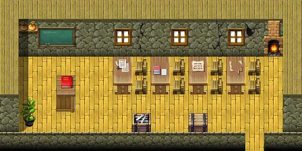

# Brimhaven school

16×8 tiles

<label class="lg lg-spawn"><input type="checkbox" data-t="spawn" checked> Monsters / NPCs</label><label class="lg lg-mapchange"><input type="checkbox" data-t="mapchange" checked> Exit to another map</label><label class="lg lg-container"><input type="checkbox" data-t="container" checked> Container</label><label class="lg lg-sign"><input type="checkbox" data-t="sign" checked> Sign</label><label class="lg lg-rest"><input type="checkbox" data-t="rest" checked> Resting place</label><label class="lg lg-key"><input type="checkbox" data-t="key" checked> Blocked / needs key or quest</label><label class="lg lg-script"><input type="checkbox" data-t="script"> Scripted event</label><label class="lg lg-replace"><input type="checkbox" data-t="replace"> Changes after a quest</label>

## Exits

- [Brimhaven2](brimhaven2.md)

## Monsters & NPCs here

| Name | HP |
|---|---|
| [Pupil](../monsters/brv_pupil1.md) | 0 |
| [Pupil](../monsters/brv_pupil5.md) | 0 |
| [Pupil](../monsters/brv_pupil8.md) | 0 |
| [Pupil](../monsters/brv_pupil4.md) | 0 |
| [Pupil](../monsters/brv_pupil7.md) | 0 |
| [Pupil](../monsters/brv_pupil6.md) | 0 |
| [Pupil](../monsters/brv_pupil3.md) | 0 |
| [Pupil](../monsters/brv_pupil2.md) | 0 |
| [Golin](../monsters/golin.md) | 80 |
| [Teacher](../monsters/brv_teacher.md) | 150 |
| [Statue](../monsters/brv_school_statue2.md) | 320 |
| [Statue](../monsters/brv_school_statue.md) | 320 |

<small>Map ID: `brimhaven_school` · Data from v0.8.18</small>
