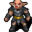
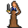
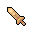

# Brimhaven school

16×8 tiles

<label class="lg"><input type="checkbox" data-t="spawn" checked><b>Red</b>&nbsp;Monsters / NPCs</label><label class="lg"><input type="checkbox" data-t="mapchange" checked><b>Blue</b>&nbsp;Exit to another map</label><label class="lg"><input type="checkbox" data-t="container" checked><b>Yellow</b>&nbsp;Container (click to see contents)</label><label class="lg"><input type="checkbox" data-t="sign" checked><b>Purple</b>&nbsp;Sign</label><label class="lg"><input type="checkbox" data-t="rest" checked><b>Green</b>&nbsp;Resting place</label><label class="lg"><input type="checkbox" data-t="key" checked><b>Orange dashed</b>&nbsp;Blocked until a quest step / item</label><label class="lg"><input type="checkbox" data-t="script"><b>Grey dotted</b>&nbsp;Scripted event</label><label class="lg"><input type="checkbox" data-t="replace"><b>White dotted</b>&nbsp;Changes during a quest</label>

## Containers

<b>Container 1</b><ul><li><a href="../../items/brv_school_sword/">Wooden sword</a> <small>100%</small></li><li><a href="../../items/brv_school_shield/">Paper shield</a> <small>100%</small></li></ul>

<b>Container 2</b><ul><li><a href="../../items/book_world_history/">World History</a> <small>100%</small></li></ul>

## Exits

- [Brimhaven2](brimhaven2.md)

## Monsters & NPCs here

| Name | HP |
|---|---|
| [Pupil](../monsters/brv_pupil3.md) | 0 |
| [Pupil](../monsters/brv_pupil7.md) | 0 |
| [Pupil](../monsters/brv_pupil1.md) | 0 |
| [Pupil](../monsters/brv_pupil6.md) | 0 |
| [Pupil](../monsters/brv_pupil5.md) | 0 |
| [Pupil](../monsters/brv_pupil8.md) | 0 |
| [Pupil](../monsters/brv_pupil2.md) | 0 |
| [Pupil](../monsters/brv_pupil4.md) | 0 |
| [Golin](../monsters/golin.md) | 80 |
| [Teacher](../monsters/brv_teacher.md) | 150 |
| [Statue](../monsters/brv_school_statue.md) | 320 |
| [Statue](../monsters/brv_school_statue2.md) | 320 |

<small>Map ID: `brimhaven_school` · Data from v0.8.18</small>
