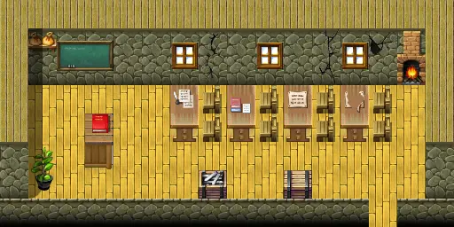
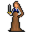

# Brimhaven school

| | |
|---|---|
| **Map ID** | `brimhaven_school` |
| **Region** | In Brimhaven (settlement) |
| **Type** | Indoors / underground |
| **Size** | 16×8 tiles |
| **Introduced** | [v0.7.11](../versions/0.7.11.md) |
| **NPCs** | 11 |
| **Enemy types** | 1 |
| **Quests** | 2 |
| **Containers** | 2 |

**Brimhaven school** is an indoor map, in Brimhaven (settlement). It has 11 NPCs and 1 kind of enemy. Exits lead to Brimhaven 2.

## Map

<label class="lg"><input type="checkbox" data-t="spawn" checked><b>Red</b>&nbsp;Monsters / NPCs</label><label class="lg"><input type="checkbox" data-t="mapchange" checked><b>Blue</b>&nbsp;Exit to another map</label><label class="lg"><input type="checkbox" data-t="container" checked><b>Yellow</b>&nbsp;Container (click to see contents)</label><label class="lg"><input type="checkbox" data-t="sign" checked><b>Purple</b>&nbsp;Sign</label><label class="lg"><input type="checkbox" data-t="rest" checked><b>Green</b>&nbsp;Resting place</label><label class="lg"><input type="checkbox" data-t="key" checked><b>Orange dashed</b>&nbsp;Blocked until a quest step / item</label><label class="lg"><input type="checkbox" data-t="script"><b>Grey dotted</b>&nbsp;Scripted event</label><label class="lg"><input type="checkbox" data-t="replace"><b>White dotted</b>&nbsp;Changes during a quest</label><label class="lg"><input type="checkbox" data-t="pin" checked><b>Numbers</b>&nbsp;Numbered key points (see the key below the map)</label>

<a class="pin pin-exit" href="#key-1" style="left:84.375%;top:93.750%" title="Exit (south): to [Brimhaven 2](brimhaven2.md)">1</a><a id="pin-npc-golin" class="pin pin-npc" href="#key-2" style="left:46.875%;top:43.750%" title="[Golin](../../monsters/golin.md): 1 quest">2</a><a id="pin-npc-brv_pupil4" class="pin pin-npc" href="#key-3" style="left:71.875%;top:50.000%" title="[Pupil](../../monsters/brv_pupil1.md#v-brv_pupil4): 1 quest">3</a><a id="pin-npc-brv_pupil3" class="pin pin-npc" href="#key-4" style="left:72.286%;top:40.626%" title="[Pupil](../../monsters/brv_pupil1.md#v-brv_pupil3): 1 quest">4</a><a id="pin-npc-brv_pupil1" class="pin pin-npc" href="#key-5" style="left:66.374%;top:41.804%" title="[Pupil](../../monsters/brv_pupil1.md): 1 quest">5</a><a id="pin-npc-brv_pupil6" class="pin pin-npc" href="#key-6" style="left:59.375%;top:56.250%" title="[Pupil](../../monsters/brv_pupil1.md#v-brv_pupil6): 1 quest">6</a><a id="pin-npc-brv_pupil5" class="pin pin-npc" href="#key-7" style="left:75.029%;top:58.226%" title="[Pupil](../../monsters/brv_pupil1.md#v-brv_pupil5): 1 quest">7</a><a id="pin-npc-brv_pupil7" class="pin pin-npc" href="#key-8" style="left:84.375%;top:43.750%" title="[Pupil](../../monsters/brv_pupil1.md#v-brv_pupil7): 1 quest">8</a><a id="pin-npc-brv_pupil2" class="pin pin-npc" href="#key-9" style="left:76.888%;top:43.622%" title="[Pupil](../../monsters/brv_pupil1.md#v-brv_pupil2): 1 quest">9</a><a id="pin-npc-brv_pupil8" class="pin pin-npc" href="#key-10" style="left:84.375%;top:56.250%" title="[Pupil](../../monsters/brv_pupil1.md#v-brv_pupil8): 1 quest">10</a><a id="pin-npc-brv_school_statue" class="pin pin-npc" href="#key-11" style="left:9.375%;top:43.750%" title="[Statue](../../monsters/brv_school_statue.md): 1 quest">11</a><a id="pin-npc-brv_teacher" class="pin pin-npc" href="#key-12" style="left:21.875%;top:43.750%" title="[Teacher](../../monsters/brv_teacher.md): 1 quest">12</a><a class="pin pin-script" href="#key-13" style="left:46.875%;top:56.250%" title="Quest trigger: Scripted event: advances the quest: Lessons learned to stage 20 (“I found a free place next to a student named Golin.”) (+1 more quest(s))">13</a><a class="pin pin-script" href="#key-14" style="left:84.375%;top:81.250%" title="Quest trigger: Scripted event: advances the quest: hidden story flag “brv_nondisplay2” to stage 10 (“You run around in classroom.”) (+1 more quest(s))">14</a><a class="pin pin-script" href="#key-14" style="left:40.625%;top:75.000%" title="Quest trigger: Scripted event: advances the quest: hidden story flag “brv_nondisplay2” to stage 10 (“You run around in classroom.”) (+1 more quest(s))">14</a><a class="pin pin-container" href="#key-15" style="left:46.875%;top:81.250%" title="Container 1: Wooden sword, Paper shield">15</a><a class="pin pin-container" href="#key-16" style="left:15.625%;top:56.250%" title="Container 2: World History">16</a><a class="pin pin-script" href="#key-17" style="left:50.000%;top:62.500%" title="Quest trigger: Scripted event: advances the quest: hidden story flag “brv_nondisplay2” to stage 50 (“Pupils ran out”) (+1 more quest(s))">17</a><a class="pin pin-key" href="#key-18" style="left:87.529%;top:64.476%" title="Blocked passage: Unlocked during the quest: Lessons learned (stage 50: “Everyone should take a set of practice weapons from the chest and sit down again.”)">18</a><a class="pin pin-key" href="#key-18" style="left:47.286%;top:71.876%" title="Blocked passage: Unlocked during the quest: Lessons learned (stage 50: “Everyone should take a set of practice weapons from the chest and sit down again.”)">18</a><a class="pin pin-key" href="#key-19" style="left:21.875%;top:62.500%" title="Blocked passage: Unlocked during the quest: base_nondisplay (stage 2: “2=This stage is never set”)">19</a><a class="pin pin-key" href="#key-19" style="left:81.233%;top:36.715%" title="Blocked passage: Unlocked during the quest: base_nondisplay (stage 2: “2=This stage is never set”)">19</a><a class="pin pin-key" href="#key-19" style="left:68.779%;top:58.226%" title="Blocked passage: Unlocked during the quest: base_nondisplay (stage 2: “2=This stage is never set”)">19</a><a class="pin pin-key" href="#key-19" style="left:53.125%;top:50.000%" title="Blocked passage: Unlocked during the quest: base_nondisplay (stage 2: “2=This stage is never set”)">19</a><a class="pin pin-key" href="#key-19" style="left:40.625%;top:50.000%" title="Blocked passage: Unlocked during the quest: base_nondisplay (stage 2: “2=This stage is never set”)">19</a><a class="pin pin-key" href="#key-19" style="left:9.375%;top:81.250%" title="Blocked passage: Unlocked during the quest: base_nondisplay (stage 2: “2=This stage is never set”)">19</a>

??? abstract "Key to the numbers on the map"

    | # | What | Details |
    |---|---|---|
    | 1 | Exit (south) | to [Brimhaven 2](brimhaven2.md) |
    | 2 | [Golin](../monsters/golin.md) | 1 quest |
    | 3 | [Pupil](../monsters/brv_pupil1.md#v-brv_pupil4) | 1 quest |
    | 4 | [Pupil](../monsters/brv_pupil1.md#v-brv_pupil3) | 1 quest |
    | 5 | [Pupil](../monsters/brv_pupil1.md) | 1 quest |
    | 6 | [Pupil](../monsters/brv_pupil1.md#v-brv_pupil6) | 1 quest |
    | 7 | [Pupil](../monsters/brv_pupil1.md#v-brv_pupil5) | 1 quest |
    | 8 | [Pupil](../monsters/brv_pupil1.md#v-brv_pupil7) | 1 quest |
    | 9 | [Pupil](../monsters/brv_pupil1.md#v-brv_pupil2) | 1 quest |
    | 10 | [Pupil](../monsters/brv_pupil1.md#v-brv_pupil8) | 1 quest |
    | 11 | [Statue](../monsters/brv_school_statue.md) | 1 quest |
    | 12 | [Teacher](../monsters/brv_teacher.md) | 1 quest |
    | 13 | Quest trigger | Scripted event: advances the quest: Lessons learned to stage 20 (“I found a free place next to a student named Golin.”) (+1 more quest(s)) |
    | 14 | Quest trigger | Scripted event: advances the quest: hidden story flag “brv_nondisplay2” to stage 10 (“You run around in classroom.”) (+1 more quest(s)) |
    | 15 | Container 1 | Wooden sword, Paper shield |
    | 16 | Container 2 | World History |
    | 17 | Quest trigger | Scripted event: advances the quest: hidden story flag “brv_nondisplay2” to stage 50 (“Pupils ran out”) (+1 more quest(s)) |
    | 18 | Blocked passage | Unlocked during the quest: Lessons learned (stage 50: “Everyone should take a set of practice weapons from the chest and sit down again.”) |
    | 19 | Blocked passage | Unlocked during the quest: base_nondisplay (stage 2: “2=This stage is never set”) |

Verified against v0.8.18 map data.

## Connections

| Direction | Leads to | Region there | Map # |
|---|---|---|---|
| South | [Brimhaven 2](brimhaven2.md) | Brimhaven | 1 |

## NPCs

- [Golin](../monsters/golin.md) — can be fought — quests: [Lessons learned](../quests/brv_school2.md) (#2)
- [Pupil](../monsters/brv_pupil1.md#v-brv_pupil4) — quests: [Lessons learned](../quests/brv_school2.md) (#3)
- [Pupil](../monsters/brv_pupil1.md#v-brv_pupil3) — quests: [Lessons learned](../quests/brv_school2.md) (#4)
- [Pupil](../monsters/brv_pupil1.md) — quests: [Lessons learned](../quests/brv_school2.md) (#5)
- [Pupil](../monsters/brv_pupil1.md#v-brv_pupil6) — quests: [Lessons learned](../quests/brv_school2.md) (#6)
- [Pupil](../monsters/brv_pupil1.md#v-brv_pupil5) — quests: [Lessons learned](../quests/brv_school2.md) (#7)
- [Pupil](../monsters/brv_pupil1.md#v-brv_pupil7) — quests: [Lessons learned](../quests/brv_school2.md) (#8)
- [Pupil](../monsters/brv_pupil1.md#v-brv_pupil2) — quests: [Lessons learned](../quests/brv_school2.md) (#9)
- [Pupil](../monsters/brv_pupil1.md#v-brv_pupil8) — quests: [Lessons learned](../quests/brv_school2.md) (#10)
- [Statue](../monsters/brv_school_statue.md) — can be fought — quests: [Lessons learned](../quests/brv_school2.md) (#11)
- [Teacher](../monsters/brv_teacher.md) — can be fought — quests: [Lessons learned](../quests/brv_school2.md) (#12)

## Enemies

| Enemy | HP | Damage | Up to | Notes |
|---|---|---|---|---|
| [Statue](../monsters/brv_school_statue.md#v-brv_school_statue2) | 320 | 5–14 | 1 | appears later, during a quest |

<small>“Up to” is the most that can be alive at once from the spawn areas on this map.</small>

## Items & containers

<b>Container 1</b><ul><li><a href="../../items/brv_school_sword/">Wooden sword</a> <small>100%</small></li><li><a href="../../items/brv_school_shield/">Paper shield</a> <small>100%</small></li></ul>

<b>Container 2</b><ul><li><a href="../../items/book_world_history/">World History</a> <small>100%</small></li></ul>

## Quests

- [base_nondisplay](../quests/base_nondisplay.md): blocked passage opens at stage 2
- [Lessons learned](../quests/brv_school2.md): [Golin](../monsters/golin.md) is involved; [Pupil](../monsters/brv_pupil1.md) is involved; [Pupil](../monsters/brv_pupil1.md#v-brv_pupil2) is involved; [Pupil](../monsters/brv_pupil1.md#v-brv_pupil3) is involved; [Pupil](../monsters/brv_pupil1.md#v-brv_pupil4) is involved; [Pupil](../monsters/brv_pupil1.md#v-brv_pupil5) is involved; [Pupil](../monsters/brv_pupil1.md#v-brv_pupil6) is involved; [Pupil](../monsters/brv_pupil1.md#v-brv_pupil7) is involved; [Pupil](../monsters/brv_pupil1.md#v-brv_pupil8) is involved; [Statue](../monsters/brv_school_statue.md) is involved; [Teacher](../monsters/brv_teacher.md) is involved; blocked passage opens at stage 50; something on this map advances it; stepping on a trigger here sets stage 10; stepping on a trigger here sets stage 102; stepping on a trigger here sets stage 104; stepping on a trigger here sets stage 122; stepping on a trigger here sets stage 124; stepping on a trigger here sets stage 152; stepping on a trigger here sets stage 20; stepping on a trigger here sets stage 220; stepping on a trigger here sets stage 230; stepping on a trigger here sets stage 30; stepping on a trigger here sets stage 40; stepping on a trigger here sets stage 50; stepping on a trigger here sets stage 60
- [Brimhaven story flags 2 (hidden flag)](../quests/brv_nondisplay2.md): [Golin](../monsters/golin.md) is involved; [Pupil](../monsters/brv_pupil1.md) is involved; [Pupil](../monsters/brv_pupil1.md#v-brv_pupil2) is involved; [Pupil](../monsters/brv_pupil1.md#v-brv_pupil3) is involved; [Pupil](../monsters/brv_pupil1.md#v-brv_pupil4) is involved; [Pupil](../monsters/brv_pupil1.md#v-brv_pupil5) is involved; [Pupil](../monsters/brv_pupil1.md#v-brv_pupil6) is involved; [Pupil](../monsters/brv_pupil1.md#v-brv_pupil7) is involved; [Pupil](../monsters/brv_pupil1.md#v-brv_pupil8) is involved; [Statue](../monsters/brv_school_statue.md) is involved; [Teacher](../monsters/brv_teacher.md) is involved; something on this map advances it; stepping on a trigger here sets stage 10; stepping on a trigger here sets stage 20; stepping on a trigger here sets stage 21; stepping on a trigger here sets stage 22; stepping on a trigger here sets stage 40; stepping on a trigger here sets stage 50

## Points of interest

- **Quest trigger** (#13): Scripted event: advances the quest: Lessons learned to stage 20 (“I found a free place next to a student named Golin.”) (+1 more quest(s))
- **Quest trigger** (#14): Scripted event: advances the quest: hidden story flag “brv_nondisplay2” to stage 10 (“You run around in classroom.”) (+1 more quest(s))
- **Quest trigger** (#17): Scripted event: advances the quest: hidden story flag “brv_nondisplay2” to stage 50 (“Pupils ran out”) (+1 more quest(s))
- **Blocked passage** (#18): Unlocked during the quest: Lessons learned (stage 50: “Everyone should take a set of practice weapons from the chest and sit down again.”)
- **Blocked passage** (#19): Unlocked during the quest: base_nondisplay (stage 2: “2=This stage is never set”)

## Version history

| Version | Change |
|---|---|
| [v0.7.11](../versions/0.7.11.md) | Added |

Verified against v0.8.18 and every earlier release back to v0.7.0 (game data compared release by release).

## Community notes

<small>Written by players, not generated from game data. **Observations**: what players notice in-game · **Lore**: the in-world story · **Trivia**: real-world facts, references, development history · **Theory / speculation**: unconfirmed ideas; may just be unfinished content</small>

### Observations

*No notes yet. Contributions are welcome: [add a note](https://github.com/asdfghjkl628/Andor-s-Trail-Wikiiii/new/main/notes/maps?filename=brimhaven_school.md&value=%23%23%20Observations%0A%0A%3C%21--%20what%20players%20notice%20in-game%20--%3E%0A%0A%23%23%20Lore%0A%0A%3C%21--%20the%20in-world%20story%20--%3E%0A%0A%23%23%20Trivia%0A%0A%3C%21--%20real-world%20facts%2C%20references%2C%20development%20history%20--%3E%0A%0A%23%23%20Theory%20/%20speculation%0A%0A%3C%21--%20unconfirmed%20ideas%3B%20may%20just%20be%20unfinished%20content%20--%3E%0A).*

### Lore

*No notes yet. Contributions are welcome: [add a note](https://github.com/asdfghjkl628/Andor-s-Trail-Wikiiii/new/main/notes/maps?filename=brimhaven_school.md&value=%23%23%20Observations%0A%0A%3C%21--%20what%20players%20notice%20in-game%20--%3E%0A%0A%23%23%20Lore%0A%0A%3C%21--%20the%20in-world%20story%20--%3E%0A%0A%23%23%20Trivia%0A%0A%3C%21--%20real-world%20facts%2C%20references%2C%20development%20history%20--%3E%0A%0A%23%23%20Theory%20/%20speculation%0A%0A%3C%21--%20unconfirmed%20ideas%3B%20may%20just%20be%20unfinished%20content%20--%3E%0A).*

### Trivia

*No notes yet. Contributions are welcome: [add a note](https://github.com/asdfghjkl628/Andor-s-Trail-Wikiiii/new/main/notes/maps?filename=brimhaven_school.md&value=%23%23%20Observations%0A%0A%3C%21--%20what%20players%20notice%20in-game%20--%3E%0A%0A%23%23%20Lore%0A%0A%3C%21--%20the%20in-world%20story%20--%3E%0A%0A%23%23%20Trivia%0A%0A%3C%21--%20real-world%20facts%2C%20references%2C%20development%20history%20--%3E%0A%0A%23%23%20Theory%20/%20speculation%0A%0A%3C%21--%20unconfirmed%20ideas%3B%20may%20just%20be%20unfinished%20content%20--%3E%0A).*

### Theory / speculation

*No notes yet. Contributions are welcome: [add a note](https://github.com/asdfghjkl628/Andor-s-Trail-Wikiiii/new/main/notes/maps?filename=brimhaven_school.md&value=%23%23%20Observations%0A%0A%3C%21--%20what%20players%20notice%20in-game%20--%3E%0A%0A%23%23%20Lore%0A%0A%3C%21--%20the%20in-world%20story%20--%3E%0A%0A%23%23%20Trivia%0A%0A%3C%21--%20real-world%20facts%2C%20references%2C%20development%20history%20--%3E%0A%0A%23%23%20Theory%20/%20speculation%0A%0A%3C%21--%20unconfirmed%20ideas%3B%20may%20just%20be%20unfinished%20content%20--%3E%0A).*

??? info "Technical information"

    | | |
    |---|---|
    | Map ID | `brimhaven_school` |
    | File | `res/xml/brimhaven_school.tmx` |
    | Size | 16×8 tiles (512×256 px) |
    | outdoors property | – |
    | Layers drawn | ground, objects, above, top |
    | Tilesets | map_bed_1, map_border_1, map_bridge_1, map_bridge_2, map_broken_1, map_cavewall_1, map_cavewall_2, map_cavewall_3, map_cavewall_4, map_chair_table_1, map_chair_table_2, map_crate_1, map_cupboard_1, map_curtain_1, map_entrance_1, map_entrance_2, map_fence_1, map_fence_2, map_fence_3, map_fence_4, map_ground_1, map_ground_2, map_ground_3, map_ground_4, map_ground_5, map_ground_6, map_ground_7, map_ground_8, map_house_1, map_house_2, map_indoor_1, map_indoor_2, map_kitchen_1, map_outdoor_1, map_pillar_1, map_pillar_2, map_plant_1, map_plant_2, map_rock_1, map_rock_2, map_roof_1, map_roof_2, map_roof_3, map_shop_1, map_sign_ladder_1, map_table_1, map_trail_1, map_transition_1, map_transition_2, map_transition_3, map_transition_4, map_transition_5, map_tree_1, map_tree_2, map_wall_1, map_wall_2, map_wall_3, map_wall_4, map_window_1, map_window_2 |
    | Map objects | key: 8, spawn: 5, script: 4, container: 2, mapchange: 1 |
    | World map position | – |

<small>Data from v0.8.18</small>
