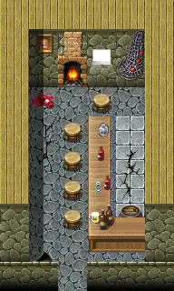

# Brimhaven tavern1

| | |
|---|---|
| **Map ID** | `brimhaven_tavern1` |
| **Region** | In Brimhaven (settlement) |
| **Type** | Indoors / underground |
| **Size** | 6×10 tiles |
| **Introduced** | [v0.7.11](../versions/0.7.11.md) |
| **NPCs** | 7 |
| **Quests** | 2 |

**Brimhaven tavern1** is an indoor map, in Brimhaven (settlement). It has 7 NPCs, and no enemies. Exits lead to Brimhaven3.

## Map

<label class="lg"><input type="checkbox" data-t="spawn" checked><b>Red</b>&nbsp;Monsters / NPCs</label><label class="lg"><input type="checkbox" data-t="mapchange" checked><b>Blue</b>&nbsp;Exit to another map</label><label class="lg"><input type="checkbox" data-t="container" checked><b>Yellow</b>&nbsp;Container (click to see contents)</label><label class="lg"><input type="checkbox" data-t="sign" checked><b>Purple</b>&nbsp;Sign</label><label class="lg"><input type="checkbox" data-t="rest" checked><b>Green</b>&nbsp;Resting place</label><label class="lg"><input type="checkbox" data-t="key" checked><b>Orange dashed</b>&nbsp;Blocked until a quest step / item</label><label class="lg"><input type="checkbox" data-t="script"><b>Grey dotted</b>&nbsp;Scripted event</label><label class="lg"><input type="checkbox" data-t="replace"><b>White dotted</b>&nbsp;Changes during a quest</label><label class="lg"><input type="checkbox" data-t="pin" checked><b>Numbers</b>&nbsp;Numbered key points (see the key below the map)</label>

<a class="pin pin-exit" href="#key-1" style="left:41.667%;top:95.000%" title="Exit (south): to [Brimhaven3](brimhaven3.md)">1</a><a id="pin-npc-burhczyd10" class="pin pin-npc" href="#key-2" style="left:75.000%;top:85.000%" title="[Burhczyd](../../monsters/burhczyd1.md#v-burhczyd10): 1 quest">2</a><a id="pin-npc-brv_tavern1_guest" class="pin pin-npc" href="#key-3" style="left:41.667%;top:75.000%" title="[Customer](../../monsters/brv_tavern1_guest.md): NPC">3</a><a id="pin-npc-brv_tavern1_guest2" class="pin pin-npc" href="#key-4" style="left:58.333%;top:35.000%" title="[Forlin](../../monsters/brv_tavern1_guest2.md): 1 quest">4</a><a id="pin-npc-brv_employee_wife2" class="pin pin-npc" href="#key-5" style="left:41.667%;top:45.000%" title="[Hettah](../../monsters/brv_employee_wife.md#v-brv_employee_wife2): NPC">5</a><a id="pin-npc-burhczyd10e" class="pin pin-npc" href="#key-6" style="left:76.097%;top:77.501%" title="[Knight of Elythom](../../monsters/burhczyd1e.md#v-burhczyd10e): 1 quest">6</a><a id="pin-npc-brv_tavern1_landlord" class="pin pin-npc" href="#key-7" style="left:75.000%;top:55.000%" title="[Rik](../../monsters/brv_tavern1_landlord.md): NPC">7</a><a id="pin-npc-brv_employee2" class="pin pin-npc" href="#key-8" style="left:42.763%;top:37.501%" title="[Stebbarik](../../monsters/brv_employee.md#v-brv_employee2): NPC">8</a>

??? abstract "Key to the numbers on the map"

    | # | What | Details |
    |---|---|---|
    | 1 | Exit (south) | to [Brimhaven3](brimhaven3.md) |
    | 2 | [Burhczyd](../monsters/burhczyd1.md#v-burhczyd10) | 1 quest |
    | 3 | [Customer](../monsters/brv_tavern1_guest.md) | NPC |
    | 4 | [Forlin](../monsters/brv_tavern1_guest2.md) | 1 quest |
    | 5 | [Hettah](../monsters/brv_employee_wife.md#v-brv_employee_wife2) | NPC |
    | 6 | [Knight of Elythom](../monsters/burhczyd1e.md#v-burhczyd10e) | 1 quest |
    | 7 | [Rik](../monsters/brv_tavern1_landlord.md) | NPC |
    | 8 | [Stebbarik](../monsters/brv_employee.md#v-brv_employee2) | NPC |

Verified against v0.8.18 map data.

## Connections

| Direction | Leads to | Region there | Map # |
|---|---|---|---|
| South | [Brimhaven3](brimhaven3.md) | Brimhaven | 1 |

## NPCs

- [Burhczyd](../monsters/burhczyd1.md#v-burhczyd10) — quests: [Young merchant](../quests/quest_burhczyd.md) (#2)
- [Customer](../monsters/brv_tavern1_guest.md) (#3)
- [Forlin](../monsters/brv_tavern1_guest2.md) — quests: [A strange looking dagger](../quests/brv_dagger.md) (#4)
- [Hettah](../monsters/brv_employee_wife.md#v-brv_employee_wife2) (#5)
- [Knight of Elythom](../monsters/burhczyd1e.md#v-burhczyd10e) — quests: [Young merchant](../quests/quest_burhczyd.md) (#6)
- [Rik](../monsters/brv_tavern1_landlord.md) (#7)
- [Stebbarik](../monsters/brv_employee.md#v-brv_employee2) (#8)

## Quests

- [A strange looking dagger](../quests/brv_dagger.md): [Forlin](../monsters/brv_tavern1_guest2.md) is involved
- [Young merchant](../quests/quest_burhczyd.md): [Burhczyd](../monsters/burhczyd1.md#v-burhczyd10) is involved; [Knight of Elythom](../monsters/burhczyd1e.md#v-burhczyd10e) is involved
- [Young merchant Non-displayed (hidden flag)](../quests/quest_burhczyd_nd.md): [Burhczyd](../monsters/burhczyd1.md#v-burhczyd10) is involved; [Knight of Elythom](../monsters/burhczyd1e.md#v-burhczyd10e) is involved

## Version history

| Version | Change |
|---|---|
| [v0.7.11](../versions/0.7.11.md) | Added |

Verified against v0.8.18 and every earlier release back to v0.7.0 (game data compared release by release).

## Community notes

<small>Written by players, not generated from game data. **Observations**: what players notice in-game · **Lore**: the in-world story · **Trivia**: real-world facts, references, development history · **Theory / speculation**: unconfirmed ideas; may just be unfinished content</small>

### Observations

*No notes yet. Contributions are welcome: [add a note](https://github.com/asdfghjkl628/Andor-s-Trail-Wikiiii/new/main/notes/maps?filename=brimhaven_tavern1.md&value=%23%23%20Observations%0A%0A%3C%21--%20what%20players%20notice%20in-game%20--%3E%0A%0A%23%23%20Lore%0A%0A%3C%21--%20the%20in-world%20story%20--%3E%0A%0A%23%23%20Trivia%0A%0A%3C%21--%20real-world%20facts%2C%20references%2C%20development%20history%20--%3E%0A%0A%23%23%20Theory%20/%20speculation%0A%0A%3C%21--%20unconfirmed%20ideas%3B%20may%20just%20be%20unfinished%20content%20--%3E%0A).*

### Lore

*No notes yet. Contributions are welcome: [add a note](https://github.com/asdfghjkl628/Andor-s-Trail-Wikiiii/new/main/notes/maps?filename=brimhaven_tavern1.md&value=%23%23%20Observations%0A%0A%3C%21--%20what%20players%20notice%20in-game%20--%3E%0A%0A%23%23%20Lore%0A%0A%3C%21--%20the%20in-world%20story%20--%3E%0A%0A%23%23%20Trivia%0A%0A%3C%21--%20real-world%20facts%2C%20references%2C%20development%20history%20--%3E%0A%0A%23%23%20Theory%20/%20speculation%0A%0A%3C%21--%20unconfirmed%20ideas%3B%20may%20just%20be%20unfinished%20content%20--%3E%0A).*

### Trivia

*No notes yet. Contributions are welcome: [add a note](https://github.com/asdfghjkl628/Andor-s-Trail-Wikiiii/new/main/notes/maps?filename=brimhaven_tavern1.md&value=%23%23%20Observations%0A%0A%3C%21--%20what%20players%20notice%20in-game%20--%3E%0A%0A%23%23%20Lore%0A%0A%3C%21--%20the%20in-world%20story%20--%3E%0A%0A%23%23%20Trivia%0A%0A%3C%21--%20real-world%20facts%2C%20references%2C%20development%20history%20--%3E%0A%0A%23%23%20Theory%20/%20speculation%0A%0A%3C%21--%20unconfirmed%20ideas%3B%20may%20just%20be%20unfinished%20content%20--%3E%0A).*

### Theory / speculation

*No notes yet. Contributions are welcome: [add a note](https://github.com/asdfghjkl628/Andor-s-Trail-Wikiiii/new/main/notes/maps?filename=brimhaven_tavern1.md&value=%23%23%20Observations%0A%0A%3C%21--%20what%20players%20notice%20in-game%20--%3E%0A%0A%23%23%20Lore%0A%0A%3C%21--%20the%20in-world%20story%20--%3E%0A%0A%23%23%20Trivia%0A%0A%3C%21--%20real-world%20facts%2C%20references%2C%20development%20history%20--%3E%0A%0A%23%23%20Theory%20/%20speculation%0A%0A%3C%21--%20unconfirmed%20ideas%3B%20may%20just%20be%20unfinished%20content%20--%3E%0A).*

??? info "Technical information"

    | | |
    |---|---|
    | Map ID | `brimhaven_tavern1` |
    | File | `res/xml/brimhaven_tavern1.tmx` |
    | Size | 6×10 tiles (192×320 px) |
    | outdoors property | – |
    | Layers drawn | ground, objects, above |
    | Tilesets | map_bed_1, map_border_1, map_bridge_1, map_bridge_2, map_broken_1, map_cavewall_1, map_cavewall_2, map_cavewall_3, map_cavewall_4, map_chair_table_1, map_chair_table_2, map_crate_1, map_cupboard_1, map_curtain_1, map_entrance_1, map_entrance_2, map_fence_1, map_fence_2, map_fence_3, map_fence_4, map_ground_1, map_ground_2, map_ground_3, map_ground_4, map_ground_5, map_ground_6, map_ground_7, map_ground_8, map_house_1, map_house_2, map_indoor_1, map_indoor_2, map_kitchen_1, map_outdoor_1, map_pillar_1, map_pillar_2, map_plant_1, map_plant_2, map_rock_1, map_rock_2, map_roof_1, map_roof_2, map_roof_3, map_shop_1, map_sign_ladder_1, map_table_1, map_trail_1, map_transition_1, map_transition_2, map_transition_3, map_transition_4, map_transition_5, map_tree_1, map_tree_2, map_wall_1, map_wall_2, map_wall_3, map_wall_4, map_window_1, map_window_2 |
    | Map objects | spawn: 7, mapchange: 1 |
    | World map position | – |

<small>Data from v0.8.18</small>
