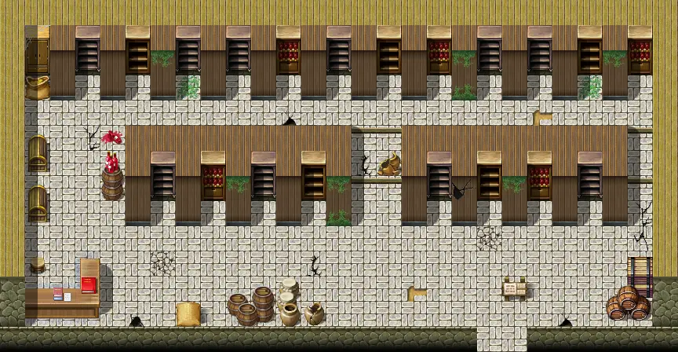
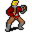
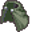

# Brimhaven warehouse

27×14 tiles

<label class="lg"><input type="checkbox" data-t="spawn" checked><b>Red</b>&nbsp;Monsters / NPCs</label><label class="lg"><input type="checkbox" data-t="mapchange" checked><b>Blue</b>&nbsp;Exit to another map</label><label class="lg"><input type="checkbox" data-t="container" checked><b>Yellow</b>&nbsp;Container (click to see contents)</label><label class="lg"><input type="checkbox" data-t="sign" checked><b>Purple</b>&nbsp;Sign</label><label class="lg"><input type="checkbox" data-t="rest" checked><b>Green</b>&nbsp;Resting place</label><label class="lg"><input type="checkbox" data-t="key" checked><b>Orange dashed</b>&nbsp;Blocked until a quest step / item</label><label class="lg"><input type="checkbox" data-t="script"><b>Grey dotted</b>&nbsp;Scripted event</label><label class="lg"><input type="checkbox" data-t="replace"><b>White dotted</b>&nbsp;Changes during a quest</label>

## Exits

- [Brimhaven4](brimhaven4.md)

## Monsters & NPCs here

| Name | HP |
|---|---|
| [brv_wh_item_04](../monsters/brv_wh_item_04.md) | 0 |
| [Pretty porcelain figure](../monsters/brv_wh_item_47.md) | 0 |
| [Lyre](../monsters/brv_wh_item_42.md) | 0 |
| [brv_wh_item_06](../monsters/brv_wh_item_06.md) | 0 |
| [brv_wh_item_26](../monsters/brv_wh_item_26.md) | 0 |
| [brv_wh_item_01](../monsters/brv_wh_item_01.md) | 0 |
| [brv_wh_item_22](../monsters/brv_wh_item_22.md) | 0 |
| [brv_wh_item_03](../monsters/brv_wh_item_03.md) | 0 |
| [brv_wh_item_28](../monsters/brv_wh_item_28.md) | 0 |
| [brv_wh_item_05](../monsters/brv_wh_item_05.md) | 0 |
| [Facutloni](../monsters/brv_wh_boss.md) | 0 |
| [brv_wh_item_07](../monsters/brv_wh_item_07.md) | 0 |
| [Crystal globe](../monsters/brv_wh_item_40.md) | 0 |
| [yellow boot](../monsters/brv_wh_item_43.md) | 0 |
| [Dusty old book](../monsters/brv_wh_item_49.md) | 0 |
| [brv_wh_item_00](../monsters/brv_wh_item_00.md) | 0 |
| [Mysterious green something](../monsters/brv_wh_item_45.md) | 0 |
| [brv_wh_item_21](../monsters/brv_wh_item_21.md) | 0 |
| [brv_wh_item_20](../monsters/brv_wh_item_20.md) | 0 |
| [brv_wh_item_25](../monsters/brv_wh_item_25.md) | 0 |
| [brv_wh_item_23](../monsters/brv_wh_item_23.md) | 0 |
| [Striped hammer](../monsters/brv_wh_item_48.md) | 0 |
| [brv_wh_item_09](../monsters/brv_wh_item_09.md) | 0 |
| [Plush pillow](../monsters/brv_wh_item_41.md) | 0 |
| [brv_wh_item_29](../monsters/brv_wh_item_29.md) | 0 |
| [Warehouse worker](../monsters/brv_wh_worker3.md) | 0 |
| [Old, worn cape](../monsters/brv_wh_item_46.md) | 0 |
| [brv_wh_item_27](../monsters/brv_wh_item_27.md) | 0 |
| [Warehouse worker](../monsters/brv_wh_worker2.md) | 0 |
| [brv_wh_item_24](../monsters/brv_wh_item_24.md) | 0 |
| [brv_wh_item_08](../monsters/brv_wh_item_08.md) | 0 |
| [Chandelier](../monsters/brv_wh_item_44.md) | 0 |
| [Warehouse worker](../monsters/brv_wh_worker.md) | 0 |
| [brv_wh_item_02](../monsters/brv_wh_item_02.md) | 0 |

<small>Map ID: `brimhaven_warehouse` · Data from v0.8.18</small>
