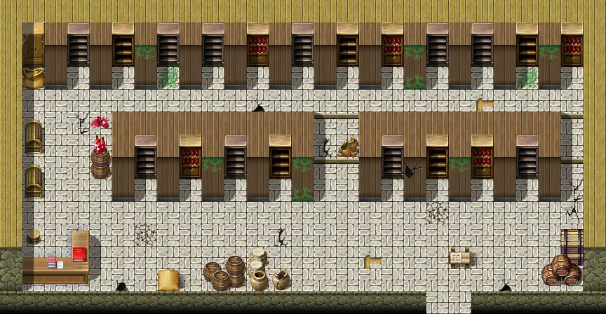
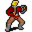

# Brimhaven warehouse

| | |
|---|---|
| **Map ID** | `brimhaven_warehouse` |
| **Region** | In Brimhaven (settlement) |
| **Type** | Indoors / underground |
| **Size** | 27×14 tiles |
| **Introduced** | [v0.7.11](../versions/0.7.11.md) |
| **NPCs** | 24 |
| **Enemy types** | 10 |
| **Quests** | 3 |

**Brimhaven warehouse** is an indoor map, in Brimhaven (settlement). It has 24 NPCs and 10 kinds of enemy. Exits lead to Brimhaven4.

## Map

<label class="lg"><input type="checkbox" data-t="spawn" checked><b>Red</b>&nbsp;Monsters / NPCs</label><label class="lg"><input type="checkbox" data-t="mapchange" checked><b>Blue</b>&nbsp;Exit to another map</label><label class="lg"><input type="checkbox" data-t="container" checked><b>Yellow</b>&nbsp;Container (click to see contents)</label><label class="lg"><input type="checkbox" data-t="sign" checked><b>Purple</b>&nbsp;Sign</label><label class="lg"><input type="checkbox" data-t="rest" checked><b>Green</b>&nbsp;Resting place</label><label class="lg"><input type="checkbox" data-t="key" checked><b>Orange dashed</b>&nbsp;Blocked until a quest step / item</label><label class="lg"><input type="checkbox" data-t="script"><b>Grey dotted</b>&nbsp;Scripted event</label><label class="lg"><input type="checkbox" data-t="replace"><b>White dotted</b>&nbsp;Changes during a quest</label><label class="lg"><input type="checkbox" data-t="pin" checked><b>Numbers</b>&nbsp;Numbered key points (see the key below the map)</label>

<a class="pin pin-exit" href="#key-1" style="left:74.074%;top:96.429%" title="Exit (south): to [Brimhaven4](brimhaven4.md)">1</a><a id="pin-npc-brv_wh_boss" class="pin pin-npc" href="#key-2" style="left:9.259%;top:75.000%" title="[Facutloni](../../monsters/brv_wh_boss.md): 2 quests">2</a><a id="pin-npc-brv_wh_worker2" class="pin pin-npc" href="#key-3" style="left:12.963%;top:25.000%" title="[Warehouse worker](../../monsters/brv_wh_worker.md#v-brv_wh_worker2): NPC">3</a><a id="pin-npc-brv_wh_worker3" class="pin pin-npc" href="#key-4" style="left:53.704%;top:39.286%" title="[Warehouse worker](../../monsters/brv_wh_worker.md#v-brv_wh_worker3): NPC">4</a><a id="pin-npc-brv_wh_worker" class="pin pin-npc" href="#key-5" style="left:90.741%;top:75.000%" title="[Warehouse worker](../../monsters/brv_wh_worker.md): NPC">5</a><a id="pin-npc-brv_wh_item_00" class="pin pin-npc" href="#key-6" style="left:12.963%;top:53.571%" title="[brv_wh_item_00](../../monsters/brv_wh_item_00.md): 1 quest">6</a><a id="pin-npc-brv_wh_item_01" class="pin pin-npc" href="#key-7" style="left:87.037%;top:17.857%" title="[brv_wh_item_01](../../monsters/brv_wh_item_01.md): 1 quest">7</a><a id="pin-npc-brv_wh_item_02" class="pin pin-npc" href="#key-8" style="left:79.630%;top:25.000%" title="[brv_wh_item_02](../../monsters/brv_wh_item_02.md): 1 quest">8</a><a id="pin-npc-brv_wh_item_03" class="pin pin-npc" href="#key-9" style="left:38.889%;top:53.571%" title="[brv_wh_item_03](../../monsters/brv_wh_item_03.md): 1 quest">9</a><a id="pin-npc-brv_wh_item_04" class="pin pin-npc" href="#key-10" style="left:94.444%;top:17.857%" title="[brv_wh_item_04](../../monsters/brv_wh_item_04.md): 1 quest">10</a><a id="pin-npc-brv_wh_item_05" class="pin pin-npc" href="#key-11" style="left:57.407%;top:53.571%" title="[brv_wh_item_05](../../monsters/brv_wh_item_05.md): 1 quest">11</a><a id="pin-npc-brv_wh_item_06" class="pin pin-npc" href="#key-12" style="left:57.407%;top:39.286%" title="[brv_wh_item_06](../../monsters/brv_wh_item_06.md): 1 quest">12</a><a id="pin-npc-brv_wh_item_07" class="pin pin-npc" href="#key-13" style="left:35.185%;top:32.143%" title="[brv_wh_item_07](../../monsters/brv_wh_item_07.md): 1 quest">13</a><a id="pin-npc-brv_wh_item_08" class="pin pin-npc" href="#key-14" style="left:72.222%;top:53.571%" title="[brv_wh_item_08](../../monsters/brv_wh_item_08.md): 1 quest">14</a><a id="pin-npc-brv_wh_item_09" class="pin pin-npc" href="#key-15" style="left:87.037%;top:25.000%" title="[brv_wh_item_09](../../monsters/brv_wh_item_09.md): 1 quest">15</a><a id="pin-npc-brv_wh_item_20" class="pin pin-npc" href="#key-16" style="left:57.407%;top:32.143%" title="[brv_wh_item_20](../../monsters/brv_wh_item_20.md): 1 quest">16</a><a id="pin-npc-brv_wh_item_21" class="pin pin-npc" href="#key-17" style="left:20.370%;top:17.857%" title="[brv_wh_item_21](../../monsters/brv_wh_item_21.md): 1 quest">17</a><a id="pin-npc-brv_wh_item_22" class="pin pin-npc" href="#key-18" style="left:27.778%;top:17.857%" title="[brv_wh_item_22](../../monsters/brv_wh_item_22.md): 1 quest">18</a><a id="pin-npc-brv_wh_item_23" class="pin pin-npc" href="#key-19" style="left:94.444%;top:32.143%" title="[brv_wh_item_23](../../monsters/brv_wh_item_23.md): 1 quest">19</a><a id="pin-npc-brv_wh_item_24" class="pin pin-npc" href="#key-20" style="left:46.296%;top:32.143%" title="[brv_wh_item_24](../../monsters/brv_wh_item_24.md): 1 quest">20</a><a id="pin-npc-brv_wh_item_25" class="pin pin-npc" href="#key-21" style="left:35.185%;top:17.857%" title="[brv_wh_item_25](../../monsters/brv_wh_item_25.md): 1 quest">21</a><a id="pin-npc-brv_wh_item_26" class="pin pin-npc" href="#key-22" style="left:94.444%;top:46.429%" title="[brv_wh_item_26](../../monsters/brv_wh_item_26.md): 1 quest">22</a><a id="pin-npc-brv_wh_item_27" class="pin pin-npc" href="#key-23" style="left:79.630%;top:32.143%" title="[brv_wh_item_27](../../monsters/brv_wh_item_27.md): 1 quest">23</a><a id="pin-npc-brv_wh_item_28" class="pin pin-npc" href="#key-24" style="left:53.704%;top:46.429%" title="[brv_wh_item_28](../../monsters/brv_wh_item_28.md): 1 quest">24</a><a id="pin-npc-brv_wh_item_29" class="pin pin-npc" href="#key-25" style="left:64.815%;top:53.571%" title="[brv_wh_item_29](../../monsters/brv_wh_item_29.md): 1 quest">25</a><a class="pin pin-key" href="#key-26" style="left:50.000%;top:35.714%" title="Blocked passage: Unlocked during the quest: Search for Andor (stage 1: “My father Mikhail says that Andor has not been home since yesterday. I should go look for him in the village.”)">26</a><a class="pin pin-key" href="#key-26" style="left:9.327%;top:56.723%" title="Blocked passage: Unlocked during the quest: Search for Andor (stage 1: “My father Mikhail says that Andor has not been home since yesterday. I should go look for him in the village.”)">26</a><a class="pin pin-key" href="#key-26" style="left:53.772%;top:56.723%" title="Blocked passage: Unlocked during the quest: Search for Andor (stage 1: “My father Mikhail says that Andor has not been home since yesterday. I should go look for him in the village.”)">26</a><a class="pin pin-key" href="#key-26" style="left:94.444%;top:53.571%" title="Blocked passage: Unlocked during the quest: Search for Andor (stage 1: “My father Mikhail says that Andor has not been home since yesterday. I should go look for him in the village.”)">26</a><a class="pin pin-key" href="#key-27" style="left:51.852%;top:60.714%" title="Blocked passage: Unlocked during the quest: Inventory (stage 10: “Facutloni asked me to help him check the storage. I should check if there is a pair of every item.”)">27</a>

??? abstract "Key to the numbers on the map"

    | # | What | Details |
    |---|---|---|
    | 1 | Exit (south) | to [Brimhaven4](brimhaven4.md) |
    | 2 | [Facutloni](../monsters/brv_wh_boss.md) | 2 quests |
    | 3 | [Warehouse worker](../monsters/brv_wh_worker.md#v-brv_wh_worker2) | NPC |
    | 4 | [Warehouse worker](../monsters/brv_wh_worker.md#v-brv_wh_worker3) | NPC |
    | 5 | [Warehouse worker](../monsters/brv_wh_worker.md) | NPC |
    | 6 | [brv_wh_item_00](../monsters/brv_wh_item_00.md) | 1 quest |
    | 7 | [brv_wh_item_01](../monsters/brv_wh_item_01.md) | 1 quest |
    | 8 | [brv_wh_item_02](../monsters/brv_wh_item_02.md) | 1 quest |
    | 9 | [brv_wh_item_03](../monsters/brv_wh_item_03.md) | 1 quest |
    | 10 | [brv_wh_item_04](../monsters/brv_wh_item_04.md) | 1 quest |
    | 11 | [brv_wh_item_05](../monsters/brv_wh_item_05.md) | 1 quest |
    | 12 | [brv_wh_item_06](../monsters/brv_wh_item_06.md) | 1 quest |
    | 13 | [brv_wh_item_07](../monsters/brv_wh_item_07.md) | 1 quest |
    | 14 | [brv_wh_item_08](../monsters/brv_wh_item_08.md) | 1 quest |
    | 15 | [brv_wh_item_09](../monsters/brv_wh_item_09.md) | 1 quest |
    | 16 | [brv_wh_item_20](../monsters/brv_wh_item_20.md) | 1 quest |
    | 17 | [brv_wh_item_21](../monsters/brv_wh_item_21.md) | 1 quest |
    | 18 | [brv_wh_item_22](../monsters/brv_wh_item_22.md) | 1 quest |
    | 19 | [brv_wh_item_23](../monsters/brv_wh_item_23.md) | 1 quest |
    | 20 | [brv_wh_item_24](../monsters/brv_wh_item_24.md) | 1 quest |
    | 21 | [brv_wh_item_25](../monsters/brv_wh_item_25.md) | 1 quest |
    | 22 | [brv_wh_item_26](../monsters/brv_wh_item_26.md) | 1 quest |
    | 23 | [brv_wh_item_27](../monsters/brv_wh_item_27.md) | 1 quest |
    | 24 | [brv_wh_item_28](../monsters/brv_wh_item_28.md) | 1 quest |
    | 25 | [brv_wh_item_29](../monsters/brv_wh_item_29.md) | 1 quest |
    | 26 | Blocked passage | Unlocked during the quest: Search for Andor (stage 1: “My father Mikhail says that Andor has not been home since yesterday. I should go look for him in the village.”) |
    | 27 | Blocked passage | Unlocked during the quest: Inventory (stage 10: “Facutloni asked me to help him check the storage. I should check if there is a pair of every item.”) |

Verified against v0.8.18 map data.

## Connections

| Direction | Leads to | Region there | Map # |
|---|---|---|---|
| South | [Brimhaven4](brimhaven4.md) | Brimhaven | 1 |

## NPCs

- [Facutloni](../monsters/brv_wh_boss.md) — quests: [Delivery](../quests/brv_wh_delivery.md), [Inventory](../quests/brv_wh.md) (#2)
- [Warehouse worker](../monsters/brv_wh_worker.md#v-brv_wh_worker2) (#3)
- [Warehouse worker](../monsters/brv_wh_worker.md#v-brv_wh_worker3) (#4)
- [Warehouse worker](../monsters/brv_wh_worker.md) (#5)
- [brv_wh_item_00](../monsters/brv_wh_item_00.md) — quests: [Inventory](../quests/brv_wh.md) (#6)
- [brv_wh_item_01](../monsters/brv_wh_item_01.md) — quests: [Inventory](../quests/brv_wh.md) (#7)
- [brv_wh_item_02](../monsters/brv_wh_item_02.md) — quests: [Inventory](../quests/brv_wh.md) (#8)
- [brv_wh_item_03](../monsters/brv_wh_item_03.md) — quests: [Inventory](../quests/brv_wh.md) (#9)
- [brv_wh_item_04](../monsters/brv_wh_item_04.md) — quests: [Inventory](../quests/brv_wh.md) (#10)
- [brv_wh_item_05](../monsters/brv_wh_item_05.md) — quests: [Inventory](../quests/brv_wh.md) (#11)
- [brv_wh_item_06](../monsters/brv_wh_item_06.md) — quests: [Inventory](../quests/brv_wh.md) (#12)
- [brv_wh_item_07](../monsters/brv_wh_item_07.md) — quests: [Inventory](../quests/brv_wh.md) (#13)
- [brv_wh_item_08](../monsters/brv_wh_item_08.md) — quests: [Inventory](../quests/brv_wh.md) (#14)
- [brv_wh_item_09](../monsters/brv_wh_item_09.md) — quests: [Inventory](../quests/brv_wh.md) (#15)
- [brv_wh_item_20](../monsters/brv_wh_item_20.md) — quests: [Inventory](../quests/brv_wh.md) (#16)
- [brv_wh_item_21](../monsters/brv_wh_item_21.md) — quests: [Inventory](../quests/brv_wh.md) (#17)
- [brv_wh_item_22](../monsters/brv_wh_item_22.md) — quests: [Inventory](../quests/brv_wh.md) (#18)
- [brv_wh_item_23](../monsters/brv_wh_item_23.md) — quests: [Inventory](../quests/brv_wh.md) (#19)
- [brv_wh_item_24](../monsters/brv_wh_item_24.md) — quests: [Inventory](../quests/brv_wh.md) (#20)
- [brv_wh_item_25](../monsters/brv_wh_item_25.md) — quests: [Inventory](../quests/brv_wh.md) (#21)
- [brv_wh_item_26](../monsters/brv_wh_item_26.md) — quests: [Inventory](../quests/brv_wh.md) (#22)
- [brv_wh_item_27](../monsters/brv_wh_item_27.md) — quests: [Inventory](../quests/brv_wh.md) (#23)
- [brv_wh_item_28](../monsters/brv_wh_item_28.md) — quests: [Inventory](../quests/brv_wh.md) (#24)
- [brv_wh_item_29](../monsters/brv_wh_item_29.md) — quests: [Inventory](../quests/brv_wh.md) (#25)

## Enemies

| Enemy | HP | Damage | Up to | Notes |
|---|---|---|---|---|
| [Plush pillow](../monsters/brv_wh_item_41.md) | 0 | 0–0 | 1 | – |
| [yellow boot](../monsters/brv_wh_item_43.md) | 0 | 0–0 | 1 | – |
| [Crystal globe](../monsters/brv_wh_item_40.md) | 0 | 0–0 | 1 | – |
| [Striped hammer](../monsters/brv_wh_item_48.md) | 0 | 0–0 | 1 | – |
| [Old, worn cape](../monsters/brv_wh_item_46.md) | 0 | 0–0 | 1 | – |
| [Pretty porcelain figure](../monsters/brv_wh_item_47.md) | 0 | 0–0 | 1 | – |
| [Dusty old book](../monsters/brv_wh_item_49.md) | 0 | 0–0 | 1 | – |
| [Mysterious green something](../monsters/brv_wh_item_45.md) | 0 | 0–0 | 1 | – |
| [Lyre](../monsters/brv_wh_item_42.md) | 0 | 0–0 | 1 | – |
| [Chandelier](../monsters/brv_wh_item_44.md) | 0 | 0–0 | 1 | – |

<small>“Up to” is the most that can be alive at once from the spawn areas on this map.</small>

## Quests

- [Delivery](../quests/brv_wh_delivery.md): [Facutloni](../monsters/brv_wh_boss.md) is involved
- [Inventory](../quests/brv_wh.md): [Facutloni](../monsters/brv_wh_boss.md) is involved; [brv_wh_item_00](../monsters/brv_wh_item_00.md) is involved; [brv_wh_item_01](../monsters/brv_wh_item_01.md) is involved; [brv_wh_item_02](../monsters/brv_wh_item_02.md) is involved; [brv_wh_item_03](../monsters/brv_wh_item_03.md) is involved; [brv_wh_item_04](../monsters/brv_wh_item_04.md) is involved; [brv_wh_item_05](../monsters/brv_wh_item_05.md) is involved; [brv_wh_item_06](../monsters/brv_wh_item_06.md) is involved; [brv_wh_item_07](../monsters/brv_wh_item_07.md) is involved; [brv_wh_item_08](../monsters/brv_wh_item_08.md) is involved; [brv_wh_item_09](../monsters/brv_wh_item_09.md) is involved; [brv_wh_item_20](../monsters/brv_wh_item_20.md) is involved; [brv_wh_item_21](../monsters/brv_wh_item_21.md) is involved; [brv_wh_item_22](../monsters/brv_wh_item_22.md) is involved; [brv_wh_item_23](../monsters/brv_wh_item_23.md) is involved; [brv_wh_item_24](../monsters/brv_wh_item_24.md) is involved; [brv_wh_item_25](../monsters/brv_wh_item_25.md) is involved; [brv_wh_item_26](../monsters/brv_wh_item_26.md) is involved; [brv_wh_item_27](../monsters/brv_wh_item_27.md) is involved; [brv_wh_item_28](../monsters/brv_wh_item_28.md) is involved; [brv_wh_item_29](../monsters/brv_wh_item_29.md) is involved; blocked passage opens at stage 10
- [Search for Andor](../quests/andor.md): blocked passage opens at stage 1
- [Gold and Exp reward for Delivery quest completed - nondisplay (hidden flag)](../quests/brv_wh_delivery_reward_nondisplay.md): [Facutloni](../monsters/brv_wh_boss.md) is involved
- [Gold and Exp reward for Inventory quest completed - nondisplay (hidden flag)](../quests/brv_wh_reward_nondisplay.md): [Facutloni](../monsters/brv_wh_boss.md) is involved

## Points of interest

- **Blocked passage** (#26): Unlocked during the quest: Search for Andor (stage 1: “My father Mikhail says that Andor has not been home since yesterday. I should go look for him in the village.”)
- **Blocked passage** (#27): Unlocked during the quest: Inventory (stage 10: “Facutloni asked me to help him check the storage. I should check if there is a pair of every item.”)

## Version history

| Version | Change |
|---|---|
| [v0.7.11](../versions/0.7.11.md) | Added |

Verified against v0.8.18 and every earlier release back to v0.7.0 (game data compared release by release).

## Community notes

<small>Written by players, not generated from game data. **Observations**: what players notice in-game · **Lore**: the in-world story · **Trivia**: real-world facts, references, development history · **Theory / speculation**: unconfirmed ideas; may just be unfinished content</small>

### Observations

*No notes yet. Contributions are welcome: [add a note](https://github.com/asdfghjkl628/Andor-s-Trail-Wikiiii/new/main/notes/maps?filename=brimhaven_warehouse.md&value=%23%23%20Observations%0A%0A%3C%21--%20what%20players%20notice%20in-game%20--%3E%0A%0A%23%23%20Lore%0A%0A%3C%21--%20the%20in-world%20story%20--%3E%0A%0A%23%23%20Trivia%0A%0A%3C%21--%20real-world%20facts%2C%20references%2C%20development%20history%20--%3E%0A%0A%23%23%20Theory%20/%20speculation%0A%0A%3C%21--%20unconfirmed%20ideas%3B%20may%20just%20be%20unfinished%20content%20--%3E%0A).*

### Lore

*No notes yet. Contributions are welcome: [add a note](https://github.com/asdfghjkl628/Andor-s-Trail-Wikiiii/new/main/notes/maps?filename=brimhaven_warehouse.md&value=%23%23%20Observations%0A%0A%3C%21--%20what%20players%20notice%20in-game%20--%3E%0A%0A%23%23%20Lore%0A%0A%3C%21--%20the%20in-world%20story%20--%3E%0A%0A%23%23%20Trivia%0A%0A%3C%21--%20real-world%20facts%2C%20references%2C%20development%20history%20--%3E%0A%0A%23%23%20Theory%20/%20speculation%0A%0A%3C%21--%20unconfirmed%20ideas%3B%20may%20just%20be%20unfinished%20content%20--%3E%0A).*

### Trivia

*No notes yet. Contributions are welcome: [add a note](https://github.com/asdfghjkl628/Andor-s-Trail-Wikiiii/new/main/notes/maps?filename=brimhaven_warehouse.md&value=%23%23%20Observations%0A%0A%3C%21--%20what%20players%20notice%20in-game%20--%3E%0A%0A%23%23%20Lore%0A%0A%3C%21--%20the%20in-world%20story%20--%3E%0A%0A%23%23%20Trivia%0A%0A%3C%21--%20real-world%20facts%2C%20references%2C%20development%20history%20--%3E%0A%0A%23%23%20Theory%20/%20speculation%0A%0A%3C%21--%20unconfirmed%20ideas%3B%20may%20just%20be%20unfinished%20content%20--%3E%0A).*

### Theory / speculation

*No notes yet. Contributions are welcome: [add a note](https://github.com/asdfghjkl628/Andor-s-Trail-Wikiiii/new/main/notes/maps?filename=brimhaven_warehouse.md&value=%23%23%20Observations%0A%0A%3C%21--%20what%20players%20notice%20in-game%20--%3E%0A%0A%23%23%20Lore%0A%0A%3C%21--%20the%20in-world%20story%20--%3E%0A%0A%23%23%20Trivia%0A%0A%3C%21--%20real-world%20facts%2C%20references%2C%20development%20history%20--%3E%0A%0A%23%23%20Theory%20/%20speculation%0A%0A%3C%21--%20unconfirmed%20ideas%3B%20may%20just%20be%20unfinished%20content%20--%3E%0A).*

??? info "Technical information"

    | | |
    |---|---|
    | Map ID | `brimhaven_warehouse` |
    | File | `res/xml/brimhaven_warehouse.tmx` |
    | Size | 27×14 tiles (864×448 px) |
    | outdoors property | – |
    | Layers drawn | ground, objects, above, top |
    | Tilesets | map_bed_1, map_border_1, map_bridge_1, map_bridge_2, map_broken_1, map_cavewall_1, map_cavewall_2, map_cavewall_3, map_cavewall_4, map_chair_table_1, map_chair_table_2, map_crate_1, map_cupboard_1, map_curtain_1, map_entrance_1, map_entrance_2, map_fence_1, map_fence_2, map_fence_3, map_fence_4, map_ground_1, map_ground_2, map_ground_3, map_ground_4, map_ground_5, map_ground_6, map_ground_7, map_ground_8, map_guynmart, map_house_1, map_house_2, map_indoor_1, map_indoor_2, map_kitchen_1, map_outdoor_1, map_pillar_1, map_pillar_2, map_plant_1, map_plant_2, map_rock_1, map_rock_2, map_roof_1, map_roof_2, map_roof_3, map_shop_1, map_sign_ladder_1, map_table_1, map_trail_1, map_transition_1, map_transition_2, map_transition_3, map_transition_4, map_transition_5, map_tree_1, map_tree_2, map_wall_1, map_wall_2, map_wall_3, map_wall_4, map_window_1, map_window_2 |
    | Map objects | spawn: 34, key: 5, script: 2, mapchange: 1 |
    | World map position | – |

<small>Data from v0.8.18</small>
