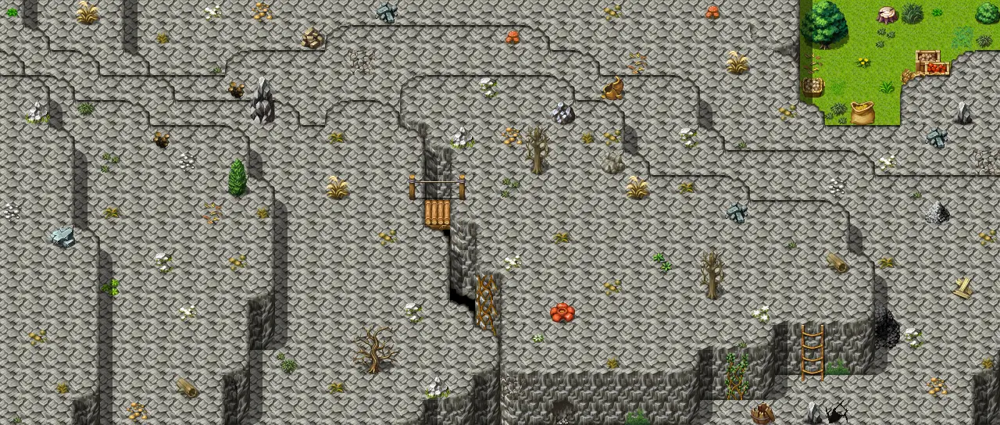

# Bwmfill2

40×17 tiles · outdoors · part of [World1](index.md)

<label class="lg"><input type="checkbox" data-t="spawn" checked><b>Red</b>&nbsp;Monsters / NPCs</label><label class="lg"><input type="checkbox" data-t="mapchange" checked><b>Blue</b>&nbsp;Exit to another map</label><label class="lg"><input type="checkbox" data-t="container" checked><b>Yellow</b>&nbsp;Container (click to see contents)</label><label class="lg"><input type="checkbox" data-t="sign" checked><b>Purple</b>&nbsp;Sign</label><label class="lg"><input type="checkbox" data-t="rest" checked><b>Green</b>&nbsp;Resting place</label><label class="lg"><input type="checkbox" data-t="key" checked><b>Orange dashed</b>&nbsp;Blocked until a quest step / item</label><label class="lg"><input type="checkbox" data-t="script"><b>Grey dotted</b>&nbsp;Scripted event</label><label class="lg"><input type="checkbox" data-t="replace"><b>White dotted</b>&nbsp;Changes during a quest</label>

## Containers

<b>Container 1</b><ul><li><a href="../../items/green_pepper/">Green Pepper</a> <small>100% · ×0 to 4</small></li><li><a href="../../items/yellow_pepper/">Yellow Pepper</a> <small>100% · ×0 to 2</small></li><li><a href="../../items/red_pepper/">Red Pepper</a> <small>100% · ×0 to 1</small></li><li><a href="../../items/gold/">Gold coins</a> <small>100% · ×5 to 15</small></li></ul>

## Exits

- [Blackwater mountain16](blackwater_mountain16.md)
- [Blackwater mountain54](blackwater_mountain54.md)
- [Bwmfill1](bwmfill1.md)
- [Bwmfill3](bwmfill3.md)
- [Ratdom bwm1](ratdom_bwm1.md)

## Monsters & NPCs here

| Name | HP |
|---|---|
| [Scaled venomfang](../monsters/scaled_venomfang.md) | 35 |
| [Slithering venomfang](../monsters/slithering_venomfang.md) | 35 |
| [Mountain wolf](../monsters/mountain_wolf.md) | 49 |
| [Trained mountain wolf](../monsters/mountain_wolf_2.md) | 61 |
| [Young gornaud](../monsters/young_gornaud.md) | 70 |
| [Gornaud](../monsters/gornaud.md) | 95 |

<small>Map ID: `bwmfill2` · Data from v0.8.18</small>
