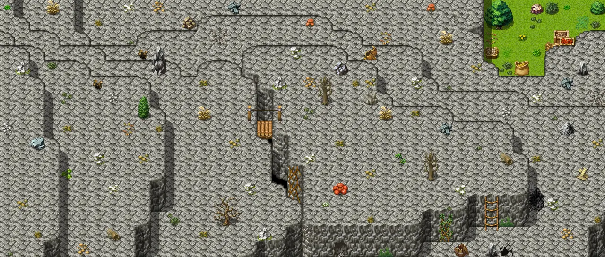

# Bwmfill2

| | |
|---|---|
| **Map ID** | `bwmfill2` |
| **Region** | In Blackwater Mountain (other) |
| **Type** | Outdoors |
| **Size** | 40×17 tiles |
| **World map** | [World1](index.md) |
| **Introduced** | [v0.8.10](../versions/0.8.10.md) |
| **Enemy types** | 6 |
| **Quests** | 0 |
| **Containers** | 1 |

**Bwmfill2** is an outdoor map, in Blackwater Mountain (other). It has no NPCs and 6 kinds of enemy. Exits lead to Blackwater mountain54, Bwmfill1, Bwmfill3, Ratdom bwm1 and 1 more.

## Map

<label class="lg"><input type="checkbox" data-t="spawn" checked><b>Red</b>&nbsp;Monsters / NPCs</label><label class="lg"><input type="checkbox" data-t="mapchange" checked><b>Blue</b>&nbsp;Exit to another map</label><label class="lg"><input type="checkbox" data-t="container" checked><b>Yellow</b>&nbsp;Container (click to see contents)</label><label class="lg"><input type="checkbox" data-t="sign" checked><b>Purple</b>&nbsp;Sign</label><label class="lg"><input type="checkbox" data-t="rest" checked><b>Green</b>&nbsp;Resting place</label><label class="lg"><input type="checkbox" data-t="key" checked><b>Orange dashed</b>&nbsp;Blocked until a quest step / item</label><label class="lg"><input type="checkbox" data-t="script"><b>Grey dotted</b>&nbsp;Scripted event</label><label class="lg"><input type="checkbox" data-t="replace"><b>White dotted</b>&nbsp;Changes during a quest</label><label class="lg"><input type="checkbox" data-t="pin" checked><b>Numbers</b>&nbsp;Numbered key points (see the key below the map)</label>

<a class="pin pin-exit" href="#key-1" style="left:86.250%;top:2.941%" title="Exit (north): to [Blackwater mountain54](blackwater_mountain54.md)">1</a><a class="pin pin-exit" href="#key-2" style="left:95.000%;top:2.941%" title="Exit (northeast): to [Blackwater mountain54](blackwater_mountain54.md)">2</a><a class="pin pin-exit" href="#key-3" style="left:98.750%;top:8.824%" title="Exit (northeast): to [Bwmfill1](bwmfill1.md)">3</a><a class="pin pin-exit" href="#key-4" style="left:98.750%;top:61.765%" title="Exit (east): to [Bwmfill1](bwmfill1.md)">4</a><a class="pin pin-exit" href="#key-5" style="left:15.000%;top:97.059%" title="Exit (south): to [Bwmfill3](bwmfill3.md)">5</a><a class="pin pin-exit" href="#key-5" style="left:32.500%;top:97.059%" title="Exit (south): to [Bwmfill3](bwmfill3.md)">5</a><a class="pin pin-exit" href="#key-6" style="left:78.750%;top:97.059%" title="Exit (south): to [Ratdom bwm1](ratdom_bwm1.md)">6</a><a class="pin pin-exit" href="#key-7" style="left:1.250%;top:32.353%" title="Exit (west): to [Blackwater mountain16](blackwater_mountain16.md)">7</a><a class="pin pin-container" href="#key-8" style="left:81.250%;top:20.588%" title="Container 1: Green Pepper, Yellow Pepper, Red Pepper, Gold coins">8</a>

??? abstract "Key to the numbers on the map"

    | # | What | Details |
    |---|---|---|
    | 1 | Exit (north) | to [Blackwater mountain54](blackwater_mountain54.md) |
    | 2 | Exit (northeast) | to [Blackwater mountain54](blackwater_mountain54.md) |
    | 3 | Exit (northeast) | to [Bwmfill1](bwmfill1.md) |
    | 4 | Exit (east) | to [Bwmfill1](bwmfill1.md) |
    | 5 | Exit (south) | to [Bwmfill3](bwmfill3.md) |
    | 6 | Exit (south) | to [Ratdom bwm1](ratdom_bwm1.md) |
    | 7 | Exit (west) | to [Blackwater mountain16](blackwater_mountain16.md) |
    | 8 | Container 1 | Green Pepper, Yellow Pepper, Red Pepper, Gold coins |

Verified against v0.8.18 map data.

## Connections

| Direction | Leads to | Region there | Map # |
|---|---|---|---|
| North | [Blackwater mountain54](blackwater_mountain54.md) | Blackwater Mountain | 1 |
| Northeast | [Blackwater mountain54](blackwater_mountain54.md) | Blackwater Mountain | 2 |
| Northeast | [Bwmfill1](bwmfill1.md) | Blackwater Mountain | 3 |
| East | [Bwmfill1](bwmfill1.md) | Blackwater Mountain | 4 |
| South | [Bwmfill3](bwmfill3.md) | Blackwater Mountain | 5 |
| South | [Ratdom bwm1](ratdom_bwm1.md) | Blackwater Mountain | 6 |
| West | [Blackwater mountain16](blackwater_mountain16.md) | Blackwater Mountain | 7 |

## Enemies

| Enemy | HP | Damage | Up to | Notes |
|---|---|---|---|---|
| [Scaled venomfang](../monsters/scaled_venomfang.md) | 35 | 2–4 | 3 | shares spawn with Gornaud |
| [Slithering venomfang](../monsters/slithering_venomfang.md) | 35 | 1–2 | 1 | shares spawn with Young gornaud |
| [Mountain wolf](../monsters/mountain_wolf.md) | 49 | 3–9 | 3 | – |
| [Trained mountain wolf](../monsters/mountain_wolf_2.md) | 61 | 5–11 | 6 | – |
| [Young gornaud](../monsters/young_gornaud.md) | 70 | 0–15 | 1 | shares spawn with Slithering venomfang |
| [Gornaud](../monsters/gornaud.md) | 95 | 0–15 | 3 | shares spawn with Scaled venomfang |

<small>“Up to” is the most that can be alive at once from the spawn areas on this map.</small>

## Items & containers

<b>Container 1</b><ul><li><a href="../../items/green_pepper/">Green Pepper</a> <small>100% · ×0 to 4</small></li><li><a href="../../items/yellow_pepper/">Yellow Pepper</a> <small>100% · ×0 to 2</small></li><li><a href="../../items/red_pepper/">Red Pepper</a> <small>100% · ×0 to 1</small></li><li><a href="../../items/gold/">Gold coins</a> <small>100% · ×5 to 15</small></li></ul>

## Version history

| Version | Change |
|---|---|
| [v0.8.10](../versions/0.8.10.md) | Added |
| [v0.8.11](../versions/0.8.11.md) | map layout or objects changed |

Verified against v0.8.18 and every earlier release back to v0.7.0 (game data compared release by release).

## Community notes

<small>Written by players, not generated from game data. **Observations**: what players notice in-game · **Lore**: the in-world story · **Trivia**: real-world facts, references, development history · **Theory / speculation**: unconfirmed ideas; may just be unfinished content</small>

### Observations

*No notes yet. Contributions are welcome: [add a note](https://github.com/asdfghjkl628/Andor-s-Trail-Wikiiii/new/main/notes/maps?filename=bwmfill2.md&value=%23%23%20Observations%0A%0A%3C%21--%20what%20players%20notice%20in-game%20--%3E%0A%0A%23%23%20Lore%0A%0A%3C%21--%20the%20in-world%20story%20--%3E%0A%0A%23%23%20Trivia%0A%0A%3C%21--%20real-world%20facts%2C%20references%2C%20development%20history%20--%3E%0A%0A%23%23%20Theory%20/%20speculation%0A%0A%3C%21--%20unconfirmed%20ideas%3B%20may%20just%20be%20unfinished%20content%20--%3E%0A).*

### Lore

*No notes yet. Contributions are welcome: [add a note](https://github.com/asdfghjkl628/Andor-s-Trail-Wikiiii/new/main/notes/maps?filename=bwmfill2.md&value=%23%23%20Observations%0A%0A%3C%21--%20what%20players%20notice%20in-game%20--%3E%0A%0A%23%23%20Lore%0A%0A%3C%21--%20the%20in-world%20story%20--%3E%0A%0A%23%23%20Trivia%0A%0A%3C%21--%20real-world%20facts%2C%20references%2C%20development%20history%20--%3E%0A%0A%23%23%20Theory%20/%20speculation%0A%0A%3C%21--%20unconfirmed%20ideas%3B%20may%20just%20be%20unfinished%20content%20--%3E%0A).*

### Trivia

*No notes yet. Contributions are welcome: [add a note](https://github.com/asdfghjkl628/Andor-s-Trail-Wikiiii/new/main/notes/maps?filename=bwmfill2.md&value=%23%23%20Observations%0A%0A%3C%21--%20what%20players%20notice%20in-game%20--%3E%0A%0A%23%23%20Lore%0A%0A%3C%21--%20the%20in-world%20story%20--%3E%0A%0A%23%23%20Trivia%0A%0A%3C%21--%20real-world%20facts%2C%20references%2C%20development%20history%20--%3E%0A%0A%23%23%20Theory%20/%20speculation%0A%0A%3C%21--%20unconfirmed%20ideas%3B%20may%20just%20be%20unfinished%20content%20--%3E%0A).*

### Theory / speculation

*No notes yet. Contributions are welcome: [add a note](https://github.com/asdfghjkl628/Andor-s-Trail-Wikiiii/new/main/notes/maps?filename=bwmfill2.md&value=%23%23%20Observations%0A%0A%3C%21--%20what%20players%20notice%20in-game%20--%3E%0A%0A%23%23%20Lore%0A%0A%3C%21--%20the%20in-world%20story%20--%3E%0A%0A%23%23%20Trivia%0A%0A%3C%21--%20real-world%20facts%2C%20references%2C%20development%20history%20--%3E%0A%0A%23%23%20Theory%20/%20speculation%0A%0A%3C%21--%20unconfirmed%20ideas%3B%20may%20just%20be%20unfinished%20content%20--%3E%0A).*

??? info "Technical information"

    | | |
    |---|---|
    | Map ID | `bwmfill2` |
    | File | `res/xml/bwmfill2.tmx` |
    | Size | 40×17 tiles (1280×544 px) |
    | outdoors property | 1 |
    | Layers drawn | ground, objects, above, top |
    | Tilesets | map_bed_1, map_border_1, map_bridge_1, map_bridge_2, map_broken_1, map_cavewall_1, map_cavewall_2, map_cavewall_3, map_cavewall_4, map_chair_table_1, map_chair_table_2, map_crate_1, map_cupboard_1, map_curtain_1, map_entrance_1, map_entrance_2, map_fence_1, map_fence_2, map_fence_3, map_fence_4, map_ground_1, map_ground_2, map_ground_3, map_ground_4, map_ground_5, map_ground_6, map_ground_7, map_ground_8, map_house_1, map_house_2, map_indoor_1, map_indoor_2, map_kitchen_1, map_outdoor_1, map_pillar_1, map_pillar_2, map_plant_1, map_plant_2, map_rock_1, map_rock_2, map_roof_1, map_roof_2, map_roof_3, map_shop_1, map_sign_ladder_1, map_table_1, map_trail_1, map_transition_1, map_transition_2, map_transition_3, map_transition_4, map_transition_5, map_tree_1, map_tree_2, map_wall_1, map_wall_2, map_wall_3, map_wall_4, map_window_1, map_window_2 |
    | Map objects | mapchange: 8, spawn: 7, container: 1 |
    | World map position | segment `world1`, x 107, y 337 |

<small>Data from v0.8.18</small>
