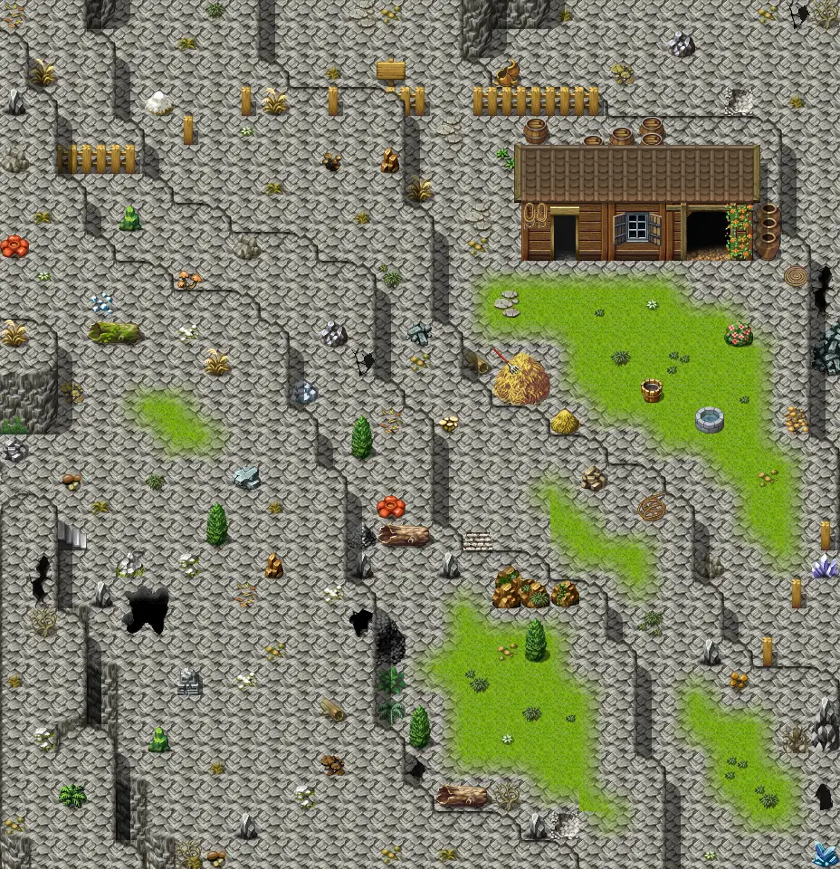

# Bwmfill3

29×30 tiles · part of [World1](index.md)

<label class="lg lg-spawn"><input type="checkbox" data-t="spawn" checked> Monsters / NPCs</label><label class="lg lg-mapchange"><input type="checkbox" data-t="mapchange" checked> Exit to another map</label><label class="lg lg-container"><input type="checkbox" data-t="container" checked> Container</label><label class="lg lg-sign"><input type="checkbox" data-t="sign" checked> Sign</label><label class="lg lg-rest"><input type="checkbox" data-t="rest" checked> Resting place</label><label class="lg lg-key"><input type="checkbox" data-t="key" checked> Blocked / needs key or quest</label><label class="lg lg-script"><input type="checkbox" data-t="script"> Scripted event</label><label class="lg lg-replace"><input type="checkbox" data-t="replace"> Changes after a quest</label>

## Exits

- [Blackwater mountain16](blackwater_mountain16.md)
- [Blackwater mountain56](blackwater_mountain56.md)
- [Bwmfill2](bwmfill2.md)
- [Bwmfill4](bwmfill4.md)
- [Bwmfill5](bwmfill5.md)
- [Bwmfill tunlon](bwmfill_tunlon.md)
- [Ratdom bwm1](ratdom_bwm1.md)

## Monsters & NPCs here

| Name | HP |
|---|---|
| [Tunlon](../monsters/tunlon.md) | 0 |
| [Mountain Sheep](../monsters/bwm_sheep1.md) | 30 |
| [Tunlon](../monsters/tunlon2.md) | 73 |

<small>Map ID: `bwmfill3` · Data from v0.8.18</small>
