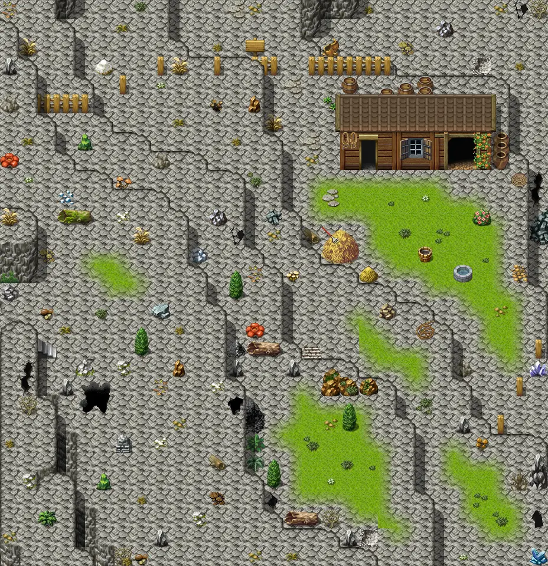

# Bwmfill 3

| | |
|---|---|
| **Map ID** | `bwmfill3` |
| **Region** | In Blackwater Mountain (other) |
| **Type** | Indoors / underground |
| **Size** | 29×30 tiles |
| **World map** | [World 1](index.md) |
| **Introduced** | [v0.8.10](../versions/0.8.10.md) |
| **NPCs** | 2 |
| **Enemy types** | 1 |
| **Quests** | 2 |

**Bwmfill 3** is an indoor map, in Blackwater Mountain (other). It has 2 NPCs and 1 kind of enemy. Exits lead to Bwmfill 2, Ratdom bwm 1, Bwmfill 4, Bwmfill 5 and 3 more.

## Map

<label class="lg"><input type="checkbox" data-t="spawn" checked><b>Red</b>&nbsp;Monsters / NPCs</label><label class="lg"><input type="checkbox" data-t="mapchange" checked><b>Blue</b>&nbsp;Exit to another map</label><label class="lg"><input type="checkbox" data-t="container" checked><b>Yellow</b>&nbsp;Container (click to see contents)</label><label class="lg"><input type="checkbox" data-t="sign" checked><b>Purple</b>&nbsp;Sign</label><label class="lg"><input type="checkbox" data-t="rest" checked><b>Green</b>&nbsp;Resting place</label><label class="lg"><input type="checkbox" data-t="key" checked><b>Orange dashed</b>&nbsp;Blocked until a quest step / item</label><label class="lg"><input type="checkbox" data-t="script"><b>Grey dotted</b>&nbsp;Scripted event</label><label class="lg"><input type="checkbox" data-t="replace"><b>White dotted</b>&nbsp;Changes during a quest</label><label class="lg"><input type="checkbox" data-t="pin" checked><b>Numbers</b>&nbsp;Numbered key points (see the key below the map)</label>

<a class="pin pin-exit" href="#key-1" style="left:20.690%;top:1.667%" title="Exit (north): to [Bwmfill 2](bwmfill2.md)">1</a><a class="pin pin-exit" href="#key-1" style="left:41.379%;top:1.667%" title="Exit (north): to [Bwmfill 2](bwmfill2.md)">1</a><a class="pin pin-exit" href="#key-2" style="left:98.276%;top:71.667%" title="Exit (east): to [Ratdom bwm 1](ratdom_bwm1.md)">2</a><a class="pin pin-exit" href="#key-2" style="left:98.276%;top:16.667%" title="Exit (east): to [Ratdom bwm 1](ratdom_bwm1.md)">2</a><a class="pin pin-exit" href="#key-3" style="left:8.621%;top:98.333%" title="Exit (south): to [Bwmfill 4](bwmfill4.md)">3</a><a class="pin pin-exit" href="#key-4" style="left:60.345%;top:98.333%" title="Exit (south): to [Bwmfill 5](bwmfill5.md)">4</a><a class="pin pin-exit" href="#key-5" style="left:1.724%;top:25.000%" title="Exit (west): to [Blackwater mountain 16](blackwater_mountain16.md)">5</a><a class="pin pin-exit" href="#key-6" style="left:1.724%;top:55.000%" title="Exit (west): to [Blackwater mountain 56](blackwater_mountain56.md)">6</a><a class="pin pin-exit" href="#key-7" style="left:67.241%;top:28.333%" title="Exit (stairs / passage): to [Bwmfill tunlon](bwmfill_tunlon.md)">7</a><a class="pin pin-exit" href="#key-7" style="left:84.483%;top:28.333%" title="Exit (stairs / passage): to [Bwmfill tunlon](bwmfill_tunlon.md)">7</a><a id="pin-npc-bwm_sheep1" class="pin pin-npc" href="#key-8" style="left:87.931%;top:51.667%" title="[Mountain Sheep](../../monsters/bwm_sheep1.md): NPC">8</a><a id="pin-npc-tunlon" class="pin pin-npc" href="#key-9" style="left:81.034%;top:41.667%" title="[Tunlon](../../monsters/tunlon.md): shopkeeper, 1 quest">9</a><a class="pin pin-sign" href="#key-10" style="left:46.552%;top:8.333%" title="Sign: “Here lives Tunlon of Crossglen - sheep farmer

Please do not feed any animals.”">10</a><a class="pin pin-script" href="#key-11" style="left:53.448%;top:60.000%" title="Quest trigger: Scripted event: advances the quest: It makes no fence to stage 12 (“Tunlon got furious when he saw that I killed his sheep.”) (+1 more quest(s))">11</a><a class="pin pin-key" href="#key-12" style="left:82.759%;top:43.333%" title="Blocked passage: Unlocked during the quest: Search for Andor (stage 1: “My father Mikhail says that Andor has not been home since yesterday. I should go look for him in the village.”)">12</a><a class="pin pin-key" href="#key-13" style="left:55.172%;top:41.667%" title="Blocked passage: Closed off once you reach this point in the quest: Search for Andor (stage 1: “My father Mikhail says that Andor has not been home since yesterday. I should go look for him in the village.”)">13</a><a class="pin pin-key" href="#key-13" style="left:39.655%;top:43.333%" title="Blocked passage: Closed off once you reach this point in the quest: Search for Andor (stage 1: “My father Mikhail says that Andor has not been home since yesterday. I should go look for him in the village.”)">13</a><a class="pin pin-key" href="#key-13" style="left:46.552%;top:75.000%" title="Blocked passage: Closed off once you reach this point in the quest: Search for Andor (stage 1: “My father Mikhail says that Andor has not been home since yesterday. I should go look for him in the village.”)">13</a>

??? abstract "Key to the numbers on the map"

    | # | What | Details |
    |---|---|---|
    | 1 | Exit (north) | to [Bwmfill 2](bwmfill2.md) |
    | 2 | Exit (east) | to [Ratdom bwm 1](ratdom_bwm1.md) |
    | 3 | Exit (south) | to [Bwmfill 4](bwmfill4.md) |
    | 4 | Exit (south) | to [Bwmfill 5](bwmfill5.md) |
    | 5 | Exit (west) | to [Blackwater mountain 16](blackwater_mountain16.md) |
    | 6 | Exit (west) | to [Blackwater mountain 56](blackwater_mountain56.md) |
    | 7 | Exit (stairs / passage) | to [Bwmfill tunlon](bwmfill_tunlon.md) |
    | 8 | [Mountain Sheep](../monsters/bwm_sheep1.md) | NPC |
    | 9 | [Tunlon](../monsters/tunlon.md) | shopkeeper, 1 quest |
    | 10 | Sign | “Here lives Tunlon of Crossglen - sheep farmer  Please do not feed any animals.” |
    | 11 | Quest trigger | Scripted event: advances the quest: It makes no fence to stage 12 (“Tunlon got furious when he saw that I killed his sheep.”) (+1 more quest(s)) |
    | 12 | Blocked passage | Unlocked during the quest: Search for Andor (stage 1: “My father Mikhail says that Andor has not been home since yesterday. I should go look for him in the village.”) |
    | 13 | Blocked passage | Closed off once you reach this point in the quest: Search for Andor (stage 1: “My father Mikhail says that Andor has not been home since yesterday. I should go look for him in the village.”) |

Verified against v0.8.18 map data.

## Connections

| Direction | Leads to | Region there | Map # |
|---|---|---|---|
| North | [Bwmfill 2](bwmfill2.md) | Blackwater Mountain | 1 |
| East | [Ratdom bwm 1](ratdom_bwm1.md) | Blackwater Mountain | 2 |
| South | [Bwmfill 4](bwmfill4.md) | Blackwater Mountain | 3 |
| South | [Bwmfill 5](bwmfill5.md) | Blackwater Mountain | 4 |
| West | [Blackwater mountain 16](blackwater_mountain16.md) | Blackwater Mountain | 5 |
| West | [Blackwater mountain 56](blackwater_mountain56.md) | Blackwater Mountain | 6 |
| Stairs / passage | [Bwmfill tunlon](bwmfill_tunlon.md) | Blackwater Mountain | 7 |

## NPCs

- [Mountain Sheep](../monsters/bwm_sheep1.md) — can be fought (#8)
- [Tunlon](../monsters/tunlon.md) — shopkeeper — quests: [It makes no fence](../quests/tunlon_fence.md) (#9)

## Enemies

| Enemy | HP | Damage | Up to | Notes |
|---|---|---|---|---|
| [Tunlon](../monsters/tunlon.md#v-tunlon2) | 73 | 9–17 | 1 | appears later, during a quest |

<small>“Up to” is the most that can be alive at once from the spawn areas on this map.</small>

## Items & containers

**Shops:** [Tunlon](../monsters/tunlon.md)

## Quests

- [It makes no fence](../quests/tunlon_fence.md): [Tunlon](../monsters/tunlon.md) is involved; something on this map advances it; stepping on a trigger here sets stage 12
- [Search for Andor](../quests/andor.md): blocked passage closes at stage 1; blocked passage opens at stage 1
- [Blackwater Mountain story flags (hidden flag)](../quests/bwmfill_nondisplay.md): [Tunlon](../monsters/tunlon.md) is involved; something on this map advances it; stepping on a trigger here sets stage 44

## Points of interest

- **Sign** (#10): “Here lives Tunlon of Crossglen - sheep farmer  Please do not feed any animals.”
- **Quest trigger** (#11): Scripted event: advances the quest: It makes no fence to stage 12 (“Tunlon got furious when he saw that I killed his sheep.”) (+1 more quest(s))
- **Blocked passage** (#12): Unlocked during the quest: Search for Andor (stage 1: “My father Mikhail says that Andor has not been home since yesterday. I should go look for him in the village.”)
- **Blocked passage** (#13): Closed off once you reach this point in the quest: Search for Andor (stage 1: “My father Mikhail says that Andor has not been home since yesterday. I should go look for him in the village.”)

## Version history

| Version | Change |
|---|---|
| [v0.8.10](../versions/0.8.10.md) | Added |
| [v0.8.18](../versions/0.8.18.md) | Map layout or objects changed |

Verified against v0.8.18 and every earlier release back to v0.7.0 (game data compared release by release).

## Community notes

<small>Written by players, not generated from game data. **Observations**: what players notice in-game · **Lore**: the in-world story · **Trivia**: real-world facts, references, development history · **Theory / speculation**: unconfirmed ideas; may just be unfinished content</small>

### Observations

*No notes yet. Contributions are welcome: [add a note](https://github.com/asdfghjkl628/Andor-s-Trail-Wikiiii/new/main/notes/maps?filename=bwmfill3.md&value=%23%23%20Observations%0A%0A%3C%21--%20what%20players%20notice%20in-game%20--%3E%0A%0A%23%23%20Lore%0A%0A%3C%21--%20the%20in-world%20story%20--%3E%0A%0A%23%23%20Trivia%0A%0A%3C%21--%20real-world%20facts%2C%20references%2C%20development%20history%20--%3E%0A%0A%23%23%20Theory%20/%20speculation%0A%0A%3C%21--%20unconfirmed%20ideas%3B%20may%20just%20be%20unfinished%20content%20--%3E%0A).*

### Lore

*No notes yet. Contributions are welcome: [add a note](https://github.com/asdfghjkl628/Andor-s-Trail-Wikiiii/new/main/notes/maps?filename=bwmfill3.md&value=%23%23%20Observations%0A%0A%3C%21--%20what%20players%20notice%20in-game%20--%3E%0A%0A%23%23%20Lore%0A%0A%3C%21--%20the%20in-world%20story%20--%3E%0A%0A%23%23%20Trivia%0A%0A%3C%21--%20real-world%20facts%2C%20references%2C%20development%20history%20--%3E%0A%0A%23%23%20Theory%20/%20speculation%0A%0A%3C%21--%20unconfirmed%20ideas%3B%20may%20just%20be%20unfinished%20content%20--%3E%0A).*

### Trivia

*No notes yet. Contributions are welcome: [add a note](https://github.com/asdfghjkl628/Andor-s-Trail-Wikiiii/new/main/notes/maps?filename=bwmfill3.md&value=%23%23%20Observations%0A%0A%3C%21--%20what%20players%20notice%20in-game%20--%3E%0A%0A%23%23%20Lore%0A%0A%3C%21--%20the%20in-world%20story%20--%3E%0A%0A%23%23%20Trivia%0A%0A%3C%21--%20real-world%20facts%2C%20references%2C%20development%20history%20--%3E%0A%0A%23%23%20Theory%20/%20speculation%0A%0A%3C%21--%20unconfirmed%20ideas%3B%20may%20just%20be%20unfinished%20content%20--%3E%0A).*

### Theory / speculation

*No notes yet. Contributions are welcome: [add a note](https://github.com/asdfghjkl628/Andor-s-Trail-Wikiiii/new/main/notes/maps?filename=bwmfill3.md&value=%23%23%20Observations%0A%0A%3C%21--%20what%20players%20notice%20in-game%20--%3E%0A%0A%23%23%20Lore%0A%0A%3C%21--%20the%20in-world%20story%20--%3E%0A%0A%23%23%20Trivia%0A%0A%3C%21--%20real-world%20facts%2C%20references%2C%20development%20history%20--%3E%0A%0A%23%23%20Theory%20/%20speculation%0A%0A%3C%21--%20unconfirmed%20ideas%3B%20may%20just%20be%20unfinished%20content%20--%3E%0A).*

??? info "Technical information"

    | | |
    |---|---|
    | Map ID | `bwmfill3` |
    | File | `res/xml/bwmfill3.tmx` |
    | Size | 29×30 tiles (928×960 px) |
    | outdoors property | – |
    | Layers drawn | ground, objects, above |
    | Tilesets | map_bed_1, map_border_1, map_bridge_1, map_bridge_2, map_broken_1, map_cavewall_1, map_cavewall_2, map_cavewall_3, map_cavewall_4, map_chair_table_1, map_chair_table_2, map_crate_1, map_cupboard_1, map_curtain_1, map_entrance_1, map_entrance_2, map_fence_1, map_fence_2, map_fence_3, map_fence_4, map_ground_1, map_ground_2, map_ground_3, map_ground_4, map_ground_5, map_ground_6, map_ground_7, map_ground_8, map_house_1, map_house_2, map_indoor_1, map_indoor_2, map_kitchen_1, map_outdoor_1, map_pillar_1, map_pillar_2, map_plant_1, map_plant_2, map_rock_1, map_rock_2, map_roof_1, map_roof_2, map_roof_3, map_shop_1, map_sign_ladder_1, map_table_1, map_trail_1, map_transition_1, map_transition_2, map_transition_3, map_transition_4, map_transition_5, map_tree_1, map_tree_2, map_wall_1, map_wall_2, map_wall_3, map_wall_4, map_window_1, map_window_2 |
    | Map objects | mapchange: 10, spawn: 5, key: 4, sign: 1, script: 1 |
    | World map position | segment `world1`, x 107, y 355 |

<small>Data from v0.8.18</small>
