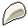

# Bwmfill6

14×20 tiles · outdoors · part of [World1](index.md)

<label class="lg"><input type="checkbox" data-t="spawn" checked><b>Red</b>&nbsp;Monsters / NPCs</label><label class="lg"><input type="checkbox" data-t="mapchange" checked><b>Blue</b>&nbsp;Exit to another map</label><label class="lg"><input type="checkbox" data-t="container" checked><b>Yellow</b>&nbsp;Container (click to see contents)</label><label class="lg"><input type="checkbox" data-t="sign" checked><b>Purple</b>&nbsp;Sign</label><label class="lg"><input type="checkbox" data-t="rest" checked><b>Green</b>&nbsp;Resting place</label><label class="lg"><input type="checkbox" data-t="key" checked><b>Orange dashed</b>&nbsp;Blocked until a quest step / item</label><label class="lg"><input type="checkbox" data-t="script"><b>Grey dotted</b>&nbsp;Scripted event</label><label class="lg"><input type="checkbox" data-t="replace"><b>White dotted</b>&nbsp;Changes during a quest</label>

## Containers

<b>Container 1</b><ul><li><a href="../../items/gold/">Gold coins</a> <small>100% · ×70 to 180</small></li><li><a href="../../items/bwm_longsword/">Blackwater iron longsword</a> <small>100%</small></li><li><a href="../../items/bwm_claws/">White wyrm claw</a> <small>50% · ×1 to 2</small></li><li><a href="../../items/bone/">Bone</a> <small>15% · ×0 to 3</small></li></ul>

<b>Container 2</b><ul><li><a href="../../items/gold/">Gold coins</a> <small>100% · ×100</small></li></ul>

## Exits

- [Bwmfill5](bwmfill5.md)
- [Bwmfill7](bwmfill7.md)
- [Ratdom bwm1](ratdom_bwm1.md)
- [Wild2](wild2.md)

## Monsters & NPCs here

| Name | HP |
|---|---|
| [Slithering venomfang](../monsters/slithering_venomfang.md) | 35 |
| [Mountain wolf](../monsters/mountain_wolf.md) | 49 |
| [White wyrm](../monsters/white_wyrm.md) | 55 |
| [Young gornaud](../monsters/young_gornaud.md) | 70 |
| [Strong aulaeth](../monsters/strong_aulaeth.md) | 135 |

<small>Map ID: `bwmfill6` · Data from v0.8.18</small>
