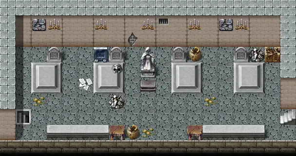

# Catacombs1

| | |
|---|---|
| **Map ID** | `catacombs1` |
| **Region** | In Fallhaven (settlement) |
| **Type** | Indoors / underground |
| **Size** | 19×10 tiles |
| **Introduced** | v0.7.0 or earlier |
| **NPCs** | 1 |
| **Enemy types** | 2 |
| **Quests** | 0 |

**Catacombs1** is an indoor map, in Fallhaven (settlement). It has 1 NPC and 2 kinds of enemy. Exits lead to Fallhaven north-east, Fallhaven church, Catacombs2.

## Map

<label class="lg"><input type="checkbox" data-t="spawn" checked><b>Red</b>&nbsp;Monsters / NPCs</label><label class="lg"><input type="checkbox" data-t="mapchange" checked><b>Blue</b>&nbsp;Exit to another map</label><label class="lg"><input type="checkbox" data-t="container" checked><b>Yellow</b>&nbsp;Container (click to see contents)</label><label class="lg"><input type="checkbox" data-t="sign" checked><b>Purple</b>&nbsp;Sign</label><label class="lg"><input type="checkbox" data-t="rest" checked><b>Green</b>&nbsp;Resting place</label><label class="lg"><input type="checkbox" data-t="key" checked><b>Orange dashed</b>&nbsp;Blocked until a quest step / item</label><label class="lg"><input type="checkbox" data-t="script"><b>Grey dotted</b>&nbsp;Scripted event</label><label class="lg"><input type="checkbox" data-t="replace"><b>White dotted</b>&nbsp;Changes during a quest</label><label class="lg"><input type="checkbox" data-t="pin" checked><b>Numbers</b>&nbsp;Numbered key points (see the key below the map)</label>

<a class="pin pin-exit" href="#key-1" style="left:55.263%;top:15.000%" title="Exit (north): to [Fallhaven north-east](fallhaven_ne.md)">1</a><a class="pin pin-exit" href="#key-2" style="left:97.368%;top:75.000%" title="Exit (east): to [Fallhaven church](fallhaven_church.md)">2</a><a class="pin pin-exit" href="#key-3" style="left:7.895%;top:75.000%" title="Exit (west): to [Catacombs2](catacombs2.md)">3</a><a id="pin-npc-guardian_of_the_catacombs" class="pin pin-npc" href="#key-4" style="left:39.474%;top:75.000%" title="[Guardian of the catacombs](../../monsters/guardian_of_the_catacombs.md): NPC">4</a><a class="pin pin-sign" href="#key-5" style="left:23.684%;top:35.000%" title="Sign: “Here lies the remains of Sir Eneryth&#x27;s horse, Shadowsteed.”">5</a><a class="pin pin-sign" href="#key-6" style="left:44.737%;top:35.000%" title="Sign: “Here lies Sir Eneryth of house Gellir. Son of Sir Anarogas, and the elder brother of Sir Karthanir.”">6</a><a class="pin pin-script" href="#key-7" style="left:55.263%;top:35.000%" title="Quest trigger: Scripted event: advances the quest: hidden story flag “feygard_nondisplayed” to stage 72 (“72=ladder place 2”)">7</a><a class="pin pin-sign" href="#key-8" style="left:76.316%;top:35.000%" title="Sign: “Here lies Lady Gelythus of house Gellir. Wife of Sir Eneryth of house Gellir.”">8</a><a class="pin pin-key" href="#key-9" style="left:55.610%;top:7.501%" title="Blocked passage: Unlocked during the quest: hidden story flag “feygard_nondisplayed” (stage 73: “73=windows church unlocked from inside”)">9</a><a class="pin pin-replace" href="#key-10" style="left:57.895%;top:30.000%" title="Changes during a quest: This area changes during the quest: hidden story flag “feygard_nondisplayed” (stage 71: “71=ladder place 1”)">10</a><a class="pin pin-replace" href="#key-11" style="left:53.263%;top:23.443%" title="Changes during a quest: This area changes during the quest: hidden story flag “feygard_nondisplayed” (stage 72: “72=ladder place 2”)">11</a><a class="pin pin-replace" href="#key-12" style="left:62.116%;top:19.898%" title="Changes during a quest: This area changes during the quest: hidden story flag “feygard_nondisplayed” (stage 73: “73=windows church unlocked from inside”)">12</a>

??? abstract "Key to the numbers on the map"

    | # | What | Details |
    |---|---|---|
    | 1 | Exit (north) | to [Fallhaven north-east](fallhaven_ne.md) |
    | 2 | Exit (east) | to [Fallhaven church](fallhaven_church.md) |
    | 3 | Exit (west) | to [Catacombs2](catacombs2.md) |
    | 4 | [Guardian of the catacombs](../monsters/guardian_of_the_catacombs.md) | NPC |
    | 5 | Sign | “Here lies the remains of Sir Eneryth's horse, Shadowsteed.” |
    | 6 | Sign | “Here lies Sir Eneryth of house Gellir. Son of Sir Anarogas, and the elder brother of Sir Karthanir.” |
    | 7 | Quest trigger | Scripted event: advances the quest: hidden story flag “feygard_nondisplayed” to stage 72 (“72=ladder place 2”) |
    | 8 | Sign | “Here lies Lady Gelythus of house Gellir. Wife of Sir Eneryth of house Gellir.” |
    | 9 | Blocked passage | Unlocked during the quest: hidden story flag “feygard_nondisplayed” (stage 73: “73=windows church unlocked from inside”) |
    | 10 | Changes during a quest | This area changes during the quest: hidden story flag “feygard_nondisplayed” (stage 71: “71=ladder place 1”) |
    | 11 | Changes during a quest | This area changes during the quest: hidden story flag “feygard_nondisplayed” (stage 72: “72=ladder place 2”) |
    | 12 | Changes during a quest | This area changes during the quest: hidden story flag “feygard_nondisplayed” (stage 73: “73=windows church unlocked from inside”) |

Verified against v0.8.18 map data.

## Connections

| Direction | Leads to | Region there | Map # |
|---|---|---|---|
| North | [Fallhaven north-east](fallhaven_ne.md) | Fallhaven | 1 |
| East | [Fallhaven church](fallhaven_church.md) | Fallhaven | 2 |
| West | [Catacombs2](catacombs2.md) | Fallhaven | 3 |

## NPCs

- [Guardian of the catacombs](../monsters/guardian_of_the_catacombs.md) — can be fought (#4)

## Enemies

| Enemy | HP | Damage | Up to | Notes |
|---|---|---|---|---|
| [Catacomb rat](../monsters/catacomb_rat.md) | 15 | 1–1 | 4 | shares spawn with Large catacomb rat |
| [Large catacomb rat](../monsters/large_catacomb_rat.md) | 21 | 1–2 | 4 | shares spawn with Catacomb rat |

<small>“Up to” is the most that can be alive at once from the spawn areas on this map.</small>

## Quests

- [feygard_nondisplayed (hidden flag)](../quests/feygard_nondisplayed.md): blocked passage opens at stage 73; part of the map changes at stage 71; part of the map changes at stage 72; part of the map changes at stage 73; something on this map advances it; stepping on a trigger here sets stage 72

## Points of interest

- **Sign** (#5): “Here lies the remains of Sir Eneryth's horse, Shadowsteed.”
- **Sign** (#6): “Here lies Sir Eneryth of house Gellir. Son of Sir Anarogas, and the elder brother of Sir Karthanir.”
- **Quest trigger** (#7): Scripted event: advances the quest: hidden story flag “feygard_nondisplayed” to stage 72 (“72=ladder place 2”)
- **Sign** (#8): “Here lies Lady Gelythus of house Gellir. Wife of Sir Eneryth of house Gellir.”
- **Blocked passage** (#9): Unlocked during the quest: hidden story flag “feygard_nondisplayed” (stage 73: “73=windows church unlocked from inside”)
- **Changes during a quest** (#10): This area changes during the quest: hidden story flag “feygard_nondisplayed” (stage 71: “71=ladder place 1”)
- **Changes during a quest** (#11): This area changes during the quest: hidden story flag “feygard_nondisplayed” (stage 72: “72=ladder place 2”)
- **Changes during a quest** (#12): This area changes during the quest: hidden story flag “feygard_nondisplayed” (stage 73: “73=windows church unlocked from inside”)

## Version history

| Version | Change |
|---|---|
| [v0.7.0](../versions/0.7.0.md) | Present in v0.7.0 (earliest release tracked) |
| [v0.7.1](../versions/0.7.1.md) | Map layout or objects changed |
| [v0.7.2](../versions/0.7.2.md) | Map layout or objects changed |
| [v0.8.12.1](../versions/0.8.12.1.md) | Map layout or objects changed |

Verified against v0.8.18 and every earlier release back to v0.7.0 (game data compared release by release).

## Community notes

<small>Written by players, not generated from game data. **Observations**: what players notice in-game · **Lore**: the in-world story · **Trivia**: real-world facts, references, development history · **Theory / speculation**: unconfirmed ideas; may just be unfinished content</small>

### Observations

*No notes yet. Contributions are welcome: [add a note](https://github.com/asdfghjkl628/Andor-s-Trail-Wikiiii/new/main/notes/maps?filename=catacombs1.md&value=%23%23%20Observations%0A%0A%3C%21--%20what%20players%20notice%20in-game%20--%3E%0A%0A%23%23%20Lore%0A%0A%3C%21--%20the%20in-world%20story%20--%3E%0A%0A%23%23%20Trivia%0A%0A%3C%21--%20real-world%20facts%2C%20references%2C%20development%20history%20--%3E%0A%0A%23%23%20Theory%20/%20speculation%0A%0A%3C%21--%20unconfirmed%20ideas%3B%20may%20just%20be%20unfinished%20content%20--%3E%0A).*

### Lore

*No notes yet. Contributions are welcome: [add a note](https://github.com/asdfghjkl628/Andor-s-Trail-Wikiiii/new/main/notes/maps?filename=catacombs1.md&value=%23%23%20Observations%0A%0A%3C%21--%20what%20players%20notice%20in-game%20--%3E%0A%0A%23%23%20Lore%0A%0A%3C%21--%20the%20in-world%20story%20--%3E%0A%0A%23%23%20Trivia%0A%0A%3C%21--%20real-world%20facts%2C%20references%2C%20development%20history%20--%3E%0A%0A%23%23%20Theory%20/%20speculation%0A%0A%3C%21--%20unconfirmed%20ideas%3B%20may%20just%20be%20unfinished%20content%20--%3E%0A).*

### Trivia

*No notes yet. Contributions are welcome: [add a note](https://github.com/asdfghjkl628/Andor-s-Trail-Wikiiii/new/main/notes/maps?filename=catacombs1.md&value=%23%23%20Observations%0A%0A%3C%21--%20what%20players%20notice%20in-game%20--%3E%0A%0A%23%23%20Lore%0A%0A%3C%21--%20the%20in-world%20story%20--%3E%0A%0A%23%23%20Trivia%0A%0A%3C%21--%20real-world%20facts%2C%20references%2C%20development%20history%20--%3E%0A%0A%23%23%20Theory%20/%20speculation%0A%0A%3C%21--%20unconfirmed%20ideas%3B%20may%20just%20be%20unfinished%20content%20--%3E%0A).*

### Theory / speculation

*No notes yet. Contributions are welcome: [add a note](https://github.com/asdfghjkl628/Andor-s-Trail-Wikiiii/new/main/notes/maps?filename=catacombs1.md&value=%23%23%20Observations%0A%0A%3C%21--%20what%20players%20notice%20in-game%20--%3E%0A%0A%23%23%20Lore%0A%0A%3C%21--%20the%20in-world%20story%20--%3E%0A%0A%23%23%20Trivia%0A%0A%3C%21--%20real-world%20facts%2C%20references%2C%20development%20history%20--%3E%0A%0A%23%23%20Theory%20/%20speculation%0A%0A%3C%21--%20unconfirmed%20ideas%3B%20may%20just%20be%20unfinished%20content%20--%3E%0A).*

??? info "Technical information"

    | | |
    |---|---|
    | Map ID | `catacombs1` |
    | File | `res/xml/catacombs1.tmx` |
    | Size | 19×10 tiles (608×320 px) |
    | outdoors property | – |
    | Layers drawn | ground, objects, above |
    | Tilesets | map_bed_1, map_border_1, map_bridge_1, map_bridge_2, map_broken_1, map_cavewall_1, map_cavewall_2, map_cavewall_3, map_cavewall_4, map_chair_table_1, map_chair_table_2, map_crate_1, map_cupboard_1, map_curtain_1, map_entrance_1, map_entrance_2, map_fence_1, map_fence_2, map_fence_3, map_fence_4, map_ground_1, map_ground_2, map_ground_3, map_ground_4, map_ground_5, map_ground_6, map_ground_7, map_ground_8, map_house_1, map_house_2, map_indoor_1, map_indoor_2, map_kitchen_1, map_outdoor_1, map_pillar_1, map_pillar_2, map_plant_1, map_plant_2, map_rock_1, map_rock_2, map_roof_1, map_roof_2, map_roof_3, map_shop_1, map_sign_ladder_1, map_table_1, map_trail_1, map_transition_1, map_transition_2, map_transition_3, map_transition_4, map_transition_5, map_tree_1, map_tree_2, map_wall_1, map_wall_2, map_wall_3, map_wall_4, map_window_1, map_window_2 |
    | Map objects | mapchange: 3, sign: 3, replace: 3, spawn: 2, script: 1, key: 1 |
    | World map position | – |

<small>Data from v0.8.18</small>
