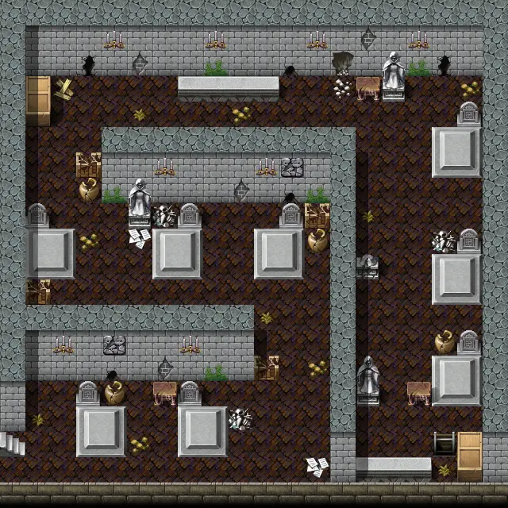

# Catacombs 2

| | |
|---|---|
| **Map ID** | `catacombs2` |
| **Region** | In Fallhaven (settlement) |
| **Type** | Indoors / underground |
| **Size** | 20×20 tiles |
| **Introduced** | v0.7.0 or earlier |
| **Enemy types** | 4 |
| **Quests** | 0 |

**Catacombs 2** is an indoor map, in Fallhaven (settlement). It has no NPCs and 4 kinds of enemy. Exits lead to Catacombs 1, Catacombs 3.

## Map

<label class="lg"><input type="checkbox" data-t="spawn" checked><b>Red</b>&nbsp;Monsters / NPCs</label><label class="lg"><input type="checkbox" data-t="mapchange" checked><b>Blue</b>&nbsp;Exit to another map</label><label class="lg"><input type="checkbox" data-t="container" checked><b>Yellow</b>&nbsp;Container (click to see contents)</label><label class="lg"><input type="checkbox" data-t="sign" checked><b>Purple</b>&nbsp;Sign</label><label class="lg"><input type="checkbox" data-t="rest" checked><b>Green</b>&nbsp;Resting place</label><label class="lg"><input type="checkbox" data-t="key" checked><b>Orange dashed</b>&nbsp;Blocked until a quest step / item</label><label class="lg"><input type="checkbox" data-t="script"><b>Grey dotted</b>&nbsp;Scripted event</label><label class="lg"><input type="checkbox" data-t="replace"><b>White dotted</b>&nbsp;Changes during a quest</label><label class="lg"><input type="checkbox" data-t="pin" checked><b>Numbers</b>&nbsp;Numbered key points (see the key below the map)</label>

<a class="pin pin-exit" href="#key-1" style="left:2.500%;top:87.500%" title="Exit (west): to [Catacombs 1](catacombs1.md)">1</a><a class="pin pin-exit" href="#key-2" style="left:87.500%;top:87.500%" title="Exit (stairs / passage): to [Catacombs 3](catacombs3.md)">2</a><a class="pin pin-sign" href="#key-3" style="left:52.500%;top:42.500%" title="Sign: “Here lies ta&#x27;Tembas, servant of the Shadow in the chapel of Fallhaven.”">3</a><a class="pin pin-sign" href="#key-4" style="left:42.500%;top:42.500%" title="Sign: “Here lies ta&#x27;Draiden, servant of the Shadow in the chapel of Fallhaven.”">4</a><a class="pin pin-sign" href="#key-5" style="left:87.500%;top:22.500%" title="Sign: “Here lies Lerythal the kind. May she rest with the Shadow.”">5</a><a class="pin pin-sign" href="#key-6" style="left:42.500%;top:77.500%" title="Sign: “Here lies the remains of one-eyed Tragdas, servant of Sir Eneryth of house Gellir.”">6</a><a class="pin pin-sign" href="#key-7" style="left:12.500%;top:77.500%" title="Sign: “Here lies Elodam, servant of Sir Eneryth of house Gellir.”">7</a><a class="pin pin-sign" href="#key-8" style="left:92.500%;top:42.500%" title="Sign: “Here lies Kragnis the second, steward of the chapel of Fallhaven.”">8</a><a class="pin pin-sign" href="#key-9" style="left:92.500%;top:62.500%" title="Sign: “The writing on the grave reads: Rest with the Shadow, my dearest.”">9</a><a class="pin pin-sign" href="#key-10" style="left:62.500%;top:92.500%" title="Sign: “You find some crumpled papers on the floor, containing scribbled notes about the fine arts of pottery making. You decide to leave them be.”">10</a><a class="pin pin-sign" href="#key-11" style="left:27.500%;top:47.500%" title="Sign: “On the floor is what looks like some torn out pages from a book.”">11</a>

??? abstract "Key to the numbers on the map"

    | # | What | Details |
    |---|---|---|
    | 1 | Exit (west) | to [Catacombs 1](catacombs1.md) |
    | 2 | Exit (stairs / passage) | to [Catacombs 3](catacombs3.md) |
    | 3 | Sign | “Here lies ta'Tembas, servant of the Shadow in the chapel of Fallhaven.” |
    | 4 | Sign | “Here lies ta'Draiden, servant of the Shadow in the chapel of Fallhaven.” |
    | 5 | Sign | “Here lies Lerythal the kind. May she rest with the Shadow.” |
    | 6 | Sign | “Here lies the remains of one-eyed Tragdas, servant of Sir Eneryth of house Gellir.” |
    | 7 | Sign | “Here lies Elodam, servant of Sir Eneryth of house Gellir.” |
    | 8 | Sign | “Here lies Kragnis the second, steward of the chapel of Fallhaven.” |
    | 9 | Sign | “The writing on the grave reads: Rest with the Shadow, my dearest.” |
    | 10 | Sign | “You find some crumpled papers on the floor, containing scribbled notes about the fine arts of pottery making. You decide to leave them be.” |
    | 11 | Sign | “On the floor is what looks like some torn out pages from a book.” |

Verified against v0.8.18 map data.

## Connections

| Direction | Leads to | Region there | Map # |
|---|---|---|---|
| West | [Catacombs 1](catacombs1.md) | Fallhaven | 1 |
| Stairs / passage | [Catacombs 3](catacombs3.md) | Fallhaven | 2 |

## Enemies

| Enemy | HP | Damage | Up to | Notes |
|---|---|---|---|---|
| [Catacomb rat](../monsters/catacomb_rat.md) | 15 | 1–1 | 4 | shares spawn with Large catacomb rat |
| [Spectre](../monsters/spectre.md) | 15 | 1–5 | 5 | shares spawn with Ghostly visage |
| [Ghostly visage](../monsters/ghostly_visage.md) | 16 | 1–4 | 5 | shares spawn with Spectre |
| [Large catacomb rat](../monsters/large_catacomb_rat.md) | 21 | 1–2 | 4 | shares spawn with Catacomb rat |

<small>“Up to” is the most that can be alive at once from the spawn areas on this map.</small>

## Points of interest

- **Sign** (#3): “Here lies ta'Tembas, servant of the Shadow in the chapel of Fallhaven.”
- **Sign** (#4): “Here lies ta'Draiden, servant of the Shadow in the chapel of Fallhaven.”
- **Sign** (#5): “Here lies Lerythal the kind. May she rest with the Shadow.”
- **Sign** (#6): “Here lies the remains of one-eyed Tragdas, servant of Sir Eneryth of house Gellir.”
- **Sign** (#7): “Here lies Elodam, servant of Sir Eneryth of house Gellir.”
- **Sign** (#8): “Here lies Kragnis the second, steward of the chapel of Fallhaven.”
- **Sign** (#9): “The writing on the grave reads: Rest with the Shadow, my dearest.”
- **Sign** (#10): “You find some crumpled papers on the floor, containing scribbled notes about the fine arts of pottery making. You decide to leave them be.”
- **Sign** (#11): “On the floor is what looks like some torn out pages from a book.”

## Version history

| Version | Change |
|---|---|
| [v0.7.0](../versions/0.7.0.md) | Present in v0.7.0 (earliest release tracked) |
| [v0.7.1](../versions/0.7.1.md) | Map layout or objects changed |
| [v0.7.2](../versions/0.7.2.md) | Map layout or objects changed |
| [v0.8.2](../versions/0.8.2.md) | Map layout or objects changed |

Verified against v0.8.18 and every earlier release back to v0.7.0 (game data compared release by release).

## Community notes

<small>Written by players, not generated from game data. **Observations**: what players notice in-game · **Lore**: the in-world story · **Trivia**: real-world facts, references, development history · **Theory / speculation**: unconfirmed ideas; may just be unfinished content</small>

### Observations

*No notes yet. Contributions are welcome: [add a note](https://github.com/asdfghjkl628/Andor-s-Trail-Wikiiii/new/main/notes/maps?filename=catacombs2.md&value=%23%23%20Observations%0A%0A%3C%21--%20what%20players%20notice%20in-game%20--%3E%0A%0A%23%23%20Lore%0A%0A%3C%21--%20the%20in-world%20story%20--%3E%0A%0A%23%23%20Trivia%0A%0A%3C%21--%20real-world%20facts%2C%20references%2C%20development%20history%20--%3E%0A%0A%23%23%20Theory%20/%20speculation%0A%0A%3C%21--%20unconfirmed%20ideas%3B%20may%20just%20be%20unfinished%20content%20--%3E%0A).*

### Lore

*No notes yet. Contributions are welcome: [add a note](https://github.com/asdfghjkl628/Andor-s-Trail-Wikiiii/new/main/notes/maps?filename=catacombs2.md&value=%23%23%20Observations%0A%0A%3C%21--%20what%20players%20notice%20in-game%20--%3E%0A%0A%23%23%20Lore%0A%0A%3C%21--%20the%20in-world%20story%20--%3E%0A%0A%23%23%20Trivia%0A%0A%3C%21--%20real-world%20facts%2C%20references%2C%20development%20history%20--%3E%0A%0A%23%23%20Theory%20/%20speculation%0A%0A%3C%21--%20unconfirmed%20ideas%3B%20may%20just%20be%20unfinished%20content%20--%3E%0A).*

### Trivia

*No notes yet. Contributions are welcome: [add a note](https://github.com/asdfghjkl628/Andor-s-Trail-Wikiiii/new/main/notes/maps?filename=catacombs2.md&value=%23%23%20Observations%0A%0A%3C%21--%20what%20players%20notice%20in-game%20--%3E%0A%0A%23%23%20Lore%0A%0A%3C%21--%20the%20in-world%20story%20--%3E%0A%0A%23%23%20Trivia%0A%0A%3C%21--%20real-world%20facts%2C%20references%2C%20development%20history%20--%3E%0A%0A%23%23%20Theory%20/%20speculation%0A%0A%3C%21--%20unconfirmed%20ideas%3B%20may%20just%20be%20unfinished%20content%20--%3E%0A).*

### Theory / speculation

*No notes yet. Contributions are welcome: [add a note](https://github.com/asdfghjkl628/Andor-s-Trail-Wikiiii/new/main/notes/maps?filename=catacombs2.md&value=%23%23%20Observations%0A%0A%3C%21--%20what%20players%20notice%20in-game%20--%3E%0A%0A%23%23%20Lore%0A%0A%3C%21--%20the%20in-world%20story%20--%3E%0A%0A%23%23%20Trivia%0A%0A%3C%21--%20real-world%20facts%2C%20references%2C%20development%20history%20--%3E%0A%0A%23%23%20Theory%20/%20speculation%0A%0A%3C%21--%20unconfirmed%20ideas%3B%20may%20just%20be%20unfinished%20content%20--%3E%0A).*

??? info "Technical information"

    | | |
    |---|---|
    | Map ID | `catacombs2` |
    | File | `res/xml/catacombs2.tmx` |
    | Size | 20×20 tiles (640×640 px) |
    | outdoors property | – |
    | Layers drawn | ground, objects, above |
    | Tilesets | map_bed_1, map_border_1, map_bridge_1, map_bridge_2, map_broken_1, map_cavewall_1, map_cavewall_2, map_cavewall_3, map_cavewall_4, map_chair_table_1, map_chair_table_2, map_crate_1, map_cupboard_1, map_curtain_1, map_entrance_1, map_entrance_2, map_fence_1, map_fence_2, map_fence_3, map_fence_4, map_ground_1, map_ground_2, map_ground_3, map_ground_4, map_ground_5, map_ground_6, map_ground_7, map_ground_8, map_house_1, map_house_2, map_indoor_1, map_indoor_2, map_kitchen_1, map_outdoor_1, map_pillar_1, map_pillar_2, map_plant_1, map_plant_2, map_rock_1, map_rock_2, map_roof_1, map_roof_2, map_roof_3, map_shop_1, map_sign_ladder_1, map_table_1, map_trail_1, map_transition_1, map_transition_2, map_transition_3, map_transition_4, map_transition_5, map_tree_1, map_tree_2, map_wall_1, map_wall_2, map_wall_3, map_wall_4, map_window_1, map_window_2 |
    | Map objects | sign: 9, spawn: 5, mapchange: 2 |
    | World map position | – |

<small>Data from v0.8.18</small>
