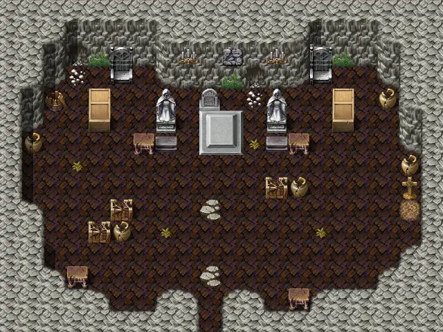

# Catacombs4

| | |
|---|---|
| **Map ID** | `catacombs4` |
| **Type** | Indoors / underground |
| **Size** | 20×15 tiles |
| **Introduced** | v0.7.0 or earlier |
| **Enemy types** | 3 |
| **Quests** | 1 |

**Catacombs4** is an indoor map. It has no NPCs and 3 kinds of enemy. Exits lead to Catacombs3.

## Map

<label class="lg"><input type="checkbox" data-t="spawn" checked><b>Red</b>&nbsp;Monsters / NPCs</label><label class="lg"><input type="checkbox" data-t="mapchange" checked><b>Blue</b>&nbsp;Exit to another map</label><label class="lg"><input type="checkbox" data-t="container" checked><b>Yellow</b>&nbsp;Container (click to see contents)</label><label class="lg"><input type="checkbox" data-t="sign" checked><b>Purple</b>&nbsp;Sign</label><label class="lg"><input type="checkbox" data-t="rest" checked><b>Green</b>&nbsp;Resting place</label><label class="lg"><input type="checkbox" data-t="key" checked><b>Orange dashed</b>&nbsp;Blocked until a quest step / item</label><label class="lg"><input type="checkbox" data-t="script"><b>Grey dotted</b>&nbsp;Scripted event</label><label class="lg"><input type="checkbox" data-t="replace"><b>White dotted</b>&nbsp;Changes during a quest</label><label class="lg"><input type="checkbox" data-t="pin" checked><b>Numbers</b>&nbsp;Numbered key points (see the key below the map)</label>

<a class="pin pin-exit" href="#key-1" style="left:47.500%;top:96.667%" title="Exit (south): to [Catacombs3](catacombs3.md)">1</a><a class="pin pin-sign" href="#key-2" style="left:92.500%;top:63.333%" title="Sign: “The cross reads: ta&#x27;Dreg lies here, advisor of the Shadow to king Luthor.”">2</a><a class="pin pin-sign" href="#key-3" style="left:52.500%;top:30.000%" title="Sign: “The grave reads: King Luthor, our savior and leader. The grave is also adorned with the golden seal of house Luthor.”">3</a><a class="pin pin-replace" href="#key-4" style="left:45.000%;top:26.667%" title="Changes during a quest: This area changes during the quest: Troubling times (stage 10: “I went to the Thieves&#x27; Guild in Fallhaven looking for things to do.”)">4</a>

??? abstract "Key to the numbers on the map"

    | # | What | Details |
    |---|---|---|
    | 1 | Exit (south) | to [Catacombs3](catacombs3.md) |
    | 2 | Sign | “The cross reads: ta'Dreg lies here, advisor of the Shadow to king Luthor.” |
    | 3 | Sign | “The grave reads: King Luthor, our savior and leader. The grave is also adorned with the golden seal of house Luthor.” |
    | 4 | Changes during a quest | This area changes during the quest: Troubling times (stage 10: “I went to the Thieves' Guild in Fallhaven looking for things to do.”) |

Verified against v0.8.18 map data.

## Connections

| Direction | Leads to | Region there | Map # |
|---|---|---|---|
| South | [Catacombs3](catacombs3.md) | Fallhaven | 1 |

## Enemies

| Enemy | HP | Damage | Up to | Notes |
|---|---|---|---|---|
| [Shade](../monsters/shade.md) | 16 | 1–4 | 2 | shares spawn with Apparition, Young gargoyle |
| [Apparition](../monsters/apparition.md) | 17 | 1–5 | 2 | shares spawn with Shade, Young gargoyle |
| [Young gargoyle](../monsters/young_gargoyle.md) | 35 | 2–5 | 2 | shares spawn with Apparition, Shade |

<small>“Up to” is the most that can be alive at once from the spawn areas on this map.</small>

## Quests

- [Troubling times](../quests/troubling_times.md): part of the map changes at stage 10

## Points of interest

- **Sign** (#2): “The cross reads: ta'Dreg lies here, advisor of the Shadow to king Luthor.”
- **Sign** (#3): “The grave reads: King Luthor, our savior and leader. The grave is also adorned with the golden seal of house Luthor.”
- **Changes during a quest** (#4): This area changes during the quest: Troubling times (stage 10: “I went to the Thieves' Guild in Fallhaven looking for things to do.”)

## Version history

| Version | Change |
|---|---|
| [v0.7.0](../versions/0.7.0.md) | Present in v0.7.0 (earliest release tracked) |
| [v0.7.1](../versions/0.7.1.md) | Map layout or objects changed |
| [v0.7.2](../versions/0.7.2.md) | Map layout or objects changed |
| [v0.8.2](../versions/0.8.2.md) | Map layout or objects changed |
| [v0.8.13](../versions/0.8.13.md) | Map layout or objects changed |

Verified against v0.8.18 and every earlier release back to v0.7.0 (game data compared release by release).

## Community notes

<small>Written by players, not generated from game data. **Observations**: what players notice in-game · **Lore**: the in-world story · **Trivia**: real-world facts, references, development history · **Theory / speculation**: unconfirmed ideas; may just be unfinished content</small>

### Observations

*No notes yet. Contributions are welcome: [add a note](https://github.com/asdfghjkl628/Andor-s-Trail-Wikiiii/new/main/notes/maps?filename=catacombs4.md&value=%23%23%20Observations%0A%0A%3C%21--%20what%20players%20notice%20in-game%20--%3E%0A%0A%23%23%20Lore%0A%0A%3C%21--%20the%20in-world%20story%20--%3E%0A%0A%23%23%20Trivia%0A%0A%3C%21--%20real-world%20facts%2C%20references%2C%20development%20history%20--%3E%0A%0A%23%23%20Theory%20/%20speculation%0A%0A%3C%21--%20unconfirmed%20ideas%3B%20may%20just%20be%20unfinished%20content%20--%3E%0A).*

### Lore

*No notes yet. Contributions are welcome: [add a note](https://github.com/asdfghjkl628/Andor-s-Trail-Wikiiii/new/main/notes/maps?filename=catacombs4.md&value=%23%23%20Observations%0A%0A%3C%21--%20what%20players%20notice%20in-game%20--%3E%0A%0A%23%23%20Lore%0A%0A%3C%21--%20the%20in-world%20story%20--%3E%0A%0A%23%23%20Trivia%0A%0A%3C%21--%20real-world%20facts%2C%20references%2C%20development%20history%20--%3E%0A%0A%23%23%20Theory%20/%20speculation%0A%0A%3C%21--%20unconfirmed%20ideas%3B%20may%20just%20be%20unfinished%20content%20--%3E%0A).*

### Trivia

*No notes yet. Contributions are welcome: [add a note](https://github.com/asdfghjkl628/Andor-s-Trail-Wikiiii/new/main/notes/maps?filename=catacombs4.md&value=%23%23%20Observations%0A%0A%3C%21--%20what%20players%20notice%20in-game%20--%3E%0A%0A%23%23%20Lore%0A%0A%3C%21--%20the%20in-world%20story%20--%3E%0A%0A%23%23%20Trivia%0A%0A%3C%21--%20real-world%20facts%2C%20references%2C%20development%20history%20--%3E%0A%0A%23%23%20Theory%20/%20speculation%0A%0A%3C%21--%20unconfirmed%20ideas%3B%20may%20just%20be%20unfinished%20content%20--%3E%0A).*

### Theory / speculation

*No notes yet. Contributions are welcome: [add a note](https://github.com/asdfghjkl628/Andor-s-Trail-Wikiiii/new/main/notes/maps?filename=catacombs4.md&value=%23%23%20Observations%0A%0A%3C%21--%20what%20players%20notice%20in-game%20--%3E%0A%0A%23%23%20Lore%0A%0A%3C%21--%20the%20in-world%20story%20--%3E%0A%0A%23%23%20Trivia%0A%0A%3C%21--%20real-world%20facts%2C%20references%2C%20development%20history%20--%3E%0A%0A%23%23%20Theory%20/%20speculation%0A%0A%3C%21--%20unconfirmed%20ideas%3B%20may%20just%20be%20unfinished%20content%20--%3E%0A).*

??? info "Technical information"

    | | |
    |---|---|
    | Map ID | `catacombs4` |
    | File | `res/xml/catacombs4.tmx` |
    | Size | 20×15 tiles (640×480 px) |
    | outdoors property | – |
    | Layers drawn | ground, objects, above |
    | Tilesets | map_bed_1, map_border_1, map_bridge_1, map_bridge_2, map_broken_1, map_cavewall_1, map_cavewall_2, map_cavewall_3, map_cavewall_4, map_chair_table_1, map_chair_table_2, map_crate_1, map_cupboard_1, map_curtain_1, map_entrance_1, map_entrance_2, map_fence_1, map_fence_2, map_fence_3, map_fence_4, map_ground_1, map_ground_2, map_ground_3, map_ground_4, map_ground_5, map_ground_6, map_ground_7, map_ground_8, map_house_1, map_house_2, map_indoor_1, map_indoor_2, map_kitchen_1, map_outdoor_1, map_pillar_1, map_pillar_2, map_plant_1, map_plant_2, map_rock_1, map_rock_2, map_roof_1, map_roof_2, map_roof_3, map_shop_1, map_sign_ladder_1, map_table_1, map_trail_1, map_transition_1, map_transition_2, map_transition_3, map_transition_4, map_transition_5, map_tree_1, map_tree_2, map_wall_1, map_wall_2, map_wall_3, map_wall_4, map_window_1, map_window_2 |
    | Map objects | sign: 2, spawn: 2, mapchange: 1, replace: 1 |
    | World map position | – |

<small>Data from v0.8.18</small>
