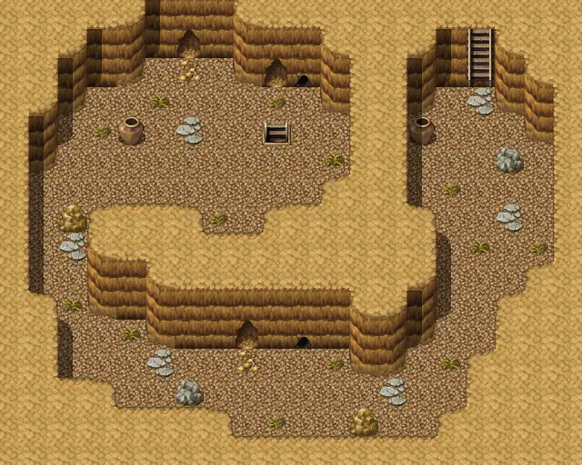

# Clearing level1

20×16 tiles

<label class="lg"><input type="checkbox" data-t="spawn" checked><b>Red</b>&nbsp;Monsters / NPCs</label><label class="lg"><input type="checkbox" data-t="mapchange" checked><b>Blue</b>&nbsp;Exit to another map</label><label class="lg"><input type="checkbox" data-t="container" checked><b>Yellow</b>&nbsp;Container (click to see contents)</label><label class="lg"><input type="checkbox" data-t="sign" checked><b>Purple</b>&nbsp;Sign</label><label class="lg"><input type="checkbox" data-t="rest" checked><b>Green</b>&nbsp;Resting place</label><label class="lg"><input type="checkbox" data-t="key" checked><b>Orange dashed</b>&nbsp;Blocked until a quest step / item</label><label class="lg"><input type="checkbox" data-t="script"><b>Grey dotted</b>&nbsp;Scripted event</label><label class="lg"><input type="checkbox" data-t="replace"><b>White dotted</b>&nbsp;Changes during a quest</label>

## Exits

- [Clearing level2](clearing_level2.md)
- [Wild11 clearing](wild11_clearing.md)

## Monsters & NPCs here

| Name | HP |
|---|---|
| [Hunting dog](../monsters/hunting_dog.md) | 25 |
| [Young wolf](../monsters/young_wolf.md) | 35 |
| [Fledgling wolf](../monsters/fledgling_wolf.md) | 42 |
| [Rabid wolf](../monsters/rabid_wolf.md) | 42 |

<small>Map ID: `clearing_level1` · Data from v0.8.18</small>
