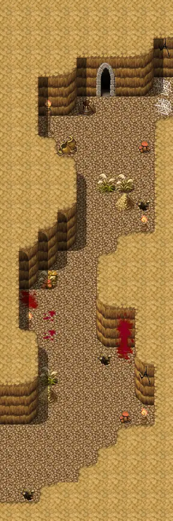

# Crackshot hideout2

9×27 tiles · part of [Crackshot hideout](index.md)

<label class="lg"><input type="checkbox" data-t="spawn" checked><b>Red</b>&nbsp;Monsters / NPCs</label><label class="lg"><input type="checkbox" data-t="mapchange" checked><b>Blue</b>&nbsp;Exit to another map</label><label class="lg"><input type="checkbox" data-t="container" checked><b>Yellow</b>&nbsp;Container (click to see contents)</label><label class="lg"><input type="checkbox" data-t="sign" checked><b>Purple</b>&nbsp;Sign</label><label class="lg"><input type="checkbox" data-t="rest" checked><b>Green</b>&nbsp;Resting place</label><label class="lg"><input type="checkbox" data-t="key" checked><b>Orange dashed</b>&nbsp;Blocked until a quest step / item</label><label class="lg"><input type="checkbox" data-t="script"><b>Grey dotted</b>&nbsp;Scripted event</label><label class="lg"><input type="checkbox" data-t="replace"><b>White dotted</b>&nbsp;Changes during a quest</label>

## Exits

- [Crackshot hideout1](crackshot_hideout1.md)
- [Crackshot hideout3](crackshot_hideout3.md)

## Monsters & NPCs here

| Name | HP |
|---|---|
| [Dying patrol](../monsters/g03_deadpatrol_1.md) | 0 |
| [Dying Patrol](../monsters/g03_deadpatrol_2.md) | 0 |
| [Rebelled thief](../monsters/guild03_rebthief_1.md) | 60 |

<small>Map ID: `crackshot_hideout2` · Data from v0.8.18</small>
