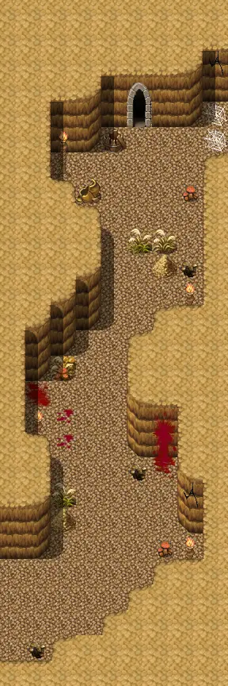

# Crackshot hideout2

| | |
|---|---|
| **Map ID** | `crackshot_hideout2` |
| **Type** | Indoors / underground |
| **Size** | 9×27 tiles |
| **World map** | [Crackshot hideout](index.md) |
| **Introduced** | [v0.7.8](../versions/0.7.8.md) |
| **NPCs** | 3 |
| **Quests** | 1 |

**Crackshot hideout2** is an indoor map. It has 3 NPCs, and no enemies. Exits lead to Crackshot hideout1, Crackshot hideout3.

## Map

<label class="lg"><input type="checkbox" data-t="spawn" checked><b>Red</b>&nbsp;Monsters / NPCs</label><label class="lg"><input type="checkbox" data-t="mapchange" checked><b>Blue</b>&nbsp;Exit to another map</label><label class="lg"><input type="checkbox" data-t="container" checked><b>Yellow</b>&nbsp;Container (click to see contents)</label><label class="lg"><input type="checkbox" data-t="sign" checked><b>Purple</b>&nbsp;Sign</label><label class="lg"><input type="checkbox" data-t="rest" checked><b>Green</b>&nbsp;Resting place</label><label class="lg"><input type="checkbox" data-t="key" checked><b>Orange dashed</b>&nbsp;Blocked until a quest step / item</label><label class="lg"><input type="checkbox" data-t="script"><b>Grey dotted</b>&nbsp;Scripted event</label><label class="lg"><input type="checkbox" data-t="replace"><b>White dotted</b>&nbsp;Changes during a quest</label><label class="lg"><input type="checkbox" data-t="pin" checked><b>Numbers</b>&nbsp;Numbered key points (see the key below the map)</label>

<a class="pin pin-exit" href="#key-1" style="left:5.556%;top:88.889%" title="Exit (west): to [Crackshot hideout1](../crackshot_hideout1.md)">1</a><a class="pin pin-exit" href="#key-2" style="left:61.111%;top:16.667%" title="Exit (stairs / passage): to [Crackshot hideout3](../crackshot_hideout3.md)">2</a><a class="pin pin-npc" href="#key-3" style="left:16.667%;top:57.407%" title="[Dying Patrol](../../monsters/g03_deadpatrol_2.md): 1 quest">3</a><a class="pin pin-npc" href="#key-4" style="left:72.222%;top:68.519%" title="[Dying patrol](../../monsters/g03_deadpatrol_1.md): 1 quest">4</a><a class="pin pin-npc" href="#key-5" style="left:50.000%;top:31.481%" title="[Rebelled thief](../../monsters/guild03_rebthief_1.md): NPC">5</a><a class="pin pin-key" href="#key-6" style="left:94.444%;top:18.519%" title="Blocked passage: Depends on your standing with the “ThievesGuild” faction (≥ 999)">6</a><a class="pin pin-key" href="#key-7" style="left:66.667%;top:20.370%" title="Blocked passage: Unlocked during the quest: hidden story flag “thieves_hidden” (stage 40: “thieves3 - Found patrol 1”)">7</a><a class="pin pin-key" href="#key-8" style="left:72.273%;top:22.808%" title="Blocked passage: Unlocked during the quest: hidden story flag “thieves_hidden” (stage 50: “thieves3 - Found patrol 2”)">8</a>

??? abstract "Key to the numbers on the map"

    | # | What | Details |
    |---|---|---|
    | 1 | Exit (west) | to [Crackshot hideout1](../crackshot_hideout1.md) |
    | 2 | Exit (stairs / passage) | to [Crackshot hideout3](../crackshot_hideout3.md) |
    | 3 | [Dying Patrol](../monsters/g03_deadpatrol_2.md) | 1 quest |
    | 4 | [Dying patrol](../monsters/g03_deadpatrol_1.md) | 1 quest |
    | 5 | [Rebelled thief](../monsters/guild03_rebthief_1.md) | NPC |
    | 6 | Blocked passage | Depends on your standing with the “ThievesGuild” faction (≥ 999) |
    | 7 | Blocked passage | Unlocked during the quest: hidden story flag “thieves_hidden” (stage 40: “thieves3 - Found patrol 1”) |
    | 8 | Blocked passage | Unlocked during the quest: hidden story flag “thieves_hidden” (stage 50: “thieves3 - Found patrol 2”) |

Verified against v0.8.18 map data.

## Connections

| Direction | Leads to | Region there | Map # |
|---|---|---|---|
| West | [Crackshot hideout1](crackshot_hideout1.md) | Crossroads Guardhouse | 1 |
| Stairs / passage | [Crackshot hideout3](crackshot_hideout3.md) | – | 2 |

## NPCs

- [Dying Patrol](../monsters/g03_deadpatrol_2.md) — quests: [The ruthless Crackshot](../quests/Thieves03.md) (#3)
- [Dying patrol](../monsters/g03_deadpatrol_1.md) — quests: [The ruthless Crackshot](../quests/Thieves03.md) (#4)
- [Rebelled thief](../monsters/guild03_rebthief_1.md) (#5)

## Quests

- [The ruthless Crackshot](../quests/Thieves03.md): [Dying Patrol](../monsters/g03_deadpatrol_2.md) is involved; [Dying patrol](../monsters/g03_deadpatrol_1.md) is involved
- [Thieves Hidden (hidden flag)](../quests/thieves_hidden.md): [Dying Patrol](../monsters/g03_deadpatrol_2.md) is involved; [Dying patrol](../monsters/g03_deadpatrol_1.md) is involved; blocked passage opens at stage 40; blocked passage opens at stage 50

## Points of interest

- **Blocked passage** (#6): Depends on your standing with the “ThievesGuild” faction (≥ 999)
- **Blocked passage** (#7): Unlocked during the quest: hidden story flag “thieves_hidden” (stage 40: “thieves3 - Found patrol 1”)
- **Blocked passage** (#8): Unlocked during the quest: hidden story flag “thieves_hidden” (stage 50: “thieves3 - Found patrol 2”)

## Version history

| Version | Change |
|---|---|
| [v0.7.8](../versions/0.7.8.md) | Added |
| [v0.8.12.1](../versions/0.8.12.1.md) | map layout or objects changed |

Verified against v0.8.18 and every earlier release back to v0.7.0 (game data compared release by release).

## Community notes

<small>Written by players, not generated from game data. **Observations**: what players notice in-game · **Lore**: the in-world story · **Trivia**: real-world facts, references, development history · **Theory / speculation**: unconfirmed ideas; may just be unfinished content</small>

### Observations

*Nothing here yet. Know something? [Add it](https://github.com/asdfghjkl628/Andor-s-Trail-Wikiiii/new/main/notes/maps?filename=crackshot_hideout2.md&value=%23%23%20Observations%0A%0A%3C%21--%20what%20players%20notice%20in-game%20--%3E%0A%0A%23%23%20Lore%0A%0A%3C%21--%20the%20in-world%20story%20--%3E%0A%0A%23%23%20Trivia%0A%0A%3C%21--%20real-world%20facts%2C%20references%2C%20development%20history%20--%3E%0A%0A%23%23%20Theory%20/%20speculation%0A%0A%3C%21--%20unconfirmed%20ideas%3B%20may%20just%20be%20unfinished%20content%20--%3E%0A).*

### Lore

*Nothing here yet. Know something? [Add it](https://github.com/asdfghjkl628/Andor-s-Trail-Wikiiii/new/main/notes/maps?filename=crackshot_hideout2.md&value=%23%23%20Observations%0A%0A%3C%21--%20what%20players%20notice%20in-game%20--%3E%0A%0A%23%23%20Lore%0A%0A%3C%21--%20the%20in-world%20story%20--%3E%0A%0A%23%23%20Trivia%0A%0A%3C%21--%20real-world%20facts%2C%20references%2C%20development%20history%20--%3E%0A%0A%23%23%20Theory%20/%20speculation%0A%0A%3C%21--%20unconfirmed%20ideas%3B%20may%20just%20be%20unfinished%20content%20--%3E%0A).*

### Trivia

*Nothing here yet. Know something? [Add it](https://github.com/asdfghjkl628/Andor-s-Trail-Wikiiii/new/main/notes/maps?filename=crackshot_hideout2.md&value=%23%23%20Observations%0A%0A%3C%21--%20what%20players%20notice%20in-game%20--%3E%0A%0A%23%23%20Lore%0A%0A%3C%21--%20the%20in-world%20story%20--%3E%0A%0A%23%23%20Trivia%0A%0A%3C%21--%20real-world%20facts%2C%20references%2C%20development%20history%20--%3E%0A%0A%23%23%20Theory%20/%20speculation%0A%0A%3C%21--%20unconfirmed%20ideas%3B%20may%20just%20be%20unfinished%20content%20--%3E%0A).*

### Theory / speculation

*Nothing here yet. Know something? [Add it](https://github.com/asdfghjkl628/Andor-s-Trail-Wikiiii/new/main/notes/maps?filename=crackshot_hideout2.md&value=%23%23%20Observations%0A%0A%3C%21--%20what%20players%20notice%20in-game%20--%3E%0A%0A%23%23%20Lore%0A%0A%3C%21--%20the%20in-world%20story%20--%3E%0A%0A%23%23%20Trivia%0A%0A%3C%21--%20real-world%20facts%2C%20references%2C%20development%20history%20--%3E%0A%0A%23%23%20Theory%20/%20speculation%0A%0A%3C%21--%20unconfirmed%20ideas%3B%20may%20just%20be%20unfinished%20content%20--%3E%0A).*

??? info "Technical information"

    | | |
    |---|---|
    | Map ID | `crackshot_hideout2` |
    | File | `res/xml/crackshot_hideout2.tmx` |
    | Size | 9×27 tiles (288×864 px) |
    | outdoors property | – |
    | Layers drawn | ground, objects, above |
    | Tilesets | map_bed_1, map_border_1, map_bridge_1, map_bridge_2, map_broken_1, map_cavewall_1, map_cavewall_2, map_cavewall_3, map_cavewall_4, map_chair_table_1, map_chair_table_2, map_crate_1, map_cupboard_1, map_curtain_1, map_entrance_1, map_entrance_2, map_fence_1, map_fence_2, map_fence_3, map_fence_4, map_ground_1, map_ground_2, map_ground_3, map_ground_4, map_ground_5, map_ground_6, map_ground_7, map_ground_8, map_house_1, map_house_2, map_indoor_1, map_indoor_2, map_kitchen_1, map_outdoor_1, map_pillar_1, map_pillar_2, map_plant_1, map_plant_2, map_rock_1, map_rock_2, map_roof_1, map_roof_2, map_roof_3, map_shop_1, map_sign_ladder_1, map_table_1, map_trail_1, map_transition_1, map_transition_2, map_transition_3, map_transition_4, map_transition_5, map_tree_1, map_tree_2, map_wall_1, map_wall_2, map_wall_3, map_wall_4, map_window_1, map_window_2 |
    | Map objects | spawn: 3, key: 3, mapchange: 2 |
    | World map position | segment `crackshot_hideout`, x 9, y -28 |

<small>Data from v0.8.18</small>
