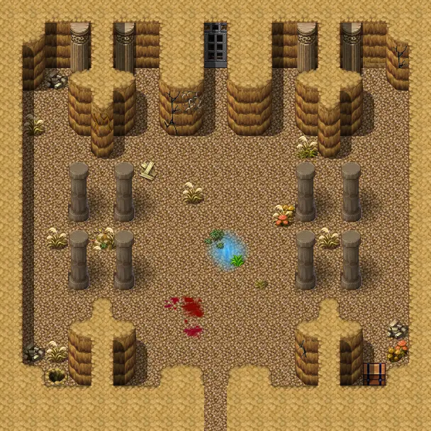

# Crackshot hideout3

19×19 tiles · part of [Crackshot hideout](index.md)

<label class="lg lg-spawn"><input type="checkbox" data-t="spawn" checked> Monsters / NPCs</label><label class="lg lg-mapchange"><input type="checkbox" data-t="mapchange" checked> Exit to another map</label><label class="lg lg-container"><input type="checkbox" data-t="container" checked> Container</label><label class="lg lg-sign"><input type="checkbox" data-t="sign" checked> Sign</label><label class="lg lg-rest"><input type="checkbox" data-t="rest" checked> Resting place</label><label class="lg lg-key"><input type="checkbox" data-t="key" checked> Blocked / needs key or quest</label><label class="lg lg-script"><input type="checkbox" data-t="script"> Scripted event</label><label class="lg lg-replace"><input type="checkbox" data-t="replace"> Changes after a quest</label>

## Exits

- [Crackshot hideout2](crackshot_hideout2.md)
- [Crackshot hideout4](crackshot_hideout4.md)

## Monsters & NPCs here

| Name | HP |
|---|---|
| [Sly Seraphina](../monsters/tt_seraphina2.md) | 0 |
| [Feygard patrol sergeant](../monsters/g03_sergeant.md) | 0 |
| [Dying Crackshot](../monsters/g03_crackshot_dying.md) | 0 |
| [Rebelled rogue](../monsters/g03_thief_3.md) | 58 |
| [Rebelled thief](../monsters/guild03_rebthief_1.md) | 60 |
| [Thief warden](../monsters/g03_thief_2.md) | 68 |
| [Crackshot](../monsters/g03_crackshot.md) | 133 |

<small>Map ID: `crackshot_hideout3` · Data from v0.8.18</small>
