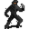

# Crackshot hideout3

19×19 tiles · part of [Crackshot hideout](index.md)

<label class="lg"><input type="checkbox" data-t="spawn" checked><b>Red</b>&nbsp;Monsters / NPCs</label><label class="lg"><input type="checkbox" data-t="mapchange" checked><b>Blue</b>&nbsp;Exit to another map</label><label class="lg"><input type="checkbox" data-t="container" checked><b>Yellow</b>&nbsp;Container (click to see contents)</label><label class="lg"><input type="checkbox" data-t="sign" checked><b>Purple</b>&nbsp;Sign</label><label class="lg"><input type="checkbox" data-t="rest" checked><b>Green</b>&nbsp;Resting place</label><label class="lg"><input type="checkbox" data-t="key" checked><b>Orange dashed</b>&nbsp;Blocked until a quest step / item</label><label class="lg"><input type="checkbox" data-t="script"><b>Grey dotted</b>&nbsp;Scripted event</label><label class="lg"><input type="checkbox" data-t="replace"><b>White dotted</b>&nbsp;Changes during a quest</label>

## Containers

<b>Container 1</b><ul><li><a href="../../items/g04_package/">Suspicious package</a> <small>100%</small></li></ul>

## Exits

- [Crackshot hideout2](crackshot_hideout2.md)
- [Crackshot hideout4](crackshot_hideout4.md)

## Monsters & NPCs here

| Name | HP |
|---|---|
| [Feygard patrol sergeant](../monsters/g03_sergeant.md) | 0 |
| [Sly Seraphina](../monsters/tt_seraphina2.md) | 0 |
| [Dying Crackshot](../monsters/g03_crackshot_dying.md) | 0 |
| [Rebelled rogue](../monsters/g03_thief_3.md) | 58 |
| [Rebelled thief](../monsters/guild03_rebthief_1.md) | 60 |
| [Thief warden](../monsters/g03_thief_2.md) | 68 |
| [Crackshot](../monsters/g03_crackshot.md) | 133 |

<small>Map ID: `crackshot_hideout3` · Data from v0.8.18</small>
