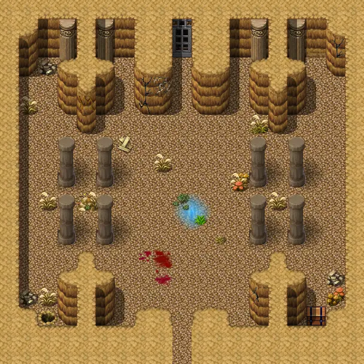

# Crackshot hideout3

| | |
|---|---|
| **Map ID** | `crackshot_hideout3` |
| **Type** | Indoors / underground |
| **Size** | 19×19 tiles |
| **World map** | [Crackshot hideout](index.md) |
| **Introduced** | [v0.7.8](../versions/0.7.8.md) |
| **NPCs** | 5 |
| **Enemy types** | 2 |
| **Quests** | 2 |
| **Containers** | 1 |

**Crackshot hideout3** is an indoor map. It has 5 NPCs and 2 kinds of enemy. Exits lead to Crackshot hideout2, Crackshot hideout4.

## Map

<label class="lg"><input type="checkbox" data-t="spawn" checked><b>Red</b>&nbsp;Monsters / NPCs</label><label class="lg"><input type="checkbox" data-t="mapchange" checked><b>Blue</b>&nbsp;Exit to another map</label><label class="lg"><input type="checkbox" data-t="container" checked><b>Yellow</b>&nbsp;Container (click to see contents)</label><label class="lg"><input type="checkbox" data-t="sign" checked><b>Purple</b>&nbsp;Sign</label><label class="lg"><input type="checkbox" data-t="rest" checked><b>Green</b>&nbsp;Resting place</label><label class="lg"><input type="checkbox" data-t="key" checked><b>Orange dashed</b>&nbsp;Blocked until a quest step / item</label><label class="lg"><input type="checkbox" data-t="script"><b>Grey dotted</b>&nbsp;Scripted event</label><label class="lg"><input type="checkbox" data-t="replace"><b>White dotted</b>&nbsp;Changes during a quest</label><label class="lg"><input type="checkbox" data-t="pin" checked><b>Numbers</b>&nbsp;Numbered key points (see the key below the map)</label>

<a class="pin pin-exit" href="#key-1" style="left:50.000%;top:97.368%" title="Exit (south): to [Crackshot hideout2](../crackshot_hideout2.md)">1</a><a class="pin pin-exit" href="#key-2" style="left:50.000%;top:13.158%" title="Exit (stairs / passage): to [Crackshot hideout4](../crackshot_hideout4.md)">2</a><a class="pin pin-npc" href="#key-3" style="left:50.000%;top:28.947%" title="[Crackshot](../../monsters/g03_crackshot.md): NPC">3</a><a class="pin pin-npc" href="#key-4" style="left:34.211%;top:81.579%" title="[Feygard patrol sergeant](../../monsters/g03_sergeant.md): 1 quest">4</a><a class="pin pin-npc" href="#key-5" style="left:7.895%;top:44.737%" title="[Rebelled thief](../../monsters/guild03_rebthief_1.md): NPC">5</a><a class="pin pin-npc" href="#key-6" style="left:50.000%;top:18.421%" title="[Sly Seraphina](../../monsters/tt_seraphina2.md): 1 quest">6</a><a class="pin pin-npc" href="#key-7" style="left:86.842%;top:81.579%" title="[Thief warden](../../monsters/g03_thief_2.md): NPC">7</a><a class="pin pin-container" href="#key-8" style="left:86.842%;top:86.842%" title="Container 1: Suspicious package">8</a><a class="pin pin-script" href="#key-9" style="left:87.188%;top:77.632%" title="Quest trigger: Scripted event: advances the quest: hidden story flag “thieves_hidden” to stage 60 (“thieves3 - Open chest”)">9</a><a class="pin pin-script" href="#key-10" style="left:47.465%;top:33.901%" title="Quest trigger: Scripted event: advances the quest: The ruthless Crackshot to stage 35 (“I killed Crackshot and he had the key of Luthor with him. I have to go back and report to Umar.”)">10</a><a class="pin pin-script" href="#key-11" style="left:50.000%;top:92.105%" title="Quest trigger: Scripted event: advances the quest: The ruthless Crackshot to stage 40 (“The dying Crackshot said something about the key. If he told the truth, it could be cursed.”) (+1 more quest(s))">11</a><a class="pin pin-key" href="#key-12" style="left:50.346%;top:6.579%" title="Blocked passage: Unlocked during the quest: hidden story flag “troubling_times_nd” (stage 20: “Crackshot&#x27;s door unsealed”)">12</a><a class="pin pin-replace" href="#key-13" style="left:45.368%;top:9.707%" title="Changes during a quest: This area changes during the quest: hidden story flag “troubling_times_nd” (stage 20: “Crackshot&#x27;s door unsealed”)">13</a>

??? abstract "Key to the numbers on the map"

    | # | What | Details |
    |---|---|---|
    | 1 | Exit (south) | to [Crackshot hideout2](../crackshot_hideout2.md) |
    | 2 | Exit (stairs / passage) | to [Crackshot hideout4](../crackshot_hideout4.md) |
    | 3 | [Crackshot](../monsters/g03_crackshot.md) | NPC |
    | 4 | [Feygard patrol sergeant](../monsters/g03_sergeant.md) | 1 quest |
    | 5 | [Rebelled thief](../monsters/guild03_rebthief_1.md) | NPC |
    | 6 | [Sly Seraphina](../monsters/tt_seraphina2.md) | 1 quest |
    | 7 | [Thief warden](../monsters/g03_thief_2.md) | NPC |
    | 8 | Container 1 | Suspicious package |
    | 9 | Quest trigger | Scripted event: advances the quest: hidden story flag “thieves_hidden” to stage 60 (“thieves3 - Open chest”) |
    | 10 | Quest trigger | Scripted event: advances the quest: The ruthless Crackshot to stage 35 (“I killed Crackshot and he had the key of Luthor with him. I have to go back and report to Umar.”) |
    | 11 | Quest trigger | Scripted event: advances the quest: The ruthless Crackshot to stage 40 (“The dying Crackshot said something about the key. If he told the truth, it could be cursed.”) (+1 more quest(s)) |
    | 12 | Blocked passage | Unlocked during the quest: hidden story flag “troubling_times_nd” (stage 20: “Crackshot's door unsealed”) |
    | 13 | Changes during a quest | This area changes during the quest: hidden story flag “troubling_times_nd” (stage 20: “Crackshot's door unsealed”) |

Verified against v0.8.18 map data.

## Connections

| Direction | Leads to | Region there | Map # |
|---|---|---|---|
| South | [Crackshot hideout2](crackshot_hideout2.md) | – | 1 |
| Stairs / passage | [Crackshot hideout4](crackshot_hideout4.md) | – | 2 |

## NPCs

- [Crackshot](../monsters/g03_crackshot.md) (#3)
- [Feygard patrol sergeant](../monsters/g03_sergeant.md) — quests: [The ruthless Crackshot](../quests/Thieves03.md) (#4)
- [Rebelled thief](../monsters/guild03_rebthief_1.md) (#5)
- [Sly Seraphina](../monsters/tt_seraphina2.md) — quests: [Troubling times](../quests/troubling_times.md) (#6)
- [Thief warden](../monsters/g03_thief_2.md) (#7)

## Enemies

| Enemy | HP | Damage | Up to | Notes |
|---|---|---|---|---|
| [Dying Crackshot](../monsters/g03_crackshot_dying.md) | 0 | 0–0 | 1 | – |
| [Rebelled rogue](../monsters/g03_thief_3.md) | 58 | 3–6 | 3 | – |

<small>“Up to” is the most that can be alive at once from the spawn areas on this map.</small>

## Items & containers

<b>Container 1</b><ul><li><a href="../../items/g04_package/">Suspicious package</a> <small>100%</small></li></ul>

## Quests

- [The ruthless Crackshot](../quests/Thieves03.md): [Feygard patrol sergeant](../monsters/g03_sergeant.md) is involved; something on this map advances it; stepping on a trigger here sets stage 35; stepping on a trigger here sets stage 40
- [Troubling times](../quests/troubling_times.md): [Sly Seraphina](../monsters/tt_seraphina2.md) is involved
- [Thieves Hidden (hidden flag)](../quests/thieves_hidden.md): [Feygard patrol sergeant](../monsters/g03_sergeant.md) is involved; something on this map advances it; stepping on a trigger here sets stage 30; stepping on a trigger here sets stage 60
- [troubling_times_nd (hidden flag)](../quests/troubling_times_nd.md): [Sly Seraphina](../monsters/tt_seraphina2.md) is involved; blocked passage opens at stage 20; part of the map changes at stage 20

## Points of interest

- **Quest trigger** (#9): Scripted event: advances the quest: hidden story flag “thieves_hidden” to stage 60 (“thieves3 - Open chest”)
- **Quest trigger** (#10): Scripted event: advances the quest: The ruthless Crackshot to stage 35 (“I killed Crackshot and he had the key of Luthor with him. I have to go back and report to Umar.”)
- **Quest trigger** (#11): Scripted event: advances the quest: The ruthless Crackshot to stage 40 (“The dying Crackshot said something about the key. If he told the truth, it could be cursed.”) (+1 more quest(s))
- **Blocked passage** (#12): Unlocked during the quest: hidden story flag “troubling_times_nd” (stage 20: “Crackshot's door unsealed”)
- **Changes during a quest** (#13): This area changes during the quest: hidden story flag “troubling_times_nd” (stage 20: “Crackshot's door unsealed”)

## Version history

| Version | Change |
|---|---|
| [v0.7.8](../versions/0.7.8.md) | Added |
| [v0.8.2](../versions/0.8.2.md) | map layout or objects changed |
| [v0.8.13](../versions/0.8.13.md) | map layout or objects changed |

Verified against v0.8.18 and every earlier release back to v0.7.0 (game data compared release by release).

## Community notes

<small>Written by players, not generated from game data. **Observations**: what players notice in-game · **Lore**: the in-world story · **Trivia**: real-world facts, references, development history · **Theory / speculation**: unconfirmed ideas; may just be unfinished content</small>

### Observations

*Nothing here yet. Know something? [Add it](https://github.com/asdfghjkl628/Andor-s-Trail-Wikiiii/new/main/notes/maps?filename=crackshot_hideout3.md&value=%23%23%20Observations%0A%0A%3C%21--%20what%20players%20notice%20in-game%20--%3E%0A%0A%23%23%20Lore%0A%0A%3C%21--%20the%20in-world%20story%20--%3E%0A%0A%23%23%20Trivia%0A%0A%3C%21--%20real-world%20facts%2C%20references%2C%20development%20history%20--%3E%0A%0A%23%23%20Theory%20/%20speculation%0A%0A%3C%21--%20unconfirmed%20ideas%3B%20may%20just%20be%20unfinished%20content%20--%3E%0A).*

### Lore

*Nothing here yet. Know something? [Add it](https://github.com/asdfghjkl628/Andor-s-Trail-Wikiiii/new/main/notes/maps?filename=crackshot_hideout3.md&value=%23%23%20Observations%0A%0A%3C%21--%20what%20players%20notice%20in-game%20--%3E%0A%0A%23%23%20Lore%0A%0A%3C%21--%20the%20in-world%20story%20--%3E%0A%0A%23%23%20Trivia%0A%0A%3C%21--%20real-world%20facts%2C%20references%2C%20development%20history%20--%3E%0A%0A%23%23%20Theory%20/%20speculation%0A%0A%3C%21--%20unconfirmed%20ideas%3B%20may%20just%20be%20unfinished%20content%20--%3E%0A).*

### Trivia

*Nothing here yet. Know something? [Add it](https://github.com/asdfghjkl628/Andor-s-Trail-Wikiiii/new/main/notes/maps?filename=crackshot_hideout3.md&value=%23%23%20Observations%0A%0A%3C%21--%20what%20players%20notice%20in-game%20--%3E%0A%0A%23%23%20Lore%0A%0A%3C%21--%20the%20in-world%20story%20--%3E%0A%0A%23%23%20Trivia%0A%0A%3C%21--%20real-world%20facts%2C%20references%2C%20development%20history%20--%3E%0A%0A%23%23%20Theory%20/%20speculation%0A%0A%3C%21--%20unconfirmed%20ideas%3B%20may%20just%20be%20unfinished%20content%20--%3E%0A).*

### Theory / speculation

*Nothing here yet. Know something? [Add it](https://github.com/asdfghjkl628/Andor-s-Trail-Wikiiii/new/main/notes/maps?filename=crackshot_hideout3.md&value=%23%23%20Observations%0A%0A%3C%21--%20what%20players%20notice%20in-game%20--%3E%0A%0A%23%23%20Lore%0A%0A%3C%21--%20the%20in-world%20story%20--%3E%0A%0A%23%23%20Trivia%0A%0A%3C%21--%20real-world%20facts%2C%20references%2C%20development%20history%20--%3E%0A%0A%23%23%20Theory%20/%20speculation%0A%0A%3C%21--%20unconfirmed%20ideas%3B%20may%20just%20be%20unfinished%20content%20--%3E%0A).*

??? info "Technical information"

    | | |
    |---|---|
    | Map ID | `crackshot_hideout3` |
    | File | `res/xml/crackshot_hideout3.tmx` |
    | Size | 19×19 tiles (608×608 px) |
    | outdoors property | – |
    | Layers drawn | ground, objects, above, top |
    | Tilesets | map_bed_1, map_border_1, map_bridge_1, map_bridge_2, map_broken_1, map_cavewall_1, map_cavewall_2, map_cavewall_3, map_cavewall_4, map_chair_table_1, map_chair_table_2, map_crate_1, map_cupboard_1, map_curtain_1, map_entrance_1, map_entrance_2, map_fence_1, map_fence_2, map_fence_3, map_fence_4, map_ground_1, map_ground_2, map_ground_3, map_ground_4, map_ground_5, map_ground_6, map_ground_7, map_ground_8, map_house_1, map_house_2, map_indoor_1, map_indoor_2, map_kitchen_1, map_outdoor_1, map_pillar_1, map_pillar_2, map_plant_1, map_plant_2, map_rock_1, map_rock_2, map_roof_1, map_roof_2, map_roof_3, map_shop_1, map_sign_ladder_1, map_table_1, map_trail_1, map_transition_1, map_transition_2, map_transition_3, map_transition_4, map_transition_5, map_tree_1, map_tree_2, map_wall_1, map_wall_2, map_wall_3, map_wall_4, map_window_1, map_window_2 |
    | Map objects | spawn: 8, script: 3, mapchange: 2, replace: 2, container: 1, key: 1 |
    | World map position | segment `crackshot_hideout`, x -19, y -30 |

<small>Data from v0.8.18</small>
