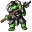

# Crackshot hideout4

19×19 tiles

<label class="lg"><input type="checkbox" data-t="spawn" checked><b>Red</b>&nbsp;Monsters / NPCs</label><label class="lg"><input type="checkbox" data-t="mapchange" checked><b>Blue</b>&nbsp;Exit to another map</label><label class="lg"><input type="checkbox" data-t="container" checked><b>Yellow</b>&nbsp;Container (click to see contents)</label><label class="lg"><input type="checkbox" data-t="sign" checked><b>Purple</b>&nbsp;Sign</label><label class="lg"><input type="checkbox" data-t="rest" checked><b>Green</b>&nbsp;Resting place</label><label class="lg"><input type="checkbox" data-t="key" checked><b>Orange dashed</b>&nbsp;Blocked until a quest step / item</label><label class="lg"><input type="checkbox" data-t="script"><b>Grey dotted</b>&nbsp;Scripted event</label><label class="lg"><input type="checkbox" data-t="replace"><b>White dotted</b>&nbsp;Changes during a quest</label>

## Containers

<b>Container 1</b><ul><li><a href="../../items/gold/">Gold coins</a> <small>100% · ×300 to 550</small></li></ul>

<b>Container 2</b><ul><li><a href="../../items/gold/">Gold coins</a> <small>100% · ×300 to 550</small></li></ul>

<b>Container 3</b><ul><li><a href="../../items/gold/">Gold coins</a> <small>100% · ×300 to 550</small></li></ul>

<b>Container 4</b><ul><li><a href="../../items/meat2/">Rotten meat</a> <small>100% · ×1 to 2</small></li></ul>

## Exits

- [Crackshot hideout3](crackshot_hideout3.md)

## Monsters & NPCs here

| Name | HP |
|---|---|
| [Sly Seraphina](../monsters/tt_seraphina3b.md) | 0 |
| [Sly Seraphina](../monsters/tt_seraphina4.md) | 0 |
| [Sly Seraphina](../monsters/tt_seraphina3.md) | 0 |
| [Sly Seraphina](../monsters/tt_seraphina5.md) | 0 |
| [Luthor's skeleton guard](../monsters/tt_monster1.md) | 52 |
| [Luthor's skeleton guard](../monsters/tt_monster3.md) | 52 |
| [Luthor's skeleton guard](../monsters/tt_monster2.md) | 52 |
| [Spearborn thrall](../monsters/spearborn_thrall.md) | 236 |
| [Young spearborn thrall](../monsters/young_spearborn_thrall.md) | 236 |

<small>Map ID: `crackshot_hideout4` · Data from v0.8.18</small>
