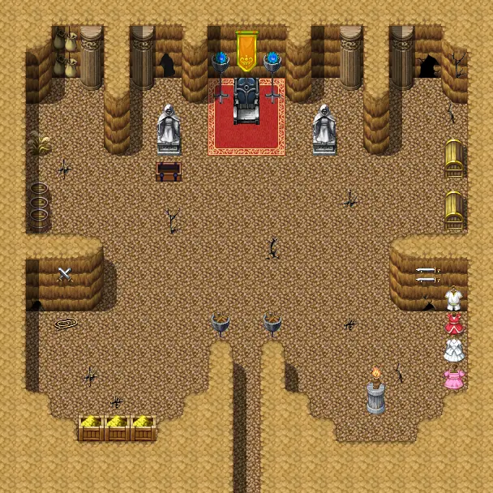

# Crackshot hideout4

19×19 tiles

<label class="lg lg-spawn"><input type="checkbox" data-t="spawn" checked> Monsters / NPCs</label><label class="lg lg-mapchange"><input type="checkbox" data-t="mapchange" checked> Exit to another map</label><label class="lg lg-container"><input type="checkbox" data-t="container" checked> Container</label><label class="lg lg-sign"><input type="checkbox" data-t="sign" checked> Sign</label><label class="lg lg-rest"><input type="checkbox" data-t="rest" checked> Resting place</label><label class="lg lg-key"><input type="checkbox" data-t="key" checked> Blocked / needs key or quest</label><label class="lg lg-script"><input type="checkbox" data-t="script"> Scripted event</label><label class="lg lg-replace"><input type="checkbox" data-t="replace"> Changes after a quest</label>

## Exits

- [Crackshot hideout3](crackshot_hideout3.md)

## Monsters & NPCs here

| Name | HP |
|---|---|
| [Sly Seraphina](../monsters/tt_seraphina3.md) | 0 |
| [Sly Seraphina](../monsters/tt_seraphina4.md) | 0 |
| [Sly Seraphina](../monsters/tt_seraphina3b.md) | 0 |
| [Sly Seraphina](../monsters/tt_seraphina5.md) | 0 |
| [Luthor's skeleton guard](../monsters/tt_monster1.md) | 52 |
| [Luthor's skeleton guard](../monsters/tt_monster3.md) | 52 |
| [Luthor's skeleton guard](../monsters/tt_monster2.md) | 52 |
| [Young spearborn thrall](../monsters/young_spearborn_thrall.md) | 236 |
| [Spearborn thrall](../monsters/spearborn_thrall.md) | 236 |

<small>Map ID: `crackshot_hideout4` · Data from v0.8.18</small>
