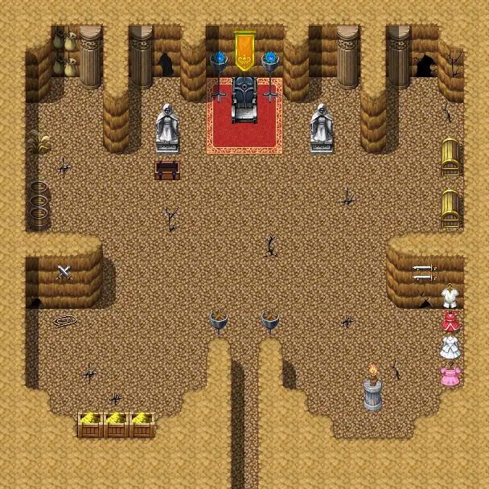
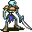

# Crackshot hideout 4

| | |
|---|---|
| **Map ID** | `crackshot_hideout4` |
| **Type** | Indoors / underground |
| **Size** | 19×19 tiles |
| **Introduced** | [v0.8.13](../versions/0.8.13.md) |
| **NPCs** | 4 |
| **Enemy types** | 5 |
| **Quests** | 1 |
| **Containers** | 4 |

**Crackshot hideout 4** is an indoor map. It has 4 NPCs and 5 kinds of enemy. Exits lead to Crackshot hideout 3.

## Map

<label class="lg"><input type="checkbox" data-t="spawn" checked><b>Red</b>&nbsp;Monsters / NPCs</label><label class="lg"><input type="checkbox" data-t="mapchange" checked><b>Blue</b>&nbsp;Exit to another map</label><label class="lg"><input type="checkbox" data-t="container" checked><b>Yellow</b>&nbsp;Container (click to see contents)</label><label class="lg"><input type="checkbox" data-t="sign" checked><b>Purple</b>&nbsp;Sign</label><label class="lg"><input type="checkbox" data-t="rest" checked><b>Green</b>&nbsp;Resting place</label><label class="lg"><input type="checkbox" data-t="key" checked><b>Orange dashed</b>&nbsp;Blocked until a quest step / item</label><label class="lg"><input type="checkbox" data-t="script"><b>Grey dotted</b>&nbsp;Scripted event</label><label class="lg"><input type="checkbox" data-t="replace"><b>White dotted</b>&nbsp;Changes during a quest</label><label class="lg"><input type="checkbox" data-t="pin" checked><b>Numbers</b>&nbsp;Numbered key points (see the key below the map)</label>

<a class="pin pin-exit" href="#key-1" style="left:50.000%;top:97.368%" title="Exit (south): to [Crackshot hideout 3](crackshot_hideout3.md)">1</a><a id="pin-npc-tt_seraphina4" class="pin pin-npc" href="#key-2" style="left:50.000%;top:86.842%" title="[Sly Seraphina](../../monsters/tt_seraphina.md#v-tt_seraphina4): 1 quest">2</a><a id="pin-npc-tt_seraphina3b" class="pin pin-npc" href="#key-3" style="left:50.000%;top:76.316%" title="[Sly Seraphina](../../monsters/tt_seraphina.md#v-tt_seraphina3b): NPC">3</a><a id="pin-npc-tt_seraphina5" class="pin pin-npc" href="#key-4" style="left:50.000%;top:23.684%" title="[Sly Seraphina](../../monsters/tt_seraphina.md#v-tt_seraphina5): 1 quest">4</a><a id="pin-npc-tt_seraphina3" class="pin pin-npc" href="#key-5" style="left:50.000%;top:65.789%" title="[Sly Seraphina](../../monsters/tt_seraphina.md#v-tt_seraphina3): NPC">5</a><a class="pin pin-script" href="#key-6" style="left:50.000%;top:92.105%" title="Quest trigger: Scripted event: advances the quest: Troubling times to stage 220 (“I followed her.”)">6</a><a class="pin pin-script" href="#key-7" style="left:50.346%;top:72.369%" title="Quest trigger: Scripted event: advances the quest: hidden story flag “troubling_times_nd” to stage 30 (“1=standing north of Sly while she blocks the passage”)">7</a><a class="pin pin-script" href="#key-8" style="left:50.000%;top:60.526%" title="Quest trigger: Scripted event: advances the quest: Troubling times to stage 255 (“Seraphina already started the search for the ring.”)">8</a><a class="pin pin-container" href="#key-9" style="left:18.421%;top:86.842%" title="Container 1: Gold coins">9</a><a class="pin pin-container" href="#key-10" style="left:23.684%;top:86.842%" title="Container 2: Gold coins">10</a><a class="pin pin-container" href="#key-11" style="left:28.947%;top:86.842%" title="Container 3: Gold coins">11</a><a class="pin pin-container" href="#key-12" style="left:34.211%;top:34.211%" title="Container 4: Rotten meat">12</a><a class="pin pin-key" href="#key-13" style="left:50.346%;top:56.579%" title="Blocked passage: Unlocked during the quest: Troubling times (stage 250: “I healed Seraphina using potions.”)">13</a>

??? abstract "Key to the numbers on the map"

    | # | What | Details |
    |---|---|---|
    | 1 | Exit (south) | to [Crackshot hideout 3](crackshot_hideout3.md) |
    | 2 | [Sly Seraphina](../monsters/tt_seraphina.md#v-tt_seraphina4) | 1 quest |
    | 3 | [Sly Seraphina](../monsters/tt_seraphina.md#v-tt_seraphina3b) | NPC |
    | 4 | [Sly Seraphina](../monsters/tt_seraphina.md#v-tt_seraphina5) | 1 quest |
    | 5 | [Sly Seraphina](../monsters/tt_seraphina.md#v-tt_seraphina3) | NPC |
    | 6 | Quest trigger | Scripted event: advances the quest: Troubling times to stage 220 (“I followed her.”) |
    | 7 | Quest trigger | Scripted event: advances the quest: hidden story flag “troubling_times_nd” to stage 30 (“1=standing north of Sly while she blocks the passage”) |
    | 8 | Quest trigger | Scripted event: advances the quest: Troubling times to stage 255 (“Seraphina already started the search for the ring.”) |
    | 9 | Container 1 | Gold coins |
    | 10 | Container 2 | Gold coins |
    | 11 | Container 3 | Gold coins |
    | 12 | Container 4 | Rotten meat |
    | 13 | Blocked passage | Unlocked during the quest: Troubling times (stage 250: “I healed Seraphina using potions.”) |

Verified against v0.8.18 map data.

## Connections

| Direction | Leads to | Region there | Map # |
|---|---|---|---|
| South | [Crackshot hideout 3](crackshot_hideout3.md) | – | 1 |

## NPCs

- [Sly Seraphina](../monsters/tt_seraphina.md#v-tt_seraphina4) — quests: [Troubling times](../quests/troubling_times.md) (#2)
- [Sly Seraphina](../monsters/tt_seraphina.md#v-tt_seraphina3b) (#3)
- [Sly Seraphina](../monsters/tt_seraphina.md#v-tt_seraphina5) — quests: [Troubling times](../quests/troubling_times.md) (#4)
- [Sly Seraphina](../monsters/tt_seraphina.md#v-tt_seraphina3) (#5)

## Enemies

| Enemy | HP | Damage | Up to | Notes |
|---|---|---|---|---|
| [Luthor's skeleton guard](../monsters/tt_monster1.md) | 52 | 1–3 | 1 | – |
| [Luthor's skeleton guard](../monsters/tt_monster1.md#v-tt_monster3) | 52 | 1–3 | 3 | – |
| [Luthor's skeleton guard](../monsters/tt_monster1.md#v-tt_monster2) | 52 | 1–3 | 1 | – |
| [Spearborn thrall](../monsters/spearborn_thrall.md) | 236 | 12–13 | 6 | – |
| [Young spearborn thrall](../monsters/young_spearborn_thrall.md) | 236 | 10–11 | 3 | – |

<small>“Up to” is the most that can be alive at once from the spawn areas on this map.</small>

## Items & containers

<b>Container 1</b><ul><li><a href="../../items/gold/">Gold coins</a> <small>100% · ×300 to 550</small></li></ul>

<b>Container 2</b><ul><li><a href="../../items/gold/">Gold coins</a> <small>100% · ×300 to 550</small></li></ul>

<b>Container 3</b><ul><li><a href="../../items/gold/">Gold coins</a> <small>100% · ×300 to 550</small></li></ul>

<b>Container 4</b><ul><li><a href="../../items/meat2/">Rotten meat</a> <small>100% · ×1 to 2</small></li></ul>

## Quests

- [Troubling times](../quests/troubling_times.md): [Sly Seraphina](../monsters/tt_seraphina.md#v-tt_seraphina4) is involved; [Sly Seraphina](../monsters/tt_seraphina.md#v-tt_seraphina5) is involved; blocked passage opens at stage 250; something on this map advances it; stepping on a trigger here sets stage 220; stepping on a trigger here sets stage 255
- [Troubling times story flags (hidden flag)](../quests/troubling_times_nd.md): [Sly Seraphina](../monsters/tt_seraphina.md#v-tt_seraphina4) is involved; [Sly Seraphina](../monsters/tt_seraphina.md#v-tt_seraphina5) is involved; something on this map advances it; stepping on a trigger here sets stage 30

## Points of interest

- **Quest trigger** (#6): Scripted event: advances the quest: Troubling times to stage 220 (“I followed her.”)
- **Quest trigger** (#7): Scripted event: advances the quest: hidden story flag “troubling_times_nd” to stage 30 (“1=standing north of Sly while she blocks the passage”)
- **Quest trigger** (#8): Scripted event: advances the quest: Troubling times to stage 255 (“Seraphina already started the search for the ring.”)
- **Blocked passage** (#13): Unlocked during the quest: Troubling times (stage 250: “I healed Seraphina using potions.”)

## Version history

| Version | Change |
|---|---|
| [v0.8.13](../versions/0.8.13.md) | Added |

Verified against v0.8.18 and every earlier release back to v0.7.0 (game data compared release by release).

## Community notes

<small>Written by players, not generated from game data. **Observations**: what players notice in-game · **Lore**: the in-world story · **Trivia**: real-world facts, references, development history · **Theory / speculation**: unconfirmed ideas; may just be unfinished content</small>

### Observations

*No notes yet. Contributions are welcome: [add a note](https://github.com/asdfghjkl628/Andor-s-Trail-Wikiiii/new/main/notes/maps?filename=crackshot_hideout4.md&value=%23%23%20Observations%0A%0A%3C%21--%20what%20players%20notice%20in-game%20--%3E%0A%0A%23%23%20Lore%0A%0A%3C%21--%20the%20in-world%20story%20--%3E%0A%0A%23%23%20Trivia%0A%0A%3C%21--%20real-world%20facts%2C%20references%2C%20development%20history%20--%3E%0A%0A%23%23%20Theory%20/%20speculation%0A%0A%3C%21--%20unconfirmed%20ideas%3B%20may%20just%20be%20unfinished%20content%20--%3E%0A).*

### Lore

*No notes yet. Contributions are welcome: [add a note](https://github.com/asdfghjkl628/Andor-s-Trail-Wikiiii/new/main/notes/maps?filename=crackshot_hideout4.md&value=%23%23%20Observations%0A%0A%3C%21--%20what%20players%20notice%20in-game%20--%3E%0A%0A%23%23%20Lore%0A%0A%3C%21--%20the%20in-world%20story%20--%3E%0A%0A%23%23%20Trivia%0A%0A%3C%21--%20real-world%20facts%2C%20references%2C%20development%20history%20--%3E%0A%0A%23%23%20Theory%20/%20speculation%0A%0A%3C%21--%20unconfirmed%20ideas%3B%20may%20just%20be%20unfinished%20content%20--%3E%0A).*

### Trivia

*No notes yet. Contributions are welcome: [add a note](https://github.com/asdfghjkl628/Andor-s-Trail-Wikiiii/new/main/notes/maps?filename=crackshot_hideout4.md&value=%23%23%20Observations%0A%0A%3C%21--%20what%20players%20notice%20in-game%20--%3E%0A%0A%23%23%20Lore%0A%0A%3C%21--%20the%20in-world%20story%20--%3E%0A%0A%23%23%20Trivia%0A%0A%3C%21--%20real-world%20facts%2C%20references%2C%20development%20history%20--%3E%0A%0A%23%23%20Theory%20/%20speculation%0A%0A%3C%21--%20unconfirmed%20ideas%3B%20may%20just%20be%20unfinished%20content%20--%3E%0A).*

### Theory / speculation

*No notes yet. Contributions are welcome: [add a note](https://github.com/asdfghjkl628/Andor-s-Trail-Wikiiii/new/main/notes/maps?filename=crackshot_hideout4.md&value=%23%23%20Observations%0A%0A%3C%21--%20what%20players%20notice%20in-game%20--%3E%0A%0A%23%23%20Lore%0A%0A%3C%21--%20the%20in-world%20story%20--%3E%0A%0A%23%23%20Trivia%0A%0A%3C%21--%20real-world%20facts%2C%20references%2C%20development%20history%20--%3E%0A%0A%23%23%20Theory%20/%20speculation%0A%0A%3C%21--%20unconfirmed%20ideas%3B%20may%20just%20be%20unfinished%20content%20--%3E%0A).*

??? info "Technical information"

    | | |
    |---|---|
    | Map ID | `crackshot_hideout4` |
    | File | `res/xml/crackshot_hideout4.tmx` |
    | Size | 19×19 tiles (608×608 px) |
    | outdoors property | – |
    | Layers drawn | ground, objects, above, top |
    | Tilesets | map_bed_1, map_border_1, map_bridge_1, map_bridge_2, map_broken_1, map_cavewall_1, map_cavewall_2, map_cavewall_3, map_cavewall_4, map_chair_table_1, map_chair_table_2, map_crate_1, map_cupboard_1, map_curtain_1, map_entrance_1, map_entrance_2, map_fence_1, map_fence_2, map_fence_3, map_fence_4, map_ground_1, map_ground_2, map_ground_3, map_ground_4, map_ground_5, map_ground_6, map_ground_7, map_ground_8, map_house_1, map_house_2, map_indoor_1, map_indoor_2, map_kitchen_1, map_outdoor_1, map_pillar_1, map_pillar_2, map_plant_1, map_plant_2, map_rock_1, map_rock_2, map_roof_1, map_roof_2, map_roof_3, map_shop_1, map_sign_ladder_1, map_table_1, map_trail_1, map_transition_1, map_transition_2, map_transition_3, map_transition_4, map_transition_5, map_tree_1, map_tree_2, map_wall_1, map_wall_2, map_wall_3, map_wall_4, map_window_1, map_window_2 |
    | Map objects | spawn: 10, script: 5, container: 4, mapchange: 2, key: 1 |
    | World map position | – |

<small>Data from v0.8.18</small>
