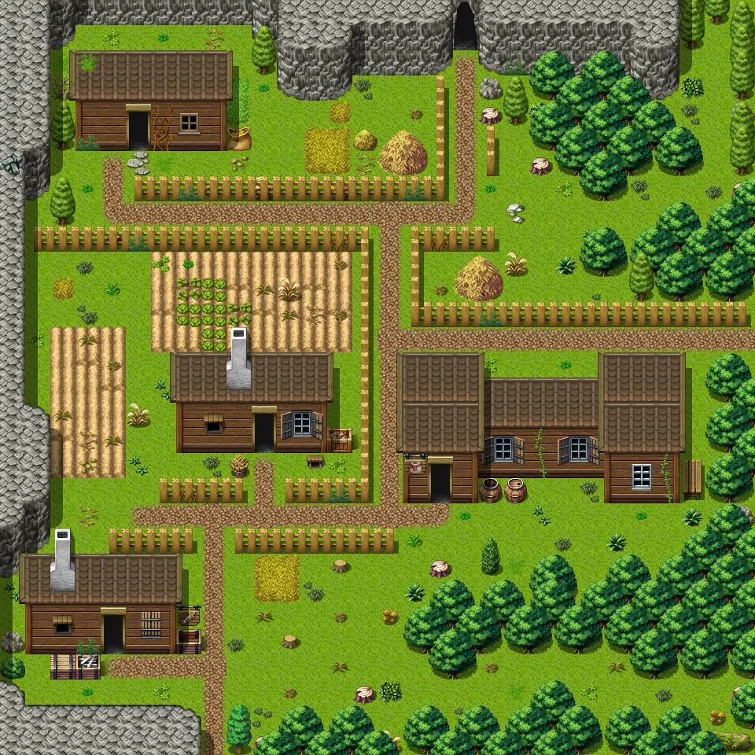

# Crossglen

30×30 tiles · outdoors · part of [World1](index.md)

<label class="lg lg-spawn"><input type="checkbox" data-t="spawn" checked> Monsters / NPCs</label><label class="lg lg-mapchange"><input type="checkbox" data-t="mapchange" checked> Exit to another map</label><label class="lg lg-container"><input type="checkbox" data-t="container" checked> Container</label><label class="lg lg-sign"><input type="checkbox" data-t="sign" checked> Sign</label><label class="lg lg-rest"><input type="checkbox" data-t="rest" checked> Resting place</label><label class="lg lg-key"><input type="checkbox" data-t="key" checked> Blocked / needs key or quest</label><label class="lg lg-script"><input type="checkbox" data-t="script"> Scripted event</label><label class="lg lg-replace"><input type="checkbox" data-t="replace"> Changes after a quest</label>

## Exits

- [Crossglen cave](crossglen_cave.md)
- [Crossglen farmhouse](crossglen_farmhouse.md)
- [Crossglen hall](crossglen_hall.md)
- [Crossglen smith](crossglen_smith.md)
- [Home](home.md)
- [Ratdom bwm1](ratdom_bwm1.md)
- [Wild1](wild1.md)
- [Wild2](wild2.md)

## Monsters & NPCs here

| Name | HP |
|---|---|
| [Clevred](../monsters/ratdom_rat_crossglen.md) | 0 |
| [Oromir](../monsters/oromir_behind_haystack_help.md) | 0 |
| [Oromir](../monsters/oromir.md) | 0 |
| [Halvor](../monsters/halvor.md) | 0 |
| [Farmer](../monsters/farmer.md) | 0 |
| [Oromir](../monsters/oromir_behind_inn.md) | 0 |
| [Gorwath](../monsters/gorwath.md) | 0 |
| [Odair](../monsters/odair.md) | 0 |
| [Oromir](../monsters/oromir_behind_inn_help.md) | 0 |
| [Oromir](../monsters/oromir_behind_haystack.md) | 0 |
| [Tired farmer](../monsters/tired_farmer.md) | 0 |
| [Tiny rat](../monsters/tiny_rat.md) | 2 |
| [Black ant](../monsters/black_ant.md) | 3 |
| [Small wasp](../monsters/small_wasp.md) | 4 |
| [Beetle](../monsters/beetle.md) | 4 |
| [Cave rat](../monsters/cave_rat.md) | 5 |
| [Reindeer](../monsters/reindeer.md) | 5 |
| [Mara](../monsters/ratdom_mara.md) | 90 |
| [Tharal](../monsters/ratdom_tharal.md) | 160 |

<small>Map ID: `crossglen` · Data from v0.8.18</small>
