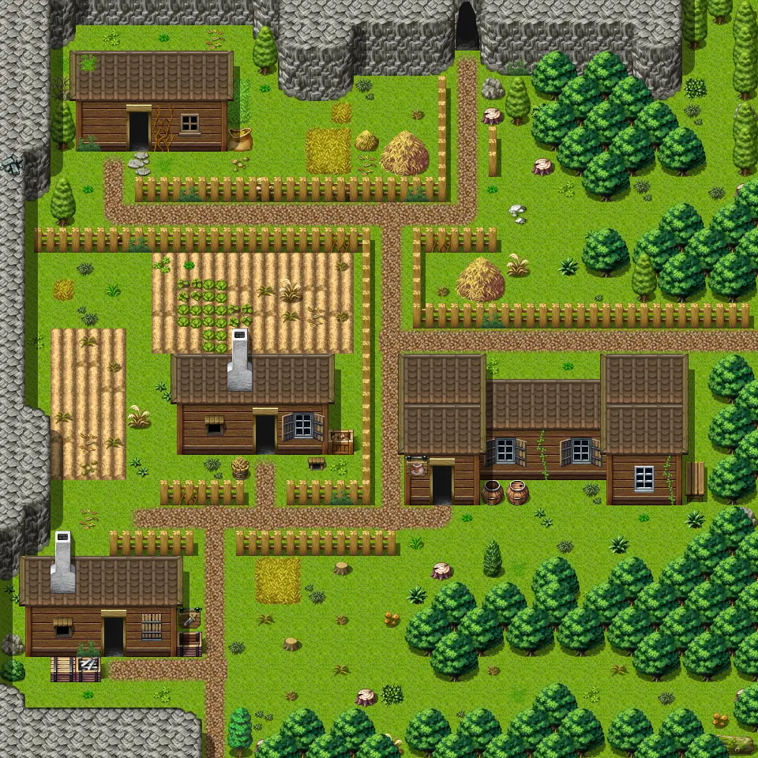

# Crossglen

| | |
|---|---|
| **Map ID** | `crossglen` |
| **Region** | In Crossglen (settlement) |
| **Type** | Outdoors |
| **Size** | 30×30 tiles |
| **World map** | [World 1](index.md) |
| **Introduced** | v0.7.0 or earlier |
| **NPCs** | 11 |
| **Enemy types** | 8 |
| **Quests** | 6 |

**Crossglen** is an outdoor map, in Crossglen (settlement). It has 11 NPCs and 8 kinds of enemy. Exits lead to Crossglen cave, Wild 1, Wild 2, Ratdom bwm 1 and 4 more.

## Map

<label class="lg"><input type="checkbox" data-t="spawn" checked><b>Red</b>&nbsp;Monsters / NPCs</label><label class="lg"><input type="checkbox" data-t="mapchange" checked><b>Blue</b>&nbsp;Exit to another map</label><label class="lg"><input type="checkbox" data-t="container" checked><b>Yellow</b>&nbsp;Container (click to see contents)</label><label class="lg"><input type="checkbox" data-t="sign" checked><b>Purple</b>&nbsp;Sign</label><label class="lg"><input type="checkbox" data-t="rest" checked><b>Green</b>&nbsp;Resting place</label><label class="lg"><input type="checkbox" data-t="key" checked><b>Orange dashed</b>&nbsp;Blocked until a quest step / item</label><label class="lg"><input type="checkbox" data-t="script"><b>Grey dotted</b>&nbsp;Scripted event</label><label class="lg"><input type="checkbox" data-t="replace"><b>White dotted</b>&nbsp;Changes during a quest</label><label class="lg"><input type="checkbox" data-t="pin" checked><b>Numbers</b>&nbsp;Numbered key points (see the key below the map)</label>

<a class="pin pin-exit" href="#key-1" style="left:61.667%;top:5.000%" title="Exit (north): to [Crossglen cave](crossglen_cave.md)">1</a><a class="pin pin-exit" href="#key-2" style="left:98.333%;top:46.667%" title="Exit (east): to [Wild 1](wild1.md)">2</a><a class="pin pin-exit" href="#key-3" style="left:28.333%;top:98.333%" title="Exit (south): to [Wild 2](wild2.md)">3</a><a class="pin pin-exit" href="#key-4" style="left:1.667%;top:11.667%" title="Exit (west): to [Ratdom bwm 1](ratdom_bwm1.md)">4</a><a class="pin pin-exit" href="#key-5" style="left:35.000%;top:58.333%" title="Exit (door): to [Crossglen farmhouse](crossglen_farmhouse.md)">5</a><a class="pin pin-exit" href="#key-6" style="left:58.333%;top:65.000%" title="Exit (door): to [Crossglen hall](crossglen_hall.md)">6</a><a class="pin pin-exit" href="#key-7" style="left:15.000%;top:85.000%" title="Exit (door): to [Crossglen smith](crossglen_smith.md)">7</a><a class="pin pin-exit" href="#key-8" style="left:18.333%;top:18.333%" title="Exit (door): to [Home](home.md)">8</a><a id="pin-npc-ratdom_rat_crossglen" class="pin pin-npc" href="#key-9" style="left:41.667%;top:1.667%" title="[Clevred](../../monsters/ratdom_rat.md#v-ratdom_rat_crossglen): NPC">9</a><a id="pin-npc-farmer" class="pin pin-npc" href="#key-10" style="left:38.333%;top:45.000%" title="[Farmer](../../monsters/farmer.md): NPC">10</a><a id="pin-npc-gorwath" class="pin pin-npc" href="#key-11" style="left:38.333%;top:18.333%" title="[Gorwath](../../monsters/gorwath.md): 1 quest">11</a><a id="pin-npc-halvor" class="pin pin-npc" href="#key-12" style="left:78.333%;top:65.000%" title="[Halvor](../../monsters/halvor.md): 1 quest">12</a><a id="pin-npc-odair" class="pin pin-npc" href="#key-13" style="left:95.000%;top:5.000%" title="[Odair](../../monsters/odair.md): 1 quest">13</a><a id="pin-npc-oromir_behind_inn_help" class="pin pin-npc" href="#key-14" style="left:91.667%;top:58.333%" title="[Oromir](../../monsters/oromir.md#v-oromir_behind_inn_help): 1 quest">14</a><a id="pin-npc-oromir_behind_haystack" class="pin pin-npc" href="#key-15" style="left:55.000%;top:18.333%" title="[Oromir](../../monsters/oromir.md#v-oromir_behind_haystack): 1 quest">15</a><a id="pin-npc-oromir" class="pin pin-npc" href="#key-16" style="left:95.000%;top:91.667%" title="[Oromir](../../monsters/oromir.md): 1 quest">16</a><a id="pin-npc-oromir_behind_inn" class="pin pin-npc" href="#key-17" style="left:91.667%;top:55.000%" title="[Oromir](../../monsters/oromir.md#v-oromir_behind_inn): 1 quest">17</a><a id="pin-npc-oromir_behind_haystack_help" class="pin pin-npc" href="#key-18" style="left:55.219%;top:15.834%" title="[Oromir](../../monsters/oromir.md#v-oromir_behind_haystack_help): 1 quest">18</a><a id="pin-npc-tired_farmer" class="pin pin-npc" href="#key-19" style="left:8.333%;top:58.333%" title="[Tired farmer](../../monsters/tired_farmer.md): NPC">19</a><a class="pin pin-script" href="#key-20" style="left:58.333%;top:68.333%" title="Quest trigger: Scripted event: advances the quest: hidden story flag “quest_burhczyd_nd” to stage 51 (“51=show oven in Crossglen”)">20</a><a class="pin pin-script" href="#key-21" style="left:11.667%;top:5.000%" title="Quest trigger: Scripted event: advances the quest: hidden story flag “brv_nondisplay” to stage 146 (“Fortune teller found gold behind father&#x27;s house”)">21</a><a class="pin pin-script" href="#key-22" style="left:35.000%;top:16.667%" title="Quest trigger: Scripted event: advances the quest: More rats! to stage 32 (“I have killed Tharal.”)">22</a><a class="pin pin-script" href="#key-23" style="left:30.000%;top:95.000%" title="Quest trigger: Scripted event: advances the quest: hidden story flag “sutdover_hidden” to stage 8 (“xmas”)">23</a><a class="pin pin-script" href="#key-23" style="left:95.000%;top:46.667%" title="Quest trigger: Scripted event: advances the quest: hidden story flag “sutdover_hidden” to stage 8 (“xmas”)">23</a><a class="pin pin-script" href="#key-24" style="left:36.667%;top:61.667%" title="Quest trigger: Scripted event: advances the quest: A familiar shadow to stage 50 (“I defeated the Dark spirit, but it didn&#x27;t feel like the end. The Dark spirit trapped inside Leta has fled back to the devastated lands south of Stoutford, where its power can grow stronger. I need to return there and finish what I started.”)">24</a><a class="pin pin-key" href="#key-25" style="left:35.000%;top:65.000%" title="Blocked passage: Closed off once you reach this point in the quest: A familiar shadow (stage 20: “The presence of the mark grows unbearable. I feel an overwhelming pull to return to Crossglen. There is something wrong, and I sense it&#x27;s tied to my father. I must hurry to see what&#x27;s happening.”)">25</a><a class="pin pin-key" href="#key-26" style="left:98.553%;top:44.167%" title="Blocked passage: Closed off once you reach this point in the quest: hidden story flag “ratdom_nondisplay” (stage 1: “1=Ratdom active”)">26</a><a class="pin pin-key" href="#key-26" style="left:25.400%;top:97.814%" title="Blocked passage: Closed off once you reach this point in the quest: hidden story flag “ratdom_nondisplay” (stage 1: “1=Ratdom active”)">26</a><a class="pin pin-key" href="#key-26" style="left:58.553%;top:62.500%" title="Blocked passage: Closed off once you reach this point in the quest: hidden story flag “ratdom_nondisplay” (stage 1: “1=Ratdom active”)">26</a><a class="pin pin-replace" href="#key-27" style="left:50.000%;top:50.000%" title="Changes during a quest: This area changes during the quest: hidden story flag “ratdom_nondisplay” (stage 1: “1=Ratdom active”)">27</a><a class="pin pin-replace" href="#key-28" style="left:50.219%;top:47.500%" title="Changes during a quest: This area changes back during the quest: hidden story flag “ratdom_nondisplay” (stage 1: “1=Ratdom active”)">28</a><a class="pin pin-replace" href="#key-29" style="left:81.667%;top:65.000%" title="Changes during a quest: This area changes during the quest: hidden story flag “sutdover_hidden” (stage 7: “halloween”)">29</a><a class="pin pin-replace" href="#key-29" style="left:65.000%;top:11.667%" title="Changes during a quest: This area changes during the quest: hidden story flag “sutdover_hidden” (stage 7: “halloween”)">29</a><a class="pin pin-replace" href="#key-29" style="left:31.667%;top:18.333%" title="Changes during a quest: This area changes during the quest: hidden story flag “sutdover_hidden” (stage 7: “halloween”)">29</a><a class="pin pin-replace" href="#key-29" style="left:31.667%;top:61.667%" title="Changes during a quest: This area changes during the quest: hidden story flag “sutdover_hidden” (stage 7: “halloween”)">29</a><a class="pin pin-replace" href="#key-29" style="left:55.400%;top:64.481%" title="Changes during a quest: This area changes during the quest: hidden story flag “sutdover_hidden” (stage 7: “halloween”)">29</a><a class="pin pin-replace" href="#key-29" style="left:18.333%;top:85.000%" title="Changes during a quest: This area changes during the quest: hidden story flag “sutdover_hidden” (stage 7: “halloween”)">29</a><a class="pin pin-replace" href="#key-29" style="left:15.000%;top:18.333%" title="Changes during a quest: This area changes during the quest: hidden story flag “sutdover_hidden” (stage 7: “halloween”)">29</a>

??? abstract "Key to the numbers on the map"

    | # | What | Details |
    |---|---|---|
    | 1 | Exit (north) | to [Crossglen cave](crossglen_cave.md) |
    | 2 | Exit (east) | to [Wild 1](wild1.md) |
    | 3 | Exit (south) | to [Wild 2](wild2.md) |
    | 4 | Exit (west) | to [Ratdom bwm 1](ratdom_bwm1.md) |
    | 5 | Exit (door) | to [Crossglen farmhouse](crossglen_farmhouse.md) |
    | 6 | Exit (door) | to [Crossglen hall](crossglen_hall.md) |
    | 7 | Exit (door) | to [Crossglen smith](crossglen_smith.md) |
    | 8 | Exit (door) | to [Home](home.md) |
    | 9 | [Clevred](../monsters/ratdom_rat.md#v-ratdom_rat_crossglen) | NPC |
    | 10 | [Farmer](../monsters/farmer.md) | NPC |
    | 11 | [Gorwath](../monsters/gorwath.md) | 1 quest |
    | 12 | [Halvor](../monsters/halvor.md) | 1 quest |
    | 13 | [Odair](../monsters/odair.md) | 1 quest |
    | 14 | [Oromir](../monsters/oromir.md#v-oromir_behind_inn_help) | 1 quest |
    | 15 | [Oromir](../monsters/oromir.md#v-oromir_behind_haystack) | 1 quest |
    | 16 | [Oromir](../monsters/oromir.md) | 1 quest |
    | 17 | [Oromir](../monsters/oromir.md#v-oromir_behind_inn) | 1 quest |
    | 18 | [Oromir](../monsters/oromir.md#v-oromir_behind_haystack_help) | 1 quest |
    | 19 | [Tired farmer](../monsters/tired_farmer.md) | NPC |
    | 20 | Quest trigger | Scripted event: advances the quest: hidden story flag “quest_burhczyd_nd” to stage 51 (“51=show oven in Crossglen”) |
    | 21 | Quest trigger | Scripted event: advances the quest: hidden story flag “brv_nondisplay” to stage 146 (“Fortune teller found gold behind father's house”) |
    | 22 | Quest trigger | Scripted event: advances the quest: More rats! to stage 32 (“I have killed Tharal.”) |
    | 23 | Quest trigger | Scripted event: advances the quest: hidden story flag “sutdover_hidden” to stage 8 (“xmas”) |
    | 24 | Quest trigger | Scripted event: advances the quest: A familiar shadow to stage 50 (“I defeated the Dark spirit, but it didn't feel like the end. The Dark spirit trapped inside Leta has fled back to the devastated lands south of Stoutford, where its power can grow stronger. I need to return there and finish what I started.”) |
    | 25 | Blocked passage | Closed off once you reach this point in the quest: A familiar shadow (stage 20: “The presence of the mark grows unbearable. I feel an overwhelming pull to return to Crossglen. There is something wrong, and I sense it's tied to my father. I must hurry to see what's happening.”) |
    | 26 | Blocked passage | Closed off once you reach this point in the quest: hidden story flag “ratdom_nondisplay” (stage 1: “1=Ratdom active”) |
    | 27 | Changes during a quest | This area changes during the quest: hidden story flag “ratdom_nondisplay” (stage 1: “1=Ratdom active”) |
    | 28 | Changes during a quest | This area changes back during the quest: hidden story flag “ratdom_nondisplay” (stage 1: “1=Ratdom active”) |
    | 29 | Changes during a quest | This area changes during the quest: hidden story flag “sutdover_hidden” (stage 7: “halloween”) |

Verified against v0.8.18 map data.

## Connections

| Direction | Leads to | Region there | Map # |
|---|---|---|---|
| North | [Crossglen cave](crossglen_cave.md) | Crossglen | 1 |
| East | [Wild 1](wild1.md) | Crossglen | 2 |
| South | [Wild 2](wild2.md) | Blackwater Mountain | 3 |
| West | [Ratdom bwm 1](ratdom_bwm1.md) | Blackwater Mountain | 4 |
| Door | [Crossglen farmhouse](crossglen_farmhouse.md) | Crossglen | 5 |
| Door | [Crossglen hall](crossglen_hall.md) | Crossglen | 6 |
| Door | [Crossglen smith](crossglen_smith.md) | Crossglen | 7 |
| Door | [Home](home.md) | Crossglen | 8 |

## NPCs

- [Clevred](../monsters/ratdom_rat.md#v-ratdom_rat_crossglen) (#9)
- [Farmer](../monsters/farmer.md) (#10)
- [Gorwath](../monsters/gorwath.md) — quests: [You're the postman](../quests/postman.md) (#11)
- [Halvor](../monsters/halvor.md) — quests: [Surprise?](../quests/halvor_surprise.md) (#12)
- [Odair](../monsters/odair.md) — quests: [Rat infestation](../quests/odair.md) (#13)
- [Oromir](../monsters/oromir.md#v-oromir_behind_inn_help) — quests: [Missing husband](../quests/leta.md) (#14)
- [Oromir](../monsters/oromir.md#v-oromir_behind_haystack) — quests: [Missing husband](../quests/leta.md) (#15)
- [Oromir](../monsters/oromir.md) — quests: [Missing husband](../quests/leta.md) (#16)
- [Oromir](../monsters/oromir.md#v-oromir_behind_inn) — quests: [Missing husband](../quests/leta.md) (#17)
- [Oromir](../monsters/oromir.md#v-oromir_behind_haystack_help) — quests: [Missing husband](../quests/leta.md) (#18)
- [Tired farmer](../monsters/tired_farmer.md) (#19)

## Enemies

| Enemy | HP | Damage | Up to | Notes |
|---|---|---|---|---|
| [Tiny rat](../monsters/tiny_rat.md) | 2 | 1–1 | 2 | – |
| [Black ant](../monsters/black_ant.md) | 3 | 1–2 | 3 | – |
| [Beetle](../monsters/beetle.md) | 4 | 3–3 | 1 | – |
| [Small wasp](../monsters/small_wasp.md) | 4 | 1–2 | 3 | – |
| [Cave rat](../monsters/cave_rat.md) | 5 | 2–2 | 20 | appears later, during a quest |
| [Reindeer](../monsters/reindeer.md) | 5 | 0–0 | 1 | appears later, during a quest |
| [Mara](../monsters/mara.md#v-ratdom_mara) | 90 | 1–4 | 1 | appears later, during a quest |
| [Tharal](../monsters/tharal.md#v-ratdom_tharal) | 160 | 1–3 | 1 | appears later, during a quest |

<small>“Up to” is the most that can be alive at once from the spawn areas on this map.</small>

## Quests

- [A familiar shadow](../quests/familiar_shadow.md): blocked passage closes at stage 20; something on this map advances it; stepping on a trigger here sets stage 50
- [Missing husband](../quests/leta.md): [Oromir](../monsters/oromir.md) is involved; [Oromir](../monsters/oromir.md#v-oromir_behind_haystack) is involved; [Oromir](../monsters/oromir.md#v-oromir_behind_haystack_help) is involved; [Oromir](../monsters/oromir.md#v-oromir_behind_inn) is involved; [Oromir](../monsters/oromir.md#v-oromir_behind_inn_help) is involved
- [More rats!](../quests/ratdom_mikhail.md): something on this map advances it; stepping on a trigger here sets stage 30; stepping on a trigger here sets stage 32
- [Rat infestation](../quests/odair.md): [Odair](../monsters/odair.md) is involved
- [Surprise?](../quests/halvor_surprise.md): [Halvor](../monsters/halvor.md) is involved
- [You're the postman](../quests/postman.md): [Gorwath](../monsters/gorwath.md) is involved
- [Brimhaven story flags (hidden flag)](../quests/brv_nondisplay.md): something on this map advances it; stepping on a trigger here sets stage 146
- [Galmore story flags (hidden flag)](../quests/galmore_nondisplayed.md): something on this map advances it
- [Ratdom story flags (hidden flag)](../quests/ratdom_nondisplay.md): a scripted event can trigger here from stage 10; blocked passage closes at stage 1; part of the map changes at stage 1
- [Sutdover story flags (hidden flag)](../quests/sutdover_hidden.md): part of the map changes at stage 7; something on this map advances it; stepping on a trigger here sets stage 7; stepping on a trigger here sets stage 8
- [Young merchant story flags (hidden flag)](../quests/quest_burhczyd_nd.md): something on this map advances it; stepping on a trigger here sets stage 51

## Points of interest

- **Quest trigger** (#20): Scripted event: advances the quest: hidden story flag “quest_burhczyd_nd” to stage 51 (“51=show oven in Crossglen”)
- **Quest trigger** (#21): Scripted event: advances the quest: hidden story flag “brv_nondisplay” to stage 146 (“Fortune teller found gold behind father's house”)
- **Quest trigger** (#22): Scripted event: advances the quest: More rats! to stage 32 (“I have killed Tharal.”)
- **Quest trigger** (#23): Scripted event: advances the quest: hidden story flag “sutdover_hidden” to stage 8 (“xmas”)
- **Quest trigger** (#24): Scripted event: advances the quest: A familiar shadow to stage 50 (“I defeated the Dark spirit, but it didn't feel like the end. The Dark spirit trapped inside Leta has fled back to the devastated lands south of Stoutford, where its power can grow stronger. I need to return there and finish what I started.”)
- **Blocked passage** (#25): Closed off once you reach this point in the quest: A familiar shadow (stage 20: “The presence of the mark grows unbearable. I feel an overwhelming pull to return to Crossglen. There is something wrong, and I sense it's tied to my father. I must hurry to see what's happening.”)
- **Blocked passage** (#26): Closed off once you reach this point in the quest: hidden story flag “ratdom_nondisplay” (stage 1: “1=Ratdom active”)
- **Changes during a quest** (#27): This area changes during the quest: hidden story flag “ratdom_nondisplay” (stage 1: “1=Ratdom active”)
- **Changes during a quest** (#28): This area changes back during the quest: hidden story flag “ratdom_nondisplay” (stage 1: “1=Ratdom active”)
- **Changes during a quest** (#29): This area changes during the quest: hidden story flag “sutdover_hidden” (stage 7: “halloween”)

## Version history

| Version | Change |
|---|---|
| [v0.7.0](../versions/0.7.0.md) | Present in v0.7.0 (earliest release tracked) |
| [v0.7.1](../versions/0.7.1.md) | Map layout or objects changed |
| [v0.7.2](../versions/0.7.2.md) | Map layout or objects changed |
| [v0.7.11](../versions/0.7.11.md) | Map layout or objects changed |
| [v0.7.12](../versions/0.7.12.md) | Map layout or objects changed |
| [v0.7.14](../versions/0.7.14.md) | Map layout or objects changed |
| [v0.8.2](../versions/0.8.2.md) | Map layout or objects changed |
| [v0.8.5](../versions/0.8.5.md) | Map layout or objects changed |
| [v0.8.8](../versions/0.8.8.md) | Map layout or objects changed |
| [v0.8.12.1](../versions/0.8.12.1.md) | Map layout or objects changed |
| [v0.8.14](../versions/0.8.14.md) | Map layout or objects changed |
| [v0.8.18](../versions/0.8.18.md) | Map layout or objects changed |

Verified against v0.8.18 and every earlier release back to v0.7.0 (game data compared release by release).

## Community notes

<small>Written by players, not generated from game data. **Observations**: what players notice in-game · **Lore**: the in-world story · **Trivia**: real-world facts, references, development history · **Theory / speculation**: unconfirmed ideas; may just be unfinished content</small>

### Observations

*No notes yet. Contributions are welcome: [add a note](https://github.com/asdfghjkl628/Andor-s-Trail-Wikiiii/new/main/notes/maps?filename=crossglen.md&value=%23%23%20Observations%0A%0A%3C%21--%20what%20players%20notice%20in-game%20--%3E%0A%0A%23%23%20Lore%0A%0A%3C%21--%20the%20in-world%20story%20--%3E%0A%0A%23%23%20Trivia%0A%0A%3C%21--%20real-world%20facts%2C%20references%2C%20development%20history%20--%3E%0A%0A%23%23%20Theory%20/%20speculation%0A%0A%3C%21--%20unconfirmed%20ideas%3B%20may%20just%20be%20unfinished%20content%20--%3E%0A).*

### Lore

*No notes yet. Contributions are welcome: [add a note](https://github.com/asdfghjkl628/Andor-s-Trail-Wikiiii/new/main/notes/maps?filename=crossglen.md&value=%23%23%20Observations%0A%0A%3C%21--%20what%20players%20notice%20in-game%20--%3E%0A%0A%23%23%20Lore%0A%0A%3C%21--%20the%20in-world%20story%20--%3E%0A%0A%23%23%20Trivia%0A%0A%3C%21--%20real-world%20facts%2C%20references%2C%20development%20history%20--%3E%0A%0A%23%23%20Theory%20/%20speculation%0A%0A%3C%21--%20unconfirmed%20ideas%3B%20may%20just%20be%20unfinished%20content%20--%3E%0A).*

### Trivia

*No notes yet. Contributions are welcome: [add a note](https://github.com/asdfghjkl628/Andor-s-Trail-Wikiiii/new/main/notes/maps?filename=crossglen.md&value=%23%23%20Observations%0A%0A%3C%21--%20what%20players%20notice%20in-game%20--%3E%0A%0A%23%23%20Lore%0A%0A%3C%21--%20the%20in-world%20story%20--%3E%0A%0A%23%23%20Trivia%0A%0A%3C%21--%20real-world%20facts%2C%20references%2C%20development%20history%20--%3E%0A%0A%23%23%20Theory%20/%20speculation%0A%0A%3C%21--%20unconfirmed%20ideas%3B%20may%20just%20be%20unfinished%20content%20--%3E%0A).*

### Theory / speculation

*No notes yet. Contributions are welcome: [add a note](https://github.com/asdfghjkl628/Andor-s-Trail-Wikiiii/new/main/notes/maps?filename=crossglen.md&value=%23%23%20Observations%0A%0A%3C%21--%20what%20players%20notice%20in-game%20--%3E%0A%0A%23%23%20Lore%0A%0A%3C%21--%20the%20in-world%20story%20--%3E%0A%0A%23%23%20Trivia%0A%0A%3C%21--%20real-world%20facts%2C%20references%2C%20development%20history%20--%3E%0A%0A%23%23%20Theory%20/%20speculation%0A%0A%3C%21--%20unconfirmed%20ideas%3B%20may%20just%20be%20unfinished%20content%20--%3E%0A).*

??? info "Technical information"

    | | |
    |---|---|
    | Map ID | `crossglen` |
    | File | `res/xml/crossglen.tmx` |
    | Size | 30×30 tiles (960×960 px) |
    | outdoors property | 1 |
    | Layers drawn | ground, objects, above, top |
    | Tilesets | map_bed_1, map_border_1, map_bridge_1, map_bridge_2, map_broken_1, map_cavewall_1, map_cavewall_2, map_cavewall_3, map_cavewall_4, map_chair_table_1, map_chair_table_2, map_crate_1, map_cupboard_1, map_curtain_1, map_entrance_1, map_entrance_2, map_fence_1, map_fence_2, map_fence_3, map_fence_4, map_ground_1, map_ground_2, map_ground_3, map_ground_4, map_ground_5, map_ground_6, map_ground_7, map_ground_8, map_house_1, map_house_2, map_indoor_1, map_indoor_2, map_kitchen_1, map_outdoor_1, map_pillar_1, map_pillar_2, map_plant_1, map_plant_2, map_ratdom, map_rock_1, map_rock_2, map_roof_1, map_roof_2, map_roof_3, map_shop_1, map_sign_ladder_1, map_table_1, map_trail_1, map_transition_1, map_transition_2, map_transition_3, map_transition_4, map_transition_5, map_tree_1, map_tree_2, map_wall_1, map_wall_2, map_wall_3, map_wall_4, map_window_1, map_window_2 |
    | Map objects | spawn: 19, replace: 9, mapchange: 8, script: 7, key: 4 |
    | World map position | segment `world1`, x 148, y 355 |

<small>Data from v0.8.18</small>
