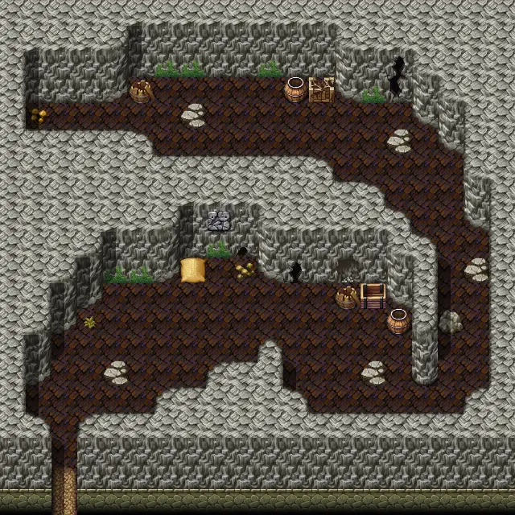

# Crossglen cave

| | |
|---|---|
| **Map ID** | `crossglen_cave` |
| **Region** | In Crossglen (settlement) |
| **Type** | Indoors / underground |
| **Size** | 20×20 tiles |
| **World map** | [Ratdom cave](index.md) |
| **Introduced** | v0.7.0 or earlier |
| **NPCs** | 2 |
| **Enemy types** | 3 |
| **Quests** | 1 |

**Crossglen cave** is an indoor map, in Crossglen (settlement). It has 2 NPCs and 3 kinds of enemy. Exits lead to Crossglen, Ratdom maze1.

## Map

<label class="lg"><input type="checkbox" data-t="spawn" checked><b>Red</b>&nbsp;Monsters / NPCs</label><label class="lg"><input type="checkbox" data-t="mapchange" checked><b>Blue</b>&nbsp;Exit to another map</label><label class="lg"><input type="checkbox" data-t="container" checked><b>Yellow</b>&nbsp;Container (click to see contents)</label><label class="lg"><input type="checkbox" data-t="sign" checked><b>Purple</b>&nbsp;Sign</label><label class="lg"><input type="checkbox" data-t="rest" checked><b>Green</b>&nbsp;Resting place</label><label class="lg"><input type="checkbox" data-t="key" checked><b>Orange dashed</b>&nbsp;Blocked until a quest step / item</label><label class="lg"><input type="checkbox" data-t="script"><b>Grey dotted</b>&nbsp;Scripted event</label><label class="lg"><input type="checkbox" data-t="replace"><b>White dotted</b>&nbsp;Changes during a quest</label><label class="lg"><input type="checkbox" data-t="pin" checked><b>Numbers</b>&nbsp;Numbered key points (see the key below the map)</label>

<a class="pin pin-exit" href="#key-1" style="left:12.500%;top:97.500%" title="Exit (south): to [Crossglen](../crossglen.md)">1</a><a class="pin pin-exit" href="#key-2" style="left:2.500%;top:22.500%" title="Exit (west): to [Ratdom maze1](../ratdom_maze1.md)">2</a><a class="pin pin-npc" href="#key-3" style="left:12.500%;top:22.500%" title="[Andor&#x27;s statue](../../monsters/ratdom_rat_statue.md): 1 quest">3</a><a class="pin pin-npc" href="#key-4" style="left:37.500%;top:2.500%" title="[Clevred](../../monsters/ratdom_rat.md): 1 quest">4</a><a class="pin pin-sign" href="#key-5" style="left:45.000%;top:52.500%" title="Sign: “The sign on the wall is cracked in several places. You cannot make out anything comprehensible from the writing.”">5</a><a class="pin pin-script" href="#key-6" style="left:7.500%;top:22.500%" title="Quest trigger: Scripted event: advances the quest: Yellow is it to stage 90 (“I tore down the statue of Andor. Behind it in the wall I found a hole in the shape of a bone.”) (+1 more quest(s))">6</a><a class="pin pin-replace" href="#key-7" style="left:50.000%;top:47.500%" title="Changes during a quest: This area changes during the quest: hidden story flag “ratdom_nondisplay” (stage 1: “1=Ratdom active”)">7</a><a class="pin pin-replace" href="#key-8" style="left:50.329%;top:43.750%" title="Changes during a quest: This area changes back during the quest: hidden story flag “ratdom_nondisplay” (stage 1: “1=Ratdom active”)">8</a><a class="pin pin-replace" href="#key-9" style="left:5.000%;top:17.500%" title="Changes during a quest: This area changes during the quest: hidden story flag “ratdom_nondisplay” (stage 3: “3=Maze entry open”)">9</a>

??? abstract "Key to the numbers on the map"

    | # | What | Details |
    |---|---|---|
    | 1 | Exit (south) | to [Crossglen](../crossglen.md) |
    | 2 | Exit (west) | to [Ratdom maze1](../ratdom_maze1.md) |
    | 3 | [Andor's statue](../monsters/ratdom_rat_statue.md) | 1 quest |
    | 4 | [Clevred](../monsters/ratdom_rat.md) | 1 quest |
    | 5 | Sign | “The sign on the wall is cracked in several places. You cannot make out anything comprehensible from the writing.” |
    | 6 | Quest trigger | Scripted event: advances the quest: Yellow is it to stage 90 (“I tore down the statue of Andor. Behind it in the wall I found a hole in the shape of a bone.”) (+1 more quest(s)) |
    | 7 | Changes during a quest | This area changes during the quest: hidden story flag “ratdom_nondisplay” (stage 1: “1=Ratdom active”) |
    | 8 | Changes during a quest | This area changes back during the quest: hidden story flag “ratdom_nondisplay” (stage 1: “1=Ratdom active”) |
    | 9 | Changes during a quest | This area changes during the quest: hidden story flag “ratdom_nondisplay” (stage 3: “3=Maze entry open”) |

Verified against v0.8.18 map data.

## Connections

| Direction | Leads to | Region there | Map # |
|---|---|---|---|
| South | [Crossglen](crossglen.md) | Crossglen | 1 |
| West | [Ratdom maze1](ratdom_maze1.md) | Crossglen | 2 |

## NPCs

- [Andor's statue](../monsters/ratdom_rat_statue.md) — quests: [Yellow is it](../quests/ratdom_quest.md) (#3)
- [Clevred](../monsters/ratdom_rat.md) — quests: [Yellow is it](../quests/ratdom_quest.md) (#4)

## Enemies

| Enemy | HP | Damage | Up to | Notes |
|---|---|---|---|---|
| [Cave rat](../monsters/cave_rat.md) | 5 | 2–2 | 8 | – |
| [Tough cave rat](../monsters/tough_cave_rat.md) | 5 | 3–3 | 2 | – |
| [Strong cave rat](../monsters/strong_cave_rat.md) | 20 | 2–4 | 1 | – |

<small>“Up to” is the most that can be alive at once from the spawn areas on this map.</small>

## Quests

- [Yellow is it](../quests/ratdom_quest.md): [Andor's statue](../monsters/ratdom_rat_statue.md) is involved; [Clevred](../monsters/ratdom_rat.md) is involved; something on this map advances it; stepping on a trigger here sets stage 100; stepping on a trigger here sets stage 90
- [ratdom_nondisplay (hidden flag)](../quests/ratdom_nondisplay.md): [Clevred](../monsters/ratdom_rat.md) is involved; part of the map changes at stage 1; part of the map changes at stage 3; something on this map advances it; stepping on a trigger here sets stage 3

## Points of interest

- **Sign** (#5): “The sign on the wall is cracked in several places. You cannot make out anything comprehensible from the writing.”
- **Quest trigger** (#6): Scripted event: advances the quest: Yellow is it to stage 90 (“I tore down the statue of Andor. Behind it in the wall I found a hole in the shape of a bone.”) (+1 more quest(s))
- **Changes during a quest** (#7): This area changes during the quest: hidden story flag “ratdom_nondisplay” (stage 1: “1=Ratdom active”)
- **Changes during a quest** (#8): This area changes back during the quest: hidden story flag “ratdom_nondisplay” (stage 1: “1=Ratdom active”)
- **Changes during a quest** (#9): This area changes during the quest: hidden story flag “ratdom_nondisplay” (stage 3: “3=Maze entry open”)

## Version history

| Version | Change |
|---|---|
| [v0.7.0](../versions/0.7.0.md) | Present in v0.7.0 (earliest release tracked) |
| [v0.7.1](../versions/0.7.1.md) | map layout or objects changed |
| [v0.7.2](../versions/0.7.2.md) | map layout or objects changed |
| [v0.8.2](../versions/0.8.2.md) | map layout or objects changed |
| [v0.8.5](../versions/0.8.5.md) | map layout or objects changed |
| [v0.8.7](../versions/0.8.7.md) | map layout or objects changed |
| [v0.8.12.1](../versions/0.8.12.1.md) | map layout or objects changed |

Verified against v0.8.18 and every earlier release back to v0.7.0 (game data compared release by release).

## Community notes

<small>Written by players, not generated from game data. **Observations**: what players notice in-game · **Lore**: the in-world story · **Trivia**: real-world facts, references, development history · **Theory / speculation**: unconfirmed ideas; may just be unfinished content</small>

### Observations

*Nothing here yet. Know something? [Add it](https://github.com/asdfghjkl628/Andor-s-Trail-Wikiiii/new/main/notes/maps?filename=crossglen_cave.md&value=%23%23%20Observations%0A%0A%3C%21--%20what%20players%20notice%20in-game%20--%3E%0A%0A%23%23%20Lore%0A%0A%3C%21--%20the%20in-world%20story%20--%3E%0A%0A%23%23%20Trivia%0A%0A%3C%21--%20real-world%20facts%2C%20references%2C%20development%20history%20--%3E%0A%0A%23%23%20Theory%20/%20speculation%0A%0A%3C%21--%20unconfirmed%20ideas%3B%20may%20just%20be%20unfinished%20content%20--%3E%0A).*

### Lore

*Nothing here yet. Know something? [Add it](https://github.com/asdfghjkl628/Andor-s-Trail-Wikiiii/new/main/notes/maps?filename=crossglen_cave.md&value=%23%23%20Observations%0A%0A%3C%21--%20what%20players%20notice%20in-game%20--%3E%0A%0A%23%23%20Lore%0A%0A%3C%21--%20the%20in-world%20story%20--%3E%0A%0A%23%23%20Trivia%0A%0A%3C%21--%20real-world%20facts%2C%20references%2C%20development%20history%20--%3E%0A%0A%23%23%20Theory%20/%20speculation%0A%0A%3C%21--%20unconfirmed%20ideas%3B%20may%20just%20be%20unfinished%20content%20--%3E%0A).*

### Trivia

*Nothing here yet. Know something? [Add it](https://github.com/asdfghjkl628/Andor-s-Trail-Wikiiii/new/main/notes/maps?filename=crossglen_cave.md&value=%23%23%20Observations%0A%0A%3C%21--%20what%20players%20notice%20in-game%20--%3E%0A%0A%23%23%20Lore%0A%0A%3C%21--%20the%20in-world%20story%20--%3E%0A%0A%23%23%20Trivia%0A%0A%3C%21--%20real-world%20facts%2C%20references%2C%20development%20history%20--%3E%0A%0A%23%23%20Theory%20/%20speculation%0A%0A%3C%21--%20unconfirmed%20ideas%3B%20may%20just%20be%20unfinished%20content%20--%3E%0A).*

### Theory / speculation

*Nothing here yet. Know something? [Add it](https://github.com/asdfghjkl628/Andor-s-Trail-Wikiiii/new/main/notes/maps?filename=crossglen_cave.md&value=%23%23%20Observations%0A%0A%3C%21--%20what%20players%20notice%20in-game%20--%3E%0A%0A%23%23%20Lore%0A%0A%3C%21--%20the%20in-world%20story%20--%3E%0A%0A%23%23%20Trivia%0A%0A%3C%21--%20real-world%20facts%2C%20references%2C%20development%20history%20--%3E%0A%0A%23%23%20Theory%20/%20speculation%0A%0A%3C%21--%20unconfirmed%20ideas%3B%20may%20just%20be%20unfinished%20content%20--%3E%0A).*

??? info "Technical information"

    | | |
    |---|---|
    | Map ID | `crossglen_cave` |
    | File | `res/xml/crossglen_cave.tmx` |
    | Size | 20×20 tiles (640×640 px) |
    | outdoors property | – |
    | Layers drawn | ground, objects, above, top |
    | Tilesets | map_bed_1, map_border_1, map_bridge_1, map_bridge_2, map_broken_1, map_cavewall_1, map_cavewall_2, map_cavewall_3, map_cavewall_4, map_chair_table_1, map_chair_table_2, map_crate_1, map_cupboard_1, map_curtain_1, map_entrance_1, map_entrance_2, map_fence_1, map_fence_2, map_fence_3, map_fence_4, map_ground_1, map_ground_2, map_ground_3, map_ground_4, map_ground_5, map_ground_6, map_ground_7, map_ground_8, map_house_1, map_house_2, map_indoor_1, map_indoor_2, map_kitchen_1, map_outdoor_1, map_pillar_1, map_pillar_2, map_plant_1, map_plant_2, map_ratdom, map_rock_1, map_rock_2, map_roof_1, map_roof_2, map_roof_3, map_shop_1, map_sign_ladder_1, map_table_1, map_trail_1, map_transition_1, map_transition_2, map_transition_3, map_transition_4, map_transition_5, map_tree_1, map_tree_2, map_wall_1, map_wall_2, map_wall_3, map_wall_4, map_window_1, map_window_2 |
    | Map objects | spawn: 6, replace: 3, mapchange: 2, sign: 1, script: 1 |
    | World map position | segment `ratdom_cave`, x 25, y -12 |

<small>Data from v0.8.18</small>
