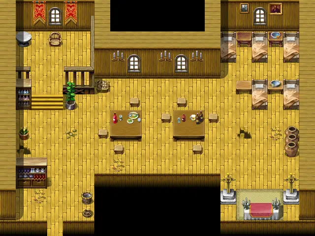

# Crossglen hall

| | |
|---|---|
| **Map ID** | `crossglen_hall` |
| **Region** | In Crossglen (settlement) |
| **Type** | Indoors / underground |
| **Size** | 20×15 tiles |
| **Introduced** | v0.7.0 or earlier |
| **NPCs** | 3 |
| **Quests** | 1 |

**Crossglen hall** is an indoor map, in Crossglen (settlement). It has 3 NPCs, and no enemies. Exits lead to Crossglen.

## Map

<label class="lg"><input type="checkbox" data-t="spawn" checked><b>Red</b>&nbsp;Monsters / NPCs</label><label class="lg"><input type="checkbox" data-t="mapchange" checked><b>Blue</b>&nbsp;Exit to another map</label><label class="lg"><input type="checkbox" data-t="container" checked><b>Yellow</b>&nbsp;Container (click to see contents)</label><label class="lg"><input type="checkbox" data-t="sign" checked><b>Purple</b>&nbsp;Sign</label><label class="lg"><input type="checkbox" data-t="rest" checked><b>Green</b>&nbsp;Resting place</label><label class="lg"><input type="checkbox" data-t="key" checked><b>Orange dashed</b>&nbsp;Blocked until a quest step / item</label><label class="lg"><input type="checkbox" data-t="script"><b>Grey dotted</b>&nbsp;Scripted event</label><label class="lg"><input type="checkbox" data-t="replace"><b>White dotted</b>&nbsp;Changes during a quest</label><label class="lg"><input type="checkbox" data-t="pin" checked><b>Numbers</b>&nbsp;Numbered key points (see the key below the map)</label>

<a class="pin pin-exit" href="#key-1" style="left:17.500%;top:96.667%" title="Exit (south): to [Crossglen](crossglen.md)">1</a><a id="pin-npc-burhczyd1" class="pin pin-npc" href="#key-2" style="left:67.500%;top:50.000%" title="[Burhczyd](../../monsters/burhczyd1.md): 1 quest">2</a><a id="pin-npc-drunk" class="pin pin-npc" href="#key-3" style="left:37.500%;top:43.333%" title="[Drunk](../../monsters/drunk.md): NPC">3</a><a id="pin-npc-burhczyd1e" class="pin pin-npc" href="#key-4" style="left:67.500%;top:43.333%" title="[Knight of Elythom](../../monsters/burhczyd1e.md): 1 quest">4</a><a class="pin pin-rest" href="#key-5" style="left:82.500%;top:43.333%" title="Resting place: Rest here to heal and set your respawn point">5</a><a class="pin pin-rest" href="#key-5" style="left:92.500%;top:43.333%" title="Resting place: Rest here to heal and set your respawn point">5</a><a class="pin pin-rest" href="#key-5" style="left:92.500%;top:23.333%" title="Resting place: Rest here to heal and set your respawn point">5</a><a class="pin pin-rest" href="#key-5" style="left:82.500%;top:23.333%" title="Resting place: Rest here to heal and set your respawn point">5</a><a class="pin pin-rest" href="#key-5" style="left:72.500%;top:23.333%" title="Resting place: Rest here to heal and set your respawn point">5</a>

??? abstract "Key to the numbers on the map"

    | # | What | Details |
    |---|---|---|
    | 1 | Exit (south) | to [Crossglen](crossglen.md) |
    | 2 | [Burhczyd](../monsters/burhczyd1.md) | 1 quest |
    | 3 | [Drunk](../monsters/drunk.md) | NPC |
    | 4 | [Knight of Elythom](../monsters/burhczyd1e.md) | 1 quest |
    | 5 | Resting place | Rest here to heal and set your respawn point |

Verified against v0.8.18 map data.

## Connections

| Direction | Leads to | Region there | Map # |
|---|---|---|---|
| South | [Crossglen](crossglen.md) | Crossglen | 1 |

## NPCs

- [Burhczyd](../monsters/burhczyd1.md) — quests: [Young merchant](../quests/quest_burhczyd.md) (#2)
- [Drunk](../monsters/drunk.md) (#3)
- [Knight of Elythom](../monsters/burhczyd1e.md) — quests: [Young merchant](../quests/quest_burhczyd.md) (#4)

## Quests

- [Young merchant](../quests/quest_burhczyd.md): [Burhczyd](../monsters/burhczyd1.md) is involved; [Knight of Elythom](../monsters/burhczyd1e.md) is involved
- [Young merchant story flags (hidden flag)](../quests/quest_burhczyd_nd.md): [Burhczyd](../monsters/burhczyd1.md) is involved; [Knight of Elythom](../monsters/burhczyd1e.md) is involved

## Points of interest

- **Resting place** (#5): Rest here to heal and set your respawn point

## Version history

| Version | Change |
|---|---|
| [v0.7.0](../versions/0.7.0.md) | Present in v0.7.0 (earliest release tracked) |
| [v0.7.1](../versions/0.7.1.md) | Map layout or objects changed |
| [v0.7.2](../versions/0.7.2.md) | Map layout or objects changed |
| [v0.7.8](../versions/0.7.8.md) | Map layout or objects changed |
| [v0.7.11](../versions/0.7.11.md) | Map layout or objects changed |
| [v0.8.18](../versions/0.8.18.md) | Map layout or objects changed |

Verified against v0.8.18 and every earlier release back to v0.7.0 (game data compared release by release).

## Community notes

<small>Written by players, not generated from game data. **Observations**: what players notice in-game · **Lore**: the in-world story · **Trivia**: real-world facts, references, development history · **Theory / speculation**: unconfirmed ideas; may just be unfinished content</small>

### Observations

*No notes yet. Contributions are welcome: [add a note](https://github.com/asdfghjkl628/Andor-s-Trail-Wikiiii/new/main/notes/maps?filename=crossglen_hall.md&value=%23%23%20Observations%0A%0A%3C%21--%20what%20players%20notice%20in-game%20--%3E%0A%0A%23%23%20Lore%0A%0A%3C%21--%20the%20in-world%20story%20--%3E%0A%0A%23%23%20Trivia%0A%0A%3C%21--%20real-world%20facts%2C%20references%2C%20development%20history%20--%3E%0A%0A%23%23%20Theory%20/%20speculation%0A%0A%3C%21--%20unconfirmed%20ideas%3B%20may%20just%20be%20unfinished%20content%20--%3E%0A).*

### Lore

*No notes yet. Contributions are welcome: [add a note](https://github.com/asdfghjkl628/Andor-s-Trail-Wikiiii/new/main/notes/maps?filename=crossglen_hall.md&value=%23%23%20Observations%0A%0A%3C%21--%20what%20players%20notice%20in-game%20--%3E%0A%0A%23%23%20Lore%0A%0A%3C%21--%20the%20in-world%20story%20--%3E%0A%0A%23%23%20Trivia%0A%0A%3C%21--%20real-world%20facts%2C%20references%2C%20development%20history%20--%3E%0A%0A%23%23%20Theory%20/%20speculation%0A%0A%3C%21--%20unconfirmed%20ideas%3B%20may%20just%20be%20unfinished%20content%20--%3E%0A).*

### Trivia

*No notes yet. Contributions are welcome: [add a note](https://github.com/asdfghjkl628/Andor-s-Trail-Wikiiii/new/main/notes/maps?filename=crossglen_hall.md&value=%23%23%20Observations%0A%0A%3C%21--%20what%20players%20notice%20in-game%20--%3E%0A%0A%23%23%20Lore%0A%0A%3C%21--%20the%20in-world%20story%20--%3E%0A%0A%23%23%20Trivia%0A%0A%3C%21--%20real-world%20facts%2C%20references%2C%20development%20history%20--%3E%0A%0A%23%23%20Theory%20/%20speculation%0A%0A%3C%21--%20unconfirmed%20ideas%3B%20may%20just%20be%20unfinished%20content%20--%3E%0A).*

### Theory / speculation

*No notes yet. Contributions are welcome: [add a note](https://github.com/asdfghjkl628/Andor-s-Trail-Wikiiii/new/main/notes/maps?filename=crossglen_hall.md&value=%23%23%20Observations%0A%0A%3C%21--%20what%20players%20notice%20in-game%20--%3E%0A%0A%23%23%20Lore%0A%0A%3C%21--%20the%20in-world%20story%20--%3E%0A%0A%23%23%20Trivia%0A%0A%3C%21--%20real-world%20facts%2C%20references%2C%20development%20history%20--%3E%0A%0A%23%23%20Theory%20/%20speculation%0A%0A%3C%21--%20unconfirmed%20ideas%3B%20may%20just%20be%20unfinished%20content%20--%3E%0A).*

??? info "Technical information"

    | | |
    |---|---|
    | Map ID | `crossglen_hall` |
    | File | `res/xml/crossglen_hall.tmx` |
    | Size | 20×15 tiles (640×480 px) |
    | outdoors property | – |
    | Layers drawn | ground, objects, above |
    | Tilesets | map_bed_1, map_border_1, map_bridge_1, map_bridge_2, map_broken_1, map_cavewall_1, map_cavewall_2, map_cavewall_3, map_cavewall_4, map_chair_table_1, map_chair_table_2, map_crate_1, map_cupboard_1, map_curtain_1, map_entrance_1, map_entrance_2, map_fence_1, map_fence_2, map_fence_3, map_fence_4, map_ground_1, map_ground_2, map_ground_3, map_ground_4, map_ground_5, map_ground_6, map_ground_7, map_ground_8, map_house_1, map_house_2, map_indoor_1, map_indoor_2, map_kitchen_1, map_outdoor_1, map_pillar_1, map_pillar_2, map_plant_1, map_plant_2, map_rock_1, map_rock_2, map_roof_1, map_roof_2, map_roof_3, map_shop_1, map_sign_ladder_1, map_table_1, map_trail_1, map_transition_1, map_transition_2, map_transition_3, map_transition_4, map_transition_5, map_tree_1, map_tree_2, map_wall_1, map_wall_2, map_wall_3, map_wall_4, map_window_1, map_window_2 |
    | Map objects | spawn: 8, rest: 5, mapchange: 1 |
    | World map position | – |

<small>Data from v0.8.18</small>
