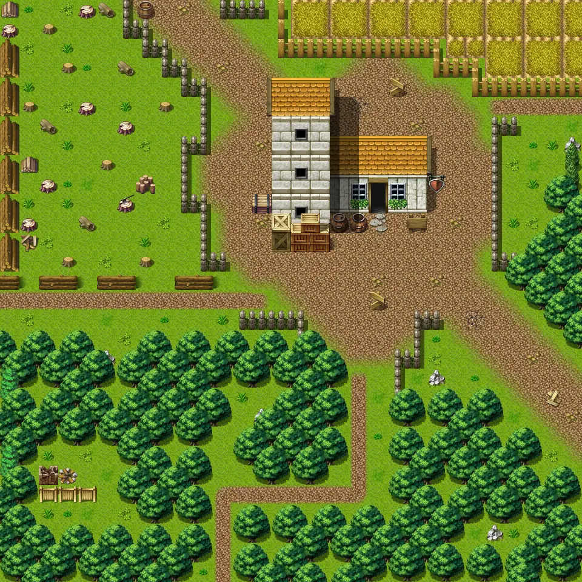
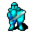

# Crossroads

30×30 tiles · outdoors · part of [World1](index.md)

<label class="lg"><input type="checkbox" data-t="spawn" checked><b>Red</b>&nbsp;Monsters / NPCs</label><label class="lg"><input type="checkbox" data-t="mapchange" checked><b>Blue</b>&nbsp;Exit to another map</label><label class="lg"><input type="checkbox" data-t="container" checked><b>Yellow</b>&nbsp;Container (click to see contents)</label><label class="lg"><input type="checkbox" data-t="sign" checked><b>Purple</b>&nbsp;Sign</label><label class="lg"><input type="checkbox" data-t="rest" checked><b>Green</b>&nbsp;Resting place</label><label class="lg"><input type="checkbox" data-t="key" checked><b>Orange dashed</b>&nbsp;Blocked until a quest step / item</label><label class="lg"><input type="checkbox" data-t="script"><b>Grey dotted</b>&nbsp;Scripted event</label><label class="lg"><input type="checkbox" data-t="replace"><b>White dotted</b>&nbsp;Changes during a quest</label>

## Exits

- [Fields0](fields0.md)
- [Houseatcrossroads0](houseatcrossroads0.md)
- [Loneford1](loneford1.md)
- [Roadbeforecrossroads](roadbeforecrossroads.md)
- [Roadtocarntower0](roadtocarntower0.md)
- [Wild0](wild0.md)

## Monsters & NPCs here

| Name | HP |
|---|---|
| [Guard](../monsters/crossroads_guard.md) | 0 |
| [Feygard soldier](../monsters/patrol_roaming.md) | 0 |
| [Benbyr](../monsters/benbyr.md) | 0 |
| [Fanamor](../monsters/fanamor.md) | 0 |
| [Frantic forest wasp](../monsters/fieldwasp_0.md) | 29 |
| [Anklebiter](../monsters/anklebiter.md) | 31 |
| [Frantic forest wasp](../monsters/fieldwasp_unique.md) | 70 |
| [Feygard scout](../monsters/feygard_scout.md) | 83 |

<small>Map ID: `crossroads` · Data from v0.8.18</small>
