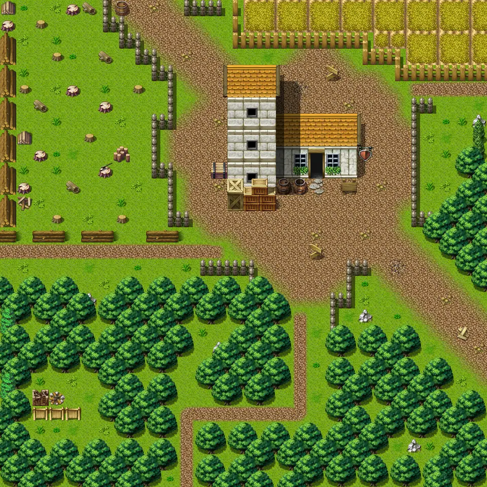

# Crossroads

| | |
|---|---|
| **Map ID** | `crossroads` |
| **Region** | In Crossroads Guardhouse (other) |
| **Type** | Outdoors |
| **Size** | 30×30 tiles |
| **World map** | [World 1](index.md) |
| **Introduced** | v0.7.0 or earlier |
| **NPCs** | 5 |
| **Enemy types** | 3 |
| **Quests** | 5 |

**Crossroads** is an outdoor map, in Crossroads Guardhouse (other). It has 5 NPCs and 3 kinds of enemy. Exits lead to Fields 0, Loneford 1, Roadbeforecrossroads, Wild 0 and 2 more.

## Map

<label class="lg"><input type="checkbox" data-t="spawn" checked><b>Red</b>&nbsp;Monsters / NPCs</label><label class="lg"><input type="checkbox" data-t="mapchange" checked><b>Blue</b>&nbsp;Exit to another map</label><label class="lg"><input type="checkbox" data-t="container" checked><b>Yellow</b>&nbsp;Container (click to see contents)</label><label class="lg"><input type="checkbox" data-t="sign" checked><b>Purple</b>&nbsp;Sign</label><label class="lg"><input type="checkbox" data-t="rest" checked><b>Green</b>&nbsp;Resting place</label><label class="lg"><input type="checkbox" data-t="key" checked><b>Orange dashed</b>&nbsp;Blocked until a quest step / item</label><label class="lg"><input type="checkbox" data-t="script"><b>Grey dotted</b>&nbsp;Scripted event</label><label class="lg"><input type="checkbox" data-t="replace"><b>White dotted</b>&nbsp;Changes during a quest</label><label class="lg"><input type="checkbox" data-t="pin" checked><b>Numbers</b>&nbsp;Numbered key points (see the key below the map)</label>

<a class="pin pin-exit" href="#key-1" style="left:31.667%;top:1.667%" title="Exit (north): to [Fields 0](fields0.md)">1</a><a class="pin pin-exit" href="#key-1" style="left:73.333%;top:1.667%" title="Exit (north): to [Fields 0](fields0.md)">1</a><a class="pin pin-exit" href="#key-1" style="left:8.333%;top:1.667%" title="Exit (north): to [Fields 0](fields0.md)">1</a><a class="pin pin-exit" href="#key-2" style="left:98.333%;top:6.667%" title="Exit (northeast): to [Loneford 1](loneford1.md)">2</a><a class="pin pin-exit" href="#key-3" style="left:98.333%;top:20.000%" title="Exit (east): to [Loneford 1](loneford1.md)">3</a><a class="pin pin-exit" href="#key-4" style="left:98.333%;top:71.667%" title="Exit (east): to [Roadbeforecrossroads](roadbeforecrossroads.md)">4</a><a class="pin pin-exit" href="#key-5" style="left:36.667%;top:98.333%" title="Exit (south): to [Wild 0](wild0.md)">5</a><a class="pin pin-exit" href="#key-6" style="left:1.667%;top:55.000%" title="Exit (west): to [Roadtocarntower 0](roadtocarntower0.md)">6</a><a class="pin pin-exit" href="#key-7" style="left:65.000%;top:35.000%" title="Exit (door): to [Houseatcrossroads 0](houseatcrossroads0.md)">7</a><a id="pin-npc-benbyr" class="pin pin-npc" href="#key-8" style="left:45.000%;top:38.333%" title="[Benbyr](../../monsters/benbyr.md): 3 quests">8</a><a id="pin-npc-fanamor" class="pin pin-npc" href="#key-9" style="left:8.333%;top:78.333%" title="[Fanamor](../../monsters/fanamor.md): 1 quest">9</a><a id="pin-npc-feygard_scout" class="pin pin-npc" href="#key-10" style="left:15.000%;top:78.333%" title="[Feygard scout](../../monsters/feygard_scout.md): 1 quest">10</a><a id="pin-npc-patrol_roaming" class="pin pin-npc" href="#key-11" style="left:65.000%;top:55.000%" title="[Feygard soldier](../../monsters/patrol_roaming.md): NPC">11</a><a id="pin-npc-crossroads_guard" class="pin pin-npc" href="#key-12" style="left:58.333%;top:41.667%" title="[Guard](../../monsters/guard.md#v-crossroads_guard): 1 quest">12</a><a class="pin pin-sign" href="#key-13" style="left:71.667%;top:38.333%" title="Sign: “Crossroads guardhouse, housing for allies of Feygard.”">13</a><a class="pin pin-sign" href="#key-14" style="left:65.000%;top:51.667%" title="Sign: “Southeast: Nor City
Northwest: Feygard
East: Loneford
South: Fallhaven”">14</a><a class="pin pin-sign" href="#key-15" style="left:68.333%;top:15.000%" title="Sign: “Northwest: Feygard
East: Loneford.”">15</a><a class="pin pin-script" href="#key-16" style="left:61.667%;top:50.000%" title="Quest trigger: Scripted event: advances the quest: hidden story flag “brv_nondisplay” to stage 142 (“Confiscated bonemeals”) (+1 more quest(s))">16</a><a class="pin pin-script" href="#key-17" style="left:63.333%;top:65.000%" title="Quest trigger: Scripted event: advances the quest: Unusual experiences and achievements to stage 10 (“On the road: My first glimpse of the great Duleian Road!”)">17</a><a class="pin pin-script" href="#key-18" style="left:66.667%;top:38.333%" title="Quest trigger: Scripted event: advances the quest: hidden story flag “dds_nd” to stage 2 (“2=Miri spawned 2”)">18</a><a class="pin pin-script" href="#key-19" style="left:68.349%;top:40.527%" title="Quest trigger: Scripted event: advances the quest: hidden story flag “quest_burhczyd_nd” to stage 512 (“512=show oven in Crossroad”)">19</a><a class="pin pin-key" href="#key-20" style="left:61.886%;top:47.500%" title="Blocked passage: Closed off once you reach this point in the quest: hidden story flag “brv_nondisplay” (stage 140: “Movement blocked by the Feygard patrol”)">20</a>

??? abstract "Key to the numbers on the map"

    | # | What | Details |
    |---|---|---|
    | 1 | Exit (north) | to [Fields 0](fields0.md) |
    | 2 | Exit (northeast) | to [Loneford 1](loneford1.md) |
    | 3 | Exit (east) | to [Loneford 1](loneford1.md) |
    | 4 | Exit (east) | to [Roadbeforecrossroads](roadbeforecrossroads.md) |
    | 5 | Exit (south) | to [Wild 0](wild0.md) |
    | 6 | Exit (west) | to [Roadtocarntower 0](roadtocarntower0.md) |
    | 7 | Exit (door) | to [Houseatcrossroads 0](houseatcrossroads0.md) |
    | 8 | [Benbyr](../monsters/benbyr.md) | 3 quests |
    | 9 | [Fanamor](../monsters/fanamor.md) | 1 quest |
    | 10 | [Feygard scout](../monsters/feygard_scout.md) | 1 quest |
    | 11 | [Feygard soldier](../monsters/patrol_roaming.md) | NPC |
    | 12 | [Guard](../monsters/guard.md#v-crossroads_guard) | 1 quest |
    | 13 | Sign | “Crossroads guardhouse, housing for allies of Feygard.” |
    | 14 | Sign | “Southeast: Nor City Northwest: Feygard East: Loneford South: Fallhaven” |
    | 15 | Sign | “Northwest: Feygard East: Loneford.” |
    | 16 | Quest trigger | Scripted event: advances the quest: hidden story flag “brv_nondisplay” to stage 142 (“Confiscated bonemeals”) (+1 more quest(s)) |
    | 17 | Quest trigger | Scripted event: advances the quest: Unusual experiences and achievements to stage 10 (“On the road: My first glimpse of the great Duleian Road!”) |
    | 18 | Quest trigger | Scripted event: advances the quest: hidden story flag “dds_nd” to stage 2 (“2=Miri spawned 2”) |
    | 19 | Quest trigger | Scripted event: advances the quest: hidden story flag “quest_burhczyd_nd” to stage 512 (“512=show oven in Crossroad”) |
    | 20 | Blocked passage | Closed off once you reach this point in the quest: hidden story flag “brv_nondisplay” (stage 140: “Movement blocked by the Feygard patrol”) |

Verified against v0.8.18 map data.

## Connections

| Direction | Leads to | Region there | Map # |
|---|---|---|---|
| North | [Fields 0](fields0.md) | Crossroads Guardhouse | 1 |
| Northeast | [Loneford 1](loneford1.md) | Crossroads Guardhouse | 2 |
| East | [Loneford 1](loneford1.md) | Crossroads Guardhouse | 3 |
| East | [Roadbeforecrossroads](roadbeforecrossroads.md) | Crossroads Guardhouse | 4 |
| South | [Wild 0](wild0.md) | Crossroads Guardhouse | 5 |
| West | [Roadtocarntower 0](roadtocarntower0.md) | Crossroads Guardhouse | 6 |
| Door | [Houseatcrossroads 0](houseatcrossroads0.md) | Crossroads Guardhouse | 7 |

## NPCs

- [Benbyr](../monsters/benbyr.md) — quests: [Cheap cuts](../quests/benbyr.md), [The ruthless Crackshot](../quests/Thieves03.md), [You shall pass](../quests/undertell_barricades.md) (#8)
- [Fanamor](../monsters/fanamor.md) — can be fought — quests: [Thief apprentice](../quests/Thieves01.md) (#9)
- [Feygard scout](../monsters/feygard_scout.md) — can be fought — quests: [Thief apprentice](../quests/Thieves01.md) (#10)
- [Feygard soldier](../monsters/patrol_roaming.md) (#11)
- [Guard](../monsters/guard.md#v-crossroads_guard) — quests: [The ruthless Crackshot](../quests/Thieves03.md) (#12)

## Enemies

| Enemy | HP | Damage | Up to | Notes |
|---|---|---|---|---|
| [Frantic forest wasp](../monsters/fieldwasp_0.md) | 29 | 2–6 | 2 | – |
| [Anklebiter](../monsters/anklebiter.md) | 31 | 3–9 | 4 | – |
| [Frantic forest wasp](../monsters/fieldwasp_0.md#v-fieldwasp_unique) | 70 | 2–6 | 1 | – |

<small>“Up to” is the most that can be alive at once from the spawn areas on this map.</small>

## Quests

- [Cheap cuts](../quests/benbyr.md): [Benbyr](../monsters/benbyr.md) is involved
- [The ruthless Crackshot](../quests/Thieves03.md): [Benbyr](../monsters/benbyr.md) is involved; [Guard](../monsters/guard.md#v-crossroads_guard) is involved
- [Thief apprentice](../quests/Thieves01.md): [Fanamor](../monsters/fanamor.md) is involved; [Feygard scout](../monsters/feygard_scout.md) is involved
- [Unusual experiences and achievements](../quests/achievements.md): something on this map advances it; stepping on a trigger here sets stage 10
- [You shall pass](../quests/undertell_barricades.md): [Benbyr](../monsters/benbyr.md) is involved
- [Blackwater Mountain story flags (hidden flag)](../quests/bwmfill_nondisplay.md): something on this map advances it; stepping on a trigger here sets stage 40; stepping on a trigger here sets stage 41; stepping on a trigger here sets stage 42; stepping on a trigger here sets stage 43
- [Brimhaven story flags (hidden flag)](../quests/brv_nondisplay.md): [Feygard soldier](../monsters/patrol_roaming.md) is involved; blocked passage closes at stage 140; something on this map advances it; stepping on a trigger here sets stage 140; stepping on a trigger here sets stage 142
- [Darkness in the Daylight and Shadows story flags (hidden flag)](../quests/dds_nd.md): something on this map advances it; stepping on a trigger here sets stage 1; stepping on a trigger here sets stage 2
- [Young merchant story flags (hidden flag)](../quests/quest_burhczyd_nd.md): something on this map advances it; stepping on a trigger here sets stage 512

## Points of interest

- **Sign** (#13): “Crossroads guardhouse, housing for allies of Feygard.”
- **Sign** (#14): “Southeast: Nor City Northwest: Feygard East: Loneford South: Fallhaven”
- **Sign** (#15): “Northwest: Feygard East: Loneford.”
- **Quest trigger** (#16): Scripted event: advances the quest: hidden story flag “brv_nondisplay” to stage 142 (“Confiscated bonemeals”) (+1 more quest(s))
- **Quest trigger** (#17): Scripted event: advances the quest: Unusual experiences and achievements to stage 10 (“On the road: My first glimpse of the great Duleian Road!”)
- **Quest trigger** (#18): Scripted event: advances the quest: hidden story flag “dds_nd” to stage 2 (“2=Miri spawned 2”)
- **Quest trigger** (#19): Scripted event: advances the quest: hidden story flag “quest_burhczyd_nd” to stage 512 (“512=show oven in Crossroad”)
- **Blocked passage** (#20): Closed off once you reach this point in the quest: hidden story flag “brv_nondisplay” (stage 140: “Movement blocked by the Feygard patrol”)

## Version history

| Version | Change |
|---|---|
| [v0.7.0](../versions/0.7.0.md) | Present in v0.7.0 (earliest release tracked) |
| [v0.7.1](../versions/0.7.1.md) | Map layout or objects changed |
| [v0.7.2](../versions/0.7.2.md) | Map layout or objects changed |
| [v0.7.8](../versions/0.7.8.md) | Map layout or objects changed |
| [v0.7.11](../versions/0.7.11.md) | Map layout or objects changed |
| [v0.7.13](../versions/0.7.13.md) | Map layout or objects changed |
| [v0.8.12.1](../versions/0.8.12.1.md) | Map layout or objects changed |
| [v0.8.14](../versions/0.8.14.md) | Map layout or objects changed |
| [v0.8.16.1](../versions/0.8.16.1.md) | Map layout or objects changed |

Verified against v0.8.18 and every earlier release back to v0.7.0 (game data compared release by release).

## Community notes

<small>Written by players, not generated from game data. **Observations**: what players notice in-game · **Lore**: the in-world story · **Trivia**: real-world facts, references, development history · **Theory / speculation**: unconfirmed ideas; may just be unfinished content</small>

### Observations

*No notes yet. Contributions are welcome: [add a note](https://github.com/asdfghjkl628/Andor-s-Trail-Wikiiii/new/main/notes/maps?filename=crossroads.md&value=%23%23%20Observations%0A%0A%3C%21--%20what%20players%20notice%20in-game%20--%3E%0A%0A%23%23%20Lore%0A%0A%3C%21--%20the%20in-world%20story%20--%3E%0A%0A%23%23%20Trivia%0A%0A%3C%21--%20real-world%20facts%2C%20references%2C%20development%20history%20--%3E%0A%0A%23%23%20Theory%20/%20speculation%0A%0A%3C%21--%20unconfirmed%20ideas%3B%20may%20just%20be%20unfinished%20content%20--%3E%0A).*

### Lore

*No notes yet. Contributions are welcome: [add a note](https://github.com/asdfghjkl628/Andor-s-Trail-Wikiiii/new/main/notes/maps?filename=crossroads.md&value=%23%23%20Observations%0A%0A%3C%21--%20what%20players%20notice%20in-game%20--%3E%0A%0A%23%23%20Lore%0A%0A%3C%21--%20the%20in-world%20story%20--%3E%0A%0A%23%23%20Trivia%0A%0A%3C%21--%20real-world%20facts%2C%20references%2C%20development%20history%20--%3E%0A%0A%23%23%20Theory%20/%20speculation%0A%0A%3C%21--%20unconfirmed%20ideas%3B%20may%20just%20be%20unfinished%20content%20--%3E%0A).*

### Trivia

*No notes yet. Contributions are welcome: [add a note](https://github.com/asdfghjkl628/Andor-s-Trail-Wikiiii/new/main/notes/maps?filename=crossroads.md&value=%23%23%20Observations%0A%0A%3C%21--%20what%20players%20notice%20in-game%20--%3E%0A%0A%23%23%20Lore%0A%0A%3C%21--%20the%20in-world%20story%20--%3E%0A%0A%23%23%20Trivia%0A%0A%3C%21--%20real-world%20facts%2C%20references%2C%20development%20history%20--%3E%0A%0A%23%23%20Theory%20/%20speculation%0A%0A%3C%21--%20unconfirmed%20ideas%3B%20may%20just%20be%20unfinished%20content%20--%3E%0A).*

### Theory / speculation

*No notes yet. Contributions are welcome: [add a note](https://github.com/asdfghjkl628/Andor-s-Trail-Wikiiii/new/main/notes/maps?filename=crossroads.md&value=%23%23%20Observations%0A%0A%3C%21--%20what%20players%20notice%20in-game%20--%3E%0A%0A%23%23%20Lore%0A%0A%3C%21--%20the%20in-world%20story%20--%3E%0A%0A%23%23%20Trivia%0A%0A%3C%21--%20real-world%20facts%2C%20references%2C%20development%20history%20--%3E%0A%0A%23%23%20Theory%20/%20speculation%0A%0A%3C%21--%20unconfirmed%20ideas%3B%20may%20just%20be%20unfinished%20content%20--%3E%0A).*

??? info "Technical information"

    | | |
    |---|---|
    | Map ID | `crossroads` |
    | File | `res/xml/crossroads.tmx` |
    | Size | 30×30 tiles (960×960 px) |
    | outdoors property | 1 |
    | Layers drawn | ground, objects, above |
    | Tilesets | map_bed_1, map_border_1, map_bridge_1, map_bridge_2, map_broken_1, map_cavewall_1, map_cavewall_2, map_cavewall_3, map_cavewall_4, map_chair_table_1, map_chair_table_2, map_crate_1, map_cupboard_1, map_curtain_1, map_entrance_1, map_entrance_2, map_fence_1, map_fence_2, map_fence_3, map_fence_4, map_ground_1, map_ground_2, map_ground_3, map_ground_4, map_ground_5, map_ground_6, map_ground_7, map_ground_8, map_house_1, map_house_2, map_indoor_1, map_indoor_2, map_kitchen_1, map_outdoor_1, map_pillar_1, map_pillar_2, map_plant_1, map_plant_2, map_rock_1, map_rock_2, map_roof_1, map_roof_2, map_roof_3, map_shop_1, map_sign_ladder_1, map_table_1, map_trail_1, map_transition_1, map_transition_2, map_transition_3, map_transition_4, map_transition_5, map_tree_1, map_tree_2, map_wall_1, map_wall_2, map_wall_3, map_wall_4, map_window_1, map_window_2 |
    | Map objects | spawn: 11, mapchange: 9, script: 4, sign: 3, key: 1 |
    | World map position | segment `world1`, x 179, y 300 |

<small>Data from v0.8.18</small>
