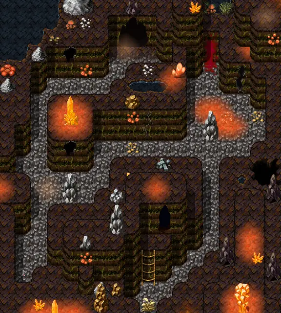

# Elm5f 1

18×20 tiles · part of [Elm5f](index.md)

<label class="lg lg-spawn"><input type="checkbox" data-t="spawn" checked> Monsters / NPCs</label><label class="lg lg-mapchange"><input type="checkbox" data-t="mapchange" checked> Exit to another map</label><label class="lg lg-container"><input type="checkbox" data-t="container" checked> Container</label><label class="lg lg-sign"><input type="checkbox" data-t="sign" checked> Sign</label><label class="lg lg-rest"><input type="checkbox" data-t="rest" checked> Resting place</label><label class="lg lg-key"><input type="checkbox" data-t="key" checked> Blocked / needs key or quest</label><label class="lg lg-script"><input type="checkbox" data-t="script"> Scripted event</label><label class="lg lg-replace"><input type="checkbox" data-t="replace"> Changes after a quest</label>

## Exits

- [Elm5f 2](elm5f_2.md)
- [Elm 4f 1](elm_4f_1.md)

## Monsters & NPCs here

| Name | HP |
|---|---|
| [Dun olm](../monsters/bwm_olm1.md) | 61 |
| [Albino olm](../monsters/bwm_olm2.md) | 66 |
| [Resurrected miner's skeleton](../monsters/elm_miner1.md) | 66 |
| [Foul miner's skeleton](../monsters/elm_miner2.md) | 82 |
| [Contaminated miner's skeleton](../monsters/elm_miner3.md) | 101 |
| [Prim guard skeleton](../monsters/elm_miner4.md) | 104 |
| [Dried kazarite golem](../monsters/elm_golem2.md) | 183 |
| [Kazarite golem](../monsters/elm_golem1.md) | 198 |
| [Yczorah](../monsters/elm_yzczorah2.md) | 231 |
| [Yczorah marauder](../monsters/elm_yczorah1.md) | 256 |

<small>Map ID: `elm5f_1` · Data from v0.8.18</small>
