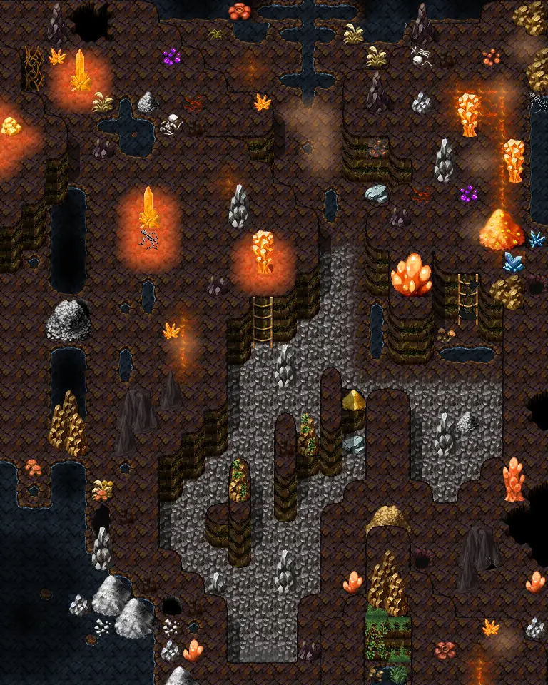
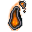
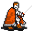

# Elm5f 2

24×30 tiles · part of [Elm5f](index.md)

<label class="lg"><input type="checkbox" data-t="spawn" checked><b>Red</b>&nbsp;Monsters / NPCs</label><label class="lg"><input type="checkbox" data-t="mapchange" checked><b>Blue</b>&nbsp;Exit to another map</label><label class="lg"><input type="checkbox" data-t="container" checked><b>Yellow</b>&nbsp;Container (click to see contents)</label><label class="lg"><input type="checkbox" data-t="sign" checked><b>Purple</b>&nbsp;Sign</label><label class="lg"><input type="checkbox" data-t="rest" checked><b>Green</b>&nbsp;Resting place</label><label class="lg"><input type="checkbox" data-t="key" checked><b>Orange dashed</b>&nbsp;Blocked until a quest step / item</label><label class="lg"><input type="checkbox" data-t="script"><b>Grey dotted</b>&nbsp;Scripted event</label><label class="lg"><input type="checkbox" data-t="replace"><b>White dotted</b>&nbsp;Changes during a quest</label>

## Containers

<b>Container 1</b><ul><li><a href="../../items/gold_bar/">Gold bar</a> <small>100%</small></li><li><a href="../../items/gold/">Gold coins</a> <small>100% · ×2 to 15</small></li></ul>

<b>Container 2</b><ul><li><a href="../../items/silver_bar/">Silver bar</a> <small>100%</small></li><li><a href="../../items/gold/">Gold coins</a> <small>100% · ×5 to 20</small></li></ul>

<b>Container 3</b><ul><li><a href="../../items/lead_bar/">Lead bar</a> <small>100%</small></li><li><a href="../../items/gold/">Gold coins</a> <small>100% · ×1 to 4</small></li></ul>

## Exits

- [Elm5f 1](elm5f_1.md)

## Monsters & NPCs here

| Name | HP |
|---|---|
| [General Ortholion](../monsters/ortholion.md) | 0 |
| [Ehrenfest](../monsters/ehrenfest.md) | 0 |
| [Resurrected miner's skeleton](../monsters/elm_miner1.md) | 66 |
| [Animated debris](../monsters/elm_debris.md) | 70 |
| [Foul miner's skeleton](../monsters/elm_miner2.md) | 82 |
| [Contaminated miner's skeleton](../monsters/elm_miner3.md) | 101 |
| [Prim guard skeleton](../monsters/elm_miner4.md) | 104 |
| [Ravenous glowing mudfiend](../monsters/elm_fiend2.md) | 111 |
| [Glowing mudfiend](../monsters/elm_fiend1.md) | 132 |
| [Kamelio](../monsters/kamelio.md) | 177 |
| [Dried kazarite golem](../monsters/elm_golem2.md) | 183 |
| [Kazarite golem](../monsters/elm_golem1.md) | 198 |
| [Yczorah](../monsters/elm_yzczorah2.md) | 231 |
| [Yczorah marauder](../monsters/elm_yczorah1.md) | 256 |
| [Undead Kamelio](../monsters/kamelio2.md) | 304 |
| [Prim guard skeleton](../monsters/elm_miner4a.md) | 364 |

<small>Map ID: `elm5f_2` · Data from v0.8.18</small>
