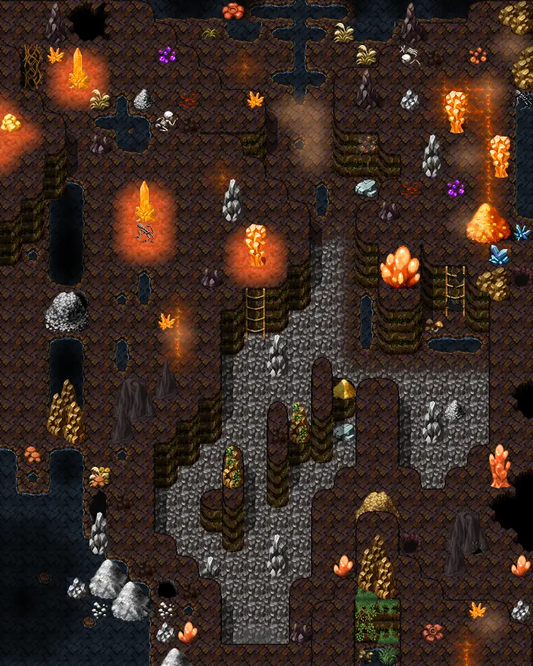
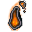
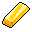
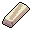

# Elm 5f 2

| | |
|---|---|
| **Map ID** | `elm5f_2` |
| **Type** | Indoors / underground |
| **Size** | 24×30 tiles |
| **World map** | [Elm 5f](index.md) |
| **Introduced** | [v0.7.14](../versions/0.7.14.md) |
| **NPCs** | 3 |
| **Enemy types** | 13 |
| **Quests** | 1 |
| **Containers** | 3 |

**Elm 5f 2** is an indoor map. It has 3 NPCs and 13 kinds of enemy. Exits lead to Elm 5f 1.

## Map

<label class="lg"><input type="checkbox" data-t="spawn" checked><b>Red</b>&nbsp;Monsters / NPCs</label><label class="lg"><input type="checkbox" data-t="mapchange" checked><b>Blue</b>&nbsp;Exit to another map</label><label class="lg"><input type="checkbox" data-t="container" checked><b>Yellow</b>&nbsp;Container (click to see contents)</label><label class="lg"><input type="checkbox" data-t="sign" checked><b>Purple</b>&nbsp;Sign</label><label class="lg"><input type="checkbox" data-t="rest" checked><b>Green</b>&nbsp;Resting place</label><label class="lg"><input type="checkbox" data-t="key" checked><b>Orange dashed</b>&nbsp;Blocked until a quest step / item</label><label class="lg"><input type="checkbox" data-t="script"><b>Grey dotted</b>&nbsp;Scripted event</label><label class="lg"><input type="checkbox" data-t="replace"><b>White dotted</b>&nbsp;Changes during a quest</label><label class="lg"><input type="checkbox" data-t="pin" checked><b>Numbers</b>&nbsp;Numbered key points (see the key below the map)</label>

<a class="pin pin-exit" href="#key-1" style="left:47.917%;top:98.333%" title="Exit (south): to [Elm 5f 1](elm5f_1.md)">1</a><a id="pin-npc-ehrenfest" class="pin pin-npc" href="#key-2" style="left:56.250%;top:5.000%" title="[Ehrenfest](../../monsters/ehrenfest.md): 1 quest">2</a><a id="pin-npc-ortholion" class="pin pin-npc" href="#key-3" style="left:56.250%;top:15.000%" title="[General Ortholion](../../monsters/ortholion.md): 1 quest">3</a><a id="pin-npc-kamelio" class="pin pin-npc" href="#key-4" style="left:47.917%;top:5.000%" title="[Kamelio](../../monsters/kamelio.md): NPC">4</a><a class="pin pin-script" href="#key-5" style="left:52.160%;top:16.471%" title="Quest trigger: Scripted event: advances the quest: hidden story flag “bwm72_beginning” to stage 38 (“Kamelio&#x27;s first death.”) (+1 more quest(s))">5</a><a class="pin pin-script" href="#key-6" style="left:62.500%;top:31.667%" title="Quest trigger: Scripted event: advances the quest: hidden story flag “bwm72_beginning” to stage 38 (“Kamelio&#x27;s first death.”)">6</a><a class="pin pin-container" href="#key-7" style="left:22.917%;top:5.000%" title="Container 1: Gold bar, Gold coins">7</a><a class="pin pin-container" href="#key-8" style="left:22.917%;top:71.667%" title="Container 2: Silver bar, Gold coins">8</a><a class="pin pin-container" href="#key-9" style="left:81.250%;top:61.667%" title="Container 3: Lead bar, Gold coins">9</a><a class="pin pin-key" href="#key-10" style="left:12.500%;top:36.667%" title="Blocked passage: Unlocked during the quest: hidden story flag “bwm72_beginning” (stage 11: “Wellspring dialogue &amp; hole. (Never-true condition)”)">10</a><a class="pin pin-key" href="#key-10" style="left:12.500%;top:55.000%" title="Blocked passage: Unlocked during the quest: hidden story flag “bwm72_beginning” (stage 11: “Wellspring dialogue &amp; hole. (Never-true condition)”)">10</a><a class="pin pin-key" href="#key-10" style="left:12.500%;top:71.667%" title="Blocked passage: Unlocked during the quest: hidden story flag “bwm72_beginning” (stage 11: “Wellspring dialogue &amp; hole. (Never-true condition)”)">10</a><a class="pin pin-key" href="#key-11" style="left:56.250%;top:18.333%" title="Blocked passage: Unlocked during the quest: Climbing up is forbidden (stage 52: “Ehrenfest reversed the situation using some kind of magic, seemingly unknown even to himself.”)">11</a><a class="pin pin-key" href="#key-10" style="left:58.333%;top:1.667%" title="Blocked passage: Unlocked during the quest: hidden story flag “bwm72_beginning” (stage 11: “Wellspring dialogue &amp; hole. (Never-true condition)”)">10</a><a class="pin pin-key" href="#key-12" style="left:62.500%;top:28.333%" title="Blocked passage: Closed off once you reach this point in the quest: hidden story flag “bwm72_beginning” (stage 38: “Kamelio&#x27;s first death.”)">12</a>

??? abstract "Key to the numbers on the map"

    | # | What | Details |
    |---|---|---|
    | 1 | Exit (south) | to [Elm 5f 1](elm5f_1.md) |
    | 2 | [Ehrenfest](../monsters/ehrenfest.md) | 1 quest |
    | 3 | [General Ortholion](../monsters/ortholion.md) | 1 quest |
    | 4 | [Kamelio](../monsters/kamelio.md) | NPC |
    | 5 | Quest trigger | Scripted event: advances the quest: hidden story flag “bwm72_beginning” to stage 38 (“Kamelio's first death.”) (+1 more quest(s)) |
    | 6 | Quest trigger | Scripted event: advances the quest: hidden story flag “bwm72_beginning” to stage 38 (“Kamelio's first death.”) |
    | 7 | Container 1 | Gold bar, Gold coins |
    | 8 | Container 2 | Silver bar, Gold coins |
    | 9 | Container 3 | Lead bar, Gold coins |
    | 10 | Blocked passage | Unlocked during the quest: hidden story flag “bwm72_beginning” (stage 11: “Wellspring dialogue & hole. (Never-true condition)”) |
    | 11 | Blocked passage | Unlocked during the quest: Climbing up is forbidden (stage 52: “Ehrenfest reversed the situation using some kind of magic, seemingly unknown even to himself.”) |
    | 12 | Blocked passage | Closed off once you reach this point in the quest: hidden story flag “bwm72_beginning” (stage 38: “Kamelio's first death.”) |

Verified against v0.8.18 map data.

## Connections

| Direction | Leads to | Region there | Map # |
|---|---|---|---|
| South | [Elm 5f 1](elm5f_1.md) | – | 1 |

## NPCs

- [Ehrenfest](../monsters/ehrenfest.md) — quests: [Climbing up is forbidden](../quests/Omi2_bwm1.md) (#2)
- [General Ortholion](../monsters/ortholion.md) — quests: [Climbing up is forbidden](../quests/Omi2_bwm1.md) (#3)
- [Kamelio](../monsters/kamelio.md) — can be fought (#4)

## Enemies

| Enemy | HP | Damage | Up to | Notes |
|---|---|---|---|---|
| [Resurrected miner's skeleton](../monsters/elm_miner1.md) | 66 | 8–10 | 11 | shares spawn with Foul miner's skeleton |
| [Animated debris](../monsters/elm_debris.md) | 70 | 1–9 | 2 | appears later, during a quest |
| [Foul miner's skeleton](../monsters/elm_miner2.md) | 82 | 6–12 | 11 | shares spawn with Resurrected miner's skeleton |
| [Contaminated miner's skeleton](../monsters/elm_miner3.md) | 101 | 10–15 | 7 | shares spawn with Prim guard skeleton |
| [Prim guard skeleton](../monsters/elm_miner4.md) | 104 | 12–16 | 7 | shares spawn with Contaminated miner's skeleton |
| [Ravenous glowing mudfiend](../monsters/elm_fiend2.md) | 111 | 7–21 | 2 | shares spawn with Glowing mudfiend |
| [Glowing mudfiend](../monsters/elm_fiend1.md) | 132 | 0–21 | 2 | shares spawn with Ravenous glowing mudfiend |
| [Dried kazarite golem](../monsters/elm_golem2.md) | 183 | 9–33 | 3 | shares spawn with Kazarite golem |
| [Kazarite golem](../monsters/elm_golem1.md) | 198 | 9–36 | 3 | shares spawn with Dried kazarite golem |
| [Yczorah](../monsters/elm_yzczorah2.md) | 231 | 6–7 | 4 | shares spawn with Yczorah marauder |
| [Yczorah marauder](../monsters/elm_yczorah1.md) | 256 | 6–7 | 4 | shares spawn with Yczorah |
| [Undead Kamelio](../monsters/kamelio2.md) | 304 | 12–18 | 1 | appears later, during a quest |
| [Prim guard skeleton](../monsters/elm_miner4.md#v-elm_miner4a) | 364 | 12–16 | 1 | – |

<small>“Up to” is the most that can be alive at once from the spawn areas on this map.</small>

## Items & containers

<b>Container 1</b><ul><li><a href="../../items/gold_bar/">Gold bar</a> <small>100%</small></li><li><a href="../../items/gold/">Gold coins</a> <small>100% · ×2 to 15</small></li></ul>

<b>Container 2</b><ul><li><a href="../../items/silver_bar/">Silver bar</a> <small>100%</small></li><li><a href="../../items/gold/">Gold coins</a> <small>100% · ×5 to 20</small></li></ul>

<b>Container 3</b><ul><li><a href="../../items/lead_bar/">Lead bar</a> <small>100%</small></li><li><a href="../../items/gold/">Gold coins</a> <small>100% · ×1 to 4</small></li></ul>

## Quests

- [Climbing up is forbidden](../quests/Omi2_bwm1.md): [Ehrenfest](../monsters/ehrenfest.md) is involved; [General Ortholion](../monsters/ortholion.md) is involved; blocked passage opens at stage 52; something on this map advances it; stepping on a trigger here sets stage 54
- [Blackwater Mountain events (hidden flag)](../quests/bwm72_beginning.md): [Ehrenfest](../monsters/ehrenfest.md) is involved; [General Ortholion](../monsters/ortholion.md) is involved; [Kamelio](../monsters/kamelio.md) is involved; a scripted event can trigger here from stage 41; blocked passage closes at stage 38; blocked passage opens at stage 11; something on this map advances it; stepping on a trigger here sets stage 38

## Points of interest

- **Quest trigger** (#5): Scripted event: advances the quest: hidden story flag “bwm72_beginning” to stage 38 (“Kamelio's first death.”) (+1 more quest(s))
- **Quest trigger** (#6): Scripted event: advances the quest: hidden story flag “bwm72_beginning” to stage 38 (“Kamelio's first death.”)
- **Blocked passage** (#10): Unlocked during the quest: hidden story flag “bwm72_beginning” (stage 11: “Wellspring dialogue & hole. (Never-true condition)”)
- **Blocked passage** (#11): Unlocked during the quest: Climbing up is forbidden (stage 52: “Ehrenfest reversed the situation using some kind of magic, seemingly unknown even to himself.”)
- **Blocked passage** (#12): Closed off once you reach this point in the quest: hidden story flag “bwm72_beginning” (stage 38: “Kamelio's first death.”)

## Version history

| Version | Change |
|---|---|
| [v0.7.14](../versions/0.7.14.md) | Added |
| [v0.7.17](../versions/0.7.17.md) | Map layout or objects changed |
| [v0.8.2](../versions/0.8.2.md) | Map layout or objects changed |

Verified against v0.8.18 and every earlier release back to v0.7.0 (game data compared release by release).

## Community notes

<small>Written by players, not generated from game data. **Observations**: what players notice in-game · **Lore**: the in-world story · **Trivia**: real-world facts, references, development history · **Theory / speculation**: unconfirmed ideas; may just be unfinished content</small>

### Observations

*No notes yet. Contributions are welcome: [add a note](https://github.com/asdfghjkl628/Andor-s-Trail-Wikiiii/new/main/notes/maps?filename=elm5f_2.md&value=%23%23%20Observations%0A%0A%3C%21--%20what%20players%20notice%20in-game%20--%3E%0A%0A%23%23%20Lore%0A%0A%3C%21--%20the%20in-world%20story%20--%3E%0A%0A%23%23%20Trivia%0A%0A%3C%21--%20real-world%20facts%2C%20references%2C%20development%20history%20--%3E%0A%0A%23%23%20Theory%20/%20speculation%0A%0A%3C%21--%20unconfirmed%20ideas%3B%20may%20just%20be%20unfinished%20content%20--%3E%0A).*

### Lore

*No notes yet. Contributions are welcome: [add a note](https://github.com/asdfghjkl628/Andor-s-Trail-Wikiiii/new/main/notes/maps?filename=elm5f_2.md&value=%23%23%20Observations%0A%0A%3C%21--%20what%20players%20notice%20in-game%20--%3E%0A%0A%23%23%20Lore%0A%0A%3C%21--%20the%20in-world%20story%20--%3E%0A%0A%23%23%20Trivia%0A%0A%3C%21--%20real-world%20facts%2C%20references%2C%20development%20history%20--%3E%0A%0A%23%23%20Theory%20/%20speculation%0A%0A%3C%21--%20unconfirmed%20ideas%3B%20may%20just%20be%20unfinished%20content%20--%3E%0A).*

### Trivia

*No notes yet. Contributions are welcome: [add a note](https://github.com/asdfghjkl628/Andor-s-Trail-Wikiiii/new/main/notes/maps?filename=elm5f_2.md&value=%23%23%20Observations%0A%0A%3C%21--%20what%20players%20notice%20in-game%20--%3E%0A%0A%23%23%20Lore%0A%0A%3C%21--%20the%20in-world%20story%20--%3E%0A%0A%23%23%20Trivia%0A%0A%3C%21--%20real-world%20facts%2C%20references%2C%20development%20history%20--%3E%0A%0A%23%23%20Theory%20/%20speculation%0A%0A%3C%21--%20unconfirmed%20ideas%3B%20may%20just%20be%20unfinished%20content%20--%3E%0A).*

### Theory / speculation

*No notes yet. Contributions are welcome: [add a note](https://github.com/asdfghjkl628/Andor-s-Trail-Wikiiii/new/main/notes/maps?filename=elm5f_2.md&value=%23%23%20Observations%0A%0A%3C%21--%20what%20players%20notice%20in-game%20--%3E%0A%0A%23%23%20Lore%0A%0A%3C%21--%20the%20in-world%20story%20--%3E%0A%0A%23%23%20Trivia%0A%0A%3C%21--%20real-world%20facts%2C%20references%2C%20development%20history%20--%3E%0A%0A%23%23%20Theory%20/%20speculation%0A%0A%3C%21--%20unconfirmed%20ideas%3B%20may%20just%20be%20unfinished%20content%20--%3E%0A).*

??? info "Technical information"

    | | |
    |---|---|
    | Map ID | `elm5f_2` |
    | File | `res/xml/elm5f_2.tmx` |
    | Size | 24×30 tiles (768×960 px) |
    | outdoors property | – |
    | Layers drawn | base, ground, objects, above, top |
    | Tilesets | map_bed_1, map_border_1, map_bridge_1, map_bridge_2, map_broken_1, map_cavewall_1, map_cavewall_2, map_cavewall_3, map_cavewall_4, map_cavewall_5, map_chair_table_1, map_chair_table_2, map_crate_1, map_cupboard_1, map_curtain_1, map_entrance_1, map_entrance_2, map_fence_1, map_fence_2, map_fence_3, map_fence_4, map_ground_1, map_ground_2, map_ground_3, map_ground_4, map_ground_5, map_ground_6, map_ground_7, map_ground_8, map_house_1, map_house_2, map_indoor_1, map_indoor_2, map_kitchen_1, map_outdoor_1, map_pillar_1, map_pillar_2, map_plant_1, map_plant_2, map_rock_1, map_rock_2, map_rock_3, map_roof_1, map_roof_2, map_roof_3, map_shop_1, map_sign_ladder_1, map_sign_ladder_omi2, map_table_1, map_trail_1, map_transition_1, map_transition_2, map_transition_3, map_transition_4, map_transition_6, map_tree_1, map_tree_2, map_wall_1, map_wall_2, map_wall_3, map_wall_4, map_window_1, map_window_2 |
    | Map objects | spawn: 18, script: 8, key: 6, container: 3, mapchange: 1 |
    | World map position | segment `elm5f`, x 7, y -17 |

<small>Data from v0.8.18</small>
