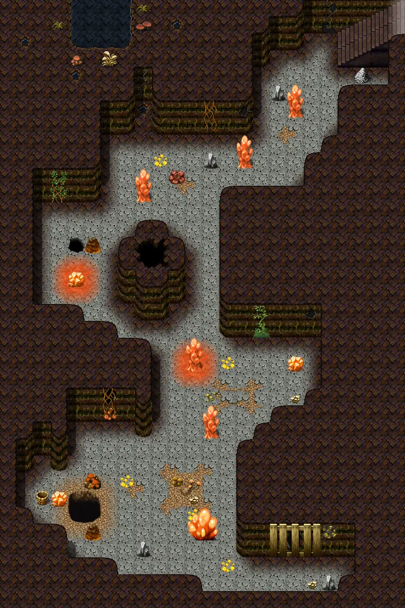

# Elm 2f 1

24×36 tiles · part of [Elmmine2f](index.md)

<label class="lg"><input type="checkbox" data-t="spawn" checked><b>Red</b>&nbsp;Monsters / NPCs</label><label class="lg"><input type="checkbox" data-t="mapchange" checked><b>Blue</b>&nbsp;Exit to another map</label><label class="lg"><input type="checkbox" data-t="container" checked><b>Yellow</b>&nbsp;Container (click to see contents)</label><label class="lg"><input type="checkbox" data-t="sign" checked><b>Purple</b>&nbsp;Sign</label><label class="lg"><input type="checkbox" data-t="rest" checked><b>Green</b>&nbsp;Resting place</label><label class="lg"><input type="checkbox" data-t="key" checked><b>Orange dashed</b>&nbsp;Blocked until a quest step / item</label><label class="lg"><input type="checkbox" data-t="script"><b>Grey dotted</b>&nbsp;Scripted event</label><label class="lg"><input type="checkbox" data-t="replace"><b>White dotted</b>&nbsp;Changes during a quest</label>

## Exits

- [Elm 2f 2](elm_2f_2.md)
- [Elm 2f 3](elm_2f_3.md)
- [Elm mine5](elm_mine5.md)

## Monsters & NPCs here

| Name | HP |
|---|---|
| [Dun olm](../monsters/bwm_olm1.md) | 61 |
| [Albino olm](../monsters/bwm_olm2.md) | 66 |
| [Animated debris](../monsters/elm_debris.md) | 70 |
| [Contaminated woodworm](../monsters/elm_woodworm.md) | 76 |
| [Aggresive woodworm](../monsters/elm_woodworm2.md) | 80 |
| [Contaminated olm](../monsters/bwm_olm5.md) | 90 |
| [Shadowfang](../monsters/shadowfang1.md) | 98 |
| [Ravenous glowing mudfiend](../monsters/elm_fiend2.md) | 111 |
| [Glowing mudfiend](../monsters/elm_fiend1.md) | 132 |

<small>Map ID: `elm_2f_1` · Data from v0.8.18</small>
