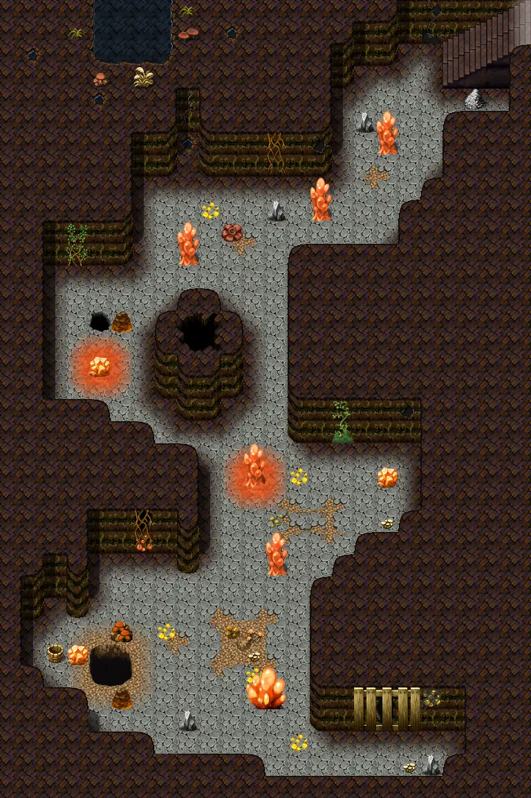

# Elm 2f 1

| | |
|---|---|
| **Map ID** | `elm_2f_1` |
| **Type** | Indoors / underground |
| **Size** | 24×36 tiles |
| **World map** | [Elmmine2f](index.md) |
| **Introduced** | [v0.7.14](../versions/0.7.14.md) |
| **NPCs** | 1 |
| **Enemy types** | 8 |
| **Quests** | 1 |

**Elm 2f 1** is an indoor map. It has 1 NPC and 8 kinds of enemy. Exits lead to Elm mine5, Elm 2f 2, Elm 2f 3.

## Map

<label class="lg"><input type="checkbox" data-t="spawn" checked><b>Red</b>&nbsp;Monsters / NPCs</label><label class="lg"><input type="checkbox" data-t="mapchange" checked><b>Blue</b>&nbsp;Exit to another map</label><label class="lg"><input type="checkbox" data-t="container" checked><b>Yellow</b>&nbsp;Container (click to see contents)</label><label class="lg"><input type="checkbox" data-t="sign" checked><b>Purple</b>&nbsp;Sign</label><label class="lg"><input type="checkbox" data-t="rest" checked><b>Green</b>&nbsp;Resting place</label><label class="lg"><input type="checkbox" data-t="key" checked><b>Orange dashed</b>&nbsp;Blocked until a quest step / item</label><label class="lg"><input type="checkbox" data-t="script"><b>Grey dotted</b>&nbsp;Scripted event</label><label class="lg"><input type="checkbox" data-t="replace"><b>White dotted</b>&nbsp;Changes during a quest</label><label class="lg"><input type="checkbox" data-t="pin" checked><b>Numbers</b>&nbsp;Numbered key points (see the key below the map)</label>

<a class="pin pin-exit" href="#key-1" style="left:97.917%;top:2.778%" title="Exit (northeast): to [Elm mine5](../elm_mine5.md)">1</a><a class="pin pin-exit" href="#key-2" style="left:93.750%;top:93.056%" title="Exit (east): to [Elm 2f 2](../elm_2f_2.md)">2</a><a class="pin pin-exit" href="#key-3" style="left:72.917%;top:90.278%" title="Exit (stairs / passage): to [Elm 2f 3](../elm_2f_3.md)">3</a><a class="pin pin-npc" href="#key-4" style="left:35.417%;top:20.833%" title="[Shadowfang](../../monsters/shadowfang1.md): NPC">4</a><a class="pin pin-sign" href="#key-5" style="left:39.583%;top:26.389%" title="Sign: A sign">5</a><a class="pin pin-key" href="#key-6" style="left:35.417%;top:18.056%" title="Blocked passage: Unlocked during the quest: hidden story flag “bwm72_beginning” (stage 11: “Wellspring dialogue &amp; hole. (Never-true condition)”)">6</a><a class="pin pin-key" href="#key-7" style="left:73.191%;top:88.195%" title="Blocked passage: Opens after killing 2× Animated debris">7</a><a class="pin pin-replace" href="#key-8" style="left:69.250%;top:88.456%" title="Changes during a quest: This area changes during the quest: Climbing up is forbidden (stage 49: “One of the unexploited areas of the mine had a walled up passage and lots of those strange glowing gems. They seem to consume living beings to grow and bring life to inanimated things or corpses. I must be very careful.”)">8</a>

??? abstract "Key to the numbers on the map"

    | # | What | Details |
    |---|---|---|
    | 1 | Exit (northeast) | to [Elm mine5](../elm_mine5.md) |
    | 2 | Exit (east) | to [Elm 2f 2](../elm_2f_2.md) |
    | 3 | Exit (stairs / passage) | to [Elm 2f 3](../elm_2f_3.md) |
    | 4 | [Shadowfang](../monsters/shadowfang1.md) | NPC |
    | 5 | Sign | A sign |
    | 6 | Blocked passage | Unlocked during the quest: hidden story flag “bwm72_beginning” (stage 11: “Wellspring dialogue & hole. (Never-true condition)”) |
    | 7 | Blocked passage | Opens after killing 2× Animated debris |
    | 8 | Changes during a quest | This area changes during the quest: Climbing up is forbidden (stage 49: “One of the unexploited areas of the mine had a walled up passage and lots of those strange glowing gems. They seem to consume living beings to grow and bring life to inanimated things or corpses. I must be very careful.”) |

Verified against v0.8.18 map data.

## Connections

| Direction | Leads to | Region there | Map # |
|---|---|---|---|
| Northeast | [Elm mine5](elm_mine5.md) | – | 1 |
| East | [Elm 2f 2](elm_2f_2.md) | – | 2 |
| Stairs / passage | [Elm 2f 3](elm_2f_3.md) | – | 3 |

## NPCs

- [Shadowfang](../monsters/shadowfang1.md) (#4)

## Enemies

| Enemy | HP | Damage | Up to | Notes |
|---|---|---|---|---|
| [Dun olm](../monsters/bwm_olm1.md) | 61 | 5–10 | 2 | shares spawn with Albino olm |
| [Albino olm](../monsters/bwm_olm2.md) | 66 | 7–10 | 2 | shares spawn with Dun olm |
| [Animated debris](../monsters/elm_debris.md) | 70 | 1–9 | 2 | appears later, during a quest |
| [Contaminated woodworm](../monsters/elm_woodworm.md) | 76 | 6–9 | 19 | shares spawn with Aggresive woodworm, Contaminated olm |
| [Aggresive woodworm](../monsters/elm_woodworm2.md) | 80 | 7–10 | 19 | shares spawn with Contaminated olm, Contaminated woodworm |
| [Contaminated olm](../monsters/bwm_olm5.md) | 90 | 6–14 | 19 | shares spawn with Aggresive woodworm, Contaminated woodworm |
| [Ravenous glowing mudfiend](../monsters/elm_fiend2.md) | 111 | 7–21 | 14 | shares spawn with Glowing mudfiend |
| [Glowing mudfiend](../monsters/elm_fiend1.md) | 132 | 0–21 | 14 | shares spawn with Ravenous glowing mudfiend |

<small>“Up to” is the most that can be alive at once from the spawn areas on this map.</small>

## Quests

- [Climbing up is forbidden](../quests/Omi2_bwm1.md): part of the map changes at stage 49; something on this map advances it
- [Hidden: events in bwm (hidden flag)](../quests/bwm72_beginning.md): blocked passage opens at stage 11

## Points of interest

- **Sign** (#5): A sign
- **Blocked passage** (#6): Unlocked during the quest: hidden story flag “bwm72_beginning” (stage 11: “Wellspring dialogue & hole. (Never-true condition)”)
- **Blocked passage** (#7): Opens after killing 2× Animated debris
- **Changes during a quest** (#8): This area changes during the quest: Climbing up is forbidden (stage 49: “One of the unexploited areas of the mine had a walled up passage and lots of those strange glowing gems. They seem to consume living beings to grow and bring life to inanimated things or corpses. I must be very careful.”)

## Version history

| Version | Change |
|---|---|
| [v0.7.14](../versions/0.7.14.md) | Added |
| [v0.7.15](../versions/0.7.15.md) | map layout or objects changed |
| [v0.8.2](../versions/0.8.2.md) | map layout or objects changed |
| [v0.8.4](../versions/0.8.4.md) | map layout or objects changed |

Verified against v0.8.18 and every earlier release back to v0.7.0 (game data compared release by release).

## Community notes

<small>Written by players, not generated from game data. **Observations**: what players notice in-game · **Lore**: the in-world story · **Trivia**: real-world facts, references, development history · **Theory / speculation**: unconfirmed ideas; may just be unfinished content</small>

### Observations

*Nothing here yet. Know something? [Add it](https://github.com/asdfghjkl628/Andor-s-Trail-Wikiiii/new/main/notes/maps?filename=elm_2f_1.md&value=%23%23%20Observations%0A%0A%3C%21--%20what%20players%20notice%20in-game%20--%3E%0A%0A%23%23%20Lore%0A%0A%3C%21--%20the%20in-world%20story%20--%3E%0A%0A%23%23%20Trivia%0A%0A%3C%21--%20real-world%20facts%2C%20references%2C%20development%20history%20--%3E%0A%0A%23%23%20Theory%20/%20speculation%0A%0A%3C%21--%20unconfirmed%20ideas%3B%20may%20just%20be%20unfinished%20content%20--%3E%0A).*

### Lore

*Nothing here yet. Know something? [Add it](https://github.com/asdfghjkl628/Andor-s-Trail-Wikiiii/new/main/notes/maps?filename=elm_2f_1.md&value=%23%23%20Observations%0A%0A%3C%21--%20what%20players%20notice%20in-game%20--%3E%0A%0A%23%23%20Lore%0A%0A%3C%21--%20the%20in-world%20story%20--%3E%0A%0A%23%23%20Trivia%0A%0A%3C%21--%20real-world%20facts%2C%20references%2C%20development%20history%20--%3E%0A%0A%23%23%20Theory%20/%20speculation%0A%0A%3C%21--%20unconfirmed%20ideas%3B%20may%20just%20be%20unfinished%20content%20--%3E%0A).*

### Trivia

*Nothing here yet. Know something? [Add it](https://github.com/asdfghjkl628/Andor-s-Trail-Wikiiii/new/main/notes/maps?filename=elm_2f_1.md&value=%23%23%20Observations%0A%0A%3C%21--%20what%20players%20notice%20in-game%20--%3E%0A%0A%23%23%20Lore%0A%0A%3C%21--%20the%20in-world%20story%20--%3E%0A%0A%23%23%20Trivia%0A%0A%3C%21--%20real-world%20facts%2C%20references%2C%20development%20history%20--%3E%0A%0A%23%23%20Theory%20/%20speculation%0A%0A%3C%21--%20unconfirmed%20ideas%3B%20may%20just%20be%20unfinished%20content%20--%3E%0A).*

### Theory / speculation

*Nothing here yet. Know something? [Add it](https://github.com/asdfghjkl628/Andor-s-Trail-Wikiiii/new/main/notes/maps?filename=elm_2f_1.md&value=%23%23%20Observations%0A%0A%3C%21--%20what%20players%20notice%20in-game%20--%3E%0A%0A%23%23%20Lore%0A%0A%3C%21--%20the%20in-world%20story%20--%3E%0A%0A%23%23%20Trivia%0A%0A%3C%21--%20real-world%20facts%2C%20references%2C%20development%20history%20--%3E%0A%0A%23%23%20Theory%20/%20speculation%0A%0A%3C%21--%20unconfirmed%20ideas%3B%20may%20just%20be%20unfinished%20content%20--%3E%0A).*

??? info "Technical information"

    | | |
    |---|---|
    | Map ID | `elm_2f_1` |
    | File | `res/xml/elm_2f_1.tmx` |
    | Size | 24×36 tiles (768×1152 px) |
    | outdoors property | – |
    | Layers drawn | ground, objects, above, top |
    | Tilesets | map_bed_1, map_border_1, map_bridge_1, map_bridge_2, map_broken_1, map_cavewall_1, map_cavewall_2, map_cavewall_3, map_cavewall_4, map_cavewall_5, map_chair_table_1, map_chair_table_2, map_crate_1, map_cupboard_1, map_curtain_1, map_entrance_1, map_entrance_2, map_fence_1, map_fence_2, map_fence_3, map_fence_4, map_ground_1, map_ground_2, map_ground_3, map_ground_4, map_ground_5, map_ground_6, map_ground_7, map_ground_8, map_house_1, map_house_2, map_indoor_1, map_indoor_2, map_kitchen_1, map_outdoor_1, map_pillar_1, map_pillar_2, map_plant_1, map_rock_1, map_rock_2, map_rock_3, map_roof_1, map_roof_2, map_roof_3, map_shop_1, map_sign_ladder_1, map_sign_ladder_omi2, map_table_1, map_trail_1, map_transition_1, map_transition_2, map_transition_3, map_transition_4, map_transition_6, map_tree_1, map_tree_2, map_wall_1, map_wall_2, map_wall_3, map_wall_4, map_window_1, map_window_2 |
    | Map objects | spawn: 15, script: 5, mapchange: 3, key: 2, sign: 1, replace: 1 |
    | World map position | segment `elmmine2f`, x 8, y -12 |

<small>Data from v0.8.18</small>
