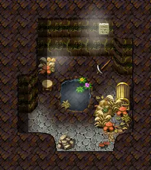
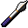

# Elm 2f 2

8×9 tiles · part of [Elmmine2f](index.md)

<label class="lg"><input type="checkbox" data-t="spawn" checked><b>Red</b>&nbsp;Monsters / NPCs</label><label class="lg"><input type="checkbox" data-t="mapchange" checked><b>Blue</b>&nbsp;Exit to another map</label><label class="lg"><input type="checkbox" data-t="container" checked><b>Yellow</b>&nbsp;Container (click to see contents)</label><label class="lg"><input type="checkbox" data-t="sign" checked><b>Purple</b>&nbsp;Sign</label><label class="lg"><input type="checkbox" data-t="rest" checked><b>Green</b>&nbsp;Resting place</label><label class="lg"><input type="checkbox" data-t="key" checked><b>Orange dashed</b>&nbsp;Blocked until a quest step / item</label><label class="lg"><input type="checkbox" data-t="script"><b>Grey dotted</b>&nbsp;Scripted event</label><label class="lg"><input type="checkbox" data-t="replace"><b>White dotted</b>&nbsp;Changes during a quest</label>

## Containers

<b>Container 1</b><ul><li><a href="../../items/elm_mushroom1/">Boletus spelunca</a> <small>100% · ×1 to 5</small></li></ul>

<b>Container 2</b><ul><li><a href="../../items/vial_empty4/">Empty potion bottle</a> <small>33.3333% · ×1 to 5</small></li><li><a href="../../items/gold/">Gold coins</a> <small>50% · ×10 to 100</small></li><li><a href="../../items/torch/">Miner&#x27;s lamp fuel</a> <small>100%</small></li><li><a href="../../items/bonemeal_potion/">Bonemeal potion</a> <small>20% · ×2 to 10</small></li><li><a href="../../items/bwm_water1/">Bottle of mountain water</a> <small>33.3333% · ×5 to 10</small></li><li><a href="../../items/bwm_pick/">Blackwater rusted pickaxe</a> <small>100% · ×1 to 3</small></li><li><a href="../../items/bwm_fish2/">Cooked inkyfish</a> <small>33.3333% · ×1 to 5</small></li><li><a href="../../items/bwm_water2/">Large bottle of mountain water</a> <small>10% · ×2 to 4</small></li><li><a href="../../items/bwm_fish3/">Toasted inkyfish</a> <small>10% · ×1 to 3</small></li><li><a href="../../items/gem4/">Sharpened gem</a> <small>10% · ×1 to 5</small></li><li><a href="../../items/shield_iron2/">Iron shield</a> <small>2%</small></li><li><a href="../../items/pot_bm_lodar/">Lodar&#x27;s bonemeal potion</a> <small>2% · ×5 to 10</small></li><li><a href="../../items/mace2/">Elm steel mace</a> <small>100%</small></li><li><a href="../../items/bwm_olm_weapon1/">Amphibian whip</a> <small>100%</small></li><li><a href="../../items/venomfang_dagger/">Venomfang dirk</a> <small>0.4%</small></li></ul>

## Exits

- [Elm 2f 1](elm_2f_1.md)

<small>Map ID: `elm_2f_2` · Data from v0.8.18</small>
