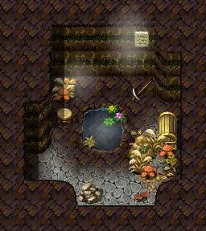

# Elm 2f 2

| | |
|---|---|
| **Map ID** | `elm_2f_2` |
| **Type** | Indoors / underground |
| **Size** | 8×9 tiles |
| **World map** | [Elmmine2f](index.md) |
| **Introduced** | [v0.7.14](../versions/0.7.14.md) |
| **Quests** | 0 |
| **Containers** | 2 |

**Elm 2f 2** is an indoor map. It has no NPCs, and no enemies. Exits lead to Elm 2f 1.

## Map

<label class="lg"><input type="checkbox" data-t="spawn" checked><b>Red</b>&nbsp;Monsters / NPCs</label><label class="lg"><input type="checkbox" data-t="mapchange" checked><b>Blue</b>&nbsp;Exit to another map</label><label class="lg"><input type="checkbox" data-t="container" checked><b>Yellow</b>&nbsp;Container (click to see contents)</label><label class="lg"><input type="checkbox" data-t="sign" checked><b>Purple</b>&nbsp;Sign</label><label class="lg"><input type="checkbox" data-t="rest" checked><b>Green</b>&nbsp;Resting place</label><label class="lg"><input type="checkbox" data-t="key" checked><b>Orange dashed</b>&nbsp;Blocked until a quest step / item</label><label class="lg"><input type="checkbox" data-t="script"><b>Grey dotted</b>&nbsp;Scripted event</label><label class="lg"><input type="checkbox" data-t="replace"><b>White dotted</b>&nbsp;Changes during a quest</label><label class="lg"><input type="checkbox" data-t="pin" checked><b>Numbers</b>&nbsp;Numbered key points (see the key below the map)</label>

<a class="pin pin-exit" href="#key-1" style="left:6.250%;top:72.222%" title="Exit (west): to [Elm 2f 1](elm_2f_1.md)">1</a><a class="pin pin-container" href="#key-2" style="left:68.750%;top:83.333%" title="Container 1: Boletus spelunca">2</a><a class="pin pin-sign" href="#key-3" style="left:68.750%;top:38.889%" title="Sign: “The sign reads:

  &quot;DO NOT THROW ITEMS INTO THE POOL&quot;
  &quot;DO NOT SPLASH&quot;
  &quot;RELAX&quot;

Signed by Guthbered of Prim”">3</a><a class="pin pin-key" href="#key-4" style="left:81.250%;top:50.000%" title="Blocked passage: Unlocked during the quest: hidden story flag “bwm72_beginning” (stage 33: “Elm2f2 chest”)">4</a><a class="pin pin-container" href="#key-5" style="left:56.250%;top:38.889%" title="Container 2: Empty potion bottle, Gold coins, Miner&#x27;s lamp fuel, Bonemeal potion, Bottle of mountain water, Blackwater rusted pickaxe">5</a>

??? abstract "Key to the numbers on the map"

    | # | What | Details |
    |---|---|---|
    | 1 | Exit (west) | to [Elm 2f 1](elm_2f_1.md) |
    | 2 | Container 1 | Boletus spelunca |
    | 3 | Sign | “The sign reads:    "DO NOT THROW ITEMS INTO THE POOL"   "DO NOT SPLASH"   "RELAX"  Signed by Guthbered of Prim” |
    | 4 | Blocked passage | Unlocked during the quest: hidden story flag “bwm72_beginning” (stage 33: “Elm2f2 chest”) |
    | 5 | Container 2 | Empty potion bottle, Gold coins, Miner's lamp fuel, Bonemeal potion, Bottle of mountain water, Blackwater rusted pickaxe |

Verified against v0.8.18 map data.

## Connections

| Direction | Leads to | Region there | Map # |
|---|---|---|---|
| West | [Elm 2f 1](elm_2f_1.md) | – | 1 |

## Items & containers

<b>Container 1</b><ul><li><a href="../../items/elm_mushroom1/">Boletus spelunca</a> <small>100% · ×1 to 5</small></li></ul>

<b>Container 2</b><ul><li><a href="../../items/vial_empty4/">Empty potion bottle</a> <small>33.3333% · ×1 to 5</small></li><li><a href="../../items/gold/">Gold coins</a> <small>50% · ×10 to 100</small></li><li><a href="../../items/torch/">Miner&#x27;s lamp fuel</a> <small>100%</small></li><li><a href="../../items/bonemeal_potion/">Bonemeal potion</a> <small>20% · ×2 to 10</small></li><li><a href="../../items/bwm_water1/">Bottle of mountain water</a> <small>33.3333% · ×5 to 10</small></li><li><a href="../../items/bwm_pick/">Blackwater rusted pickaxe</a> <small>100% · ×1 to 3</small></li><li><a href="../../items/bwm_fish2/">Cooked inkyfish</a> <small>33.3333% · ×1 to 5</small></li><li><a href="../../items/bwm_water2/">Large bottle of mountain water</a> <small>10% · ×2 to 4</small></li><li><a href="../../items/bwm_fish3/">Toasted inkyfish</a> <small>10% · ×1 to 3</small></li><li><a href="../../items/gem4/">Sharpened gem</a> <small>10% · ×1 to 5</small></li><li><a href="../../items/shield_iron2/">Iron shield</a> <small>2%</small></li><li><a href="../../items/pot_bm_lodar/">Lodar&#x27;s bonemeal potion</a> <small>2% · ×5 to 10</small></li><li><a href="../../items/mace2/">Elm steel mace</a> <small>100%</small></li><li><a href="../../items/bwm_olm_weapon1/">Amphibian whip</a> <small>100%</small></li><li><a href="../../items/venomfang_dagger/">Venomfang dirk</a> <small>0.4%</small></li></ul>

## Quests

- [Hidden: events in bwm (hidden flag)](../quests/bwm72_beginning.md): blocked passage opens at stage 33; something on this map advances it

## Points of interest

- **Sign** (#3): “The sign reads:    "DO NOT THROW ITEMS INTO THE POOL"   "DO NOT SPLASH"   "RELAX"  Signed by Guthbered of Prim”
- **Blocked passage** (#4): Unlocked during the quest: hidden story flag “bwm72_beginning” (stage 33: “Elm2f2 chest”)

## Version history

| Version | Change |
|---|---|
| [v0.7.14](../versions/0.7.14.md) | Added |
| [v0.8.8](../versions/0.8.8.md) | map layout or objects changed |
| [v0.8.13](../versions/0.8.13.md) | map layout or objects changed |

Verified against v0.8.18 and every earlier release back to v0.7.0 (game data compared release by release).

## Community notes

<small>Written by players, not generated from game data. **Observations**: what players notice in-game · **Lore**: the in-world story · **Trivia**: real-world facts, references, development history · **Theory / speculation**: unconfirmed ideas; may just be unfinished content</small>

### Observations

*No notes yet. Contributions are welcome: [add a note](https://github.com/asdfghjkl628/Andor-s-Trail-Wikiiii/new/main/notes/maps?filename=elm_2f_2.md&value=%23%23%20Observations%0A%0A%3C%21--%20what%20players%20notice%20in-game%20--%3E%0A%0A%23%23%20Lore%0A%0A%3C%21--%20the%20in-world%20story%20--%3E%0A%0A%23%23%20Trivia%0A%0A%3C%21--%20real-world%20facts%2C%20references%2C%20development%20history%20--%3E%0A%0A%23%23%20Theory%20/%20speculation%0A%0A%3C%21--%20unconfirmed%20ideas%3B%20may%20just%20be%20unfinished%20content%20--%3E%0A).*

### Lore

*No notes yet. Contributions are welcome: [add a note](https://github.com/asdfghjkl628/Andor-s-Trail-Wikiiii/new/main/notes/maps?filename=elm_2f_2.md&value=%23%23%20Observations%0A%0A%3C%21--%20what%20players%20notice%20in-game%20--%3E%0A%0A%23%23%20Lore%0A%0A%3C%21--%20the%20in-world%20story%20--%3E%0A%0A%23%23%20Trivia%0A%0A%3C%21--%20real-world%20facts%2C%20references%2C%20development%20history%20--%3E%0A%0A%23%23%20Theory%20/%20speculation%0A%0A%3C%21--%20unconfirmed%20ideas%3B%20may%20just%20be%20unfinished%20content%20--%3E%0A).*

### Trivia

*No notes yet. Contributions are welcome: [add a note](https://github.com/asdfghjkl628/Andor-s-Trail-Wikiiii/new/main/notes/maps?filename=elm_2f_2.md&value=%23%23%20Observations%0A%0A%3C%21--%20what%20players%20notice%20in-game%20--%3E%0A%0A%23%23%20Lore%0A%0A%3C%21--%20the%20in-world%20story%20--%3E%0A%0A%23%23%20Trivia%0A%0A%3C%21--%20real-world%20facts%2C%20references%2C%20development%20history%20--%3E%0A%0A%23%23%20Theory%20/%20speculation%0A%0A%3C%21--%20unconfirmed%20ideas%3B%20may%20just%20be%20unfinished%20content%20--%3E%0A).*

### Theory / speculation

*No notes yet. Contributions are welcome: [add a note](https://github.com/asdfghjkl628/Andor-s-Trail-Wikiiii/new/main/notes/maps?filename=elm_2f_2.md&value=%23%23%20Observations%0A%0A%3C%21--%20what%20players%20notice%20in-game%20--%3E%0A%0A%23%23%20Lore%0A%0A%3C%21--%20the%20in-world%20story%20--%3E%0A%0A%23%23%20Trivia%0A%0A%3C%21--%20real-world%20facts%2C%20references%2C%20development%20history%20--%3E%0A%0A%23%23%20Theory%20/%20speculation%0A%0A%3C%21--%20unconfirmed%20ideas%3B%20may%20just%20be%20unfinished%20content%20--%3E%0A).*

??? info "Technical information"

    | | |
    |---|---|
    | Map ID | `elm_2f_2` |
    | File | `res/xml/elm_2f_2.tmx` |
    | Size | 8×9 tiles (256×288 px) |
    | outdoors property | – |
    | Layers drawn | ground, objects, above, top |
    | Tilesets | map_bed_1, map_bridge_1, map_bridge_2, map_cavewall_1, map_cavewall_2, map_cavewall_3, map_cavewall_4, map_cavewall_5, map_chair_table_1, map_chair_table_2, map_crate_1, map_cupboard_1, map_curtain_1, map_entrance_1, map_entrance_2, map_fence_1, map_fence_2, map_fence_3, map_fence_4, map_ground_2, map_ground_3, map_ground_4, map_ground_5, map_ground_6, map_ground_7, map_ground_8, map_house_1, map_house_2, map_indoor_1, map_indoor_2, map_kitchen_1, map_outdoor_1, map_pillar_1, map_pillar_2, map_plant_1, map_plant_2, map_rock_1, map_rock_2, map_rock_3, map_roof_1, map_roof_2, map_roof_3, map_shop_1, map_sign_ladder_1, map_sign_ladder_omi2, map_table_1, map_trail_1, map_transition_1, map_transition_2, map_transition_3, map_transition_4, map_transition_6, map_tree_1, map_tree_2, map_wall_1, map_wall_2, map_wall_3, map_wall_4, map_window_1, map_window_2 |
    | Map objects | container: 2, mapchange: 1, sign: 1, script: 1, key: 1 |
    | World map position | segment `elmmine2f`, x 33, y 15 |

<small>Data from v0.8.18</small>
