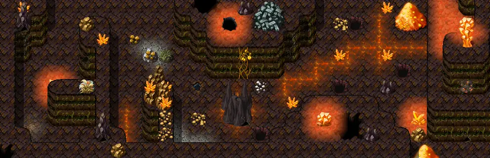
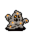
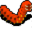
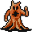
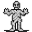
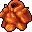

# Elm 4f 2

31×10 tiles · part of [Elm4f](index.md)

<label class="lg"><input type="checkbox" data-t="spawn" checked><b>Red</b>&nbsp;Monsters / NPCs</label><label class="lg"><input type="checkbox" data-t="mapchange" checked><b>Blue</b>&nbsp;Exit to another map</label><label class="lg"><input type="checkbox" data-t="container" checked><b>Yellow</b>&nbsp;Container (click to see contents)</label><label class="lg"><input type="checkbox" data-t="sign" checked><b>Purple</b>&nbsp;Sign</label><label class="lg"><input type="checkbox" data-t="rest" checked><b>Green</b>&nbsp;Resting place</label><label class="lg"><input type="checkbox" data-t="key" checked><b>Orange dashed</b>&nbsp;Blocked until a quest step / item</label><label class="lg"><input type="checkbox" data-t="script"><b>Grey dotted</b>&nbsp;Scripted event</label><label class="lg"><input type="checkbox" data-t="replace"><b>White dotted</b>&nbsp;Changes during a quest</label>

## Containers

<b>Container 1</b><ul><li><a href="../../items/gem2/">Ruby gem</a> <small>100% · ×1 to 5</small></li><li><a href="../../items/rock/">Small rock</a> <small>20% · ×0 to 9</small></li><li><a href="../../items/gold/">Gold coins</a> <small>33.3333% · ×3 to 9</small></li><li><a href="../../items/gold/">Gold coins</a> <small>1% · ×45 to 90</small></li><li><a href="../../items/rock2/">Large rock</a> <small>10%</small></li><li><a href="../../items/bwm_pick/">Blackwater rusted pickaxe</a> <small>1% · ×0 to 1</small></li><li><a href="../../items/armor6/">Dented bronze plate</a> <small>1%</small></li></ul>

## Exits

- [Elm 4f 1](elm_4f_1.md)
- [Elm 4f 3](elm_4f_3.md)

## Monsters & NPCs here

| Name | HP |
|---|---|
| [Resurrected miner's skeleton](../monsters/elm_miner1.md) | 66 |
| [Contaminated woodworm](../monsters/elm_woodworm.md) | 76 |
| [Aggresive woodworm](../monsters/elm_woodworm2.md) | 80 |
| [Foul miner's skeleton](../monsters/elm_miner2.md) | 82 |
| [Contaminated olm](../monsters/bwm_olm5.md) | 90 |
| [Ravenous glowing mudfiend](../monsters/elm_fiend2.md) | 111 |
| [Glowing mudfiend](../monsters/elm_fiend1.md) | 132 |
| [Dried kazarite golem](../monsters/elm_golem2.md) | 183 |
| [Kazarite golem](../monsters/elm_golem1.md) | 198 |

<small>Map ID: `elm_4f_2` · Data from v0.8.18</small>
