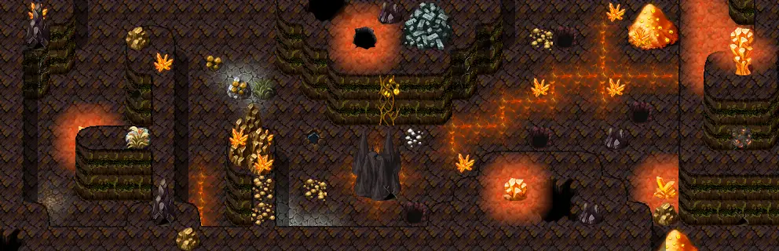
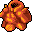

# Elm 4f 2

| | |
|---|---|
| **Map ID** | `elm_4f_2` |
| **Type** | Indoors / underground |
| **Size** | 31×10 tiles |
| **World map** | [Elm4f](index.md) |
| **Introduced** | [v0.7.14](../versions/0.7.14.md) |
| **Enemy types** | 9 |
| **Quests** | 0 |
| **Containers** | 1 |

**Elm 4f 2** is an indoor map. It has no NPCs and 9 kinds of enemy. Exits lead to Elm 4f 1, Elm 4f 3.

## Map

<label class="lg"><input type="checkbox" data-t="spawn" checked><b>Red</b>&nbsp;Monsters / NPCs</label><label class="lg"><input type="checkbox" data-t="mapchange" checked><b>Blue</b>&nbsp;Exit to another map</label><label class="lg"><input type="checkbox" data-t="container" checked><b>Yellow</b>&nbsp;Container (click to see contents)</label><label class="lg"><input type="checkbox" data-t="sign" checked><b>Purple</b>&nbsp;Sign</label><label class="lg"><input type="checkbox" data-t="rest" checked><b>Green</b>&nbsp;Resting place</label><label class="lg"><input type="checkbox" data-t="key" checked><b>Orange dashed</b>&nbsp;Blocked until a quest step / item</label><label class="lg"><input type="checkbox" data-t="script"><b>Grey dotted</b>&nbsp;Scripted event</label><label class="lg"><input type="checkbox" data-t="replace"><b>White dotted</b>&nbsp;Changes during a quest</label><label class="lg"><input type="checkbox" data-t="pin" checked><b>Numbers</b>&nbsp;Numbered key points (see the key below the map)</label>

<a class="pin pin-exit" href="#key-1" style="left:70.968%;top:5.000%" title="Exit (north): to [Elm 4f 1](elm_4f_1.md)">1</a><a class="pin pin-exit" href="#key-2" style="left:22.581%;top:5.000%" title="Exit (north): to [Elm 4f 3](elm_4f_3.md)">2</a><a class="pin pin-container" href="#key-3" style="left:53.226%;top:25.000%" title="Container 1: Ruby gem, Small rock, Gold coins, Gold coins, Large rock, Blackwater rusted pickaxe">3</a>

??? abstract "Key to the numbers on the map"

    | # | What | Details |
    |---|---|---|
    | 1 | Exit (north) | to [Elm 4f 1](elm_4f_1.md) |
    | 2 | Exit (north) | to [Elm 4f 3](elm_4f_3.md) |
    | 3 | Container 1 | Ruby gem, Small rock, Gold coins, Gold coins, Large rock, Blackwater rusted pickaxe |

Verified against v0.8.18 map data.

## Connections

| Direction | Leads to | Region there | Map # |
|---|---|---|---|
| North | [Elm 4f 1](elm_4f_1.md) | – | 1 |
| North | [Elm 4f 3](elm_4f_3.md) | – | 2 |

## Enemies

| Enemy | HP | Damage | Up to | Notes |
|---|---|---|---|---|
| [Resurrected miner's skeleton](../monsters/elm_miner1.md) | 66 | 8–10 | 4 | shares spawn with Foul miner's skeleton |
| [Contaminated woodworm](../monsters/elm_woodworm.md) | 76 | 6–9 | 7 | shares spawn with Aggresive woodworm, Contaminated olm |
| [Aggresive woodworm](../monsters/elm_woodworm2.md) | 80 | 7–10 | 7 | shares spawn with Contaminated olm, Contaminated woodworm |
| [Foul miner's skeleton](../monsters/elm_miner2.md) | 82 | 6–12 | 4 | shares spawn with Resurrected miner's skeleton |
| [Contaminated olm](../monsters/bwm_olm5.md) | 90 | 6–14 | 7 | shares spawn with Aggresive woodworm, Contaminated woodworm |
| [Ravenous glowing mudfiend](../monsters/elm_fiend2.md) | 111 | 7–21 | 4 | shares spawn with Glowing mudfiend |
| [Glowing mudfiend](../monsters/elm_fiend1.md) | 132 | 0–21 | 4 | shares spawn with Ravenous glowing mudfiend |
| [Dried kazarite golem](../monsters/elm_golem2.md) | 183 | 9–33 | 6 | shares spawn with Kazarite golem |
| [Kazarite golem](../monsters/elm_golem1.md) | 198 | 9–36 | 6 | shares spawn with Dried kazarite golem |

<small>“Up to” is the most that can be alive at once from the spawn areas on this map.</small>

## Items & containers

<b>Container 1</b><ul><li><a href="../../items/gem2/">Ruby gem</a> <small>100% · ×1 to 5</small></li><li><a href="../../items/rock/">Small rock</a> <small>20% · ×0 to 9</small></li><li><a href="../../items/gold/">Gold coins</a> <small>33.3333% · ×3 to 9</small></li><li><a href="../../items/gold/">Gold coins</a> <small>1% · ×45 to 90</small></li><li><a href="../../items/rock2/">Large rock</a> <small>10%</small></li><li><a href="../../items/bwm_pick/">Blackwater rusted pickaxe</a> <small>1% · ×0 to 1</small></li><li><a href="../../items/armor6/">Dented bronze plate</a> <small>1%</small></li></ul>

## Version history

| Version | Change |
|---|---|
| [v0.7.14](../versions/0.7.14.md) | Added |
| [v0.7.17](../versions/0.7.17.md) | Map layout or objects changed |
| [v0.8.2](../versions/0.8.2.md) | Map layout or objects changed |
| [v0.8.4](../versions/0.8.4.md) | Map layout or objects changed |

Verified against v0.8.18 and every earlier release back to v0.7.0 (game data compared release by release).

## Community notes

<small>Written by players, not generated from game data. **Observations**: what players notice in-game · **Lore**: the in-world story · **Trivia**: real-world facts, references, development history · **Theory / speculation**: unconfirmed ideas; may just be unfinished content</small>

### Observations

*No notes yet. Contributions are welcome: [add a note](https://github.com/asdfghjkl628/Andor-s-Trail-Wikiiii/new/main/notes/maps?filename=elm_4f_2.md&value=%23%23%20Observations%0A%0A%3C%21--%20what%20players%20notice%20in-game%20--%3E%0A%0A%23%23%20Lore%0A%0A%3C%21--%20the%20in-world%20story%20--%3E%0A%0A%23%23%20Trivia%0A%0A%3C%21--%20real-world%20facts%2C%20references%2C%20development%20history%20--%3E%0A%0A%23%23%20Theory%20/%20speculation%0A%0A%3C%21--%20unconfirmed%20ideas%3B%20may%20just%20be%20unfinished%20content%20--%3E%0A).*

### Lore

*No notes yet. Contributions are welcome: [add a note](https://github.com/asdfghjkl628/Andor-s-Trail-Wikiiii/new/main/notes/maps?filename=elm_4f_2.md&value=%23%23%20Observations%0A%0A%3C%21--%20what%20players%20notice%20in-game%20--%3E%0A%0A%23%23%20Lore%0A%0A%3C%21--%20the%20in-world%20story%20--%3E%0A%0A%23%23%20Trivia%0A%0A%3C%21--%20real-world%20facts%2C%20references%2C%20development%20history%20--%3E%0A%0A%23%23%20Theory%20/%20speculation%0A%0A%3C%21--%20unconfirmed%20ideas%3B%20may%20just%20be%20unfinished%20content%20--%3E%0A).*

### Trivia

*No notes yet. Contributions are welcome: [add a note](https://github.com/asdfghjkl628/Andor-s-Trail-Wikiiii/new/main/notes/maps?filename=elm_4f_2.md&value=%23%23%20Observations%0A%0A%3C%21--%20what%20players%20notice%20in-game%20--%3E%0A%0A%23%23%20Lore%0A%0A%3C%21--%20the%20in-world%20story%20--%3E%0A%0A%23%23%20Trivia%0A%0A%3C%21--%20real-world%20facts%2C%20references%2C%20development%20history%20--%3E%0A%0A%23%23%20Theory%20/%20speculation%0A%0A%3C%21--%20unconfirmed%20ideas%3B%20may%20just%20be%20unfinished%20content%20--%3E%0A).*

### Theory / speculation

*No notes yet. Contributions are welcome: [add a note](https://github.com/asdfghjkl628/Andor-s-Trail-Wikiiii/new/main/notes/maps?filename=elm_4f_2.md&value=%23%23%20Observations%0A%0A%3C%21--%20what%20players%20notice%20in-game%20--%3E%0A%0A%23%23%20Lore%0A%0A%3C%21--%20the%20in-world%20story%20--%3E%0A%0A%23%23%20Trivia%0A%0A%3C%21--%20real-world%20facts%2C%20references%2C%20development%20history%20--%3E%0A%0A%23%23%20Theory%20/%20speculation%0A%0A%3C%21--%20unconfirmed%20ideas%3B%20may%20just%20be%20unfinished%20content%20--%3E%0A).*

??? info "Technical information"

    | | |
    |---|---|
    | Map ID | `elm_4f_2` |
    | File | `res/xml/elm_4f_2.tmx` |
    | Size | 31×10 tiles (992×320 px) |
    | outdoors property | – |
    | Layers drawn | base, ground, objects, above, top |
    | Tilesets | map_bed_1, map_border_1, map_bridge_1, map_bridge_2, map_broken_1, map_cavewall_1, map_cavewall_2, map_cavewall_3, map_cavewall_4, map_cavewall_5, map_chair_table_1, map_chair_table_2, map_crate_1, map_cupboard_1, map_curtain_1, map_entrance_1, map_entrance_2, map_fence_1, map_fence_2, map_fence_3, map_fence_4, map_ground_1, map_ground_2, map_ground_3, map_ground_4, map_ground_5, map_ground_6, map_ground_7, map_ground_8, map_house_1, map_house_2, map_indoor_1, map_indoor_2, map_kitchen_1, map_outdoor_1, map_pillar_1, map_pillar_2, map_plant_1, map_plant_2, map_rock_1, map_rock_2, map_rock_3, map_roof_1, map_roof_2, map_roof_3, map_shop_1, map_sign_ladder_1, map_sign_ladder_omi2, map_table_1, map_trail_1, map_transition_1, map_transition_2, map_transition_3, map_transition_4, map_transition_6, map_tree_1, map_tree_2, map_wall_1, map_wall_2, map_wall_3, map_wall_4, map_window_1, map_window_2 |
    | Map objects | spawn: 7, script: 4, mapchange: 2, container: 1 |
    | World map position | segment `elm4f`, x -14, y 14 |

<small>Data from v0.8.18</small>
