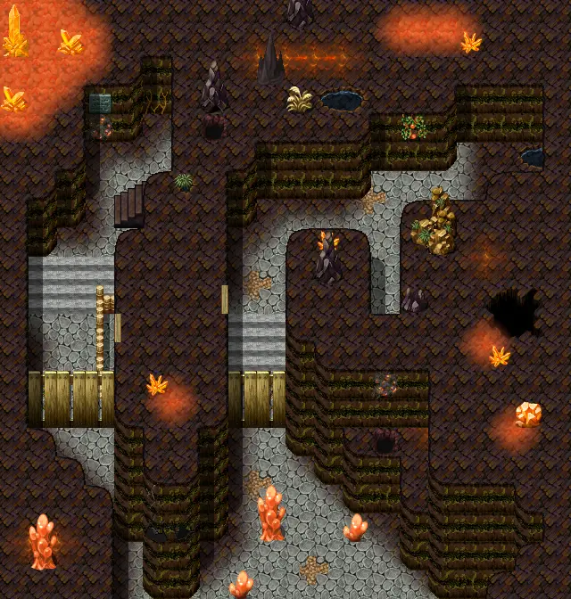

# Elm 4f 5

20×21 tiles · part of [Elm4f](index.md)

<label class="lg lg-spawn"><input type="checkbox" data-t="spawn" checked> Monsters / NPCs</label><label class="lg lg-mapchange"><input type="checkbox" data-t="mapchange" checked> Exit to another map</label><label class="lg lg-container"><input type="checkbox" data-t="container" checked> Container</label><label class="lg lg-sign"><input type="checkbox" data-t="sign" checked> Sign</label><label class="lg lg-rest"><input type="checkbox" data-t="rest" checked> Resting place</label><label class="lg lg-key"><input type="checkbox" data-t="key" checked> Blocked / needs key or quest</label><label class="lg lg-script"><input type="checkbox" data-t="script"> Scripted event</label><label class="lg lg-replace"><input type="checkbox" data-t="replace"> Changes after a quest</label>

## Exits

- [Elm 4f 3](elm_4f_3.md)

## Monsters & NPCs here

| Name | HP |
|---|---|
| [Resurrected miner's skeleton](../monsters/elm_miner1.md) | 66 |
| [Hard-skinned olm](../monsters/bwm_olm3.md) | 68 |
| [Blackened olm](../monsters/bwm_olm4.md) | 75 |
| [Contaminated woodworm](../monsters/elm_woodworm.md) | 76 |
| [Aggresive woodworm](../monsters/elm_woodworm2.md) | 80 |
| [Foul miner's skeleton](../monsters/elm_miner2.md) | 82 |
| [Contaminated olm](../monsters/bwm_olm5.md) | 90 |
| [Shadowfang](../monsters/shadowfang1.md) | 98 |
| [Ravenous glowing mudfiend](../monsters/elm_fiend2.md) | 111 |
| [Glowing mudfiend](../monsters/elm_fiend1.md) | 132 |

<small>Map ID: `elm_4f_5` · Data from v0.8.18</small>
