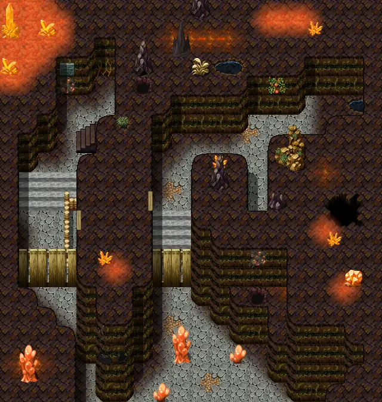

# Elm 4f 5

| | |
|---|---|
| **Map ID** | `elm_4f_5` |
| **Type** | Indoors / underground |
| **Size** | 20×21 tiles |
| **World map** | [Elm 4f](index.md) |
| **Introduced** | [v0.7.14](../versions/0.7.14.md) |
| **NPCs** | 1 |
| **Enemy types** | 9 |
| **Quests** | 0 |

**Elm 4f 5** is an indoor map. It has 1 NPC and 9 kinds of enemy. Exits lead to Elm 4f 3.

## Map

<label class="lg"><input type="checkbox" data-t="spawn" checked><b>Red</b>&nbsp;Monsters / NPCs</label><label class="lg"><input type="checkbox" data-t="mapchange" checked><b>Blue</b>&nbsp;Exit to another map</label><label class="lg"><input type="checkbox" data-t="container" checked><b>Yellow</b>&nbsp;Container (click to see contents)</label><label class="lg"><input type="checkbox" data-t="sign" checked><b>Purple</b>&nbsp;Sign</label><label class="lg"><input type="checkbox" data-t="rest" checked><b>Green</b>&nbsp;Resting place</label><label class="lg"><input type="checkbox" data-t="key" checked><b>Orange dashed</b>&nbsp;Blocked until a quest step / item</label><label class="lg"><input type="checkbox" data-t="script"><b>Grey dotted</b>&nbsp;Scripted event</label><label class="lg"><input type="checkbox" data-t="replace"><b>White dotted</b>&nbsp;Changes during a quest</label><label class="lg"><input type="checkbox" data-t="pin" checked><b>Numbers</b>&nbsp;Numbered key points (see the key below the map)</label>

<a class="pin pin-exit" href="#key-1" style="left:97.500%;top:26.190%" title="Exit (east): to [Elm 4f 3](elm_4f_3.md)">1</a><a id="pin-npc-shadowfang1" class="pin pin-npc" href="#key-2" style="left:67.500%;top:50.000%" title="[Shadowfang](../../monsters/shadowfang1.md): NPC">2</a><a class="pin pin-key" href="#key-3" style="left:17.500%;top:54.762%" title="Blocked passage: Unlocked during the quest: hidden story flag “bwm72_beginning” (stage 11: “Wellspring dialogue &amp; hole. (Never-true condition)”)">3</a>

??? abstract "Key to the numbers on the map"

    | # | What | Details |
    |---|---|---|
    | 1 | Exit (east) | to [Elm 4f 3](elm_4f_3.md) |
    | 2 | [Shadowfang](../monsters/shadowfang1.md) | NPC |
    | 3 | Blocked passage | Unlocked during the quest: hidden story flag “bwm72_beginning” (stage 11: “Wellspring dialogue & hole. (Never-true condition)”) |

Verified against v0.8.18 map data.

## Connections

| Direction | Leads to | Region there | Map # |
|---|---|---|---|
| East | [Elm 4f 3](elm_4f_3.md) | – | 1 |

## NPCs

- [Shadowfang](../monsters/shadowfang1.md) — can be fought (#2)

## Enemies

| Enemy | HP | Damage | Up to | Notes |
|---|---|---|---|---|
| [Resurrected miner's skeleton](../monsters/elm_miner1.md) | 66 | 8–10 | 3 | shares spawn with Foul miner's skeleton |
| [Hard-skinned olm](../monsters/bwm_olm3.md) | 68 | 5–10 | 5 | shares spawn with Blackened olm |
| [Blackened olm](../monsters/bwm_olm4.md) | 75 | 8–11 | 5 | shares spawn with Hard-skinned olm |
| [Contaminated woodworm](../monsters/elm_woodworm.md) | 76 | 6–9 | 3 | shares spawn with Aggresive woodworm, Contaminated olm |
| [Aggresive woodworm](../monsters/elm_woodworm2.md) | 80 | 7–10 | 3 | shares spawn with Contaminated olm, Contaminated woodworm |
| [Foul miner's skeleton](../monsters/elm_miner2.md) | 82 | 6–12 | 3 | shares spawn with Resurrected miner's skeleton |
| [Contaminated olm](../monsters/bwm_olm5.md) | 90 | 6–14 | 3 | shares spawn with Aggresive woodworm, Contaminated woodworm |
| [Ravenous glowing mudfiend](../monsters/elm_fiend2.md) | 111 | 7–21 | 3 | shares spawn with Glowing mudfiend |
| [Glowing mudfiend](../monsters/elm_fiend1.md) | 132 | 0–21 | 3 | shares spawn with Ravenous glowing mudfiend |

<small>“Up to” is the most that can be alive at once from the spawn areas on this map.</small>

## Quests

- [Blackwater Mountain events (hidden flag)](../quests/bwm72_beginning.md): blocked passage opens at stage 11

## Points of interest

- **Blocked passage** (#3): Unlocked during the quest: hidden story flag “bwm72_beginning” (stage 11: “Wellspring dialogue & hole. (Never-true condition)”)

## Version history

| Version | Change |
|---|---|
| [v0.7.14](../versions/0.7.14.md) | Added |
| [v0.8.13](../versions/0.8.13.md) | Map layout or objects changed |

Verified against v0.8.18 and every earlier release back to v0.7.0 (game data compared release by release).

## Community notes

<small>Written by players, not generated from game data. **Observations**: what players notice in-game · **Lore**: the in-world story · **Trivia**: real-world facts, references, development history · **Theory / speculation**: unconfirmed ideas; may just be unfinished content</small>

### Observations

*No notes yet. Contributions are welcome: [add a note](https://github.com/asdfghjkl628/Andor-s-Trail-Wikiiii/new/main/notes/maps?filename=elm_4f_5.md&value=%23%23%20Observations%0A%0A%3C%21--%20what%20players%20notice%20in-game%20--%3E%0A%0A%23%23%20Lore%0A%0A%3C%21--%20the%20in-world%20story%20--%3E%0A%0A%23%23%20Trivia%0A%0A%3C%21--%20real-world%20facts%2C%20references%2C%20development%20history%20--%3E%0A%0A%23%23%20Theory%20/%20speculation%0A%0A%3C%21--%20unconfirmed%20ideas%3B%20may%20just%20be%20unfinished%20content%20--%3E%0A).*

### Lore

*No notes yet. Contributions are welcome: [add a note](https://github.com/asdfghjkl628/Andor-s-Trail-Wikiiii/new/main/notes/maps?filename=elm_4f_5.md&value=%23%23%20Observations%0A%0A%3C%21--%20what%20players%20notice%20in-game%20--%3E%0A%0A%23%23%20Lore%0A%0A%3C%21--%20the%20in-world%20story%20--%3E%0A%0A%23%23%20Trivia%0A%0A%3C%21--%20real-world%20facts%2C%20references%2C%20development%20history%20--%3E%0A%0A%23%23%20Theory%20/%20speculation%0A%0A%3C%21--%20unconfirmed%20ideas%3B%20may%20just%20be%20unfinished%20content%20--%3E%0A).*

### Trivia

*No notes yet. Contributions are welcome: [add a note](https://github.com/asdfghjkl628/Andor-s-Trail-Wikiiii/new/main/notes/maps?filename=elm_4f_5.md&value=%23%23%20Observations%0A%0A%3C%21--%20what%20players%20notice%20in-game%20--%3E%0A%0A%23%23%20Lore%0A%0A%3C%21--%20the%20in-world%20story%20--%3E%0A%0A%23%23%20Trivia%0A%0A%3C%21--%20real-world%20facts%2C%20references%2C%20development%20history%20--%3E%0A%0A%23%23%20Theory%20/%20speculation%0A%0A%3C%21--%20unconfirmed%20ideas%3B%20may%20just%20be%20unfinished%20content%20--%3E%0A).*

### Theory / speculation

*No notes yet. Contributions are welcome: [add a note](https://github.com/asdfghjkl628/Andor-s-Trail-Wikiiii/new/main/notes/maps?filename=elm_4f_5.md&value=%23%23%20Observations%0A%0A%3C%21--%20what%20players%20notice%20in-game%20--%3E%0A%0A%23%23%20Lore%0A%0A%3C%21--%20the%20in-world%20story%20--%3E%0A%0A%23%23%20Trivia%0A%0A%3C%21--%20real-world%20facts%2C%20references%2C%20development%20history%20--%3E%0A%0A%23%23%20Theory%20/%20speculation%0A%0A%3C%21--%20unconfirmed%20ideas%3B%20may%20just%20be%20unfinished%20content%20--%3E%0A).*

??? info "Technical information"

    | | |
    |---|---|
    | Map ID | `elm_4f_5` |
    | File | `res/xml/elm_4f_5.tmx` |
    | Size | 20×21 tiles (640×672 px) |
    | outdoors property | – |
    | Layers drawn | ground, objects, above, top |
    | Tilesets | map_bed_1, map_border_1, map_bridge_1, map_bridge_2, map_broken_1, map_cavewall_1, map_cavewall_2, map_cavewall_3, map_cavewall_4, map_cavewall_5, map_chair_table_1, map_chair_table_2, map_crate_1, map_cupboard_1, map_curtain_1, map_entrance_1, map_entrance_2, map_fence_1, map_fence_2, map_fence_3, map_fence_4, map_ground_1, map_ground_2, map_ground_3, map_ground_4, map_ground_5, map_ground_6, map_ground_7, map_ground_8, map_house_1, map_house_2, map_indoor_1, map_indoor_2, map_kitchen_1, map_outdoor_1, map_pillar_1, map_pillar_2, map_plant_1, map_plant_2, map_rock_1, map_rock_2, map_rock_3, map_roof_1, map_roof_2, map_roof_3, map_shop_1, map_sign_ladder_1, map_sign_ladder_omi2, map_table_1, map_trail_1, map_transition_1, map_transition_2, map_transition_3, map_transition_4, map_transition_6, map_tree_1, map_tree_2, map_wall_1, map_wall_2, map_wall_3, map_wall_4, map_window_1, map_window_2 |
    | Map objects | spawn: 6, mapchange: 1, key: 1 |
    | World map position | segment `elm4f`, x -35, y 3 |

<small>Data from v0.8.18</small>
