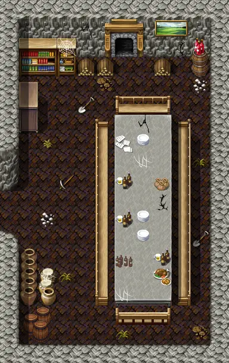

# Elm mine1

12×19 tiles · part of [Elmmine](index.md)

<label class="lg lg-spawn"><input type="checkbox" data-t="spawn" checked> Monsters / NPCs</label><label class="lg lg-mapchange"><input type="checkbox" data-t="mapchange" checked> Exit to another map</label><label class="lg lg-container"><input type="checkbox" data-t="container" checked> Container</label><label class="lg lg-sign"><input type="checkbox" data-t="sign" checked> Sign</label><label class="lg lg-rest"><input type="checkbox" data-t="rest" checked> Resting place</label><label class="lg lg-key"><input type="checkbox" data-t="key" checked> Blocked / needs key or quest</label><label class="lg lg-script"><input type="checkbox" data-t="script"> Scripted event</label><label class="lg lg-replace"><input type="checkbox" data-t="replace"> Changes after a quest</label>

## Exits

- [Blackwater mountain13](blackwater_mountain13.md)

## Monsters & NPCs here

| Name | HP |
|---|---|
| [Drunken Feygard scout](../monsters/ortholion_guard10.md) | 0 |
| [Drunken Feygard patrol](../monsters/ortholion_guard11.md) | 0 |
| [General Ortholion](../monsters/ortholion.md) | 0 |
| [Ehrenfest](../monsters/ehrenfest.md) | 0 |

<small>Map ID: `elm_mine1` · Data from v0.8.18</small>
