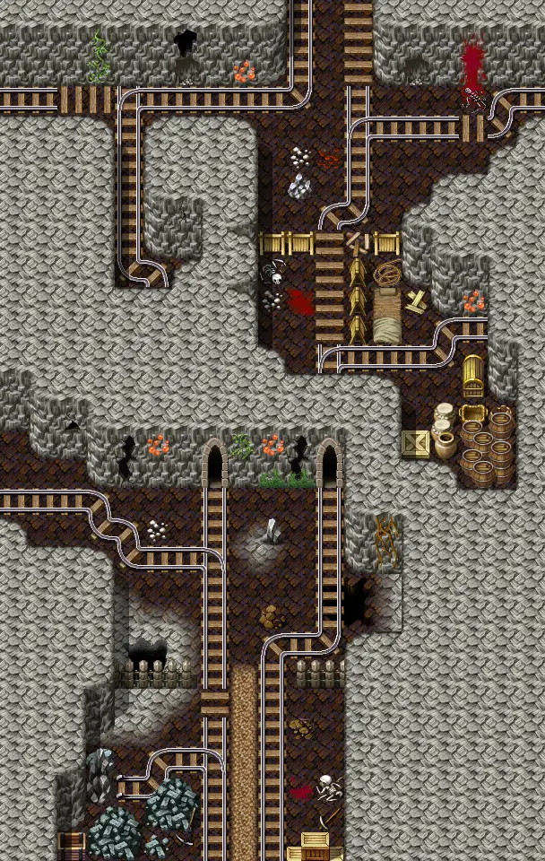
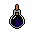
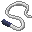
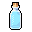
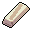
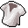

# Elm mine2

19×30 tiles · part of [Elmmine](index.md)

<label class="lg"><input type="checkbox" data-t="spawn" checked><b>Red</b>&nbsp;Monsters / NPCs</label><label class="lg"><input type="checkbox" data-t="mapchange" checked><b>Blue</b>&nbsp;Exit to another map</label><label class="lg"><input type="checkbox" data-t="container" checked><b>Yellow</b>&nbsp;Container (click to see contents)</label><label class="lg"><input type="checkbox" data-t="sign" checked><b>Purple</b>&nbsp;Sign</label><label class="lg"><input type="checkbox" data-t="rest" checked><b>Green</b>&nbsp;Resting place</label><label class="lg"><input type="checkbox" data-t="key" checked><b>Orange dashed</b>&nbsp;Blocked until a quest step / item</label><label class="lg"><input type="checkbox" data-t="script"><b>Grey dotted</b>&nbsp;Scripted event</label><label class="lg"><input type="checkbox" data-t="replace"><b>White dotted</b>&nbsp;Changes during a quest</label>

## Containers

<b>Container 1</b><ul><li><a href="../../items/gold/">Gold coins</a> <small>50% · ×75 to 750</small></li><li><a href="../../items/torch/">Miner&#x27;s lamp fuel</a> <small>100% · ×1 to 3</small></li><li><a href="../../items/bwm_pick/">Blackwater rusted pickaxe</a> <small>100% · ×1 to 2</small></li><li><a href="../../items/shield5/">Superior wooden shield</a> <small>50%</small></li><li><a href="../../items/gem2/">Ruby gem</a> <small>33.3333% · ×5 to 20</small></li><li><a href="../../items/bwm_olm_weapon1/">Amphibian whip</a> <small>50%</small></li><li><a href="../../items/bwm_brew/">Blackwater brew</a> <small>50% · ×10 to 20</small></li><li><a href="../../items/bwm_water1/">Bottle of mountain water</a> <small>20% · ×4 to 10</small></li><li><a href="../../items/vial_empty3/">Empty flask</a> <small>20% · ×10 to 20</small></li><li><a href="../../items/silver_bar/">Silver bar</a> <small>20% · ×1 to 2</small></li></ul>

<b>Container 2</b><ul><li><a href="../../items/lead_bar/">Lead bar</a> <small>100%</small></li><li><a href="../../items/gold/">Gold coins</a> <small>100% · ×1 to 4</small></li></ul>

<b>Container 3</b><ul><li><a href="../../items/gold/">Gold coins</a> <small>100% · ×10 to 120</small></li><li><a href="../../items/shirt2/">Fine shirt</a> <small>66.6667%</small></li><li><a href="../../items/mead/">Mead</a> <small>66.6667% · ×1 to 8</small></li><li><a href="../../items/bwm_brew/">Blackwater brew</a> <small>66.6667% · ×1 to 5</small></li><li><a href="../../items/bone/">Bone</a> <small>100% · ×1 to 10</small></li><li><a href="../../items/ring_dmg1/">Ring of damage +1</a> <small>50%</small></li><li><a href="../../items/ring2/">Polished ring</a> <small>33.3333%</small></li><li><a href="../../items/gloves_leather_attack/">Leather gloves of attack</a> <small>25%</small></li></ul>

## Exits

- [Blackwater mountain13](blackwater_mountain13.md)
- [Elm mine3](elm_mine3.md)
- [Elm mine4](elm_mine4.md)
- [Elm mine5](elm_mine5.md)

## Monsters & NPCs here

| Name | HP |
|---|---|
| [Feygard patrol guard](../monsters/ortholion_guard3.md) | 0 |
| [Slippery Venomfang](../monsters/slippery_venomfang.md) | 38 |
| [Noxious venomfang](../monsters/noxious_venomfang.md) | 44 |
| [Dun olm](../monsters/bwm_olm1.md) | 61 |
| [Albino olm](../monsters/bwm_olm2.md) | 66 |
| [Hard-skinned olm](../monsters/bwm_olm3.md) | 68 |
| [Blackened olm](../monsters/bwm_olm4.md) | 75 |
| [Confused Feygard soldier](../monsters/ortholion_guard7.md) | 211 |

<small>Map ID: `elm_mine2` · Data from v0.8.18</small>
