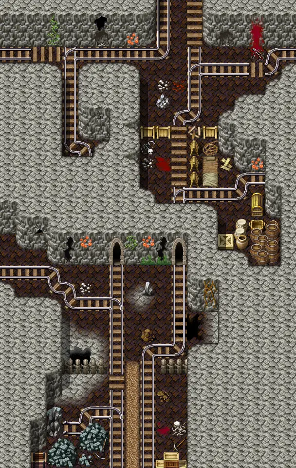
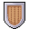

# Elm mine2

| | |
|---|---|
| **Map ID** | `elm_mine2` |
| **Type** | Indoors / underground |
| **Size** | 19×30 tiles |
| **World map** | [Elmmine](index.md) |
| **Introduced** | [v0.7.14](../versions/0.7.14.md) |
| **NPCs** | 2 |
| **Enemy types** | 6 |
| **Quests** | 0 |
| **Containers** | 3 |

**Elm mine2** is an indoor map. It has 2 NPCs and 6 kinds of enemy. Exits lead to Elm mine5, Elm mine4, Blackwater mountain13, Elm mine3.

## Map

<label class="lg"><input type="checkbox" data-t="spawn" checked><b>Red</b>&nbsp;Monsters / NPCs</label><label class="lg"><input type="checkbox" data-t="mapchange" checked><b>Blue</b>&nbsp;Exit to another map</label><label class="lg"><input type="checkbox" data-t="container" checked><b>Yellow</b>&nbsp;Container (click to see contents)</label><label class="lg"><input type="checkbox" data-t="sign" checked><b>Purple</b>&nbsp;Sign</label><label class="lg"><input type="checkbox" data-t="rest" checked><b>Green</b>&nbsp;Resting place</label><label class="lg"><input type="checkbox" data-t="key" checked><b>Orange dashed</b>&nbsp;Blocked until a quest step / item</label><label class="lg"><input type="checkbox" data-t="script"><b>Grey dotted</b>&nbsp;Scripted event</label><label class="lg"><input type="checkbox" data-t="replace"><b>White dotted</b>&nbsp;Changes during a quest</label><label class="lg"><input type="checkbox" data-t="pin" checked><b>Numbers</b>&nbsp;Numbered key points (see the key below the map)</label>

<a class="pin pin-exit" href="#key-1" style="left:60.526%;top:1.667%" title="Exit (north): to [Elm mine5](../elm_mine5.md)">1</a><a class="pin pin-exit" href="#key-2" style="left:97.368%;top:11.667%" title="Exit (east): to [Elm mine4](../elm_mine4.md)">2</a><a class="pin pin-exit" href="#key-3" style="left:39.474%;top:98.333%" title="Exit (south): to [Blackwater mountain13](../blackwater_mountain13.md)">3</a><a class="pin pin-exit" href="#key-4" style="left:2.632%;top:55.000%" title="Exit (west): to [Elm mine3](../elm_mine3.md)">4</a><a class="pin pin-exit" href="#key-4" style="left:2.632%;top:11.667%" title="Exit (west): to [Elm mine3](../elm_mine3.md)">4</a><a class="pin pin-npc" href="#key-5" style="left:81.579%;top:41.667%" title="[Confused Feygard soldier](../../monsters/ortholion_guard7.md): NPC">5</a><a class="pin pin-npc" href="#key-6" style="left:34.211%;top:81.667%" title="[Feygard patrol guard](../../monsters/ortholion_guard3.md): NPC">6</a><a class="pin pin-sign" href="#key-7" style="left:60.526%;top:91.667%" title="Sign: “This corpse is not old. It is probably one of the missing miners. He has a single large wound in his chest.”">7</a><a class="pin pin-container" href="#key-8" style="left:86.842%;top:43.333%" title="Container 1: Gold coins, Miner&#x27;s lamp fuel, Blackwater rusted pickaxe, Superior wooden shield, Ruby gem, Amphibian whip">8</a><a class="pin pin-container" href="#key-9" style="left:18.421%;top:95.000%" title="Container 2: Lead bar, Gold coins">9</a><a class="pin pin-container" href="#key-10" style="left:60.526%;top:55.000%" title="Container 3: Gold coins, Fine shirt, Mead, Blackwater brew, Bone, Ring of damage +1">10</a><a class="pin pin-key" href="#key-11" style="left:39.474%;top:55.000%" title="Blocked passage: Unlocked during the quest: hidden story flag “bwm72_beginning” (stage 11: “Wellspring dialogue &amp; hole. (Never-true condition)”)">11</a><a class="pin pin-key" href="#key-12" style="left:60.873%;top:52.500%" title="Blocked passage: Unlocked during the quest: hidden story flag “bwm72_beginning” (stage 23: “Torch secret”)">12</a><a class="pin pin-key" href="#key-11" style="left:60.873%;top:49.167%" title="Blocked passage: Unlocked during the quest: hidden story flag “bwm72_beginning” (stage 11: “Wellspring dialogue &amp; hole. (Never-true condition)”)">11</a><a class="pin pin-key" href="#key-11" style="left:28.947%;top:31.667%" title="Blocked passage: Unlocked during the quest: hidden story flag “bwm72_beginning” (stage 11: “Wellspring dialogue &amp; hole. (Never-true condition)”)">11</a><a class="pin pin-key" href="#key-11" style="left:60.526%;top:45.000%" title="Blocked passage: Unlocked during the quest: hidden story flag “bwm72_beginning” (stage 11: “Wellspring dialogue &amp; hole. (Never-true condition)”)">11</a><a class="pin pin-key" href="#key-11" style="left:71.053%;top:36.667%" title="Blocked passage: Unlocked during the quest: hidden story flag “bwm72_beginning” (stage 11: “Wellspring dialogue &amp; hole. (Never-true condition)”)">11</a><a class="pin pin-key" href="#key-13" style="left:87.188%;top:40.834%" title="Blocked passage: Unlocked during the quest: hidden story flag “bwm72_beginning” (stage 25: “Elm2 chest.”)">13</a>

??? abstract "Key to the numbers on the map"

    | # | What | Details |
    |---|---|---|
    | 1 | Exit (north) | to [Elm mine5](../elm_mine5.md) |
    | 2 | Exit (east) | to [Elm mine4](../elm_mine4.md) |
    | 3 | Exit (south) | to [Blackwater mountain13](../blackwater_mountain13.md) |
    | 4 | Exit (west) | to [Elm mine3](../elm_mine3.md) |
    | 5 | [Confused Feygard soldier](../monsters/ortholion_guard7.md) | NPC |
    | 6 | [Feygard patrol guard](../monsters/ortholion_guard3.md) | NPC |
    | 7 | Sign | “This corpse is not old. It is probably one of the missing miners. He has a single large wound in his chest.” |
    | 8 | Container 1 | Gold coins, Miner's lamp fuel, Blackwater rusted pickaxe, Superior wooden shield, Ruby gem, Amphibian whip |
    | 9 | Container 2 | Lead bar, Gold coins |
    | 10 | Container 3 | Gold coins, Fine shirt, Mead, Blackwater brew, Bone, Ring of damage +1 |
    | 11 | Blocked passage | Unlocked during the quest: hidden story flag “bwm72_beginning” (stage 11: “Wellspring dialogue & hole. (Never-true condition)”) |
    | 12 | Blocked passage | Unlocked during the quest: hidden story flag “bwm72_beginning” (stage 23: “Torch secret”) |
    | 13 | Blocked passage | Unlocked during the quest: hidden story flag “bwm72_beginning” (stage 25: “Elm2 chest.”) |

Verified against v0.8.18 map data.

## Connections

| Direction | Leads to | Region there | Map # |
|---|---|---|---|
| North | [Elm mine5](elm_mine5.md) | – | 1 |
| East | [Elm mine4](elm_mine4.md) | – | 2 |
| South | [Blackwater mountain13](blackwater_mountain13.md) | Prim | 3 |
| West | [Elm mine3](elm_mine3.md) | – | 4 |

## NPCs

- [Confused Feygard soldier](../monsters/ortholion_guard7.md) (#5)
- [Feygard patrol guard](../monsters/ortholion_guard3.md) (#6)

## Enemies

| Enemy | HP | Damage | Up to | Notes |
|---|---|---|---|---|
| [Slippery Venomfang](../monsters/slippery_venomfang.md) | 38 | 3–6 | 5 | shares spawn with Noxious venomfang |
| [Noxious venomfang](../monsters/noxious_venomfang.md) | 44 | 3–6 | 5 | shares spawn with Slippery Venomfang |
| [Dun olm](../monsters/bwm_olm1.md) | 61 | 5–10 | 6 | shares spawn with Albino olm |
| [Albino olm](../monsters/bwm_olm2.md) | 66 | 7–10 | 6 | shares spawn with Dun olm |
| [Hard-skinned olm](../monsters/bwm_olm3.md) | 68 | 5–10 | 5 | shares spawn with Blackened olm |
| [Blackened olm](../monsters/bwm_olm4.md) | 75 | 8–11 | 5 | shares spawn with Hard-skinned olm |

<small>“Up to” is the most that can be alive at once from the spawn areas on this map.</small>

## Items & containers

<b>Container 1</b><ul><li><a href="../../items/gold/">Gold coins</a> <small>50% · ×75 to 750</small></li><li><a href="../../items/torch/">Miner&#x27;s lamp fuel</a> <small>100% · ×1 to 3</small></li><li><a href="../../items/bwm_pick/">Blackwater rusted pickaxe</a> <small>100% · ×1 to 2</small></li><li><a href="../../items/shield5/">Superior wooden shield</a> <small>50%</small></li><li><a href="../../items/gem2/">Ruby gem</a> <small>33.3333% · ×5 to 20</small></li><li><a href="../../items/bwm_olm_weapon1/">Amphibian whip</a> <small>50%</small></li><li><a href="../../items/bwm_brew/">Blackwater brew</a> <small>50% · ×10 to 20</small></li><li><a href="../../items/bwm_water1/">Bottle of mountain water</a> <small>20% · ×4 to 10</small></li><li><a href="../../items/vial_empty3/">Empty flask</a> <small>20% · ×10 to 20</small></li><li><a href="../../items/silver_bar/">Silver bar</a> <small>20% · ×1 to 2</small></li></ul>

<b>Container 2</b><ul><li><a href="../../items/lead_bar/">Lead bar</a> <small>100%</small></li><li><a href="../../items/gold/">Gold coins</a> <small>100% · ×1 to 4</small></li></ul>

<b>Container 3</b><ul><li><a href="../../items/gold/">Gold coins</a> <small>100% · ×10 to 120</small></li><li><a href="../../items/shirt2/">Fine shirt</a> <small>66.6667%</small></li><li><a href="../../items/mead/">Mead</a> <small>66.6667% · ×1 to 8</small></li><li><a href="../../items/bwm_brew/">Blackwater brew</a> <small>66.6667% · ×1 to 5</small></li><li><a href="../../items/bone/">Bone</a> <small>100% · ×1 to 10</small></li><li><a href="../../items/ring_dmg1/">Ring of damage +1</a> <small>50%</small></li><li><a href="../../items/ring2/">Polished ring</a> <small>33.3333%</small></li><li><a href="../../items/gloves_leather_attack/">Leather gloves of attack</a> <small>25%</small></li></ul>

## Quests

- [Hidden: events in bwm (hidden flag)](../quests/bwm72_beginning.md): blocked passage opens at stage 11; blocked passage opens at stage 23; blocked passage opens at stage 25; something on this map advances it

## Points of interest

- **Sign** (#7): “This corpse is not old. It is probably one of the missing miners. He has a single large wound in his chest.”
- **Blocked passage** (#11): Unlocked during the quest: hidden story flag “bwm72_beginning” (stage 11: “Wellspring dialogue & hole. (Never-true condition)”)
- **Blocked passage** (#12): Unlocked during the quest: hidden story flag “bwm72_beginning” (stage 23: “Torch secret”)
- **Blocked passage** (#13): Unlocked during the quest: hidden story flag “bwm72_beginning” (stage 25: “Elm2 chest.”)

## Version history

| Version | Change |
|---|---|
| [v0.7.14](../versions/0.7.14.md) | Added |
| [v0.8.8](../versions/0.8.8.md) | map layout or objects changed |

Verified against v0.8.18 and every earlier release back to v0.7.0 (game data compared release by release).

## Community notes

<small>Written by players, not generated from game data. **Observations**: what players notice in-game · **Lore**: the in-world story · **Trivia**: real-world facts, references, development history · **Theory / speculation**: unconfirmed ideas; may just be unfinished content</small>

### Observations

*Nothing here yet. Know something? [Add it](https://github.com/asdfghjkl628/Andor-s-Trail-Wikiiii/new/main/notes/maps?filename=elm_mine2.md&value=%23%23%20Observations%0A%0A%3C%21--%20what%20players%20notice%20in-game%20--%3E%0A%0A%23%23%20Lore%0A%0A%3C%21--%20the%20in-world%20story%20--%3E%0A%0A%23%23%20Trivia%0A%0A%3C%21--%20real-world%20facts%2C%20references%2C%20development%20history%20--%3E%0A%0A%23%23%20Theory%20/%20speculation%0A%0A%3C%21--%20unconfirmed%20ideas%3B%20may%20just%20be%20unfinished%20content%20--%3E%0A).*

### Lore

*Nothing here yet. Know something? [Add it](https://github.com/asdfghjkl628/Andor-s-Trail-Wikiiii/new/main/notes/maps?filename=elm_mine2.md&value=%23%23%20Observations%0A%0A%3C%21--%20what%20players%20notice%20in-game%20--%3E%0A%0A%23%23%20Lore%0A%0A%3C%21--%20the%20in-world%20story%20--%3E%0A%0A%23%23%20Trivia%0A%0A%3C%21--%20real-world%20facts%2C%20references%2C%20development%20history%20--%3E%0A%0A%23%23%20Theory%20/%20speculation%0A%0A%3C%21--%20unconfirmed%20ideas%3B%20may%20just%20be%20unfinished%20content%20--%3E%0A).*

### Trivia

*Nothing here yet. Know something? [Add it](https://github.com/asdfghjkl628/Andor-s-Trail-Wikiiii/new/main/notes/maps?filename=elm_mine2.md&value=%23%23%20Observations%0A%0A%3C%21--%20what%20players%20notice%20in-game%20--%3E%0A%0A%23%23%20Lore%0A%0A%3C%21--%20the%20in-world%20story%20--%3E%0A%0A%23%23%20Trivia%0A%0A%3C%21--%20real-world%20facts%2C%20references%2C%20development%20history%20--%3E%0A%0A%23%23%20Theory%20/%20speculation%0A%0A%3C%21--%20unconfirmed%20ideas%3B%20may%20just%20be%20unfinished%20content%20--%3E%0A).*

### Theory / speculation

*Nothing here yet. Know something? [Add it](https://github.com/asdfghjkl628/Andor-s-Trail-Wikiiii/new/main/notes/maps?filename=elm_mine2.md&value=%23%23%20Observations%0A%0A%3C%21--%20what%20players%20notice%20in-game%20--%3E%0A%0A%23%23%20Lore%0A%0A%3C%21--%20the%20in-world%20story%20--%3E%0A%0A%23%23%20Trivia%0A%0A%3C%21--%20real-world%20facts%2C%20references%2C%20development%20history%20--%3E%0A%0A%23%23%20Theory%20/%20speculation%0A%0A%3C%21--%20unconfirmed%20ideas%3B%20may%20just%20be%20unfinished%20content%20--%3E%0A).*

??? info "Technical information"

    | | |
    |---|---|
    | Map ID | `elm_mine2` |
    | File | `res/xml/elm_mine2.tmx` |
    | Size | 19×30 tiles (608×960 px) |
    | outdoors property | – |
    | Layers drawn | base, ground, objects, above, top |
    | Tilesets | map_bed_1, map_border_1, map_bridge_1, map_bridge_2, map_broken_1, map_cavewall_1, map_cavewall_2, map_cavewall_3, map_cavewall_4, map_cavewall_5, map_chair_table_1, map_chair_table_2, map_crate_1, map_cupboard_1, map_curtain_1, map_entrance_1, map_entrance_2, map_fence_1, map_fence_2, map_fence_3, map_fence_4, map_ground_1, map_ground_2, map_ground_3, map_ground_4, map_ground_5, map_ground_6, map_ground_7, map_ground_8, map_house_1, map_house_2, map_indoor_1, map_indoor_2, map_kitchen_1, map_outdoor_1, map_pillar_1, map_pillar_2, map_plant_1, map_plant_2, map_rock_1, map_rock_2, map_roof_1, map_roof_2, map_roof_3, map_shop_1, map_sign_ladder_1, map_table_1, map_trail_1, map_transition_1, map_transition_2, map_transition_3, map_transition_4, map_transition_6, map_tree_1, map_tree_2, map_wall_1, map_wall_2, map_wall_3, map_wall_4, map_window_1, map_window_2 |
    | Map objects | spawn: 10, key: 7, mapchange: 5, container: 3, script: 2, sign: 1 |
    | World map position | segment `elmmine`, x -13, y -50 |

<small>Data from v0.8.18</small>
