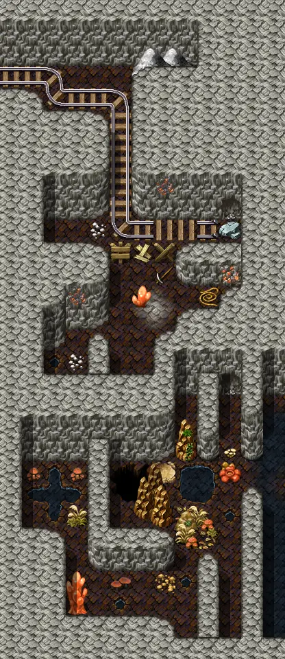
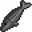
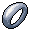

# Elm mine4

13×30 tiles · part of [Elmmine](index.md)

<label class="lg"><input type="checkbox" data-t="spawn" checked><b>Red</b>&nbsp;Monsters / NPCs</label><label class="lg"><input type="checkbox" data-t="mapchange" checked><b>Blue</b>&nbsp;Exit to another map</label><label class="lg"><input type="checkbox" data-t="container" checked><b>Yellow</b>&nbsp;Container (click to see contents)</label><label class="lg"><input type="checkbox" data-t="sign" checked><b>Purple</b>&nbsp;Sign</label><label class="lg"><input type="checkbox" data-t="rest" checked><b>Green</b>&nbsp;Resting place</label><label class="lg"><input type="checkbox" data-t="key" checked><b>Orange dashed</b>&nbsp;Blocked until a quest step / item</label><label class="lg"><input type="checkbox" data-t="script"><b>Grey dotted</b>&nbsp;Scripted event</label><label class="lg"><input type="checkbox" data-t="replace"><b>White dotted</b>&nbsp;Changes during a quest</label>

## Containers

<b>Container 1</b><ul><li><a href="../../items/bwm_fish/">Raw inkyfish</a> <small>100% · ×1 to 3</small></li><li><a href="../../items/bone/">Bone</a> <small>80% · ×1 to 4</small></li><li><a href="../../items/rock/">Small rock</a> <small>70% · ×1 to 10</small></li><li><a href="../../items/gold/">Gold coins</a> <small>50% · ×0 to 25</small></li><li><a href="../../items/gem6/">Azure gem</a> <small>10% · ×1 to 2</small></li><li><a href="../../items/ring1/">Mundane ring</a> <small>5%</small></li><li><a href="../../items/junk_necklace0/">Mundane necklace</a> <small>5%</small></li><li><a href="../../items/ring_rough_life/">Rough ring of life force</a> <small>100%</small></li><li><a href="../../items/necklace_shield2/">Shielding necklace</a> <small>0.4%</small></li></ul>

## Exits

- [Elm mine2](elm_mine2.md)

## Monsters & NPCs here

| Name | HP |
|---|---|
| [Dun olm](../monsters/bwm_olm1.md) | 61 |
| [Albino olm](../monsters/bwm_olm2.md) | 66 |
| [Hard-skinned olm](../monsters/bwm_olm3.md) | 68 |
| [Blackened olm](../monsters/bwm_olm4.md) | 75 |

<small>Map ID: `elm_mine4` · Data from v0.8.18</small>
