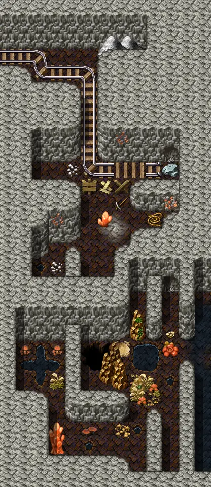
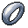

# Elm mine4

| | |
|---|---|
| **Map ID** | `elm_mine4` |
| **Type** | Indoors / underground |
| **Size** | 13×30 tiles |
| **World map** | [Elmmine](index.md) |
| **Introduced** | [v0.7.14](../versions/0.7.14.md) |
| **Enemy types** | 4 |
| **Quests** | 0 |
| **Containers** | 1 |

**Elm mine4** is an indoor map. It has no NPCs and 4 kinds of enemy. Exits lead to Elm mine2.

## Map

<label class="lg"><input type="checkbox" data-t="spawn" checked><b>Red</b>&nbsp;Monsters / NPCs</label><label class="lg"><input type="checkbox" data-t="mapchange" checked><b>Blue</b>&nbsp;Exit to another map</label><label class="lg"><input type="checkbox" data-t="container" checked><b>Yellow</b>&nbsp;Container (click to see contents)</label><label class="lg"><input type="checkbox" data-t="sign" checked><b>Purple</b>&nbsp;Sign</label><label class="lg"><input type="checkbox" data-t="rest" checked><b>Green</b>&nbsp;Resting place</label><label class="lg"><input type="checkbox" data-t="key" checked><b>Orange dashed</b>&nbsp;Blocked until a quest step / item</label><label class="lg"><input type="checkbox" data-t="script"><b>Grey dotted</b>&nbsp;Scripted event</label><label class="lg"><input type="checkbox" data-t="replace"><b>White dotted</b>&nbsp;Changes during a quest</label><label class="lg"><input type="checkbox" data-t="pin" checked><b>Numbers</b>&nbsp;Numbered key points (see the key below the map)</label>

<a class="pin pin-exit" href="#key-1" style="left:3.846%;top:11.667%" title="Exit (west): to [Elm mine2](elm_mine2.md)">1</a><a class="pin pin-script" href="#key-2" style="left:42.308%;top:35.000%" title="Quest trigger: Scripted event: advances the quest: hidden story flag “bwm72_beginning” to stage 26 (“Elm4 sign (north)”)">2</a><a class="pin pin-script" href="#key-3" style="left:46.154%;top:40.000%" title="Quest trigger: Scripted event: advances the quest: hidden story flag “bwm72_beginning” to stage 27 (“Elm4 sign (south)”)">3</a><a class="pin pin-script" href="#key-4" style="left:23.077%;top:35.000%" title="Quest trigger: Scripted event: advances the quest: hidden story flag “bwm72_beginning” to stage 28 (“Elm4 hole
”)">4</a><a class="pin pin-container" href="#key-5" style="left:19.231%;top:55.000%" title="Container 1: Raw inkyfish, Bone, Small rock, Gold coins, Azure gem, Mundane ring">5</a><a class="pin pin-key" href="#key-6" style="left:42.308%;top:38.333%" title="Blocked passage: Unlocked during the quest: hidden story flag “bwm72_beginning” (stage 11: “Wellspring dialogue &amp; hole. (Never-true condition)”)">6</a><a class="pin pin-replace" href="#key-7" style="left:23.583%;top:32.500%" title="Changes during a quest: This area changes during the quest: hidden story flag “bwm72_beginning” (stage 28: “Elm4 hole
”)">7</a>

??? abstract "Key to the numbers on the map"

    | # | What | Details |
    |---|---|---|
    | 1 | Exit (west) | to [Elm mine2](elm_mine2.md) |
    | 2 | Quest trigger | Scripted event: advances the quest: hidden story flag “bwm72_beginning” to stage 26 (“Elm4 sign (north)”) |
    | 3 | Quest trigger | Scripted event: advances the quest: hidden story flag “bwm72_beginning” to stage 27 (“Elm4 sign (south)”) |
    | 4 | Quest trigger | Scripted event: advances the quest: hidden story flag “bwm72_beginning” to stage 28 (“Elm4 hole ”) |
    | 5 | Container 1 | Raw inkyfish, Bone, Small rock, Gold coins, Azure gem, Mundane ring |
    | 6 | Blocked passage | Unlocked during the quest: hidden story flag “bwm72_beginning” (stage 11: “Wellspring dialogue & hole. (Never-true condition)”) |
    | 7 | Changes during a quest | This area changes during the quest: hidden story flag “bwm72_beginning” (stage 28: “Elm4 hole ”) |

Verified against v0.8.18 map data.

## Connections

| Direction | Leads to | Region there | Map # |
|---|---|---|---|
| West | [Elm mine2](elm_mine2.md) | – | 1 |

## Enemies

| Enemy | HP | Damage | Up to | Notes |
|---|---|---|---|---|
| [Dun olm](../monsters/bwm_olm1.md) | 61 | 5–10 | 6 | shares spawn with Albino olm |
| [Albino olm](../monsters/bwm_olm2.md) | 66 | 7–10 | 6 | shares spawn with Dun olm |
| [Hard-skinned olm](../monsters/bwm_olm3.md) | 68 | 5–10 | 4 | shares spawn with Blackened olm |
| [Blackened olm](../monsters/bwm_olm4.md) | 75 | 8–11 | 4 | shares spawn with Hard-skinned olm |

<small>“Up to” is the most that can be alive at once from the spawn areas on this map.</small>

## Items & containers

<b>Container 1</b><ul><li><a href="../../items/bwm_fish/">Raw inkyfish</a> <small>100% · ×1 to 3</small></li><li><a href="../../items/bone/">Bone</a> <small>80% · ×1 to 4</small></li><li><a href="../../items/rock/">Small rock</a> <small>70% · ×1 to 10</small></li><li><a href="../../items/gold/">Gold coins</a> <small>50% · ×0 to 25</small></li><li><a href="../../items/gem6/">Azure gem</a> <small>10% · ×1 to 2</small></li><li><a href="../../items/ring1/">Mundane ring</a> <small>5%</small></li><li><a href="../../items/junk_necklace0/">Mundane necklace</a> <small>5%</small></li><li><a href="../../items/ring_rough_life/">Rough ring of life force</a> <small>100%</small></li><li><a href="../../items/necklace_shield2/">Shielding necklace</a> <small>0.4%</small></li></ul>

## Quests

- [Hidden: events in bwm (hidden flag)](../quests/bwm72_beginning.md): blocked passage opens at stage 11; part of the map changes at stage 28; something on this map advances it; stepping on a trigger here sets stage 26; stepping on a trigger here sets stage 27; stepping on a trigger here sets stage 28

## Points of interest

- **Quest trigger** (#2): Scripted event: advances the quest: hidden story flag “bwm72_beginning” to stage 26 (“Elm4 sign (north)”)
- **Quest trigger** (#3): Scripted event: advances the quest: hidden story flag “bwm72_beginning” to stage 27 (“Elm4 sign (south)”)
- **Quest trigger** (#4): Scripted event: advances the quest: hidden story flag “bwm72_beginning” to stage 28 (“Elm4 hole ”)
- **Blocked passage** (#6): Unlocked during the quest: hidden story flag “bwm72_beginning” (stage 11: “Wellspring dialogue & hole. (Never-true condition)”)
- **Changes during a quest** (#7): This area changes during the quest: hidden story flag “bwm72_beginning” (stage 28: “Elm4 hole ”)

## Version history

| Version | Change |
|---|---|
| [v0.7.14](../versions/0.7.14.md) | Added |
| [v0.8.12.1](../versions/0.8.12.1.md) | map layout or objects changed |

Verified against v0.8.18 and every earlier release back to v0.7.0 (game data compared release by release).

## Community notes

<small>Written by players, not generated from game data. **Observations**: what players notice in-game · **Lore**: the in-world story · **Trivia**: real-world facts, references, development history · **Theory / speculation**: unconfirmed ideas; may just be unfinished content</small>

### Observations

*No notes yet. Contributions are welcome: [add a note](https://github.com/asdfghjkl628/Andor-s-Trail-Wikiiii/new/main/notes/maps?filename=elm_mine4.md&value=%23%23%20Observations%0A%0A%3C%21--%20what%20players%20notice%20in-game%20--%3E%0A%0A%23%23%20Lore%0A%0A%3C%21--%20the%20in-world%20story%20--%3E%0A%0A%23%23%20Trivia%0A%0A%3C%21--%20real-world%20facts%2C%20references%2C%20development%20history%20--%3E%0A%0A%23%23%20Theory%20/%20speculation%0A%0A%3C%21--%20unconfirmed%20ideas%3B%20may%20just%20be%20unfinished%20content%20--%3E%0A).*

### Lore

*No notes yet. Contributions are welcome: [add a note](https://github.com/asdfghjkl628/Andor-s-Trail-Wikiiii/new/main/notes/maps?filename=elm_mine4.md&value=%23%23%20Observations%0A%0A%3C%21--%20what%20players%20notice%20in-game%20--%3E%0A%0A%23%23%20Lore%0A%0A%3C%21--%20the%20in-world%20story%20--%3E%0A%0A%23%23%20Trivia%0A%0A%3C%21--%20real-world%20facts%2C%20references%2C%20development%20history%20--%3E%0A%0A%23%23%20Theory%20/%20speculation%0A%0A%3C%21--%20unconfirmed%20ideas%3B%20may%20just%20be%20unfinished%20content%20--%3E%0A).*

### Trivia

*No notes yet. Contributions are welcome: [add a note](https://github.com/asdfghjkl628/Andor-s-Trail-Wikiiii/new/main/notes/maps?filename=elm_mine4.md&value=%23%23%20Observations%0A%0A%3C%21--%20what%20players%20notice%20in-game%20--%3E%0A%0A%23%23%20Lore%0A%0A%3C%21--%20the%20in-world%20story%20--%3E%0A%0A%23%23%20Trivia%0A%0A%3C%21--%20real-world%20facts%2C%20references%2C%20development%20history%20--%3E%0A%0A%23%23%20Theory%20/%20speculation%0A%0A%3C%21--%20unconfirmed%20ideas%3B%20may%20just%20be%20unfinished%20content%20--%3E%0A).*

### Theory / speculation

*No notes yet. Contributions are welcome: [add a note](https://github.com/asdfghjkl628/Andor-s-Trail-Wikiiii/new/main/notes/maps?filename=elm_mine4.md&value=%23%23%20Observations%0A%0A%3C%21--%20what%20players%20notice%20in-game%20--%3E%0A%0A%23%23%20Lore%0A%0A%3C%21--%20the%20in-world%20story%20--%3E%0A%0A%23%23%20Trivia%0A%0A%3C%21--%20real-world%20facts%2C%20references%2C%20development%20history%20--%3E%0A%0A%23%23%20Theory%20/%20speculation%0A%0A%3C%21--%20unconfirmed%20ideas%3B%20may%20just%20be%20unfinished%20content%20--%3E%0A).*

??? info "Technical information"

    | | |
    |---|---|
    | Map ID | `elm_mine4` |
    | File | `res/xml/elm_mine4.tmx` |
    | Size | 13×30 tiles (416×960 px) |
    | outdoors property | – |
    | Layers drawn | ground, objects, above, top |
    | Tilesets | map_bed_1, map_border_1, map_bridge_1, map_bridge_2, map_broken_1, map_cavewall_1, map_cavewall_2, map_cavewall_3, map_cavewall_4, map_cavewall_5, map_chair_table_1, map_chair_table_2, map_crate_1, map_cupboard_1, map_curtain_1, map_entrance_1, map_entrance_2, map_fence_1, map_fence_2, map_fence_3, map_fence_4, map_ground_1, map_ground_2, map_ground_3, map_ground_4, map_ground_5, map_ground_6, map_ground_7, map_ground_8, map_house_1, map_house_2, map_indoor_1, map_indoor_2, map_kitchen_1, map_outdoor_1, map_pillar_1, map_pillar_2, map_plant_1, map_plant_2, map_rock_1, map_rock_2, map_roof_1, map_roof_2, map_roof_3, map_shop_1, map_sign_ladder_1, map_table_1, map_trail_1, map_transition_1, map_transition_2, map_transition_3, map_transition_4, map_transition_6, map_tree_1, map_tree_2, map_wall_1, map_wall_2, map_wall_3, map_wall_4, map_window_1, map_window_2 |
    | Map objects | spawn: 4, script: 3, mapchange: 1, container: 1, key: 1, replace: 1 |
    | World map position | segment `elmmine`, x 7, y -50 |

<small>Data from v0.8.18</small>
