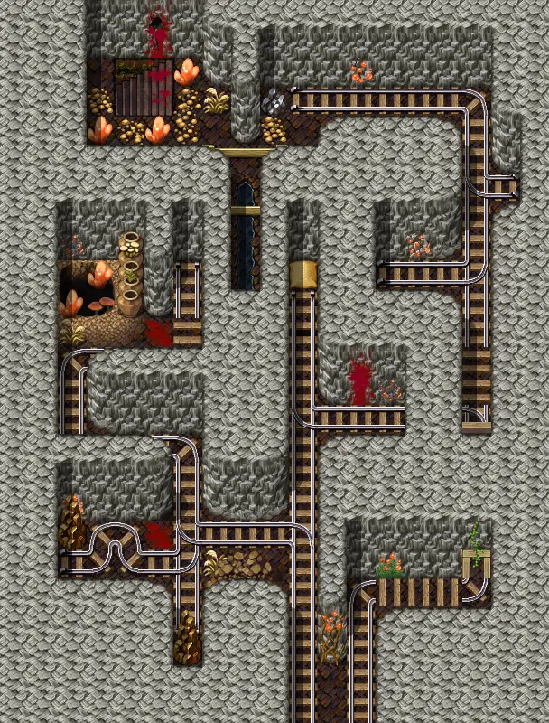
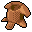
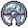
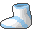
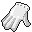

# Elm mine5

19×25 tiles · part of [Elmmine](index.md)

<label class="lg"><input type="checkbox" data-t="spawn" checked><b>Red</b>&nbsp;Monsters / NPCs</label><label class="lg"><input type="checkbox" data-t="mapchange" checked><b>Blue</b>&nbsp;Exit to another map</label><label class="lg"><input type="checkbox" data-t="container" checked><b>Yellow</b>&nbsp;Container (click to see contents)</label><label class="lg"><input type="checkbox" data-t="sign" checked><b>Purple</b>&nbsp;Sign</label><label class="lg"><input type="checkbox" data-t="rest" checked><b>Green</b>&nbsp;Resting place</label><label class="lg"><input type="checkbox" data-t="key" checked><b>Orange dashed</b>&nbsp;Blocked until a quest step / item</label><label class="lg"><input type="checkbox" data-t="script"><b>Grey dotted</b>&nbsp;Scripted event</label><label class="lg"><input type="checkbox" data-t="replace"><b>White dotted</b>&nbsp;Changes during a quest</label>

## Containers

<b>Container 1</b><ul><li><a href="../../items/bwm_pick/">Blackwater rusted pickaxe</a> <small>66.6667% · ×0 to 2</small></li><li><a href="../../items/gold/">Gold coins</a> <small>100% · ×15 to 75</small></li><li><a href="../../items/bwm_olm_drop/">Thin amphibian skin</a> <small>33.3333% · ×0 to 4</small></li><li><a href="../../items/bwm_water1/">Bottle of mountain water</a> <small>50% · ×1 to 5</small></li><li><a href="../../items/armor3/">Hard leather armor</a> <small>10%</small></li><li><a href="../../items/rusted_iron_sword/">Rusted iron sword</a> <small>25% · ×1 to 3</small></li><li><a href="../../items/shield_crude_wooden/">Crude wooden buckler</a> <small>25% · ×1 to 2</small></li><li><a href="../../items/shield8/">Iced broken wooden buckler</a> <small>1.33333%</small></li><li><a href="../../items/bwm_olm_boots1/">Amphibian boots</a> <small>100%</small></li><li><a href="../../items/gold/">Gold coins</a> <small>4% · ×100 to 450</small></li><li><a href="../../items/bwm_fish/">Raw inkyfish</a> <small>50% · ×1 to 6</small></li><li><a href="../../items/bwm_fish2/">Cooked inkyfish</a> <small>33.3333% · ×1 to 4</small></li><li><a href="../../items/bwm_fish3/">Toasted inkyfish</a> <small>14.2857% · ×1 to 3</small></li><li><a href="../../items/bwm_olm_gloves1/">Amphibian gloves</a> <small>100%</small></li></ul>

<b>Container 2</b><ul><li><a href="../../items/meat3/">Worm meat</a> <small>100% · ×1 to 7</small></li><li><a href="../../items/feygard_necklace1/">Broken Feygard medallion</a> <small>100%</small></li><li><a href="../../items/gold/">Gold coins</a> <small>100% · ×1 to 15</small></li><li><a href="../../items/bone/">Bone</a> <small>100% · ×1 to 9</small></li></ul>

<b>Container 3</b><ul><li><a href="../../items/gold/">Gold coins</a> <small>100% · ×5 to 15</small></li><li><a href="../../items/bwm_olm_drop/">Thin amphibian skin</a> <small>20% · ×1 to 4</small></li></ul>

<b>Container 4</b><ul><li><a href="../../items/lead_bar/">Lead bar</a> <small>100%</small></li><li><a href="../../items/gold/">Gold coins</a> <small>100% · ×1 to 4</small></li></ul>

## Exits

- [Elm 2f 1](elm_2f_1.md)
- [Elm mine2](elm_mine2.md)

## Monsters & NPCs here

| Name | HP |
|---|---|
| [Dying general's henchman](../monsters/ortholion_guard8.md) | 0 |
| [Slippery Venomfang](../monsters/slippery_venomfang.md) | 38 |
| [Noxious venomfang](../monsters/noxious_venomfang.md) | 44 |
| [Hard-skinned olm](../monsters/bwm_olm3.md) | 68 |
| [Blackened olm](../monsters/bwm_olm4.md) | 75 |
| [Contaminated woodworm](../monsters/elm_woodworm.md) | 76 |
| [Aggresive woodworm](../monsters/elm_woodworm2.md) | 80 |
| [Contaminated olm](../monsters/bwm_olm5.md) | 90 |
| [Shadowfang](../monsters/shadowfang1.md) | 98 |

<small>Map ID: `elm_mine5` · Data from v0.8.18</small>
