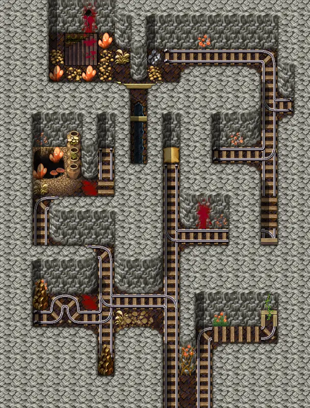
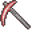
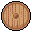

# Elm mine 5

| | |
|---|---|
| **Map ID** | `elm_mine5` |
| **Type** | Indoors / underground |
| **Size** | 19×25 tiles |
| **World map** | [Elmmine](index.md) |
| **Introduced** | [v0.7.14](../versions/0.7.14.md) |
| **NPCs** | 2 |
| **Enemy types** | 7 |
| **Quests** | 0 |
| **Containers** | 4 |

**Elm mine 5** is an indoor map. It has 2 NPCs and 7 kinds of enemy. Exits lead to Elm mine 2, Elm 2f 1.

## Map

<label class="lg"><input type="checkbox" data-t="spawn" checked><b>Red</b>&nbsp;Monsters / NPCs</label><label class="lg"><input type="checkbox" data-t="mapchange" checked><b>Blue</b>&nbsp;Exit to another map</label><label class="lg"><input type="checkbox" data-t="container" checked><b>Yellow</b>&nbsp;Container (click to see contents)</label><label class="lg"><input type="checkbox" data-t="sign" checked><b>Purple</b>&nbsp;Sign</label><label class="lg"><input type="checkbox" data-t="rest" checked><b>Green</b>&nbsp;Resting place</label><label class="lg"><input type="checkbox" data-t="key" checked><b>Orange dashed</b>&nbsp;Blocked until a quest step / item</label><label class="lg"><input type="checkbox" data-t="script"><b>Grey dotted</b>&nbsp;Scripted event</label><label class="lg"><input type="checkbox" data-t="replace"><b>White dotted</b>&nbsp;Changes during a quest</label><label class="lg"><input type="checkbox" data-t="pin" checked><b>Numbers</b>&nbsp;Numbered key points (see the key below the map)</label>

<a class="pin pin-exit" href="#key-1" style="left:60.526%;top:98.000%" title="Exit (south): to [Elm mine 2](elm_mine2.md)">1</a><a class="pin pin-exit" href="#key-2" style="left:23.684%;top:12.000%" title="Exit (stairs / passage): to [Elm 2f 1](elm_2f_1.md)">2</a><a id="pin-npc-ortholion_guard8" class="pin pin-npc" href="#key-3" style="left:28.947%;top:14.000%" title="[Dying general&#x27;s henchman](../../monsters/ortholion_guard8.md): NPC">3</a><a id="pin-npc-shadowfang1" class="pin pin-npc" href="#key-4" style="left:18.421%;top:62.000%" title="[Shadowfang](../../monsters/shadowfang1.md): NPC">4</a><a class="pin pin-script" href="#key-5" style="left:55.263%;top:50.000%" title="Quest trigger: Scripted event: advances the quest: hidden story flag “bwm72_beginning” to stage 30 (“Elm5 hole.”)">5</a><a class="pin pin-container" href="#key-6" style="left:55.263%;top:38.000%" title="Container 1: Blackwater rusted pickaxe, Gold coins, Thin amphibian skin, Bottle of mountain water, Hard leather armor, Rusted iron sword">6</a><a class="pin pin-container" href="#key-7" style="left:28.947%;top:46.000%" title="Container 2: Worm meat, Broken Feygard medallion, Gold coins, Bone">7</a><a class="pin pin-container" href="#key-8" style="left:29.294%;top:11.000%" title="Container 3: Gold coins, Thin amphibian skin">8</a><a class="pin pin-container" href="#key-9" style="left:44.737%;top:78.000%" title="Container 4: Lead bar, Gold coins">9</a><a class="pin pin-key" href="#key-10" style="left:71.053%;top:78.000%" title="Blocked passage: Unlocked during the quest: hidden story flag “bwm72_beginning” (stage 11: “Wellspring dialogue &amp; hole. (Never-true condition)”)">10</a><a class="pin pin-replace" href="#key-11" style="left:71.399%;top:75.000%" title="Changes during a quest: This area changes during the quest: hidden story flag “bwm72_beginning” (stage 29: “Elm5 first ore.”)">11</a><a class="pin pin-replace" href="#key-12" style="left:55.610%;top:47.000%" title="Changes during a quest: This area changes during the quest: hidden story flag “bwm72_beginning” (stage 30: “Elm5 hole.”)">12</a>

??? abstract "Key to the numbers on the map"

    | # | What | Details |
    |---|---|---|
    | 1 | Exit (south) | to [Elm mine 2](elm_mine2.md) |
    | 2 | Exit (stairs / passage) | to [Elm 2f 1](elm_2f_1.md) |
    | 3 | [Dying general's henchman](../monsters/ortholion_guard8.md) | NPC |
    | 4 | [Shadowfang](../monsters/shadowfang1.md) | NPC |
    | 5 | Quest trigger | Scripted event: advances the quest: hidden story flag “bwm72_beginning” to stage 30 (“Elm5 hole.”) |
    | 6 | Container 1 | Blackwater rusted pickaxe, Gold coins, Thin amphibian skin, Bottle of mountain water, Hard leather armor, Rusted iron sword |
    | 7 | Container 2 | Worm meat, Broken Feygard medallion, Gold coins, Bone |
    | 8 | Container 3 | Gold coins, Thin amphibian skin |
    | 9 | Container 4 | Lead bar, Gold coins |
    | 10 | Blocked passage | Unlocked during the quest: hidden story flag “bwm72_beginning” (stage 11: “Wellspring dialogue & hole. (Never-true condition)”) |
    | 11 | Changes during a quest | This area changes during the quest: hidden story flag “bwm72_beginning” (stage 29: “Elm5 first ore.”) |
    | 12 | Changes during a quest | This area changes during the quest: hidden story flag “bwm72_beginning” (stage 30: “Elm5 hole.”) |

Verified against v0.8.18 map data.

## Connections

| Direction | Leads to | Region there | Map # |
|---|---|---|---|
| South | [Elm mine 2](elm_mine2.md) | – | 1 |
| Stairs / passage | [Elm 2f 1](elm_2f_1.md) | – | 2 |

## NPCs

- [Dying general's henchman](../monsters/ortholion_guard8.md) (#3)
- [Shadowfang](../monsters/shadowfang1.md) — can be fought (#4)

## Enemies

| Enemy | HP | Damage | Up to | Notes |
|---|---|---|---|---|
| [Slippery Venomfang](../monsters/slippery_venomfang.md) | 38 | 3–6 | 5 | shares spawn with Noxious venomfang |
| [Noxious venomfang](../monsters/noxious_venomfang.md) | 44 | 3–6 | 5 | shares spawn with Slippery Venomfang |
| [Hard-skinned olm](../monsters/bwm_olm3.md) | 68 | 5–10 | 3 | shares spawn with Blackened olm |
| [Blackened olm](../monsters/bwm_olm4.md) | 75 | 8–11 | 3 | shares spawn with Hard-skinned olm |
| [Contaminated woodworm](../monsters/elm_woodworm.md) | 76 | 6–9 | 8 | shares spawn with Aggresive woodworm, Contaminated olm |
| [Aggresive woodworm](../monsters/elm_woodworm2.md) | 80 | 7–10 | 7 | shares spawn with Contaminated olm, Contaminated woodworm |
| [Contaminated olm](../monsters/bwm_olm5.md) | 90 | 6–14 | 7 | shares spawn with Aggresive woodworm, Contaminated woodworm |

<small>“Up to” is the most that can be alive at once from the spawn areas on this map.</small>

## Items & containers

<b>Container 1</b><ul><li><a href="../../items/bwm_pick/">Blackwater rusted pickaxe</a> <small>66.6667% · ×0 to 2</small></li><li><a href="../../items/gold/">Gold coins</a> <small>100% · ×15 to 75</small></li><li><a href="../../items/bwm_olm_drop/">Thin amphibian skin</a> <small>33.3333% · ×0 to 4</small></li><li><a href="../../items/bwm_water1/">Bottle of mountain water</a> <small>50% · ×1 to 5</small></li><li><a href="../../items/armor3/">Hard leather armor</a> <small>10%</small></li><li><a href="../../items/rusted_iron_sword/">Rusted iron sword</a> <small>25% · ×1 to 3</small></li><li><a href="../../items/shield_crude_wooden/">Crude wooden buckler</a> <small>25% · ×1 to 2</small></li><li><a href="../../items/shield8/">Iced broken wooden buckler</a> <small>1.33333%</small></li><li><a href="../../items/bwm_olm_boots1/">Amphibian boots</a> <small>100%</small></li><li><a href="../../items/gold/">Gold coins</a> <small>4% · ×100 to 450</small></li><li><a href="../../items/bwm_fish/">Raw inkyfish</a> <small>50% · ×1 to 6</small></li><li><a href="../../items/bwm_fish2/">Cooked inkyfish</a> <small>33.3333% · ×1 to 4</small></li><li><a href="../../items/bwm_fish3/">Toasted inkyfish</a> <small>14.2857% · ×1 to 3</small></li><li><a href="../../items/bwm_olm_gloves1/">Amphibian gloves</a> <small>100%</small></li></ul>

<b>Container 2</b><ul><li><a href="../../items/meat3/">Worm meat</a> <small>100% · ×1 to 7</small></li><li><a href="../../items/feygard_necklace1/">Broken Feygard medallion</a> <small>100%</small></li><li><a href="../../items/gold/">Gold coins</a> <small>100% · ×1 to 15</small></li><li><a href="../../items/bone/">Bone</a> <small>100% · ×1 to 9</small></li></ul>

<b>Container 3</b><ul><li><a href="../../items/gold/">Gold coins</a> <small>100% · ×5 to 15</small></li><li><a href="../../items/bwm_olm_drop/">Thin amphibian skin</a> <small>20% · ×1 to 4</small></li></ul>

<b>Container 4</b><ul><li><a href="../../items/lead_bar/">Lead bar</a> <small>100%</small></li><li><a href="../../items/gold/">Gold coins</a> <small>100% · ×1 to 4</small></li></ul>

## Quests

- [Blackwater Mountain events (hidden flag)](../quests/bwm72_beginning.md): [Dying general's henchman](../monsters/ortholion_guard8.md) is involved; blocked passage opens at stage 11; part of the map changes at stage 29; part of the map changes at stage 30; something on this map advances it; stepping on a trigger here sets stage 30

## Points of interest

- **Quest trigger** (#5): Scripted event: advances the quest: hidden story flag “bwm72_beginning” to stage 30 (“Elm5 hole.”)
- **Blocked passage** (#10): Unlocked during the quest: hidden story flag “bwm72_beginning” (stage 11: “Wellspring dialogue & hole. (Never-true condition)”)
- **Changes during a quest** (#11): This area changes during the quest: hidden story flag “bwm72_beginning” (stage 29: “Elm5 first ore.”)
- **Changes during a quest** (#12): This area changes during the quest: hidden story flag “bwm72_beginning” (stage 30: “Elm5 hole.”)

## Version history

| Version | Change |
|---|---|
| [v0.7.14](../versions/0.7.14.md) | Added |
| [v0.8.12.1](../versions/0.8.12.1.md) | Map layout or objects changed |
| [v0.8.18](../versions/0.8.18.md) | Map layout or objects changed |

Verified against v0.8.18 and every earlier release back to v0.7.0 (game data compared release by release).

## Community notes

<small>Written by players, not generated from game data. **Observations**: what players notice in-game · **Lore**: the in-world story · **Trivia**: real-world facts, references, development history · **Theory / speculation**: unconfirmed ideas; may just be unfinished content</small>

### Observations

*No notes yet. Contributions are welcome: [add a note](https://github.com/asdfghjkl628/Andor-s-Trail-Wikiiii/new/main/notes/maps?filename=elm_mine5.md&value=%23%23%20Observations%0A%0A%3C%21--%20what%20players%20notice%20in-game%20--%3E%0A%0A%23%23%20Lore%0A%0A%3C%21--%20the%20in-world%20story%20--%3E%0A%0A%23%23%20Trivia%0A%0A%3C%21--%20real-world%20facts%2C%20references%2C%20development%20history%20--%3E%0A%0A%23%23%20Theory%20/%20speculation%0A%0A%3C%21--%20unconfirmed%20ideas%3B%20may%20just%20be%20unfinished%20content%20--%3E%0A).*

### Lore

*No notes yet. Contributions are welcome: [add a note](https://github.com/asdfghjkl628/Andor-s-Trail-Wikiiii/new/main/notes/maps?filename=elm_mine5.md&value=%23%23%20Observations%0A%0A%3C%21--%20what%20players%20notice%20in-game%20--%3E%0A%0A%23%23%20Lore%0A%0A%3C%21--%20the%20in-world%20story%20--%3E%0A%0A%23%23%20Trivia%0A%0A%3C%21--%20real-world%20facts%2C%20references%2C%20development%20history%20--%3E%0A%0A%23%23%20Theory%20/%20speculation%0A%0A%3C%21--%20unconfirmed%20ideas%3B%20may%20just%20be%20unfinished%20content%20--%3E%0A).*

### Trivia

*No notes yet. Contributions are welcome: [add a note](https://github.com/asdfghjkl628/Andor-s-Trail-Wikiiii/new/main/notes/maps?filename=elm_mine5.md&value=%23%23%20Observations%0A%0A%3C%21--%20what%20players%20notice%20in-game%20--%3E%0A%0A%23%23%20Lore%0A%0A%3C%21--%20the%20in-world%20story%20--%3E%0A%0A%23%23%20Trivia%0A%0A%3C%21--%20real-world%20facts%2C%20references%2C%20development%20history%20--%3E%0A%0A%23%23%20Theory%20/%20speculation%0A%0A%3C%21--%20unconfirmed%20ideas%3B%20may%20just%20be%20unfinished%20content%20--%3E%0A).*

### Theory / speculation

*No notes yet. Contributions are welcome: [add a note](https://github.com/asdfghjkl628/Andor-s-Trail-Wikiiii/new/main/notes/maps?filename=elm_mine5.md&value=%23%23%20Observations%0A%0A%3C%21--%20what%20players%20notice%20in-game%20--%3E%0A%0A%23%23%20Lore%0A%0A%3C%21--%20the%20in-world%20story%20--%3E%0A%0A%23%23%20Trivia%0A%0A%3C%21--%20real-world%20facts%2C%20references%2C%20development%20history%20--%3E%0A%0A%23%23%20Theory%20/%20speculation%0A%0A%3C%21--%20unconfirmed%20ideas%3B%20may%20just%20be%20unfinished%20content%20--%3E%0A).*

??? info "Technical information"

    | | |
    |---|---|
    | Map ID | `elm_mine5` |
    | File | `res/xml/elm_mine5.tmx` |
    | Size | 19×25 tiles (608×800 px) |
    | outdoors property | – |
    | Layers drawn | ground, objects, above, top |
    | Tilesets | map_bed_1, map_border_1, map_bridge_1, map_bridge_2, map_broken_1, map_cavewall_1, map_cavewall_2, map_cavewall_3, map_cavewall_4, map_cavewall_5, map_chair_table_1, map_chair_table_2, map_crate_1, map_cupboard_1, map_curtain_1, map_entrance_1, map_entrance_2, map_fence_1, map_fence_2, map_fence_3, map_fence_4, map_ground_1, map_ground_2, map_ground_3, map_ground_4, map_ground_5, map_ground_6, map_ground_7, map_ground_8, map_house_1, map_house_2, map_indoor_1, map_indoor_2, map_kitchen_1, map_outdoor_1, map_pillar_1, map_pillar_2, map_plant_1, map_plant_2, map_rock_1, map_rock_2, map_roof_1, map_roof_2, map_roof_3, map_shop_1, map_sign_ladder_1, map_sign_ladder_omi2, map_table_1, map_trail_1, map_transition_1, map_transition_2, map_transition_3, map_transition_4, map_transition_6, map_tree_1, map_tree_2, map_wall_1, map_wall_2, map_wall_3, map_wall_4, map_window_1, map_window_2 |
    | Map objects | spawn: 10, container: 4, mapchange: 2, replace: 2, script: 1, key: 1 |
    | World map position | segment `elmmine`, x -13, y -76 |

<small>Data from v0.8.18</small>
