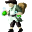

# Fallhaven derelict2

25×19 tiles

<label class="lg"><input type="checkbox" data-t="spawn" checked><b>Red</b>&nbsp;Monsters / NPCs</label><label class="lg"><input type="checkbox" data-t="mapchange" checked><b>Blue</b>&nbsp;Exit to another map</label><label class="lg"><input type="checkbox" data-t="container" checked><b>Yellow</b>&nbsp;Container (click to see contents)</label><label class="lg"><input type="checkbox" data-t="sign" checked><b>Purple</b>&nbsp;Sign</label><label class="lg"><input type="checkbox" data-t="rest" checked><b>Green</b>&nbsp;Resting place</label><label class="lg"><input type="checkbox" data-t="key" checked><b>Orange dashed</b>&nbsp;Blocked until a quest step / item</label><label class="lg"><input type="checkbox" data-t="script"><b>Grey dotted</b>&nbsp;Scripted event</label><label class="lg"><input type="checkbox" data-t="replace"><b>White dotted</b>&nbsp;Changes during a quest</label>

## Exits

- [Fallhaven derelict](fallhaven_derelict.md)
- [Fallhaven tunnel1](fallhaven_tunnel1.md)

## Monsters & NPCs here

| Name | HP |
|---|---|
| [Umar](../monsters/umar.md) | 0 |
| [Troublemaker](../monsters/troublemaker.md) | 0 |
| [Farrik](../monsters/farrik.md) | 0 |
| [Nanath](../monsters/nanath.md) | 0 |
| [Smug looking thief](../monsters/smug_looking_thief.md) | 0 |
| [Pickpocket](../monsters/pickpocket.md) | 0 |
| [Fanamor](../monsters/fanamor.md) | 0 |
| [Thieves guild cook](../monsters/thieves_guild_cook.md) | 0 |

<small>Map ID: `fallhaven_derelict2` · Data from v0.8.18</small>
