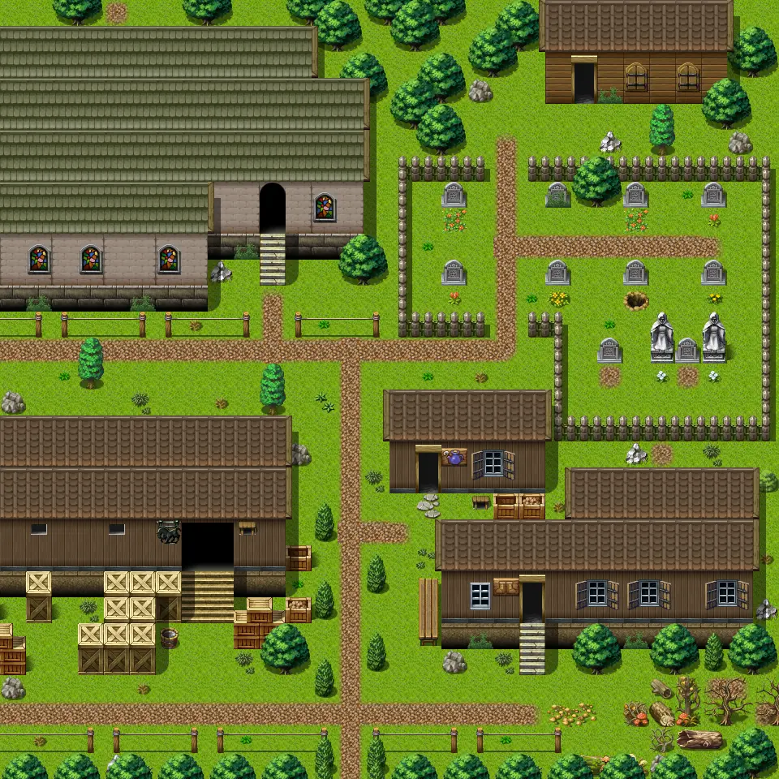

# Fallhaven ne

30×30 tiles · outdoors · part of [World1](index.md)

<label class="lg lg-spawn"><input type="checkbox" data-t="spawn" checked> Monsters / NPCs</label><label class="lg lg-mapchange"><input type="checkbox" data-t="mapchange" checked> Exit to another map</label><label class="lg lg-container"><input type="checkbox" data-t="container" checked> Container</label><label class="lg lg-sign"><input type="checkbox" data-t="sign" checked> Sign</label><label class="lg lg-rest"><input type="checkbox" data-t="rest" checked> Resting place</label><label class="lg lg-key"><input type="checkbox" data-t="key" checked> Blocked / needs key or quest</label><label class="lg lg-script"><input type="checkbox" data-t="script"> Scripted event</label><label class="lg lg-replace"><input type="checkbox" data-t="replace"> Changes after a quest</label>

## Exits

- [Catacombs1](catacombs1.md)
- [Fallhaven barn](fallhaven_barn.md)
- [Fallhaven church](fallhaven_church.md)
- [Fallhaven clothes](fallhaven_clothes.md)
- [Fallhaven gravedigger](fallhaven_gravedigger.md)
- [Fallhaven nw](fallhaven_nw.md)
- [Fallhaven potions](fallhaven_potions.md)
- [Fallhaven se](fallhaven_se.md)
- [Roadbeforecrossroads2](roadbeforecrossroads2.md)
- [Roadbeforecrossroads4](roadbeforecrossroads4.md)
- [Roadbeforecrossroads5](roadbeforecrossroads5.md)

## Monsters & NPCs here

| Name | HP |
|---|---|
| [Acolyte](../monsters/acolyte.md) | 0 |
| [Blond citizen](../monsters/blond_citizen.md) | 0 |
| [Grumpy citizen](../monsters/grumpy_citizen.md) | 0 |
| [Watchman](../monsters/guard_pathway.md) | 0 |
| [Citizen](../monsters/citizen.md) | 0 |

<small>Map ID: `fallhaven_ne` · Data from v0.8.18</small>
