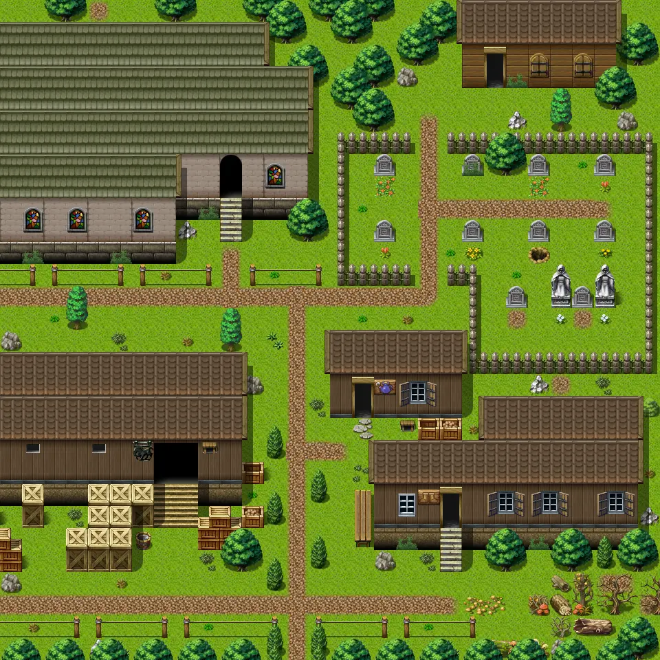

# Fallhaven north-east

| | |
|---|---|
| **Map ID** | `fallhaven_ne` |
| **Region** | In Fallhaven (settlement) |
| **Type** | Outdoors |
| **Size** | 30×30 tiles |
| **World map** | [World1](index.md) |
| **Introduced** | v0.7.0 or earlier |
| **NPCs** | 5 |
| **Quests** | 1 |

**Fallhaven north-east** is an outdoor map, in Fallhaven (settlement). It has 5 NPCs, and no enemies. Exits lead to Catacombs1, Roadbeforecrossroads2, Roadbeforecrossroads4, Roadbeforecrossroads5 and 7 more.

## Map

<label class="lg"><input type="checkbox" data-t="spawn" checked><b>Red</b>&nbsp;Monsters / NPCs</label><label class="lg"><input type="checkbox" data-t="mapchange" checked><b>Blue</b>&nbsp;Exit to another map</label><label class="lg"><input type="checkbox" data-t="container" checked><b>Yellow</b>&nbsp;Container (click to see contents)</label><label class="lg"><input type="checkbox" data-t="sign" checked><b>Purple</b>&nbsp;Sign</label><label class="lg"><input type="checkbox" data-t="rest" checked><b>Green</b>&nbsp;Resting place</label><label class="lg"><input type="checkbox" data-t="key" checked><b>Orange dashed</b>&nbsp;Blocked until a quest step / item</label><label class="lg"><input type="checkbox" data-t="script"><b>Grey dotted</b>&nbsp;Scripted event</label><label class="lg"><input type="checkbox" data-t="replace"><b>White dotted</b>&nbsp;Changes during a quest</label><label class="lg"><input type="checkbox" data-t="pin" checked><b>Numbers</b>&nbsp;Numbered key points (see the key below the map)</label>

<a class="pin pin-exit" href="#key-1" style="left:15.000%;top:1.667%" title="Exit (north): to [Catacombs1](catacombs1.md)">1</a><a class="pin pin-exit" href="#key-2" style="left:20.000%;top:1.667%" title="Exit (north): to [Roadbeforecrossroads2](roadbeforecrossroads2.md)">2</a><a class="pin pin-exit" href="#key-2" style="left:45.000%;top:1.667%" title="Exit (north): to [Roadbeforecrossroads2](roadbeforecrossroads2.md)">2</a><a class="pin pin-exit" href="#key-3" style="left:98.333%;top:3.333%" title="Exit (northeast): to [Roadbeforecrossroads4](roadbeforecrossroads4.md)">3</a><a class="pin pin-exit" href="#key-4" style="left:98.333%;top:58.333%" title="Exit (east): to [Roadbeforecrossroads4](roadbeforecrossroads4.md)">4</a><a class="pin pin-exit" href="#key-5" style="left:98.333%;top:91.667%" title="Exit (east): to [Roadbeforecrossroads5](roadbeforecrossroads5.md)">5</a><a class="pin pin-exit" href="#key-6" style="left:45.000%;top:98.333%" title="Exit (south): to [Fallhaven south-east](fallhaven_se.md)">6</a><a class="pin pin-exit" href="#key-7" style="left:1.667%;top:46.667%" title="Exit (west): to [Fallhaven north-west](fallhaven_nw.md)">7</a><a class="pin pin-exit" href="#key-7" style="left:1.667%;top:91.667%" title="Exit (west): to [Fallhaven north-west](fallhaven_nw.md)">7</a><a class="pin pin-exit" href="#key-8" style="left:26.667%;top:71.667%" title="Exit (door): to [Fallhaven barn](fallhaven_barn.md)">8</a><a class="pin pin-exit" href="#key-9" style="left:35.000%;top:28.333%" title="Exit (door): to [Fallhaven church](fallhaven_church.md)">9</a><a class="pin pin-exit" href="#key-10" style="left:68.333%;top:78.333%" title="Exit (door): to [Fallhaven clothes](fallhaven_clothes.md)">10</a><a class="pin pin-exit" href="#key-10" style="left:85.000%;top:58.333%" title="Exit (door): to [Fallhaven clothes](fallhaven_clothes.md)">10</a><a class="pin pin-exit" href="#key-11" style="left:75.000%;top:11.667%" title="Exit (door): to [Fallhaven gravedigger](fallhaven_gravedigger.md)">11</a><a class="pin pin-exit" href="#key-12" style="left:55.000%;top:61.667%" title="Exit (door): to [Fallhaven potions](fallhaven_potions.md)">12</a><a id="pin-npc-acolyte" class="pin pin-npc" href="#key-13" style="left:48.333%;top:38.333%" title="[Acolyte](../../monsters/acolyte.md): NPC">13</a><a id="pin-npc-blond_citizen" class="pin pin-npc" href="#key-14" style="left:5.000%;top:88.333%" title="[Blond citizen](../../monsters/blond_citizen.md): NPC">14</a><a id="pin-npc-citizen" class="pin pin-npc" href="#key-15" style="left:88.333%;top:28.333%" title="[Citizen](../../monsters/citizen.md): NPC">15</a><a id="pin-npc-grumpy_citizen" class="pin pin-npc" href="#key-16" style="left:48.333%;top:55.000%" title="[Grumpy citizen](../../monsters/grumpy_citizen.md): NPC">16</a><a id="pin-npc-guard_pathway" class="pin pin-npc" href="#key-17" style="left:75.000%;top:91.667%" title="[Watchman](../../monsters/guard_pathway.md): 1 quest">17</a><a class="pin pin-sign" href="#key-18" style="left:58.333%;top:28.333%" title="Sign: “Here lies Kargir the merchant.”">18</a><a class="pin pin-sign" href="#key-19" style="left:58.333%;top:38.333%" title="Sign: “Gimlont the corpulent lies here. May we finally be free from his fat hands being part of all of our businesses.”">19</a><a class="pin pin-sign" href="#key-20" style="left:71.667%;top:38.333%" title="Sign: “Here lies Terdar the smith. May he forever be embraced by the comfort of the Shadow.”">20</a><a class="pin pin-sign" href="#key-21" style="left:71.667%;top:28.333%" title="Sign: “The stone is covered with a thin layer of green moss. The writing on the stone has eroded and is completely unreadable.”">21</a><a class="pin pin-sign" href="#key-22" style="left:81.667%;top:28.333%" title="Sign: “Rest with the Shadow, one-legged Berth. She lived a full life, but in the end she could not stand up to the illness that befell her.”">22</a><a class="pin pin-sign" href="#key-23" style="left:91.667%;top:28.333%" title="Sign: “The remains of Kigrim lies here, after he was killed by wolves south of Fallhaven.”">23</a><a class="pin pin-sign" href="#key-24" style="left:91.667%;top:38.333%" title="Sign: “Here lies O&#x27;llath, praised by her fellow citizens of Fallhaven for her delicious cakes.”">24</a><a class="pin pin-sign" href="#key-25" style="left:88.333%;top:48.333%" title="Sign: “Tyngose the noble lies here. May her legacy never be forgotten.”">25</a><a class="pin pin-sign" href="#key-26" style="left:78.333%;top:48.333%" title="Sign: “Sidari the woodcutter lies here. We all told him to be careful with that axe of his, but he never listened.”">26</a><a class="pin pin-script" href="#key-27" style="left:35.000%;top:45.000%" title="Quest trigger: Scripted event: advances the quest: hidden story flag “feygard_nondisplayed” to stage 69 (“69=closed”)">27</a><a class="pin pin-script" href="#key-28" style="left:85.219%;top:55.834%" title="Quest trigger: Scripted event: advances the quest: hidden story flag “feygard_nondisplayed” to stage 66 (“66=passed window towards tailor”)">28</a>

??? abstract "Key to the numbers on the map"

    | # | What | Details |
    |---|---|---|
    | 1 | Exit (north) | to [Catacombs1](catacombs1.md) |
    | 2 | Exit (north) | to [Roadbeforecrossroads2](roadbeforecrossroads2.md) |
    | 3 | Exit (northeast) | to [Roadbeforecrossroads4](roadbeforecrossroads4.md) |
    | 4 | Exit (east) | to [Roadbeforecrossroads4](roadbeforecrossroads4.md) |
    | 5 | Exit (east) | to [Roadbeforecrossroads5](roadbeforecrossroads5.md) |
    | 6 | Exit (south) | to [Fallhaven south-east](fallhaven_se.md) |
    | 7 | Exit (west) | to [Fallhaven north-west](fallhaven_nw.md) |
    | 8 | Exit (door) | to [Fallhaven barn](fallhaven_barn.md) |
    | 9 | Exit (door) | to [Fallhaven church](fallhaven_church.md) |
    | 10 | Exit (door) | to [Fallhaven clothes](fallhaven_clothes.md) |
    | 11 | Exit (door) | to [Fallhaven gravedigger](fallhaven_gravedigger.md) |
    | 12 | Exit (door) | to [Fallhaven potions](fallhaven_potions.md) |
    | 13 | [Acolyte](../monsters/acolyte.md) | NPC |
    | 14 | [Blond citizen](../monsters/blond_citizen.md) | NPC |
    | 15 | [Citizen](../monsters/citizen.md) | NPC |
    | 16 | [Grumpy citizen](../monsters/grumpy_citizen.md) | NPC |
    | 17 | [Watchman](../monsters/guard_pathway.md) | 1 quest |
    | 18 | Sign | “Here lies Kargir the merchant.” |
    | 19 | Sign | “Gimlont the corpulent lies here. May we finally be free from his fat hands being part of all of our businesses.” |
    | 20 | Sign | “Here lies Terdar the smith. May he forever be embraced by the comfort of the Shadow.” |
    | 21 | Sign | “The stone is covered with a thin layer of green moss. The writing on the stone has eroded and is completely unreadable.” |
    | 22 | Sign | “Rest with the Shadow, one-legged Berth. She lived a full life, but in the end she could not stand up to the illness that befell her.” |
    | 23 | Sign | “The remains of Kigrim lies here, after he was killed by wolves south of Fallhaven.” |
    | 24 | Sign | “Here lies O'llath, praised by her fellow citizens of Fallhaven for her delicious cakes.” |
    | 25 | Sign | “Tyngose the noble lies here. May her legacy never be forgotten.” |
    | 26 | Sign | “Sidari the woodcutter lies here. We all told him to be careful with that axe of his, but he never listened.” |
    | 27 | Quest trigger | Scripted event: advances the quest: hidden story flag “feygard_nondisplayed” to stage 69 (“69=closed”) |
    | 28 | Quest trigger | Scripted event: advances the quest: hidden story flag “feygard_nondisplayed” to stage 66 (“66=passed window towards tailor”) |

Verified against v0.8.18 map data.

## Connections

| Direction | Leads to | Region there | Map # |
|---|---|---|---|
| North | [Catacombs1](catacombs1.md) | Fallhaven | 1 |
| North | [Roadbeforecrossroads2](roadbeforecrossroads2.md) | Fallhaven | 2 |
| Northeast | [Roadbeforecrossroads4](roadbeforecrossroads4.md) | Fallhaven | 3 |
| East | [Roadbeforecrossroads4](roadbeforecrossroads4.md) | Fallhaven | 4 |
| East | [Roadbeforecrossroads5](roadbeforecrossroads5.md) | Fallhaven | 5 |
| South | [Fallhaven south-east](fallhaven_se.md) | Fallhaven | 6 |
| West | [Fallhaven north-west](fallhaven_nw.md) | Fallhaven | 7 |
| Door | [Fallhaven barn](fallhaven_barn.md) | Fallhaven | 8 |
| Door | [Fallhaven church](fallhaven_church.md) | Fallhaven | 9 |
| Door | [Fallhaven clothes](fallhaven_clothes.md) | Fallhaven | 10 |
| Door | [Fallhaven gravedigger](fallhaven_gravedigger.md) | Fallhaven | 11 |
| Door | [Fallhaven potions](fallhaven_potions.md) | Fallhaven | 12 |

## NPCs

- [Acolyte](../monsters/acolyte.md) (#13)
- [Blond citizen](../monsters/blond_citizen.md) (#14)
- [Citizen](../monsters/citizen.md) (#15)
- [Grumpy citizen](../monsters/grumpy_citizen.md) (#16)
- [Watchman](../monsters/guard_pathway.md) — quests: [A path to the Duleian Road](../quests/pathway_fallhaven.md) (#17)

## Quests

- [A path to the Duleian Road](../quests/pathway_fallhaven.md): [Watchman](../monsters/guard_pathway.md) is involved
- [feygard_nondisplayed (hidden flag)](../quests/feygard_nondisplayed.md): something on this map advances it; stepping on a trigger here sets stage 66; stepping on a trigger here sets stage 69

## Points of interest

- **Sign** (#18): “Here lies Kargir the merchant.”
- **Sign** (#19): “Gimlont the corpulent lies here. May we finally be free from his fat hands being part of all of our businesses.”
- **Sign** (#20): “Here lies Terdar the smith. May he forever be embraced by the comfort of the Shadow.”
- **Sign** (#21): “The stone is covered with a thin layer of green moss. The writing on the stone has eroded and is completely unreadable.”
- **Sign** (#22): “Rest with the Shadow, one-legged Berth. She lived a full life, but in the end she could not stand up to the illness that befell her.”
- **Sign** (#23): “The remains of Kigrim lies here, after he was killed by wolves south of Fallhaven.”
- **Sign** (#24): “Here lies O'llath, praised by her fellow citizens of Fallhaven for her delicious cakes.”
- **Sign** (#25): “Tyngose the noble lies here. May her legacy never be forgotten.”
- **Sign** (#26): “Sidari the woodcutter lies here. We all told him to be careful with that axe of his, but he never listened.”
- **Quest trigger** (#27): Scripted event: advances the quest: hidden story flag “feygard_nondisplayed” to stage 69 (“69=closed”)
- **Quest trigger** (#28): Scripted event: advances the quest: hidden story flag “feygard_nondisplayed” to stage 66 (“66=passed window towards tailor”)

## Version history

| Version | Change |
|---|---|
| [v0.7.0](../versions/0.7.0.md) | Present in v0.7.0 (earliest release tracked) |
| [v0.7.1](../versions/0.7.1.md) | Map layout or objects changed |
| [v0.7.2](../versions/0.7.2.md) | Map layout or objects changed |
| [v0.8.12.1](../versions/0.8.12.1.md) | Map layout or objects changed |
| [v0.8.18](../versions/0.8.18.md) | Map layout or objects changed |

Verified against v0.8.18 and every earlier release back to v0.7.0 (game data compared release by release).

## Community notes

<small>Written by players, not generated from game data. **Observations**: what players notice in-game · **Lore**: the in-world story · **Trivia**: real-world facts, references, development history · **Theory / speculation**: unconfirmed ideas; may just be unfinished content</small>

### Observations

*No notes yet. Contributions are welcome: [add a note](https://github.com/asdfghjkl628/Andor-s-Trail-Wikiiii/new/main/notes/maps?filename=fallhaven_ne.md&value=%23%23%20Observations%0A%0A%3C%21--%20what%20players%20notice%20in-game%20--%3E%0A%0A%23%23%20Lore%0A%0A%3C%21--%20the%20in-world%20story%20--%3E%0A%0A%23%23%20Trivia%0A%0A%3C%21--%20real-world%20facts%2C%20references%2C%20development%20history%20--%3E%0A%0A%23%23%20Theory%20/%20speculation%0A%0A%3C%21--%20unconfirmed%20ideas%3B%20may%20just%20be%20unfinished%20content%20--%3E%0A).*

### Lore

*No notes yet. Contributions are welcome: [add a note](https://github.com/asdfghjkl628/Andor-s-Trail-Wikiiii/new/main/notes/maps?filename=fallhaven_ne.md&value=%23%23%20Observations%0A%0A%3C%21--%20what%20players%20notice%20in-game%20--%3E%0A%0A%23%23%20Lore%0A%0A%3C%21--%20the%20in-world%20story%20--%3E%0A%0A%23%23%20Trivia%0A%0A%3C%21--%20real-world%20facts%2C%20references%2C%20development%20history%20--%3E%0A%0A%23%23%20Theory%20/%20speculation%0A%0A%3C%21--%20unconfirmed%20ideas%3B%20may%20just%20be%20unfinished%20content%20--%3E%0A).*

### Trivia

*No notes yet. Contributions are welcome: [add a note](https://github.com/asdfghjkl628/Andor-s-Trail-Wikiiii/new/main/notes/maps?filename=fallhaven_ne.md&value=%23%23%20Observations%0A%0A%3C%21--%20what%20players%20notice%20in-game%20--%3E%0A%0A%23%23%20Lore%0A%0A%3C%21--%20the%20in-world%20story%20--%3E%0A%0A%23%23%20Trivia%0A%0A%3C%21--%20real-world%20facts%2C%20references%2C%20development%20history%20--%3E%0A%0A%23%23%20Theory%20/%20speculation%0A%0A%3C%21--%20unconfirmed%20ideas%3B%20may%20just%20be%20unfinished%20content%20--%3E%0A).*

### Theory / speculation

*No notes yet. Contributions are welcome: [add a note](https://github.com/asdfghjkl628/Andor-s-Trail-Wikiiii/new/main/notes/maps?filename=fallhaven_ne.md&value=%23%23%20Observations%0A%0A%3C%21--%20what%20players%20notice%20in-game%20--%3E%0A%0A%23%23%20Lore%0A%0A%3C%21--%20the%20in-world%20story%20--%3E%0A%0A%23%23%20Trivia%0A%0A%3C%21--%20real-world%20facts%2C%20references%2C%20development%20history%20--%3E%0A%0A%23%23%20Theory%20/%20speculation%0A%0A%3C%21--%20unconfirmed%20ideas%3B%20may%20just%20be%20unfinished%20content%20--%3E%0A).*

??? info "Technical information"

    | | |
    |---|---|
    | Map ID | `fallhaven_ne` |
    | File | `res/xml/fallhaven_ne.tmx` |
    | Size | 30×30 tiles (960×960 px) |
    | outdoors property | 1 |
    | Layers drawn | ground, objects, above, top |
    | Tilesets | map_bed_1, map_border_1, map_bridge_1, map_bridge_2, map_broken_1, map_cavewall_1, map_cavewall_2, map_cavewall_3, map_cavewall_4, map_chair_table_1, map_chair_table_2, map_crate_1, map_cupboard_1, map_curtain_1, map_entrance_1, map_entrance_2, map_fence_1, map_fence_2, map_fence_3, map_fence_4, map_ground_1, map_ground_2, map_ground_3, map_ground_4, map_ground_5, map_ground_6, map_ground_7, map_ground_8, map_house_1, map_house_2, map_indoor_1, map_indoor_2, map_kitchen_1, map_outdoor_1, map_pillar_1, map_pillar_2, map_plant_1, map_plant_2, map_rock_1, map_rock_2, map_roof_1, map_roof_2, map_roof_3, map_shop_1, map_sign_ladder_1, map_table_1, map_trail_1, map_transition_1, map_transition_2, map_transition_3, map_transition_4, map_transition_5, map_tree_1, map_tree_2, map_wall_1, map_wall_2, map_wall_3, map_wall_4, map_window_1, map_window_2 |
    | Map objects | mapchange: 15, sign: 9, spawn: 5, script: 2, replace: 2 |
    | World map position | segment `world1`, x 241, y 382 |

<small>Data from v0.8.18</small>
